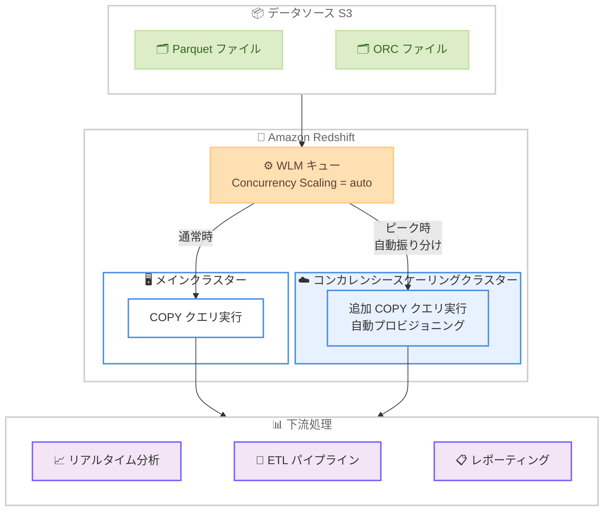

# Amazon Redshift - COPY クエリに対するコンカレンシースケーリングのサポート

**リリース日**: 2026 年 5 月 7 日
**サービス**: Amazon Redshift
**機能**: Concurrency Scaling for COPY (Batch Workloads)

📊 [このアップデートのインフォグラフィックを見る](https://takech9203.github.io/aws-news-summary/20260507-concurrencyscaling-support-for-copy.html)

## 概要

Amazon Redshift のコンカレンシースケーリング機能が拡張され、Amazon S3 からの COPY クエリによる大量データ取り込みワークロードをサポートするようになった。これにより、Parquet および ORC ファイル形式での S3 からのバッチデータ取り込みにおいて、ピーク時でもデータパイプラインがインジェスト速度とクエリパフォーマンスのどちらかを犠牲にする必要がなくなった。

これまでコンカレンシースケーリングは読み取りクエリと一部の書き込み操作 (INSERT、DELETE、UPDATE、CTAS、VACUUM) をサポートしていたが、COPY コマンドでの Parquet/ORC 形式のファイル取り込みは対象外であった。今回のアップデートにより、Amazon Redshift が自動的に追加のコンピュート容量をプロビジョニングし、バースト性のあるインジェストワークロードを吸収する。

**アップデート前の課題**

- COPY コマンドでの Parquet/ORC 形式のファイル取り込みはコンカレンシースケーリングの対象外であり、メインクラスターのリソースに制約されていた
- トラフィックスパイク時にデータ取り込みがボトルネックとなり、リアルタイム分析や ETL パイプラインに遅延が発生していた
- 書き込み負荷の高いワークロードが同時実行クエリとリソース競合を起こし、クエリパフォーマンスが低下していた
- 対策として手動でのクラスターリサイズやワークロードスケジューリングが必要だった

**アップデート後の改善**

- Parquet および ORC 形式の S3 ファイルに対する COPY クエリがコンカレンシースケーリングの対象となった
- 複数ファイルの同時ロードがキューイング遅延なく実行可能になった
- 手動でのクラスターリサイズやワークロードスケジューリングが不要になった
- Serverless ではデマンドに基づく自動スケーリング、Provisioned では事前設定に基づく自動スケーリングが適用される

## アーキテクチャ図



WLM キューでコンカレンシースケーリングを有効化すると、ピーク時に自動的にスケーリングクラスターがプロビジョニングされ、COPY クエリが振り分けられる。

## サービスアップデートの詳細

### 主要機能

1. **Parquet/ORC 形式の COPY サポート**
   - Amazon S3 からの Parquet および ORC ファイル形式での COPY クエリがコンカレンシースケーリング対象に追加
   - 複数ファイルの並列ロードがキューイング遅延なく実行可能
   - バッチワークロードにおける COPY パフォーマンスが大幅に向上

2. **自動スケーリング**
   - Amazon Redshift Serverless: デマンドに基づいて自動的にスケーリングを有効化/無効化
   - Amazon Redshift Provisioned: 事前設定された構成に基づいてスケーリングを制御
   - 手動でのクラスターリサイズやワークロードスケジューリングが不要

3. **ゼロオペレーションオーバーヘッド**
   - 既存のコンカレンシースケーリング設定がそのまま適用される
   - マイグレーションや設定変更は不要
   - コンカレンシースケーリングを有効にするだけで即座にインジェストワークロードに適用

## 技術仕様

### 対応ファイル形式と要件

| 項目 | 詳細 |
|------|------|
| 対応ファイル形式 | Parquet、ORC |
| データソース | Amazon S3 |
| 対象コマンド | COPY |
| 対応ノードタイプ | RA3 ノード (ra3.large、ra3.xlplus、ra3.4xlarge、ra3.16xlarge) |
| 対応デプロイメント | Serverless、Provisioned |
| 最大ノード数 | 32 コンピュートノード (RA3) |
| クラスター要件 | マルチノードクラスター (シングルノード不可) |

### API 変更履歴

直近 30 日間で Redshift 関連の API 変更が確認された。

| 日付 | サービス | 変更内容 |
|------|----------|----------|
| 2026/04/09 | [Redshift Data API Service](https://awsapichanges.com/archive/changes/215aec-redshift-data.html) | 1 updated method - BatchExecuteStatement で名前付き SQL パラメータをサポート |

### コンカレンシースケーリング対象操作一覧

| 操作 | 読み取り | 書き込み | 備考 |
|------|:--------:|:--------:|------|
| SELECT | ○ | - | 従来からサポート |
| COPY (Parquet/ORC from S3) | - | ○ | **今回新規追加** |
| COPY (その他形式) | - | ○ | 従来からサポート |
| INSERT | - | ○ | 従来からサポート |
| DELETE | - | ○ | 従来からサポート |
| UPDATE | - | ○ | 従来からサポート |
| CTAS | - | ○ | 従来からサポート |
| VACUUM | - | ○ | 従来からサポート |

### WLM キュー設定

```json
{
  "WLMConfiguration": [
    {
      "queue_name": "etl_queue",
      "concurrency_scaling": "auto",
      "query_group": ["etl", "data_ingestion"],
      "slots": 5
    }
  ]
}
```

## 設定方法

### 前提条件

1. Amazon Redshift RA3 ノードタイプのクラスター、または Amazon Redshift Serverless ワークグループ
2. マルチノードクラスター構成 (Provisioned の場合)
3. Amazon S3 へのアクセス権限 (IAM ロール)
4. 制限的な VPC エンドポイントポリシーやソース IP 制限がある場合は調整が必要

### 手順

#### ステップ 1: コンカレンシースケーリングの有効化 (Provisioned)

```sql
-- WLM キューでコンカレンシースケーリングを有効化
-- Amazon Redshift コンソール > ワークロード管理 > WLM 設定で
-- Concurrency Scaling mode を「auto」に設定
```

Amazon Redshift コンソールまたは AWS CLI を使用して、対象の WLM キューのコンカレンシースケーリングモードを `auto` に設定する。

#### ステップ 2: クエリグループの設定 (オプション)

```sql
-- データ取り込みクエリを特定のキューに振り分け
SET query_group TO 'data_ingestion';

-- S3 からの COPY コマンドを実行
COPY my_table
FROM 's3://my-bucket/data/'
IAM_ROLE 'arn:aws:iam::123456789012:role/MyRedshiftRole'
FORMAT AS PARQUET;
```

クエリグループラベルを使用して、COPY クエリをコンカレンシースケーリングが有効なキューに振り分ける。

#### ステップ 3: Serverless での確認

```sql
-- Serverless ではデフォルトでコンカレンシースケーリングが有効
-- 追加設定なしで COPY クエリが自動スケーリングの対象となる
COPY my_table
FROM 's3://my-bucket/data/files/'
IAM_ROLE 'arn:aws:iam::123456789012:role/MyRedshiftServerlessRole'
FORMAT AS ORC;
```

Amazon Redshift Serverless では、デマンドに基づいて自動的にコンカレンシースケーリングが動作するため、追加設定は不要。

## メリット

### ビジネス面

- **データ鮮度の向上**: ピーク時でもデータ取り込み遅延が発生しないため、リアルタイムに近い分析が可能になる
- **運用コスト削減**: 手動でのクラスターリサイズやスケジュール管理が不要になり、運用負荷が軽減される
- **SLA 遵守**: トラフィックスパイク時でもデータパイプラインの処理時間が安定し、SLA を満たしやすくなる

### 技術面

- **リソース競合の解消**: 読み取りクエリと書き込みクエリが独立したコンピュートリソースで実行されるため、相互影響がなくなる
- **スループット向上**: 複数の COPY クエリを並列実行できるため、大量データの取り込み時間が短縮される
- **ゼロコード変更**: 既存の COPY コマンドやデータパイプラインの変更が不要で、設定のみで有効化できる

## デメリット・制約事項

### 制限事項

- RA3 ノードタイプのみサポート (DC2 ノードでは書き込み操作のコンカレンシースケーリングは非対応)
- シングルノードクラスターでは利用不可
- 制限的な IAM ポリシー (aws:sourceVpc、aws:sourceVpce、aws:sourceIp) が設定されている場合、COPY クエリがスケーリングクラスターに送信されない可能性がある
- インターリーブソートキーを使用するテーブルへの COPY は非対応
- DISTSTYLE ALL のテーブルへの書き込み操作は非対応
- COPY コマンドでの ANALYZE オプションはコンカレンシースケーリングクラスターでは非対応
- Identity 列を持つテーブルへの書き込みは非対応

### 考慮すべき点

- コンカレンシースケーリングクラスターでの実行時間に対して追加料金が発生する (1 日あたりの無料クレジットあり)
- 制限的なネットワークや VPC 構成で保護されている外部リソースへのアクセスが必要な場合、IAM ポリシーの調整が必要になる場合がある
- 明示的トランザクション内で非サポート DDL 文と COPY 文を混在させると、COPY がスケーリングクラスターで実行されない

## ユースケース

### ユースケース 1: リアルタイムデータレイク取り込み

**シナリオ**: IoT デバイスや Web アプリケーションから S3 に継続的に Parquet ファイルが出力され、5 分ごとに Redshift へ COPY で取り込むパイプラインが存在する。日中のピーク時にはファイル数が 10 倍に増加し、従来はインジェスト遅延が発生していた。

**実装例**:
```sql
-- ピーク時でも自動スケーリングにより遅延なく取り込み
SET query_group TO 'realtime_ingestion';

COPY events_table
FROM 's3://data-lake/events/2026/05/07/'
IAM_ROLE 'arn:aws:iam::123456789012:role/RedshiftIngestionRole'
FORMAT AS PARQUET;
```

**効果**: ピーク時でもインジェスト遅延が解消され、ダッシュボードのデータ鮮度が 5 分以内に維持される。

### ユースケース 2: 大規模 ETL バッチ処理

**シナリオ**: 毎日深夜に数百 GB の ORC ファイルを Redshift にロードする ETL ジョブがある。同時にレポート生成クエリも実行されるため、リソース競合により ETL の完了時間が不安定であった。

**実装例**:
```sql
-- 大規模バッチの並列ロード
SET query_group TO 'batch_etl';

-- 複数テーブルへの並列 COPY が同時実行可能
COPY sales_fact
FROM 's3://dw-staging/sales/daily/'
IAM_ROLE 'arn:aws:iam::123456789012:role/ETLRole'
FORMAT AS ORC;

COPY inventory_fact
FROM 's3://dw-staging/inventory/daily/'
IAM_ROLE 'arn:aws:iam::123456789012:role/ETLRole'
FORMAT AS ORC;
```

**効果**: レポートクエリとリソース競合せずに ETL ジョブが安定して完了し、朝のレポート配信 SLA を確実に遵守できる。

### ユースケース 3: 高頻度レポーティング基盤

**シナリオ**: 金融機関で取引データを 1 分間隔で S3 に Parquet 形式で出力し、Redshift に取り込んでいる。市場オープン時間帯にはデータ量が急増し、多数のアナリストが同時にクエリを実行する。

**実装例**:
```sql
-- 高頻度インジェストと分析クエリの共存
SET query_group TO 'trading_ingestion';

COPY trades_realtime
FROM 's3://trading-data/realtime/parquet/'
IAM_ROLE 'arn:aws:iam::123456789012:role/TradingDataRole'
FORMAT AS PARQUET
MANIFEST 's3://trading-data/manifests/latest.manifest';
```

**効果**: 市場オープン時のトラフィックスパイクでもインジェストと分析クエリが互いに影響せず、トレーダーやアナリストがリアルタイムデータにアクセス可能。

## 料金

コンカレンシースケーリングは、スケーリングクラスターがクエリを実行している時間に対して課金される。

### 料金体系

| 項目 | 詳細 |
|------|------|
| 無料クレジット | 1 日あたり 1 時間分の無料コンカレンシースケーリングクレジットが付与 (クラスターごと) |
| 課金単位 | スケーリングクラスターがアクティブにクエリを処理している秒単位 |
| 課金対象 | 読み取り・書き込み両方の操作が同一のクレジットプールから消費 |
| Serverless | RPU 使用量として通常の料金に含まれる |

### 料金例

| 使用量 | 月額料金 (概算) |
|--------|------------------|
| 1 日 1 時間以内の利用 | 追加料金なし (無料クレジット内) |
| 1 日平均 2 時間の利用 (ra3.xlplus) | クラスターのオンデマンド料金に準じた追加料金が発生 |

**注意**: 具体的な料金はノードタイプおよびリージョンにより異なる。詳細は [Amazon Redshift 料金ページ](https://aws.amazon.com/redshift/pricing/) を参照。

## 利用可能リージョン

すべての AWS 商用リージョンおよび AWS GovCloud (US) リージョンで利用可能。東京リージョン (ap-northeast-1) を含む。

## 関連サービス・機能

- **Amazon Redshift Serverless**: デマンドベースで自動的にコンカレンシースケーリングが動作するサーバーレスオプション
- **Amazon S3**: データ取り込み元のオブジェクトストレージ。Parquet/ORC 形式でのデータ格納に使用
- **AWS Glue**: ETL パイプラインの構築に使用され、Redshift への COPY コマンドを発行するジョブを管理
- **Amazon Redshift WLM**: ワークロード管理機能。コンカレンシースケーリングのキュー設定を制御
- **Amazon Redshift Spectrum**: S3 上のデータを直接クエリする機能。COPY による取り込みとの使い分けが重要

## 参考リンク

- 📊 [インフォグラフィック](https://takech9203.github.io/aws-news-summary/20260507-concurrencyscaling-support-for-copy.html)
- [公式発表 (What's New)](https://aws.amazon.com/about-aws/whats-new/2026/05/concurrencyscaling-support-for-copy)
- [Amazon Redshift コンカレンシースケーリング ドキュメント](https://docs.aws.amazon.com/redshift/latest/dg/concurrency-scaling.html)
- [Amazon Redshift 料金ページ](https://aws.amazon.com/redshift/pricing/)

## まとめ

今回のアップデートにより、Amazon Redshift のコンカレンシースケーリングが Parquet/ORC 形式の S3 からの COPY クエリに対応し、バッチデータ取り込みワークロードのスケーラビリティが大幅に向上した。特にリアルタイム分析や継続的 ETL を実行している環境では、ピーク時のインジェストボトルネックが解消され、データパイプラインの安定性と信頼性が向上する。既存の COPY コマンドに変更は不要で、コンカレンシースケーリングを有効化するだけで即座に恩恵を受けられるため、該当するワークロードを持つ環境では早期に適用を検討することを推奨する。
