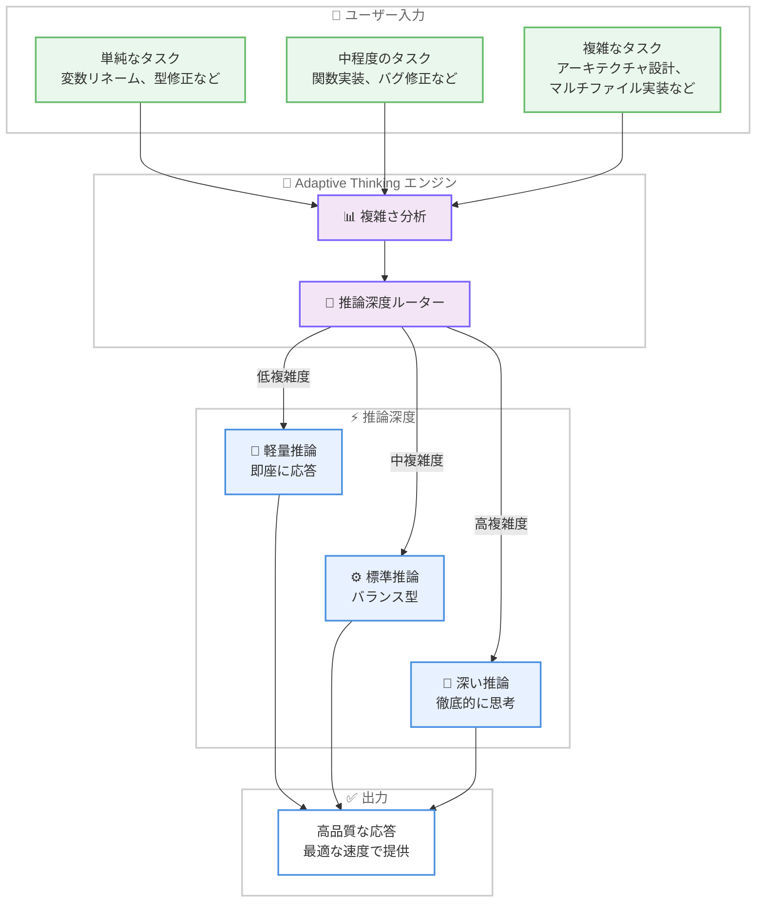

# Kiro - Claude Opus 4.7 with Adaptive Thinking

**リリース日**: 2026 年 5 月 7 日
**サービス**: Kiro
**機能**: Claude Opus 4.7 Adaptive Thinking

[このアップデートのインフォグラフィックを見る](https://takech9203.github.io/aws-news-summary/20260507-kiro-opus-4-7.html)

## 概要

Kiro IDE および CLI で Claude Opus 4.7 に Adaptive Thinking (適応型思考) 機能が追加された。Adaptive Thinking はタスクの複雑さに応じてモデルが使用する推論の深さを自動的に調整する機能であり、難しい問題にはより多くの時間をかけて思考し、単純な問題にはすばやく応答する。この機能は Pro、Pro+、Power サブスクライバー、および IAM Identity Center ユーザーに提供される。

最適なパフォーマンスと効率を得るためには、IDE バージョン 0.11.133 以降および CLI バージョン 2.2.0 以降が必要となる。Adaptive Thinking により、開発者はモデルの思考モードを手動で切り替える必要がなくなり、タスクの性質に応じた最適な推論リソース配分が自動的に行われる。

**アップデート前の課題**

- モデルの思考深度は固定されており、単純なコード補完にも複雑なアーキテクチャ設計にも同じ推論リソースが消費されていた
- 単純なタスクに対して過剰な推論が行われることで、応答速度が不必要に遅くなる場合があった
- 複雑なタスクに対して推論が不足し、十分な品質の出力が得られない場合があった
- 開発者が手動で思考モードを切り替える必要があり、ワークフローが中断されることがあった

**アップデート後の改善**

- タスクの複雑さを自動判定し、推論の深さを動的に調整することで最適なリソース配分を実現
- 単純なタスクへの応答速度が向上し、開発者の待機時間を短縮
- 複雑なマルチステップ実装やアーキテクチャ設計には十分な推論リソースが自動的に割り当てられ、出力品質が向上
- 手動での思考モード切り替えが不要になり、シームレスな開発体験を提供

## アーキテクチャ図



Adaptive Thinking はタスクの複雑さを分析し、推論の深さを自動的に 3 段階に調整する。単純なタスクには軽量推論で即座に応答し、複雑なタスクには深い推論で高品質な結果を生成する。

## サービスアップデートの詳細

### 主要機能

1. **Adaptive Thinking (適応型思考)**
   - タスクの複雑さをリアルタイムで分析し、最適な推論深度を自動選択
   - 単純なタスクには最小限の推論で高速応答を実現
   - 複雑なタスクにはより多くの推論ステップを費やして精度を向上
   - 開発者による手動の思考モード設定が不要

2. **Pro、Pro+、Power サブスクライバーへの提供**
   - Pro プラン以上のすべてのサブスクライバーが利用可能
   - IAM Identity Center ユーザーにも対応
   - 既存の Opus 4.7 クレジット乗数 (2.2x) は維持

3. **IDE および CLI の両方に対応**
   - Kiro IDE v0.11.133 以降で利用可能
   - Kiro CLI v2.2.0 以降で利用可能
   - 最新バージョンへのアップデートにより最適なパフォーマンスを発揮

## 技術仕様

### 必要バージョン

| 項目 | 最小バージョン |
|------|----------------|
| Kiro IDE | 0.11.133 |
| Kiro CLI | 2.2.0 |
| サブスクリプション | Pro / Pro+ / Power |
| 認証 | AWS IAM Identity Center |

### Adaptive Thinking の動作仕様

| タスク複雑度 | 推論深度 | 特徴 |
|--------------|----------|------|
| 低 (変数リネーム、フォーマット修正など) | 軽量 | 即座に応答、最小限の推論 |
| 中 (関数実装、テスト作成など) | 標準 | バランスの取れた推論と速度 |
| 高 (アーキテクチャ設計、マルチファイル実装など) | 深い | 徹底的な推論、自己検証を含む |

## 設定方法

### 前提条件

1. Pro、Pro+、または Power プランのサブスクリプションが有効であること
2. AWS IAM Identity Center でのログインが設定されていること
3. Kiro IDE v0.11.133 以降、または Kiro CLI v2.2.0 以降がインストールされていること

### 手順

#### ステップ 1: Kiro のアップデート

```bash
# CLI の場合: 最新バージョンにアップデート
kiro update
```

IDE の場合は、アプリを再起動することで最新バージョンが自動的に適用される。

#### ステップ 2: モデルの選択

```bash
# CLI の場合: Opus 4.7 を選択
kiro config set model opus-4.7
```

IDE の場合は、モデル選択メニューから Claude Opus 4.7 を選択する。Adaptive Thinking は Opus 4.7 選択時に自動的に有効化される。

#### ステップ 3: 動作確認

```bash
# バージョン確認
kiro --version
```

バージョンが 2.2.0 以上であることを確認し、通常通りタスクを実行する。Adaptive Thinking は自動的に動作し、追加の設定は不要である。

## メリット

### ビジネス面

- **開発速度の向上**: 単純なタスクへの応答が高速化され、開発者の待機時間が短縮される
- **コスト効率の最適化**: 推論リソースが必要な場所にのみ集中配分され、無駄なリソース消費を抑制
- **開発者体験の向上**: 手動でのモード切替が不要になり、開発フローの中断がなくなる

### 技術面

- **推論品質の向上**: 複雑なタスクに対して十分な推論ステップが自動割り当てされ、出力精度が向上
- **応答速度の最適化**: タスクに応じた最適な推論時間により、全体的なスループットが改善
- **スペック駆動開発との親和性**: 大規模なコードベースへの変更実装において、スペックへの忠実度がさらに向上

## デメリット・制約事項

### 制限事項

- Pro プラン以上が必要であり、Free プランでは利用不可
- IDE v0.11.133 以降、CLI v2.2.0 以降が必須であり、旧バージョンでは Adaptive Thinking が機能しない
- Opus 4.7 のクレジット乗数は 2.2x であり、Sonnet モデルと比較してクレジット消費が多い

### 考慮すべき点

- Adaptive Thinking による推論深度の自動判定は、タスクの記述方法によって結果が変わる可能性がある
- 推論深度の選択はモデル側で自動的に行われるため、ユーザーが明示的に深い思考を強制する方法が限定的な場合がある

## ユースケース

### ユースケース 1: 日常的なコーディング作業の高速化

**シナリオ**: 変数名の変更、型アノテーションの追加、インポート文の整理など、頻繁に発生する単純なリファクタリング作業

**実装例**:
```
# Kiro へのプロンプト
"getUserData 関数内の変数名 d を userData に変更して"
```

**効果**: Adaptive Thinking が低複雑度と判定し、軽量推論で即座に応答する。従来の固定深度推論と比較して応答時間が大幅に短縮される。

### ユースケース 2: 複雑なアーキテクチャ実装

**シナリオ**: マイクロサービス間の認証フローの設計と実装、複数ファイルにまたがるリファクタリング

**実装例**:
```
# Kiro へのプロンプト
"OAuth 2.0 PKCE フローを使用したマイクロサービス間認証を設計・実装して。
API Gateway、Lambda Authorizer、DynamoDB セッションストアを使用する構成で。"
```

**効果**: Adaptive Thinking が高複雑度と判定し、深い推論モードで徹底的に思考する。アーキテクチャの整合性確認や依存関係の分析を含む高品質な実装を生成する。

### ユースケース 3: スペック駆動開発での効率的な実装

**シナリオ**: Kiro Specs で定義された詳細な要件に基づく、大規模コードベースへの機能追加

**実装例**:
```
# Kiro Specs を使用
# Requirements -> Design -> Tasks の各フェーズで
# Adaptive Thinking が自動的に最適な推論深度を選択
kiro spec run my-feature-spec.md
```

**効果**: 要件分析フェーズでは深い推論で論理的矛盾を検出し、個々のタスク実装フェーズではタスクの複雑さに応じた推論深度を自動選択する。全体的なスペック実行時間が最適化される。

## 料金

Adaptive Thinking 機能そのものに追加料金は発生しない。Claude Opus 4.7 のクレジット乗数 (2.2x) は従来通り適用される。

| プラン | 月額料金 | Opus 4.7 利用 |
|--------|----------|---------------|
| Pro | $19/月 | 利用可 (2.2x クレジット乗数) |
| Pro+ | $39/月 | 利用可 (2.2x クレジット乗数) |
| Power | $99/月 | 利用可 (2.2x クレジット乗数) |

## 利用可能リージョン

グローバル

## 関連サービス・機能

- **Kiro Specs (スペック駆動開発)**: Adaptive Thinking により、Specs の各フェーズで最適な推論深度が自動適用される
- **Kiro Powers**: AI パワー機能と組み合わせることで、専門領域での推論品質がさらに向上
- **AWS IAM Identity Center**: エンタープライズ認証基盤として Kiro へのアクセス管理を提供

## 参考リンク

- [このアップデートのインフォグラフィック](https://takech9203.github.io/aws-news-summary/20260507-kiro-opus-4-7.html)
- [Kiro Changelog](https://kiro.dev/changelog/)
- [Opus 4.7 Blog 記事](https://kiro.dev/blog/opus-4-7/)
- [Kiro ダウンロード](https://kiro.dev/downloads/)
- [Kiro 料金ページ](https://kiro.dev/pricing/)
- [Kiro ドキュメント](https://kiro.dev/docs/)

## まとめ

Claude Opus 4.7 への Adaptive Thinking 機能の追加により、Kiro はタスクの複雑さに応じた推論深度の自動最適化を実現した。開発者は手動でのモード切替を意識することなく、単純なタスクには高速応答を、複雑なタスクには高品質な出力を自動的に受け取ることができる。この機能を最大限に活用するには、IDE を v0.11.133 以降、CLI を v2.2.0 以降にアップデートすることを推奨する。
