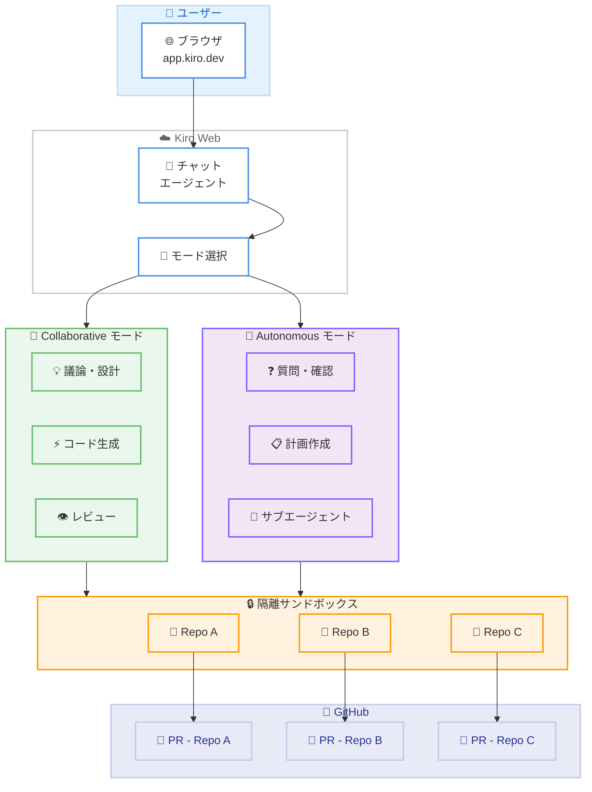

# Kiro - Kiro Web (Preview)

**リリース日**: 2026 年 5 月 7 日
**サービス**: Kiro
**機能**: Kiro Web (Preview)

📊 [このアップデートのインフォグラフィックを見る](https://takech9203.github.io/aws-news-summary/20260507-kiro-web-preview.html)

## 概要

Kiro Web (Preview) が app.kiro.dev で利用可能になった。Kiro Pro、Pro+、Power プランのユーザーが対象で、ブラウザベースの AI エージェントと対話しながらコード変更を進め、最終的にプルリクエストとして成果物を出力できる。複数リポジトリにまたがる変更を単一セッションで調整できる点が大きな特徴である。

Kiro は AWS が提供する AI 搭載 IDE であり、これまで IDE (デスクトップアプリ) と CLI の 2 つのインターフェースを提供してきた。今回の Web インターフェースの追加により、環境構築なしにブラウザからすぐにエージェントを利用できるようになり、アクセシビリティが大幅に向上した。

**アップデート前の課題**

- Kiro を使用するにはデスクトップ IDE のインストールまたは CLI のセットアップが必要だった
- 複数リポジトリにまたがる変更は各リポジトリで個別に作業する必要があった
- エージェントにタスクを完全に委任してプルリクエストまで自動化する手段がなかった
- チームの規約やパターンをセッション間で引き継ぐ仕組みが限定的だった

**アップデート後の改善**

- ブラウザから app.kiro.dev にアクセスするだけで AI エージェントを利用可能
- 単一セッション内で複数リポジトリの変更を調整し、それぞれにプルリクエストを作成可能
- Autonomous モードでタスクを完全に委任し、エージェントが計画から PR 作成まで自動実行
- Steering ファイルによるチーム規約の共有が IDE、CLI、Web で統一的に機能

## アーキテクチャ図



Kiro Web のワークフローを示す図。ユーザーはブラウザからエージェントとチャットし、Collaborative または Autonomous モードを選択する。エージェントは隔離されたサンドボックス内で複数リポジトリのコードを編集し、GitHub にプルリクエストを作成する。

## サービスアップデートの詳細

### 主要機能

1. **Collaborative モードと Autonomous モード**
   - Collaborative モード (デフォルト): ユーザーがエージェントと対話しながらアプローチを議論し、コードを共同作成。準備ができたらエージェントに PR の作成を指示する
   - Autonomous モード: エージェントがタスク全体を所有。最初に質問で要件を明確化し、計画を立て、専門サブエージェントに委任し、自動的に PR を作成する
   - モードはセッション中にトグルで切り替え可能

2. **GitHub ネイティブワークフロー**
   - セッション開始時に作業対象のリポジトリを選択
   - エージェントがリポジトリを隔離サンドボックスにクローンし、複数リポジトリの編集と PR を単一セッションで調整
   - GitHub Issues に `kiro` ラベルまたは `/kiro` コメントで作業を割り当て可能
   - エージェントがフィーチャーブランチを作成し、ユーザーの代理でコミットし、詳細な説明付きの PR を作成
   - PR のレビューコメントにエージェントが対応: `/kiro all` で全フィードバックに一括対応、`/kiro fix` で個別スレッドに対応

3. **Steering (ステアリング) の持続**
   - `.kiro/steering/` ディレクトリの Steering ファイルがセッション開始時にロードされる
   - Kiro IDE および Kiro CLI と同じフォーマットで動作
   - PR コメントを通じてエージェントに教えた内容が将来のセッションに引き継がれる
   - チーム全体のリポジトリで一貫した規約を適用可能

4. **隔離サンドボックス**
   - 各タスクは専用の隔離サンドボックスで実行
   - エージェントがリポジトリのクローン、環境設定の検出・構成、完了後のクリーンアップを自動実行
   - ネットワークアクセス、環境変数、シークレット、MCP サーバーをエージェント設定ページから制御可能

## 技術仕様

### 対応プラン

| プラン | 月額料金 | クレジット | Kiro Web 利用 |
|--------|----------|------------|---------------|
| Kiro Free | $0 | 50 | 非対応 |
| Kiro Pro | $20 | 1,000 | 対応 |
| Kiro Pro+ | $40 | 2,000 | 対応 |
| Kiro Power | $200 | 10,000 | 対応 |

### 動作要件

| 項目 | 詳細 |
|------|------|
| アクセス URL | https://app.kiro.dev |
| 対応ブラウザ | モダンブラウザ (Chrome、Firefox、Safari、Edge) |
| 認証 | GitHub アカウント連携 |
| リポジトリ連携 | GitHub |
| ステータス | Preview (プレビュー) |

### GitHub 連携コマンド

| コマンド | 説明 |
|----------|------|
| `kiro` ラベル | GitHub Issue にラベルを付与してエージェントに作業を割り当て |
| `/kiro` コメント | Issue またはPR にコメントでエージェントを呼び出し |
| `/kiro all` | PR の全レビューフィードバックに一括対応 |
| `/kiro fix` | PR の個別スレッドに対応 |

## 設定方法

### 前提条件

1. Kiro Pro、Pro+、または Power プランへの登録
2. GitHub アカウント
3. 作業対象のリポジトリへのアクセス権限

### 手順

#### ステップ 1: Kiro Web にアクセス

ブラウザで https://app.kiro.dev にアクセスし、GitHub アカウントでサインインする。

#### ステップ 2: リポジトリの選択

セッション開始時に作業対象のリポジトリを選択する。複数リポジトリを同時に選択して横断的な変更を実施できる。

#### ステップ 3: モードの選択とタスク開始

Collaborative モード (デフォルト) でエージェントとの対話を開始するか、Autonomous モードに切り替えてタスクを完全に委任する。

#### ステップ 4: Steering ファイルの設定 (任意)

チームの規約やパターンを共有するため、リポジトリに `.kiro/steering/` ディレクトリを作成し、Steering ファイルを配置する。

```
.kiro/
  steering/
    coding-standards.md
    review-guidelines.md
    architecture-patterns.md
```

このディレクトリに配置したファイルがセッション開始時に自動的にロードされ、エージェントの振る舞いをガイドする。

#### ステップ 5: サンドボックス設定のカスタマイズ (任意)

エージェント設定ページから、サンドボックスのネットワークアクセス、環境変数、シークレット、MCP サーバーを制御できる。

## メリット

### ビジネス面

- **開発サイクルの短縮**: タスクの完全委任により、ルーチン作業やバグ修正をエージェントに任せ、開発者は設計やレビューに集中可能
- **マルチリポジトリ運用の効率化**: マイクロサービスやモノレポ構成で、関連する変更を一度に調整し、整合性を保った状態で PR を作成
- **オンボーディング不要の即時利用**: IDE やCLI のインストールなしに、ブラウザからすぐに利用開始可能

### 技術面

- **隔離されたサンドボックス実行**: 各タスクが専用環境で実行されるため、開発者のローカル環境に影響を与えない
- **Steering による一貫性**: チーム全体で同じコーディング規約やアーキテクチャパターンを自動適用
- **GitHub ネイティブ統合**: Issue、PR、レビューコメントとシームレスに連携し、既存のワークフローを維持

## デメリット・制約事項

### 制限事項

- Preview 段階のため、機能や安定性が今後変更される可能性がある
- Kiro Free プランでは利用不可 (Pro 以上が必要)
- GitHub リポジトリのみ対応 (GitLab、Bitbucket 等は未対応)
- サンドボックス環境のため、外部サービスとの連携にはネットワーク設定が必要

### 考慮すべき点

- Autonomous モードでの自動 PR 作成は、レビュープロセスを変更する可能性がある
- 複数リポジトリの同時変更は、依存関係の管理に注意が必要
- Steering ファイルの設計がエージェントの出力品質に直接影響する

## ユースケース

### ユースケース 1: マイクロサービスの横断的リファクタリング

**シナリオ**: 共通ライブラリの API を変更し、依存する 3 つのマイクロサービスを同時に更新する必要がある。

**実装例**:
```
1. app.kiro.dev でセッション開始
2. 共通ライブラリ + 3 つのサービスリポジトリを選択
3. Autonomous モードに切り替え
4. 「共通ライブラリの認証モジュールを OAuth 2.1 に更新し、
    依存サービスを追従させてください」と指示
5. エージェントが 4 つのリポジトリに整合性のある PR を作成
```

**効果**: 従来は数時間から数日かかっていた横断的変更を、単一セッションで完了。各リポジトリの PR が相互参照付きで作成される。

### ユースケース 2: GitHub Issue からのバグ修正自動化

**シナリオ**: バグレポートが Issue として報告され、原因調査から修正、テスト追加、PR 作成までを自動化したい。

**実装例**:
```
1. GitHub Issue に "kiro" ラベルを付与
2. エージェントが Issue を認識し、自動的にタスクを開始
3. コードベースを分析し、バグの原因を特定
4. 修正コードとテストケースを生成
5. フィーチャーブランチで PR を作成し、Issue を参照
```

**効果**: 定型的なバグ修正を自動化し、開発者はレビューのみに集中。Issue から PR までのリードタイムを大幅に短縮。

### ユースケース 3: PR レビューフィードバックへの一括対応

**シナリオ**: PR に対して複数のレビュアーから指摘があり、それぞれのフィードバックに対応する必要がある。

**実装例**:
```
1. レビュアーが PR にコメントを追加
2. PR に "/kiro all" とコメント
3. エージェントが全レビューコメントを分析
4. 各指摘に対する修正を実施し、コミットをプッシュ
5. レビュアーに対応完了を通知
```

**効果**: レビューフィードバックへの対応時間を短縮し、PR のマージまでのサイクルを高速化。

## 料金

Kiro Web は既存の Kiro プランのクレジットを使用して利用する。追加の Web 専用料金は発生しない。

### 料金例

| プラン | 月額料金 | 含まれるクレジット | 超過料金 |
|--------|----------|-------------------|----------|
| Kiro Pro | $20/月 | 1,000 | $0.04/クレジット |
| Kiro Pro+ | $40/月 | 2,000 | $0.04/クレジット |
| Kiro Power | $200/月 | 10,000 | $0.04/クレジット |

## 利用可能リージョン

グローバル

Kiro Web はグローバルサービスとして提供され、app.kiro.dev から世界中のユーザーがアクセス可能である。

## 関連サービス・機能

- **Kiro IDE**: デスクトップベースの AI 搭載 IDE。Steering ファイルや Powers を Web 版と共有可能
- **Kiro CLI**: ターミナルベースのインターフェース。CI/CD パイプラインやリモート環境での利用に最適
- **GitHub**: Kiro Web のリポジトリ連携先。Issue、PR、レビューコメントを通じたワークフロー統合
- **Amazon Bedrock**: Kiro のバックエンドで利用される AI モデル基盤

## 参考リンク

- 📊 [インフォグラフィック](https://takech9203.github.io/aws-news-summary/20260507-kiro-web-preview.html)
- [Kiro Changelog](https://kiro.dev/changelog/)
- [Kiro Web アクセス](https://app.kiro.dev)
- [Kiro ドキュメント](https://kiro.dev/docs/)
- [Kiro 料金ページ](https://kiro.dev/pricing)

## まとめ

Kiro Web (Preview) の登場により、Kiro のエージェント機能がブラウザから即座に利用可能になった。特に複数リポジトリの横断的な変更を単一セッションで調整し、自動的に PR を作成できる Autonomous モードは、マイクロサービスアーキテクチャを採用するチームにとって大きな生産性向上をもたらす。Preview 段階であるため本番ワークフローへの全面導入は慎重に進めるべきだが、まずは Steering ファイルを整備し、定型的なタスクから試用を開始することを推奨する。
