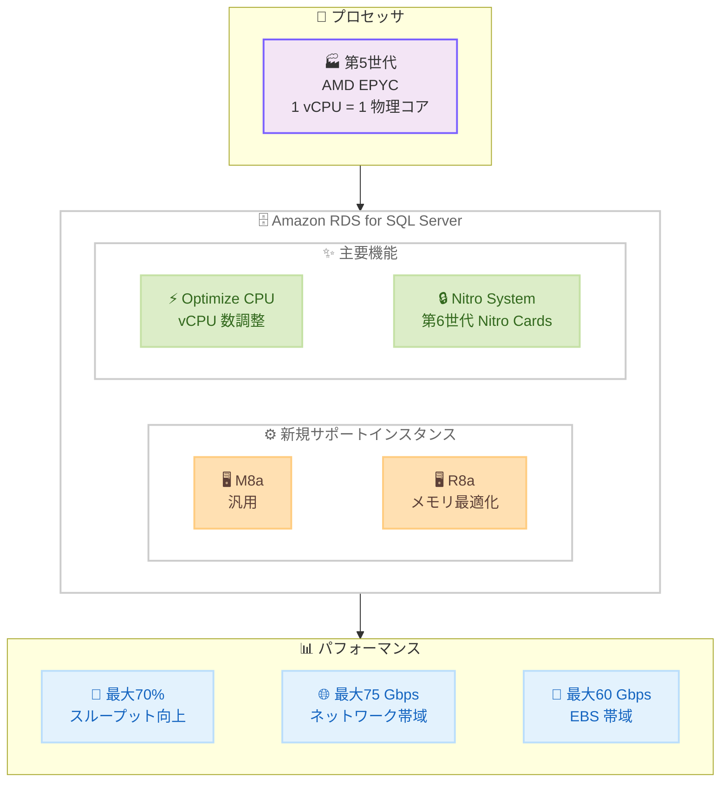

# Amazon RDS for SQL Server - AMD EPYC プロセッサ搭載インスタンスのサポート

**リリース日**: 2026年5月7日
**サービス**: Amazon RDS for SQL Server
**機能**: M8a / R8a インスタンスタイプのサポート

[このアップデートのインフォグラフィックを見る](https://takech9203.github.io/aws-news-summary/20260507-rds-sqlserver-supports-amd-instances.html)

## 概要

Amazon RDS for SQL Server が、第 5 世代 AMD EPYC プロセッサを搭載した M8a および R8a インスタンスタイプをサポートした。RDS for SQL Server 上でこれらのインスタンスを使用すると、一般的なインスタンスサイズにおいて、同等の x86 インスタンスと比較して最大 70% 高いスループットを実現する。

M8a は汎用インスタンス、R8a はメモリ最適化インスタンスとして位置づけられ、各 vCPU は物理 CPU コアに対応しており、一貫した per-core パフォーマンスを提供する。高 I/O 要件のワークロードに対しては、最大 75 Gbps のネットワーク帯域幅と 60 Gbps の Amazon EBS 帯域幅を提供する。

**アップデート前の課題**

- RDS for SQL Server で利用可能な AMD ベースのインスタンスタイプが旧世代に限られており、最新のプロセッサ性能を活用できなかった
- SQL Server のライセンスコストが vCPU 数に基づくため、パフォーマンスを維持しながらコストを最適化することが困難だった
- 高スループットが必要なデータベースワークロードで、ネットワークおよび EBS 帯域幅の制限がボトルネックとなる場合があった

**アップデート後の改善**

- 第 5 世代 AMD EPYC プロセッサにより、同等の x86 インスタンスと比較して最大 70% 高いスループットを実現
- Optimize CPU 機能により、vCPU 数を調整して SQL Server ライセンスコストを削減可能
- 最大 75 Gbps のネットワーク帯域幅と 60 Gbps の EBS 帯域幅で、I/O 集約型ワークロードに対応
- 第 6 世代 Nitro Cards を使用した AWS Nitro System 上に構築され、I/O 処理のオフロードによりシステム全体のパフォーマンスが向上

## アーキテクチャ図



M8a / R8a インスタンスは第 5 世代 AMD EPYC プロセッサと第 6 世代 Nitro Cards を組み合わせ、RDS for SQL Server に高スループットと高帯域幅を提供する。

## サービスアップデートの詳細

### 主要機能

1. **M8a インスタンス (汎用)**
   - 第 5 世代 AMD EPYC プロセッサ搭載、最大周波数 4.5 GHz
   - 前世代 M7a と比較して最大 30% 高いコンピューティング性能
   - 1 vCPU あたり 4 GiB メモリ (例: m8a.2xlarge で 8 vCPU / 32 GiB)
   - 最大 192 vCPU、768 GiB メモリまでスケール可能

2. **R8a インスタンス (メモリ最適化)**
   - 第 5 世代 AMD EPYC プロセッサ搭載、最大周波数 4.5 GHz
   - 前世代 R7a と比較して最大 30% 高いコンピューティング性能
   - 1 vCPU あたり 8 GiB メモリ (例: r8a.2xlarge で 8 vCPU / 64 GiB)
   - 最大 192 vCPU、1,536 GiB メモリまでスケール可能

3. **Optimize CPU 機能**
   - vCPU 数を調整して SQL Server のライセンスコストを削減
   - インスタンスの物理コア数を維持しつつ、有効な vCPU 数を減らすことが可能
   - Microsoft SQL Server の per-vCPU ライセンス課金を最適化

4. **AWS Nitro System (第 6 世代 Nitro Cards)**
   - I/O 機能をオフロードして全体的なシステムパフォーマンスを向上
   - AMD Secure Memory Encryption (SME) による AES-256 の常時メモリ暗号化

## 技術仕様

### M8a インスタンスサイズ (RDS for SQL Server 向け主要サイズ)

| インスタンスサイズ | vCPU | メモリ (GiB) | ネットワーク帯域 (Gbps) | EBS 帯域 (Gbps) |
|---|---|---|---|---|
| m8a.2xlarge | 8 | 32 | 最大 15 | 最大 10 |
| m8a.4xlarge | 16 | 64 | 最大 15 | 最大 10 |
| m8a.8xlarge | 32 | 128 | 15 | 10 |
| m8a.16xlarge | 64 | 256 | 30 | 20 |
| m8a.24xlarge | 96 | 384 | 40 | 30 |
| m8a.48xlarge | 192 | 768 | 75 | 60 |

### R8a インスタンスサイズ (RDS for SQL Server 向け主要サイズ)

| インスタンスサイズ | vCPU | メモリ (GiB) | ネットワーク帯域 (Gbps) | EBS 帯域 (Gbps) |
|---|---|---|---|---|
| r8a.2xlarge | 8 | 64 | 最大 15 | 最大 10 |
| r8a.4xlarge | 16 | 128 | 最大 15 | 最大 10 |
| r8a.8xlarge | 32 | 256 | 15 | 10 |
| r8a.16xlarge | 64 | 512 | 30 | 20 |
| r8a.24xlarge | 96 | 768 | 40 | 30 |
| r8a.48xlarge | 192 | 1,536 | 75 | 60 |

### パフォーマンス比較

| 比較項目 | 改善内容 |
|---|---|
| スループット | 同等の x86 インスタンスと比較して最大 70% 向上 |
| ネットワーク帯域 | 最大 75 Gbps |
| EBS 帯域 | 最大 60 Gbps |
| vCPU マッピング | 1 vCPU = 1 物理 CPU コア |
| メモリ帯域 | 前世代比 45% 向上 |

## 設定方法

### 前提条件

1. 既存の Amazon RDS for SQL Server インスタンスまたは新規作成の権限
2. M8a / R8a インスタンスが利用可能なリージョンであること
3. SQL Server のライセンスモデルの理解 (License Included または Bring Your Own License)

### 手順

#### ステップ 1: 新規インスタンスの作成 (AWS CLI)

```bash
aws rds create-db-instance \
  --db-instance-identifier my-sqlserver-m8a \
  --db-instance-class db.m8a.4xlarge \
  --engine sqlserver-ee \
  --master-username admin \
  --master-user-password <password> \
  --allocated-storage 200
```

M8a インスタンスクラスを指定して RDS for SQL Server インスタンスを作成する。`db.m8a.*` または `db.r8a.*` のプレフィックスを使用する。

#### ステップ 2: 既存インスタンスのインスタンスクラス変更

```bash
aws rds modify-db-instance \
  --db-instance-identifier my-existing-sqlserver \
  --db-instance-class db.r8a.8xlarge \
  --apply-immediately
```

既存の RDS for SQL Server インスタンスを R8a インスタンスクラスに変更する。`--apply-immediately` を指定しない場合は次のメンテナンスウィンドウで適用される。

#### ステップ 3: Optimize CPU の設定

```bash
aws rds modify-db-instance \
  --db-instance-identifier my-sqlserver-m8a \
  --processor-features "Name=coreCount,Value=8" \
  --apply-immediately
```

Optimize CPU 機能を使用して有効なコア数を調整する。これにより、SQL Server のライセンスコストを vCPU 数に基づいて削減できる。

## メリット

### ビジネス面

- **ライセンスコスト最適化**: Optimize CPU 機能により、必要な vCPU 数のみに対して SQL Server ライセンスを支払うことでコストを大幅に削減
- **価格性能比の向上**: 前世代 AMD ベースインスタンスと比較して最大 19% 優れた価格性能比を実現
- **柔軟な購入オプション**: オンデマンド料金または Database Savings Plans による購入が可能

### 技術面

- **スループット向上**: 同等の x86 インスタンスと比較して最大 70% 高いスループットにより、データベースクエリのレスポンスタイムが改善
- **一貫したパフォーマンス**: 各 vCPU が物理 CPU コアに対応し、ハイパースレッディングによるパフォーマンスのばらつきを排除
- **高帯域幅 I/O**: 最大 75 Gbps ネットワーク / 60 Gbps EBS により、大量のデータ転送やバックアップ処理に対応
- **セキュリティ強化**: AMD SME による AES-256 の常時メモリ暗号化でデータ保護を強化

## デメリット・制約事項

### 制限事項

- Amazon EC2 で M8a / R8a が利用可能なリージョンのみで使用可能
- ベアメタルインスタンス (metal) は RDS では利用不可
- インスタンスクラス変更時にダウンタイムが発生する (Multi-AZ 構成の場合はフェイルオーバーで最小化可能)

### 考慮すべき点

- 既存の Reserved Instances は新しいインスタンスファミリーには適用されないため、Savings Plans への移行を検討する必要がある
- Optimize CPU でコア数を減らすと CPU バウンドなワークロードではパフォーマンスに影響する可能性がある
- AMD プロセッサ固有の命令セットに依存するワークロードがある場合は互換性を確認する必要がある

## ユースケース

### ユースケース 1: OLTP データベースの高スループット化

**シナリオ**: 大量のトランザクション処理を行う SQL Server データベースで、現行インスタンスのスループットが限界に達している。

**実装例**:
```bash
# 現行の db.r6i.4xlarge から db.r8a.4xlarge に移行
aws rds modify-db-instance \
  --db-instance-identifier prod-oltp-db \
  --db-instance-class db.r8a.4xlarge \
  --apply-immediately
```

**効果**: 同等サイズで最大 70% のスループット向上により、ピーク時のトランザクション処理能力が大幅に改善される。

### ユースケース 2: SQL Server ライセンスコストの最適化

**シナリオ**: メモリ集約型ワークロードのため大きなインスタンスが必要だが、CPU はフル活用していない。SQL Server Enterprise Edition のライセンスコストが課題。

**実装例**:
```bash
# r8a.8xlarge (32 vCPU) でコア数を 16 に制限
aws rds modify-db-instance \
  --db-instance-identifier prod-analytics-db \
  --db-instance-class db.r8a.8xlarge \
  --processor-features "Name=coreCount,Value=16" \
  --apply-immediately
```

**効果**: 256 GiB のメモリを維持しつつ、ライセンス対象の vCPU 数を半減させることで、SQL Server ライセンスコストを約 50% 削減。

### ユースケース 3: データウェアハウスの大規模クエリ処理

**シナリオ**: レポーティングや分析用のデータウェアハウスで、大量のデータスキャンを伴うクエリのパフォーマンスが課題。高い EBS 帯域幅が必要。

**実装例**:
```bash
# 大規模メモリと高 I/O 帯域幅が必要な分析ワークロード
aws rds create-db-instance \
  --db-instance-identifier analytics-dw \
  --db-instance-class db.r8a.24xlarge \
  --engine sqlserver-ee \
  --master-username admin \
  --master-user-password <password> \
  --allocated-storage 5000 \
  --storage-type io2 \
  --iops 64000
```

**効果**: 768 GiB メモリと 40 Gbps EBS 帯域幅により、大規模なテーブルスキャンやインメモリ処理のパフォーマンスが向上。45% 高いメモリ帯域幅が分析クエリの実行時間を短縮する。

## 料金

RDS for SQL Server の M8a / R8a インスタンスはオンデマンド料金または Database Savings Plans で利用可能。料金はインスタンスサイズ、SQL Server エディション、ライセンスモデルにより異なる。

### 料金例

| インスタンスサイズ | 購入方法 |
|---|---|
| db.m8a.* / db.r8a.* | オンデマンド料金 |
| db.m8a.* / db.r8a.* | Database Savings Plans (最大割引) |

詳細な料金については [Amazon RDS for SQL Server 料金ページ](https://aws.amazon.com/rds/sqlserver/pricing/) を参照。

## 利用可能リージョン

Amazon EC2 で M8a および R8a インスタンスが提供されている全ての商用 AWS リージョンで利用可能。

## 関連サービス・機能

- **Amazon EC2 M8a インスタンス**: RDS の基盤となる汎用コンピューティングインスタンス
- **Amazon EC2 R8a インスタンス**: RDS の基盤となるメモリ最適化インスタンス
- **RDS Optimize CPU**: vCPU 数を制御してライセンスコストを最適化する RDS 機能
- **AWS Nitro System**: セキュリティ、パフォーマンス、イノベーションの基盤となるハードウェアプラットフォーム
- **Database Savings Plans**: RDS インスタンスの柔軟な割引購入オプション

## 参考リンク

- [インフォグラフィック](https://takech9203.github.io/aws-news-summary/20260507-rds-sqlserver-supports-amd-instances.html)
- [公式発表 (What's New)](https://aws.amazon.com/about-aws/whats-new/2026/05/rds-sqlserver-supports-amd-instances/)
- [Amazon RDS for SQL Server ドキュメント](https://docs.aws.amazon.com/AmazonRDS/latest/UserGuide/CHAP_SQLServer.html)
- [Amazon RDS for SQL Server 料金ページ](https://aws.amazon.com/rds/sqlserver/pricing/)
- [Database Savings Plans](https://aws.amazon.com/savingsplans/database-pricing/)
- [Amazon EC2 M8a インスタンス](https://aws.amazon.com/ec2/instance-types/m8a/)
- [Amazon EC2 R8a インスタンス](https://aws.amazon.com/ec2/instance-types/r8a/)

## まとめ

Amazon RDS for SQL Server が M8a / R8a インスタンスをサポートしたことで、第 5 世代 AMD EPYC プロセッサによる最大 70% のスループット向上と、Optimize CPU 機能による SQL Server ライセンスコストの最適化を同時に実現できる。高い I/O 帯域幅と一貫した per-core パフォーマンスにより、OLTP からデータウェアハウスまで幅広いワークロードに対応する。既存の RDS for SQL Server インスタンスを運用しているユーザーは、インスタンスクラスの変更による移行を検討することを推奨する。
