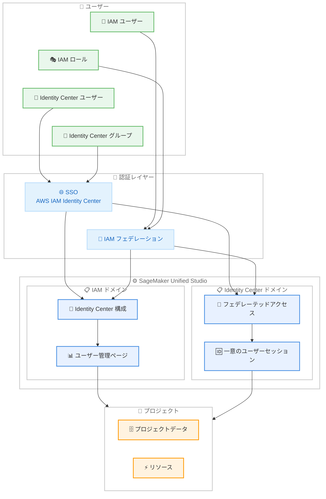

# Amazon SageMaker Unified Studio - ID とユーザー管理機能の追加

**リリース日**: 2026年5月7日
**サービス**: Amazon SageMaker Unified Studio
**機能**: ID 構成およびユーザー管理の管理機能

📊 [このアップデートのインフォグラフィックを見る](https://takech9203.github.io/aws-news-summary/20260507-smus-identity-user-management.html)

## 概要

Amazon SageMaker Unified Studio に、ID 構成とユーザー管理に関する新しい管理機能が追加された。この機能により、管理者は IAM ドメインと Identity Center ドメインの両方のドメインタイプにおいて、より柔軟な ID 管理とユーザーオンボーディングが可能になる。

今回のアップデートにより、IAM ドメインでは AWS IAM Identity Center を設定して SSO によるユーザーオンボーディングが可能になり、Identity Center ドメインではフェデレーテッド IAM ロールを通じたポータルアクセスがサポートされた。これにより、認証方法に関係なくチームメンバーがプロジェクトデータとリソースで共同作業できるようになる。

**アップデート前の課題**

- IAM ドメインではシングルサインオン (SSO) によるユーザーオンボーディングができなかった
- IAM ドメインのユーザー管理が分散しており、一元的なビューが存在しなかった
- Identity Center ドメインではフェデレーテッド IAM ロールでのアクセスがサポートされていなかった
- 同一 IAM ロールを共有する複数ユーザーの個別セッション管理ができなかった
- 認証方法の違いにより、ドメインタイプをまたいだ柔軟なコラボレーションが困難だった

**アップデート後の改善**

- IAM ドメインで AWS IAM Identity Center を構成し、SSO によるユーザーオンボーディングが可能になった
- IAM ロール、IAM ユーザー、Identity Center ユーザー、Identity Center グループをプロジェクトメンバーとして追加可能になった
- 新しいドメインユーザー管理ページにより、ドメイン内の全アクティブユーザーを一元管理できるようになった
- Identity Center ドメインでフェデレーテッド IAM ロールによるアクセスが可能になった
- フェデレーテッドユーザーごとに一意のセッションが作成され、同一ロール共有時の作業上書きが防止されるようになった

## アーキテクチャ図



SageMaker Unified Studio における ID フェデレーションフローを示す。IAM ユーザー/ロールと Identity Center ユーザー/グループの両方が、SSO またはフェデレーションを通じて IAM ドメインおよび Identity Center ドメインにアクセスし、プロジェクトリソースを共有できる。

## サービスアップデートの詳細

### 主要機能

1. **IAM ドメインでの SSO オンボーディング**
   - AWS IAM Identity Center を設定することで、IAM ドメインでも SSO 経由のユーザーオンボーディングが可能
   - SageMaker Unified Studio 管理者ポータルから IAM Identity Center 統合を設定
   - IAM ロール、IAM ユーザー、Identity Center ユーザー、Identity Center グループをプロジェクトメンバーとして追加可能

2. **ドメインユーザー管理ページ**
   - IAM ドメイン向けの新しい一元管理画面
   - ドメイン内のすべてのアクティブユーザーを統合ビューで表示
   - アクセス管理と権限更新を単一画面から実行可能

3. **Identity Center ドメインでのフェデレーテッド IAM ロールアクセス**
   - Identity Center ドメインで IAM ロールを通じたフェデレーテッドアクセスをサポート
   - フェデレーテッドユーザーごとに一意のセッションを自動作成
   - 同一 IAM ロールを共有するユーザー間で作業の上書きが発生しない
   - 管理者は複数ユーザーが単一 IAM ロールを共有している場合でも個別のアクションを監査可能

4. **クロスドメインタイプの ID サポート**
   - IAM アイデンティティと IAM Identity Center 企業 ID の両方を、両ドメインタイプで使用可能
   - 認証方法に関係なく、チームメンバーが SageMaker Unified Studio で共同作業可能

## 技術仕様

### サポートされる ID タイプ

| ドメインタイプ | サポートされる ID | 新機能 |
|------|------|------|
| IAM ドメイン | IAM ロール、IAM ユーザー、Identity Center ユーザー、Identity Center グループ | SSO オンボーディング、ユーザー管理ページ |
| Identity Center ドメイン | Identity Center ユーザー/グループ、フェデレーテッド IAM ロール | フェデレーテッド IAM ロールアクセス、一意セッション |

### ドメイン構成の比較

| 項目 | IAM ドメイン | Identity Center ドメイン |
|------|------|------|
| 基本認証 | IAM ロール/ユーザー | Identity Center ユーザー/グループ |
| SSO 対応 | 新規対応 (Identity Center 構成) | 既存対応 |
| フェデレーション | - | 新規対応 (IAM ロール経由) |
| セッション管理 | - | 一意のユーザーセッション (新規) |
| ユーザー管理画面 | 新規 (統合ビュー) | 既存 |

## 設定方法

### 前提条件

1. Amazon SageMaker Unified Studio ドメインが作成済みであること
2. ドメインの管理者権限を持つこと
3. IAM Identity Center が同一リージョンで有効化されていること (SSO 構成の場合)

### 手順

#### ステップ 1: IAM ドメインで Identity Center を構成

SageMaker Unified Studio 管理者ポータルにアクセスし、IAM ドメインの設定画面で AWS IAM Identity Center 統合を有効化する。

```bash
# AWS CLI でドメイン情報を確認
aws sagemaker describe-domain \
  --domain-id <domain-id> \
  --region <region>
```

上記コマンドでドメインの現在の設定状態を確認できる。Identity Center の構成は管理者ポータルの UI から実行する。

#### ステップ 2: プロジェクトメンバーの追加

Identity Center 構成完了後、管理者ポータルからプロジェクトメンバーを追加する。以下の ID タイプをメンバーとして追加可能。

- IAM ロール
- IAM ユーザー
- IAM Identity Center ユーザー
- IAM Identity Center グループ

#### ステップ 3: ユーザー管理ページでのアクセス管理

新しいドメインユーザー管理ページを使用して、ドメイン内の全アクティブユーザーを確認し、アクセス権限の管理と更新を実行する。

## メリット

### ビジネス面

- **チームコラボレーションの向上**: 認証方法の違いに関係なく、チームメンバーが同一プロジェクトで共同作業可能
- **オンボーディング工数の削減**: SSO 統合により、新規ユーザーの追加が迅速かつ簡単に
- **監査とコンプライアンスの強化**: フェデレーテッドユーザーの個別アクション追跡により、コンプライアンス要件への対応が容易に

### 技術面

- **ID 管理の統一**: IAM と Identity Center の両方の ID を単一のプラットフォームで管理可能
- **セッション分離**: 同一 IAM ロールを共有するユーザー間でセッションが分離され、データ整合性を確保
- **一元管理**: 新しいユーザー管理ページにより、分散していた管理タスクを統合

## デメリット・制約事項

### 制限事項

- IAM Identity Center が同一リージョンで有効化されている必要がある
- IAM ドメインの SSO 構成は管理者ポータルからの手動設定が必要
- すべてのリージョンで利用可能ではない (15 リージョンで対応)

### 考慮すべき点

- 既存の IAM ドメインに Identity Center 統合を追加する場合、既存ユーザーのアクセスに影響がないか事前に確認が必要
- フェデレーテッドアクセスのセッション管理により、セッション有効期限やタイムアウトの設定を適切に行う必要がある
- 複数の認証方法を併用する場合、組織のセキュリティポリシーとの整合性を確認すること

## ユースケース

### ユースケース 1: マルチチームでの ML プロジェクト共同作業

**シナリオ**: データサイエンスチーム (Identity Center 管理) とインフラチーム (IAM ロール管理) が同一の ML プロジェクトで共同作業する必要がある。

**実装例**:
```
1. IAM ドメインで Identity Center を構成
2. データサイエンスチームを Identity Center グループとして追加
3. インフラチームを IAM ロールとして追加
4. 両チームが同一プロジェクトのデータとリソースにアクセス
```

**効果**: 認証基盤の違いを意識することなく、チーム横断でのコラボレーションが実現

### ユースケース 2: 外部コンサルタントの一時的なアクセス付与

**シナリオ**: 外部コンサルタントに IAM ロール経由のフェデレーテッドアクセスを付与し、Identity Center ドメインのプロジェクトに参加させる。

**実装例**:
```
1. Identity Center ドメインでフェデレーテッド IAM ロールアクセスを有効化
2. コンサルタント用の IAM ロールを作成
3. コンサルタントがフェデレーションを通じてポータルにアクセス
4. 一意のセッションにより個別の作業履歴が保持される
```

**効果**: Identity Center にユーザーを追加することなく、既存の IAM ロールベースのアクセス管理で外部ユーザーのオンボーディングが可能

### ユースケース 3: 大規模組織でのユーザー管理の効率化

**シナリオ**: 数百人規模のデータサイエンティストが所属する組織で、IAM ドメインのユーザー管理を効率化したい。

**実装例**:
```
1. 新しいドメインユーザー管理ページにアクセス
2. 全アクティブユーザーの一覧を確認
3. 不要なアクセス権限を特定して削除
4. グループ単位での権限更新を実行
```

**効果**: 管理者の運用負荷を軽減し、アクセス権限の棚卸しを効率的に実施可能

## 料金

SageMaker Unified Studio の ID 管理およびユーザー管理機能自体に追加料金は発生しない。SageMaker Unified Studio の標準料金が適用される。AWS IAM Identity Center の使用料金も無料である。

## 利用可能リージョン

以下の 15 リージョンで利用可能。

- アジアパシフィック (ムンバイ) - ap-south-1
- アジアパシフィック (ソウル) - ap-northeast-2
- アジアパシフィック (シンガポール) - ap-southeast-1
- アジアパシフィック (シドニー) - ap-southeast-2
- アジアパシフィック (東京) - ap-northeast-1
- カナダ (中部) - ca-central-1
- 欧州 (フランクフルト) - eu-central-1
- 欧州 (アイルランド) - eu-west-1
- 欧州 (ロンドン) - eu-west-2
- 欧州 (パリ) - eu-west-3
- 欧州 (ストックホルム) - eu-north-1
- 南米 (サンパウロ) - sa-east-1
- 米国東部 (バージニア北部) - us-east-1
- 米国東部 (オハイオ) - us-east-2
- 米国西部 (オレゴン) - us-west-2

## 関連サービス・機能

- **AWS IAM Identity Center**: SageMaker Unified Studio と統合し、SSO およびグループベースのアクセス管理を提供
- **AWS IAM**: IAM ロールおよびユーザーベースのアクセス制御を提供し、フェデレーテッドアクセスの基盤
- **Amazon SageMaker Studio**: SageMaker Unified Studio の IDE 環境。同一ドメイン内で ML 開発を実行
- **AWS CloudTrail**: フェデレーテッドユーザーの個別アクション監査に使用

## 参考リンク

- 📊 [インフォグラフィック](https://takech9203.github.io/aws-news-summary/20260507-smus-identity-user-management.html)
- [公式発表 (What's New)](https://aws.amazon.com/about-aws/whats-new/2026/05/smus-identity-user-management/)
- [SageMaker Unified Studio ドキュメント](https://docs.aws.amazon.com/sagemaker-unified-studio/latest/adminguide/working-with-domains.html)
- [AWS IAM Identity Center ドキュメント](https://docs.aws.amazon.com/singlesignon/latest/userguide/what-is.html)

## まとめ

Amazon SageMaker Unified Studio の ID およびユーザー管理機能の強化により、IAM ドメインと Identity Center ドメインの両方で、より柔軟な認証とアクセス管理が可能になった。特に、異なる認証方法を使用するチームメンバーが同一プロジェクトで共同作業できるようになった点は、大規模組織での ML プロジェクト運営において大きな価値を提供する。東京リージョンを含む 15 リージョンで利用可能であり、既存の SageMaker Unified Studio ユーザーは追加費用なく本機能を利用開始できる。
