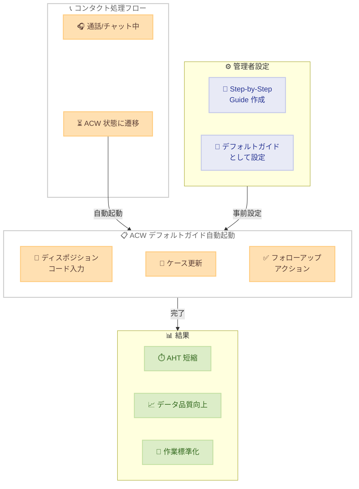

# Amazon Connect - デフォルト Step-by-Step Guides for After Contact Work

**リリース日**: 2026年5月8日
**サービス**: Amazon Connect
**機能**: Default Step-by-Step Guides for After Contact Work (ACW)

📊 [このアップデートのインフォグラフィックを見る](https://takech9203.github.io/aws-news-summary/20260508-amazon-connect-adds-default-step-by-step-guides-for-after-contact-work.html)

## 概要

Amazon Connect に、After Contact Work (ACW) 状態でデフォルトの Step-by-Step Guide を自動起動する機能が追加された。これにより、コンタクトセンターの管理者は、エージェントが ACW 状態に入った際に自動的にガイドを表示させることが可能になり、手動操作なしでポストコンタクトワークフローを標準化できる。

この機能は、エージェントが通話やチャットを終了した直後のラップアップ作業を体系化することを目的としている。ディスポジションコードの記録、ケースの更新、フォローアップアクションの完了など、必須のタスクをガイド形式で提示することで、作業の一貫性を確保し、ハンドル時間の短縮を実現する。

従来、エージェントは ACW 中に適切なアプリケーションやフォームを手動で探してナビゲートする必要があったが、今回のアップデートにより、管理者が事前に設定したガイドが自動的に表示されるため、エージェントの生産性向上とエラー削減に貢献する。

**アップデート前の課題**

- エージェントが ACW 状態に入った後、適切なアプリケーションやフォームを手動で探す必要があった
- ポストコンタクトワークフローが標準化されておらず、エージェントごとに作業手順が異なっていた
- ラップアップ作業の漏れや入力ミスが発生しやすく、データ品質に影響していた
- ACW 時間が長くなりがちで、平均処理時間 (AHT) の増加につながっていた
- Step-by-Step Guide はコンタクト中のみ利用可能で、ACW フェーズでの自動起動には対応していなかった

**アップデート後の改善**

- ACW 状態への遷移時に、デフォルトの Step-by-Step Guide が自動的に起動される
- 管理者が事前に定義したワークフローにより、すべてのエージェントが統一された手順でラップアップ作業を実行できる
- 手動ナビゲーションが不要になり、ACW 時間の短縮とエージェント生産性の向上が実現される
- ディスポジションコードの記録漏れやケース更新忘れなどのヒューマンエラーが削減される

## アーキテクチャ図

エージェントが通話/チャットを終了し ACW 状態に遷移すると、管理者が事前に設定したデフォルトの Step-by-Step Guide が自動的に起動され、標準化されたラップアップ作業が実行される。

## サービスアップデートの詳細

### 主要機能

1. **デフォルト ACW ガイドの自動起動**
   - エージェントが ACW 状態に入ると、設定済みの Step-by-Step Guide が自動的に表示される
   - 手動でのガイド選択やアプリケーション切り替えが不要
   - コンタクトタイプに応じた適切なガイドを自動的にルーティング可能

2. **管理者によるガイド設定**
   - コンタクトセンター管理者がデフォルトガイドを事前に定義
   - ガイド内で必須フィールドの入力やステップの完了を強制可能
   - 複数のガイドテンプレートを作成し、条件に応じた出し分けが可能

3. **標準化されたポストコンタクトワークフロー**
   - ディスポジションコードの記録
   - ケース情報の更新
   - フォローアップアクションの登録
   - 品質管理情報の入力

## 技術仕様

### Step-by-Step Guide の ACW 対応仕様

| 項目 | 詳細 |
|------|------|
| トリガー | エージェントが ACW 状態に遷移した時点 |
| 起動方式 | 自動起動 (手動操作不要) |
| 設定単位 | コンタクトフロー/キュー単位で設定可能 |
| ガイドタイプ | Step-by-Step Guide (既存のガイド機能を拡張) |
| エージェントワークスペース | Amazon Connect Agent Workspace 内で表示 |

### 設定要件

| 項目 | 詳細 |
|------|------|
| 前提条件 | Amazon Connect インスタンスで Step-by-Step Guides が有効化されていること |
| 権限 | コンタクトセンター管理者権限 |
| 互換性 | 既存の Step-by-Step Guide と同じビルダーで作成可能 |

## 設定方法

### 前提条件

1. Amazon Connect インスタンスが稼働中であること
2. Step-by-Step Guides 機能が有効化されていること
3. Amazon Connect Agent Workspace を使用していること
4. 管理者権限を持つユーザーでログインしていること

### 手順

#### ステップ 1: Step-by-Step Guide の作成

Amazon Connect 管理コンソールにログインし、Step-by-Step Guides セクションでラップアップ用のガイドを作成する。ディスポジションコードの選択、ケース更新フォーム、フォローアップアクション登録などのステップを定義する。

#### ステップ 2: デフォルト ACW ガイドとして設定

作成したガイドを ACW のデフォルトガイドとして割り当てる。コンタクトフローの設定画面で、ACW 時に起動するガイドを指定する。

#### ステップ 3: テストと検証

テストコンタクトを実行し、通話終了後に ACW 状態に遷移した際にガイドが自動的に表示されることを確認する。ガイドの各ステップが正しく動作し、入力データが適切に保存されることを検証する。

## メリット

### ビジネス面

- **AHT の短縮**: エージェントがアプリケーションを探す時間が削減され、平均処理時間が短縮される
- **データ品質の向上**: 標準化されたフォームにより、入力漏れやミスが減少し、レポーティングの精度が向上する
- **コンプライアンス強化**: 必須項目の入力を強制できるため、規制要件への準拠が容易になる
- **オンボーディング効率化**: 新人エージェントでもガイドに従って正確に作業を完了できる

### 技術面

- **ノーコード設定**: Step-by-Step Guide ビルダーを使用してガイドを視覚的に作成でき、開発リソースが不要
- **既存機能の拡張**: 新たなインフラストラクチャの追加なしに、既存の Step-by-Step Guides 機能を活用
- **柔軟なカスタマイズ**: コンタクトタイプやキューに応じて異なるガイドを設定可能
- **データ連携**: ガイドで入力されたデータは Amazon Connect のケース管理やコンタクト属性と連携

## デメリット・制約事項

### 制限事項

- Amazon Connect Agent Workspace の使用が前提となるため、カスタム CCP を使用している場合は対応が必要
- Step-by-Step Guides 機能が有効化されているインスタンスでのみ利用可能
- ガイドの複雑さによっては、かえって ACW 時間が長くなる可能性がある

### 考慮すべき点

- 既存のラップアップワークフローからの移行計画が必要
- エージェントへのトレーニングやチェンジマネジメントの実施が推奨される
- ガイドの設計が不適切な場合、エージェントの作業効率に悪影響を与える可能性がある

## ユースケース

### ユースケース 1: カスタマーサポートのディスポジション記録

**シナリオ**: 大規模なカスタマーサポートセンターで、すべてのコンタクトに対して一貫したディスポジションコードの記録を義務付けたい。

**実装例**:
ACW デフォルトガイドにディスポジションコードの選択画面を配置し、エージェントがカテゴリ (問い合わせ種別、解決状況、エスカレーション有無) を選択するステップを定義する。

**効果**: ディスポジションコードの記録率が 100% に近づき、コンタクト分析の精度が向上する。

### ユースケース 2: 保険会社のクレーム処理

**シナリオ**: 保険会社のコンタクトセンターで、クレーム関連の通話後に必ずケース情報を更新し、次のアクションを登録する必要がある。

**実装例**:
ACW ガイドで「クレームステータスの更新」「損害額の入力」「次回フォローアップ日時の設定」「必要書類リストの確認」をステップとして定義する。

**効果**: クレーム処理の追跡が確実になり、フォローアップ漏れが防止される。

### ユースケース 3: テクニカルサポートのナレッジ記録

**シナリオ**: テクニカルサポートチームで、解決した問題の内容とソリューションをナレッジベースに記録したい。

**実装例**:
ACW ガイドで「問題カテゴリの選択」「解決策の要約入力」「関連ドキュメントのリンク追加」「顧客満足度の記録」をステップとして構成する。

**効果**: ナレッジベースが充実し、同様の問題に対する将来の解決時間が短縮される。

## 料金

Step-by-Step Guides for ACW は Amazon Connect の既存機能の拡張であり、追加料金は発生しない。Amazon Connect の標準料金体系に含まれる。

| 項目 | 料金 |
|------|------|
| Step-by-Step Guides (ACW) | Amazon Connect の使用料に含まれる |
| Amazon Connect 音声通話 | $0.018/分 (インバウンド) |
| Amazon Connect チャット | $0.004/メッセージ |

※ 料金はリージョンにより異なる。最新の料金情報は AWS 公式料金ページを参照。

## 利用可能リージョン

Amazon Connect Step-by-Step Guides が利用可能なすべてのリージョンで使用可能。主要なリージョンは以下の通り。

- 米国東部 (バージニア北部) - us-east-1
- 米国西部 (オレゴン) - us-west-2
- アジアパシフィック (東京) - ap-northeast-1
- アジアパシフィック (シドニー) - ap-southeast-2
- アジアパシフィック (シンガポール) - ap-southeast-1
- 欧州 (フランクフルト) - eu-central-1
- 欧州 (ロンドン) - eu-west-2
- カナダ (中部) - ca-central-1
- アフリカ (ケープタウン) - af-south-1

## 関連サービス・機能

- **Amazon Connect Step-by-Step Guides**: 今回のアップデートのベースとなる既存機能。コンタクト中のエージェントガイダンスを提供
- **Amazon Connect Agent Workspace**: ガイドが表示されるエージェント向け統合ワークスペース
- **Amazon Connect Cases**: ACW ガイドと連携してケース情報の作成・更新が可能
- **Amazon Connect Contact Lens**: コンタクト分析結果と組み合わせてガイド内容を最適化
- **Amazon Connect Flows**: コンタクトフロー内でデフォルト ACW ガイドの割り当てを設定

## 参考リンク

- 📊 [インフォグラフィック](https://takech9203.github.io/aws-news-summary/20260508-amazon-connect-adds-default-step-by-step-guides-for-after-contact-work.html)
- [公式発表 (What's New)](https://aws.amazon.com/about-aws/whats-new/2026/05/amazon-connect-adds-default-step-by-step-guides-for-after-contact-work)
- [Amazon Connect Step-by-Step Guides ドキュメント](https://docs.aws.amazon.com/connect/latest/adminguide/step-by-step-guided-experiences.html)
- [Amazon Connect 料金ページ](https://aws.amazon.com/connect/pricing/)

## まとめ

Amazon Connect の ACW デフォルト Step-by-Step Guides は、コンタクトセンターにおけるポストコンタクトワークフローの標準化と効率化を実現する重要なアップデートである。エージェントが ACW 状態に入ると自動的にガイドが起動されるため、手動ナビゲーションの手間が省かれ、AHT の短縮とデータ品質の向上が期待できる。コンタクトセンターの運用品質を向上させたい組織は、既存のラップアップ手順を Step-by-Step Guide として定義し、デフォルト ACW ガイドとして設定することを推奨する。
