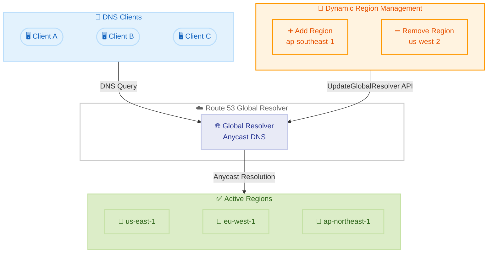

# Amazon Route 53 Global Resolver - リージョンの動的追加・削除による Anycast DNS 解決

**リリース日**: 2026年5月8日
**サービス**: Amazon Route 53 Global Resolver
**機能**: Add and Remove AWS Regions for Anycast DNS Resolution

📊 [このアップデートのインフォグラフィックを見る](https://takech9203.github.io/aws-news-summary/20260508-amazon-route-global-resolver-aws.html)

## 概要

Amazon Route 53 Global Resolver に、Anycast DNS 解決に参加する AWS リージョンを動的に追加・削除できる機能が追加された。この機能により、Global Resolver の設定を再作成することなく、DNS クエリが解決されるリージョンを柔軟に制御できるようになる。

Global Resolver は、パブリックインターネットドメインおよびプライベート Route 53 ホストゾーンに対して、任意のロケーションから Anycast DNS 解決を提供するサービスである。DNS クエリフィルタリングや集中ログ管理機能も備えている。今回のアップデートにより、組織の成長に合わせたカバレッジ拡大や、コンプライアンス要件に応じたリージョン配置の調整が容易になった。

この機能は、Route 53 Global Resolver がサポートされているすべての AWS リージョンで追加コストなしで利用可能である。

**アップデート前の課題**

- Global Resolver の参加リージョンを変更するには、設定全体を再作成する必要があった
- 組織のグローバル展開に伴うリージョン追加に時間とオペレーション負荷がかかっていた
- コンプライアンス要件の変更に伴い、特定リージョンからの DNS 解決を停止するには設定の作り直しが必要だった

**アップデート後の改善**

- `UpdateGlobalResolver` API で `regions` パラメータを指定するだけでリージョンの追加・削除が可能になった
- Global Resolver の設定を再作成せずに、Anycast 解決に参加するリージョンを動的に調整できる
- 追加コストなしでリージョン変更が可能であり、運用コストの増加なく柔軟な対応が実現する

## アーキテクチャ図



Global Resolver は Anycast ルーティングにより、DNS クライアントからのクエリを最も近いリージョンで解決する。`UpdateGlobalResolver` API を使用して、参加リージョンを動的に追加・削除できる。

## サービスアップデートの詳細

### 主要機能

1. **リージョンの動的追加**
   - 新しい AWS リージョンを Global Resolver の Anycast 解決対象に追加可能
   - 組織のグローバル展開に合わせて、DNS 解決のカバレッジを拡大
   - 設定の再作成は不要で、既存の Global Resolver 設定にリージョンを追加するだけ

2. **リージョンの動的削除**
   - 特定のリージョンを Anycast 解決の対象から除外可能
   - コンプライアンス要件やデータ主権規制に基づくリージョン制限に対応
   - 不要になったリージョンを即座に除外してトラフィックを他リージョンに振り分け

3. **設定の再作成が不要**
   - 既存の Global Resolver ID、DNS 名、IP アドレスを維持したままリージョン変更が可能
   - DNS クエリフィルタリングルールやログ設定は維持される
   - ダウンタイムなしでリージョン構成の変更が完了

## 技術仕様

### UpdateGlobalResolver API

| 項目 | 詳細 |
|------|------|
| API メソッド | `UpdateGlobalResolver` |
| 新規パラメータ | `regions` (文字列リスト) |
| IP アドレスタイプ | `IPV4` / `DUAL_STACK` |
| ステータス遷移 | `OPERATIONAL` → `UPDATING` → `OPERATIONAL` |
| レスポンスフィールド | `id`, `arn`, `dnsName`, `regions`, `ipv4Addresses`, `ipv6Addresses` 等 |

### API 変更履歴

| 日付 | サービス | 変更内容 |
|------|----------|----------|
| 2026/04/30 | [Amazon Route 53 Global Resolver](https://awsapichanges.com/archive/changes/7084f0-route53globalresolver.html) | 1 updated method - `UpdateGlobalResolver` に `regions` パラメータを追加 |

### API リクエスト例

```json
{
  "globalResolverId": "gr-1234567890abcdef0",
  "regions": [
    "us-east-1",
    "eu-west-1",
    "ap-northeast-1",
    "ap-southeast-1"
  ]
}
```

### API レスポンス例

```json
{
  "id": "gr-1234567890abcdef0",
  "arn": "arn:aws:route53globalresolver::123456789012:global-resolver/gr-1234567890abcdef0",
  "dnsName": "resolver-gr-1234567890abcdef0.route53globalresolver.amazonaws.com",
  "regions": [
    "us-east-1",
    "eu-west-1",
    "ap-northeast-1",
    "ap-southeast-1"
  ],
  "status": "UPDATING",
  "ipv4Addresses": ["198.51.100.10", "198.51.100.11"],
  "ipv6Addresses": ["2001:db8::1", "2001:db8::2"],
  "ipAddressType": "DUAL_STACK"
}
```

## 設定方法

### 前提条件

1. Route 53 Global Resolver が作成済みであること
2. AWS CLI v2 の最新バージョンがインストールされていること
3. `route53globalresolver:UpdateGlobalResolver` の IAM 権限があること

### 手順

#### ステップ 1: 現在の Global Resolver 設定を確認

```bash
aws route53globalresolver get-global-resolver \
  --global-resolver-id gr-1234567890abcdef0
```

現在の Global Resolver の設定内容 (参加リージョン、ステータス、IP アドレス等) を確認する。

#### ステップ 2: リージョンを追加

```bash
aws route53globalresolver update-global-resolver \
  --global-resolver-id gr-1234567890abcdef0 \
  --regions us-east-1 eu-west-1 ap-northeast-1 ap-southeast-1
```

`--regions` パラメータに、Anycast 解決に参加させたい全リージョンのリストを指定する。新しいリージョン (この例では `ap-southeast-1`) を追加する場合、既存のリージョンも含めて全リストを渡す必要がある。

#### ステップ 3: ステータス確認

```bash
aws route53globalresolver get-global-resolver \
  --global-resolver-id gr-1234567890abcdef0 \
  --query 'status'
```

ステータスが `UPDATING` から `OPERATIONAL` に変わるまで待機する。変更完了後、新しいリージョンでの Anycast DNS 解決が有効になる。

#### ステップ 4: リージョンを削除する場合

```bash
aws route53globalresolver update-global-resolver \
  --global-resolver-id gr-1234567890abcdef0 \
  --regions us-east-1 eu-west-1 ap-northeast-1
```

削除対象のリージョンを除外したリストを `--regions` パラメータに指定する。この例では `ap-southeast-1` が除外される。

## メリット

### ビジネス面

- **運用効率の向上**: 設定再作成が不要になり、リージョン変更にかかる運用工数が大幅に削減される
- **コンプライアンス対応の迅速化**: データ主権規制や地域法規制への対応として、特定リージョンの追加・除外を即座に実行可能
- **コスト最適化**: 追加コストなしで利用可能であり、不要リージョンの除外によるリソース最適化も実現

### 技術面

- **ゼロダウンタイム**: リージョン変更中も DNS 解決は継続され、サービス中断が発生しない
- **設定整合性の維持**: Global Resolver ID、DNS 名、IP アドレス、フィルタリングルールが変更されないため、クライアント側の設定変更が不要
- **Anycast ルーティングの最適化**: 参加リージョンの追加により、エンドユーザーに近いリージョンでの DNS 解決が可能になり、レイテンシが低減する

## デメリット・制約事項

### 制限事項

- `regions` パラメータは全リージョンのリストを渡す仕様であり、差分 (追加のみ・削除のみ) の指定はできない
- リージョン変更中はステータスが `UPDATING` となり、その間の追加変更はできない
- Route 53 Global Resolver がサポートされているリージョンのみ指定可能

### 考慮すべき点

- リージョンを削除すると、そのリージョンに最も近いクライアントの DNS レイテンシが増加する可能性がある
- リージョン変更の反映には伝播時間が必要であり、即座にグローバルで有効にはならない場合がある
- 少なくとも 1 つのリージョンが参加していないと Global Resolver は機能しないため、全リージョンの削除はできない

## ユースケース

### ユースケース 1: グローバル展開に伴うカバレッジ拡大

**シナリオ**: 北米とヨーロッパで事業を展開していた企業がアジア太平洋地域に進出し、現地ユーザー向けの DNS レイテンシを改善したい。

**実装例**:
```bash
# 既存の設定に ap-northeast-1 と ap-southeast-1 を追加
aws route53globalresolver update-global-resolver \
  --global-resolver-id gr-1234567890abcdef0 \
  --regions us-east-1 eu-west-1 ap-northeast-1 ap-southeast-1
```

**効果**: アジア太平洋地域のユーザーが最寄りのリージョンで DNS 解決を受けられるようになり、DNS レイテンシが大幅に改善される。

### ユースケース 2: データ主権規制への対応

**シナリオ**: EU のデータ主権規制により、特定の DNS クエリデータが EU 外のリージョンで処理されないようにする必要がある。

**実装例**:
```bash
# EU リージョンのみで DNS 解決を行うよう制限
aws route53globalresolver update-global-resolver \
  --global-resolver-id gr-eu-compliance \
  --regions eu-west-1 eu-central-1 eu-north-1
```

**効果**: DNS クエリの処理が EU リージョン内に限定され、GDPR やデータローカライゼーション規制への準拠が確保される。

### ユースケース 3: 障害時のリージョン除外と復旧

**シナリオ**: 特定リージョンで問題が発生した際に、そのリージョンを一時的に Anycast 解決から除外し、問題解決後に再追加する。

**実装例**:
```bash
# 問題のあるリージョンを除外
aws route53globalresolver update-global-resolver \
  --global-resolver-id gr-1234567890abcdef0 \
  --regions us-east-1 eu-west-1 ap-northeast-1

# 問題解決後にリージョンを再追加
aws route53globalresolver update-global-resolver \
  --global-resolver-id gr-1234567890abcdef0 \
  --regions us-east-1 us-west-2 eu-west-1 ap-northeast-1
```

**効果**: 問題のあるリージョンを迅速に除外することで、エンドユーザーへの影響を最小化し、復旧後にスムーズにリージョンを再参加させられる。

## 料金

この機能の利用に追加コストは発生しない。Route 53 Global Resolver の既存の料金体系に含まれる。

### 料金例

| 項目 | 料金 |
|------|------|
| リージョンの追加・削除操作 | 無料 |
| Global Resolver の DNS クエリ | Route 53 Global Resolver の標準料金に準拠 |
| DNS クエリフィルタリング | Route 53 Global Resolver の標準料金に準拠 |

## 利用可能リージョン

Route 53 Global Resolver がサポートされているすべての AWS リージョンで利用可能。具体的なサポートリージョンは AWS の公式ドキュメントを参照のこと。

## 関連サービス・機能

- **Amazon Route 53 Resolver**: VPC 内の DNS 解決を提供するサービス。Global Resolver はこれをグローバルスケールに拡張したもの
- **Route 53 DNS Firewall**: DNS クエリフィルタリングルールを管理するサービス。Global Resolver と組み合わせてセキュリティを強化
- **AWS CloudTrail**: Global Resolver の API 呼び出し (リージョン変更等) を監査ログとして記録
- **Amazon CloudWatch**: Global Resolver の DNS クエリメトリクスやログを集中管理

## 参考リンク

- 📊 [インフォグラフィック](https://takech9203.github.io/aws-news-summary/20260508-amazon-route-global-resolver-aws.html)
- [公式発表 (What's New)](https://aws.amazon.com/about-aws/whats-new/2026/05/amazon-route-global-resolver-aws/)
- [AWS API Changes - Route 53 Global Resolver](https://awsapichanges.com/archive/changes/7084f0-route53globalresolver.html)
- [Route 53 Global Resolver ドキュメント](https://docs.aws.amazon.com/Route53/latest/DeveloperGuide/resolver-global-resolver.html)
- [Route 53 料金ページ](https://aws.amazon.com/route53/pricing/)

## まとめ

今回のアップデートにより、Route 53 Global Resolver の Anycast DNS 解決に参加するリージョンを、設定を再作成することなく動的に変更できるようになった。グローバルに展開する組織にとって、ビジネスの成長やコンプライアンス要件の変化に迅速に対応できる重要な運用改善である。追加コストなしで利用可能であるため、既に Global Resolver を利用している組織は、リージョン構成の最適化を検討することを推奨する。
