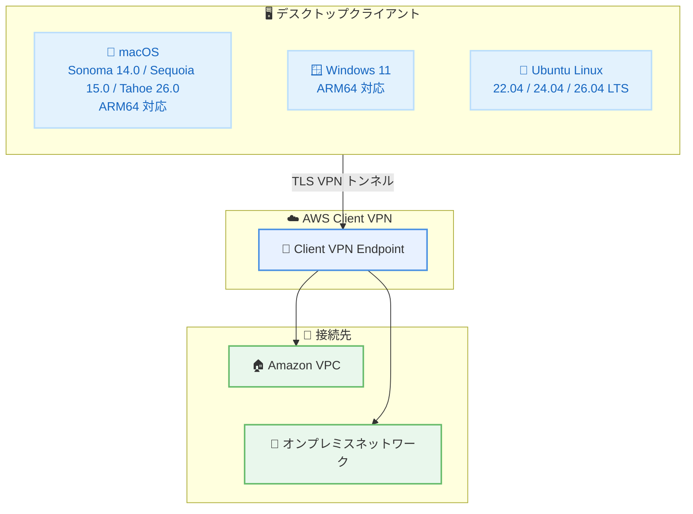

# AWS Client VPN - Ubuntu 26.04 LTS サポート追加

**リリース日**: 2026年05月08日
**サービス**: AWS Client VPN
**機能**: Ubuntu 26.04 LTS デスクトップクライアントサポート

📊 [このアップデートのインフォグラフィックを見る](https://takech9203.github.io/aws-news-summary/20260508-aws-client-vpn-ubuntu-26.html)

## 概要

AWS Client VPN が Linux デスクトップクライアントにおいて Ubuntu 26.04 LTS のサポートを追加した。これにより、最新の Ubuntu OS バージョンで AWS 提供の VPN クライアントを利用できるようになった。

AWS Client VPN は、リモートワークフォースを AWS またはオンプレミスネットワークに安全に接続するためのマネージドサービスである。デスクトップクライアントは macOS、Windows、Ubuntu Linux をサポートしており、今回のリリースで Ubuntu 26.04 LTS が新たにサポート対象に追加された。既存の Ubuntu 22.04 および 24.04 のサポートも継続される。

デスクトップクライアントは無料で提供されており、AWS Client VPN が一般提供されている全リージョンで追加費用なく利用可能である。macOS では ARM64 アーキテクチャもサポートされており、Windows でも ARM64 がサポートされている。

**アップデート前の課題**

- Ubuntu 26.04 LTS を利用する開発者やエンジニアが AWS Client VPN のデスクトップクライアントを直接利用できなかった
- 最新の Ubuntu LTS にアップグレードした環境では、サードパーティの VPN クライアントやコマンドラインベースの接続が必要だった
- 組織全体で OS バージョンを統一する際に、VPN クライアントの互換性が制約となっていた

**アップデート後の改善**

- Ubuntu 26.04 LTS 環境で AWS 提供のデスクトップ VPN クライアントを直接利用可能になった
- Ubuntu 22.04、24.04、26.04 の 3 バージョンが同時にサポートされ、段階的なアップグレードパスが確保された
- 最新の Ubuntu LTS を利用する組織が追加コストなしで AWS Client VPN を導入可能になった

## アーキテクチャ図



AWS Client VPN デスクトップクライアントが各 OS から Client VPN Endpoint を経由して AWS VPC またはオンプレミスネットワークに接続する構成を示している。

## サービスアップデートの詳細

### 主要機能

1. **Ubuntu 26.04 LTS サポート**
   - 最新の Ubuntu 長期サポート版でデスクトップクライアントを利用可能
   - GUI ベースの VPN 接続管理が可能
   - 既存の Client VPN Endpoint 設定をそのまま利用可能

2. **マルチバージョンサポート**
   - Ubuntu 22.04 LTS、24.04 LTS、26.04 LTS の 3 バージョンを同時サポート
   - 組織内で異なる Ubuntu バージョンが混在していても一貫した VPN 接続が可能
   - 段階的な OS アップグレードを VPN 接続を中断せずに実施可能

3. **クロスプラットフォーム対応**
   - macOS: Sonoma 14.0、Sequoia 15.0、Tahoe 26.0 (ARM64 対応)
   - Windows: Windows 11 (ARM64 対応)
   - Ubuntu Linux: 22.04、24.04、26.04 LTS

## 技術仕様

### サポート対象 OS バージョン

| OS | サポートバージョン | アーキテクチャ |
|------|------|------|
| macOS | Sonoma 14.0、Sequoia 15.0、Tahoe 26.0 | x86_64、ARM64 |
| Windows | Windows 11 | x86_64、ARM64 |
| Ubuntu Linux | 22.04 LTS、24.04 LTS、26.04 LTS | x86_64 |

### クライアント機能

| 項目 | 詳細 |
|------|------|
| プロトコル | OpenVPN ベース |
| 認証方式 | 証明書ベース認証、Active Directory 認証、SAML ベースフェデレーション認証 |
| 料金 | クライアントソフトウェアは無料 |
| 配布方式 | AWS 公式サイトからダウンロード |

## 設定方法

### 前提条件

1. Ubuntu 26.04 LTS がインストールされたデスクトップ環境
2. AWS Client VPN Endpoint が設定済みであること
3. 認証に必要なクライアント証明書または認証情報

### 手順

#### ステップ 1: クライアントのダウンロードとインストール

```bash
# AWS Client VPN デスクトップクライアントをダウンロード
# AWS 公式サイトからパッケージを取得
wget https://d20adtppz83p9s.cloudfront.net/GTK/latest/awsvpnclient_amd64.deb

# パッケージをインストール
sudo dpkg -i awsvpnclient_amd64.deb

# 依存関係の解決
sudo apt-get install -f
```

AWS 公式サイトから Ubuntu 用の .deb パッケージをダウンロードし、dpkg コマンドでインストールする。

#### ステップ 2: VPN プロファイルの設定

```bash
# AWS Client VPN クライアントを起動
awsvpnclient
```

クライアントを起動し、管理者から提供された .ovpn 設定ファイルをインポートして VPN プロファイルを追加する。

#### ステップ 3: VPN 接続の開始

GUI クライアントで接続先プロファイルを選択し、[接続] をクリックして VPN トンネルを確立する。認証方式に応じて、証明書の選択または認証情報の入力が求められる。

## メリット

### ビジネス面

- **追加コストなし**: デスクトップクライアントは無料で提供され、追加のライセンス費用は不要
- **OS 標準化の促進**: 最新の Ubuntu LTS を組織標準として採用しやすくなる
- **リモートワーク対応**: Linux デスクトップを利用する開発チームのリモートアクセスが容易に

### 技術面

- **最新 OS のセキュリティ機能活用**: Ubuntu 26.04 LTS の最新セキュリティパッチや機能と組み合わせて利用可能
- **マネージドサービスの恩恵**: VPN インフラの運用管理が不要で、スケーリングも自動的に対応
- **一貫した接続体験**: OS に依存しない統一的な VPN 接続インターフェースを提供

## デメリット・制約事項

### 制限事項

- Ubuntu Linux クライアントは ARM64 アーキテクチャのサポートについて明示的な記載がない (macOS と Windows は ARM64 対応)
- デスクトップ環境が前提であり、サーバー版 Ubuntu での GUI クライアント利用は非推奨
- Ubuntu 以外の Linux ディストリビューション (Fedora、Debian、Arch Linux など) は公式サポート対象外

### 考慮すべき点

- Ubuntu 22.04 LTS のサポート終了時期を見据えた計画的なアップグレード戦略が必要
- SAML 認証を利用する場合、ブラウザとの連携が必要となるため、デスクトップ環境の構成に注意が必要

## ユースケース

### ユースケース 1: 開発チームのリモートアクセス

**シナリオ**: Ubuntu 26.04 LTS を標準開発環境として採用している開発チームが、リモートから AWS VPC 内のリソースにアクセスする必要がある。

**効果**: 追加のソフトウェアコストなしで、チーム全体がセキュアに AWS リソースへアクセスでき、開発環境の OS アップグレードに伴う VPN 接続の中断も防止できる。

### ユースケース 2: マルチ OS 環境での統一的な VPN 管理

**シナリオ**: 社内に macOS、Windows、Ubuntu Linux が混在する環境で、統一的な VPN アクセスポリシーを適用したい。

**効果**: 全プラットフォームで AWS Client VPN を使用することで、一元的なアクセス管理と監査ログの収集が可能になり、セキュリティコンプライアンスの維持が容易になる。

### ユースケース 3: ハイブリッドクラウド環境へのセキュアアクセス

**シナリオ**: オンプレミスのデータセンターと AWS VPC の両方にアクセスが必要なエンジニアが、Ubuntu 26.04 LTS ワークステーションから安全に接続する。

**効果**: AWS Client VPN Endpoint を経由して VPC とオンプレミスの両方にセキュアに接続でき、ハイブリッド環境全体へのアクセスを単一の VPN クライアントで管理できる。

## 料金

AWS Client VPN デスクトップクライアントソフトウェア自体は無料で提供される。ただし、AWS Client VPN サービスの利用には以下の料金が発生する。

### 料金例

| 項目 | 料金 |
|--------|------------------|
| Client VPN エンドポイントアソシエーション | $0.10/時間 (サブネットごと) |
| Client VPN 接続 | $0.05/時間 (接続ごと) |
| デスクトップクライアントソフトウェア | 無料 |

※料金はリージョンにより異なる場合がある。最新の料金情報は公式料金ページを参照のこと。

## 利用可能リージョン

AWS Client VPN が一般提供 (GA) されている全リージョンで利用可能。追加コストは発生しない。

## 関連サービス・機能

- **AWS Site-to-Site VPN**: サイト間の VPN 接続を提供するサービスで、Client VPN と組み合わせてハイブリッド環境を構築可能
- **AWS Direct Connect**: 専用線接続によるプライベートネットワーク接続で、VPN と併用してバックアップ経路として構成可能
- **Amazon VPC**: Client VPN の接続先となる仮想プライベートクラウド環境
- **AWS IAM Identity Center**: SAML ベースの認証と連携して Client VPN のアクセス管理を一元化可能

## 参考リンク

- 📊 [インフォグラフィック](https://takech9203.github.io/aws-news-summary/20260508-aws-client-vpn-ubuntu-26.html)
- [公式発表 (What's New)](https://aws.amazon.com/about-aws/whats-new/2026/05/aws-client-vpn-ubuntu-26/)
- [AWS Client VPN ドキュメント](https://docs.aws.amazon.com/vpn/latest/clientvpn-user/)
- [AWS Client VPN 料金](https://aws.amazon.com/vpn/pricing/)
- [AWS Client VPN デスクトップクライアント ダウンロード](https://aws.amazon.com/vpn/client-vpn-download/)

## まとめ

AWS Client VPN が Ubuntu 26.04 LTS をサポートしたことで、最新の Ubuntu LTS を利用する開発者やエンジニアが AWS 提供のデスクトップ VPN クライアントをそのまま利用できるようになった。クライアントソフトウェアは無料で提供され、既存の Client VPN Endpoint 設定との互換性も維持されているため、OS アップグレード後も追加設定なしで VPN 接続を継続できる。Ubuntu Linux 環境でリモートワークを行うチームは、最新 LTS への移行と合わせて本クライアントの導入を検討することを推奨する。
