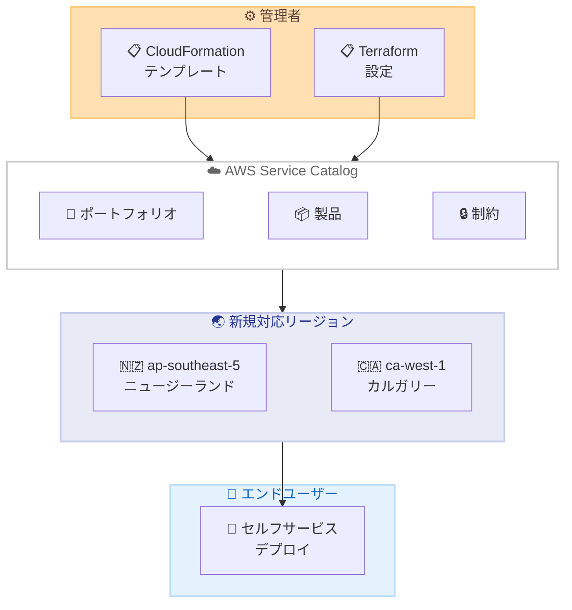

# AWS Service Catalog - Asia Pacific (ニュージーランド) および Canada West (カルガリー) リージョンで利用可能に

**リリース日**: 2026 年 5 月 8 日
**サービス**: AWS Service Catalog
**機能**: リージョン拡大

📊 [このアップデートのインフォグラフィックを見る](https://takech9203.github.io/aws-news-summary/20260508-aws-service-catalog-calgary-new-zealand-regions.html)

## 概要

AWS Service Catalog が、Asia Pacific (New Zealand) リージョン (ap-southeast-5) および Canada West (Calgary) リージョン (ca-west-1) で利用可能になった。これにより、ニュージーランドおよびカナダ西部のユーザーは、より低レイテンシーで Service Catalog を活用し、承認済みの Infrastructure as Code (IaC) 製品のカタログを作成、ガバナンス管理、配布できるようになる。

AWS Service Catalog は、組織が承認された IT サービスのカタログを作成・管理するためのサービスである。管理者は AWS CloudFormation や Terraform などの IaC ツールを使用して製品を定義し、エンドユーザーはセルフサービスでこれらの製品をデプロイできる。AWS Organizations を通じてアカウント間や組織単位間でポートフォリオを共有することも可能である。

**アップデート前の課題**

- ニュージーランドおよびカナダ西部に拠点を持つ組織は、地理的に離れたリージョンで Service Catalog を利用する必要があり、レイテンシーが高かった
- データレジデンシー要件により、これらの地域のリソースを近隣リージョンに配置できない場合があった
- マルチリージョン展開戦略において、これらのリージョンでの IaC ガバナンスが一元管理できなかった

**アップデート後の改善**

- ニュージーランドおよびカナダ西部のユーザーが低レイテンシーで Service Catalog にアクセス可能になった
- データレジデンシー要件を満たしながら、IaC 製品のガバナンス管理が可能になった
- AWS Organizations と連携し、これらの新リージョンを含むグローバルなポートフォリオ共有が実現した

## アーキテクチャ図



管理者が定義した IaC 製品を Service Catalog に登録し、新たに対応した 2 リージョンでエンドユーザーがセルフサービスデプロイを実行する全体フローを示している。

## サービスアップデートの詳細

### 主要機能

1. **IaC 製品カタログの管理**
   - AWS CloudFormation テンプレートまたは Terraform 設定を使用して製品を定義
   - 単一のコンピューティングインスタンスから完全に構成されたマルチティアアプリケーションまで対応
   - バージョン管理により製品のライフサイクルを管理

2. **ガバナンスとアクセス制御**
   - ポートフォリオ単位でのアクセス権限管理
   - 制約の設定によるリソースのデプロイ条件制御
   - IAM ロールと連携した最小権限の原則に基づくプロビジョニング

3. **クロスアカウント共有**
   - AWS Organizations を通じたポートフォリオ共有
   - 組織単位 (OU) レベルでの一括配布
   - 数千の AWS アカウントへのスケーラブルな展開

## 技術仕様

### 対応リージョン

| リージョン名 | リージョンコード | 所在地 |
|------|------|------|
| Asia Pacific (New Zealand) | ap-southeast-5 | ニュージーランド |
| Canada West (Calgary) | ca-west-1 | カナダ・カルガリー |

### サポートされる IaC ツール

| ツール | 説明 |
|------|------|
| AWS CloudFormation | AWS ネイティブの IaC サービス |
| HashiCorp Terraform Open Source | オープンソースの IaC ツール |
| Terraform Cloud | Terraform のマネージドサービス |

## 設定方法

### 前提条件

1. AWS アカウントが有効であること
2. 該当リージョンへのアクセスが有効化されていること
3. Service Catalog の管理者権限 (AWSServiceCatalogAdminFullAccess) を持つ IAM ユーザーまたはロール

### 手順

#### ステップ 1: リージョンの選択

```bash
# AWS CLI でリージョンを指定
export AWS_DEFAULT_REGION=ap-southeast-5
# または
export AWS_DEFAULT_REGION=ca-west-1
```

対象リージョンを環境変数で指定する。AWS マネジメントコンソールの場合はリージョンセレクターから選択する。

#### ステップ 2: ポートフォリオの作成

```bash
aws servicecatalog create-portfolio \
  --display-name "My Portfolio" \
  --provider-name "IT Department" \
  --description "Approved IaC products for deployment"
```

新しいリージョンでポートフォリオを作成する。このポートフォリオに承認済みの製品を格納する。

#### ステップ 3: 製品の作成と登録

```bash
aws servicecatalog create-product \
  --name "Web Application Stack" \
  --owner "IT Department" \
  --product-type CLOUD_FORMATION_TEMPLATE \
  --provisioning-artifact-parameters \
    Name="v1.0",Info={LoadTemplateFromURL=https://s3.amazonaws.com/mybucket/template.yaml},Type=CLOUD_FORMATION_TEMPLATE
```

CloudFormation テンプレートを使用して製品を作成し、ポートフォリオに関連付ける。

## メリット

### ビジネス面

- **データレジデンシーの遵守**: ニュージーランドおよびカナダの規制要件に準拠したリソース管理が可能
- **レイテンシーの削減**: 地理的に近いリージョンを使用することで、管理操作のレスポンスが向上
- **グローバル展開の加速**: マルチリージョン戦略における対象リージョンの拡大

### 技術面

- **一貫したガバナンス**: 全リージョンで統一された IaC 製品管理が可能
- **AWS Organizations 連携**: 新リージョンでもクロスアカウント共有が利用可能
- **Terraform サポート**: CloudFormation に加え Terraform ベースの製品も新リージョンで管理可能

## デメリット・制約事項

### 制限事項

- 新リージョンでの利用開始時、既存リージョンのポートフォリオは自動的に複製されない
- リージョン間でのポートフォリオ共有には追加の設定が必要
- 一部の AWS サービスが新リージョンで未対応の場合、製品テンプレート内で使用できないリソースが存在する可能性がある

### 考慮すべき点

- 既存のマルチリージョン展開パイプラインに新リージョンを追加する際は、テンプレートの互換性を確認すること
- 新リージョンでの Service Catalog 利用に際し、他の依存サービスの対応状況を事前に確認すること

## ユースケース

### ユースケース 1: ニュージーランドのデータレジデンシー対応

**シナリオ**: ニュージーランドに拠点を持つ金融機関が、規制要件により国内にデータを保持する必要がある。

**実装例**:
```bash
# ニュージーランドリージョンでのポートフォリオ作成
aws servicecatalog create-portfolio \
  --display-name "NZ Compliant Products" \
  --provider-name "Cloud Team" \
  --region ap-southeast-5
```

**効果**: データレジデンシー要件を満たしながら、承認済みインフラストラクチャのセルフサービスデプロイを実現する。

### ユースケース 2: カナダ西部のマルチリージョン DR 構成

**シナリオ**: カナダ東部 (ca-central-1) をプライマリとし、カナダ西部 (ca-west-1) をディザスタリカバリサイトとして構成する。

**実装例**:
```bash
# カルガリーリージョンで DR 用製品を展開
aws servicecatalog create-product \
  --name "DR Recovery Stack" \
  --owner "Platform Team" \
  --product-type CLOUD_FORMATION_TEMPLATE \
  --region ca-west-1 \
  --provisioning-artifact-parameters \
    Name="v1.0",Info={LoadTemplateFromURL=https://s3.ca-west-1.amazonaws.com/dr-templates/recovery.yaml},Type=CLOUD_FORMATION_TEMPLATE
```

**効果**: カナダ国内でのリージョン間 DR 構成が Service Catalog で一元管理可能になる。

### ユースケース 3: グローバル組織のポートフォリオ共有

**シナリオ**: グローバル企業が AWS Organizations を使用して、新リージョンを含む全拠点に標準化された製品を配布する。

**実装例**:
```bash
# Organizations を通じたポートフォリオ共有
aws servicecatalog create-portfolio-share \
  --portfolio-id port-xxxxxxxxx \
  --organization-node Type=ORGANIZATION,Value=o-xxxxxxxxxx
```

**効果**: ニュージーランドおよびカルガリーの開発チームが、組織全体で承認された標準テンプレートを即座に利用可能になる。

## 料金

AWS Service Catalog 自体の利用に追加料金は発生しない。料金は Service Catalog を通じてプロビジョニングされた AWS リソース (EC2 インスタンス、RDS データベースなど) の使用量に基づいて課金される。

### 料金例

| 項目 | 料金 |
|--------|------------------|
| Service Catalog の利用 | 無料 |
| プロビジョニングされたリソース | 各サービスの標準料金 |

## 利用可能リージョン

今回のアップデートにより、以下の 2 リージョンが追加された。

- Asia Pacific (New Zealand) - ap-southeast-5
- Canada West (Calgary) - ca-west-1

AWS Service Catalog は、これらを含む多数の AWS リージョンで利用可能である。

## 関連サービス・機能

- **AWS CloudFormation**: Service Catalog 製品の定義に使用される主要な IaC サービス
- **AWS Organizations**: アカウント間でのポートフォリオ共有を実現する組織管理サービス
- **AWS Control Tower**: マルチアカウント環境のガバナンスを提供し、Service Catalog と連携してアカウントファクトリーを構成
- **AWS Config**: Service Catalog で展開されたリソースのコンプライアンス状態を継続的に監視

## 参考リンク

- 📊 [インフォグラフィック](https://takech9203.github.io/aws-news-summary/20260508-aws-service-catalog-calgary-new-zealand-regions.html)
- [公式発表 (What's New)](https://aws.amazon.com/about-aws/whats-new/2026/05/aws-service-catalog-calgary-new-zealand-regions/)
- [AWS Service Catalog ドキュメント](https://docs.aws.amazon.com/servicecatalog/latest/adminguide/)
- [AWS Service Catalog 料金](https://aws.amazon.com/servicecatalog/pricing/)

## まとめ

AWS Service Catalog が Asia Pacific (New Zealand) および Canada West (Calgary) リージョンで利用可能になったことで、これらの地域に拠点を持つ組織はデータレジデンシー要件を満たしながら、標準化された IaC 製品の管理とセルフサービスデプロイを実現できる。既にマルチリージョン展開を行っている組織は、AWS Organizations と連携したポートフォリオ共有を新リージョンに拡大することを推奨する。
