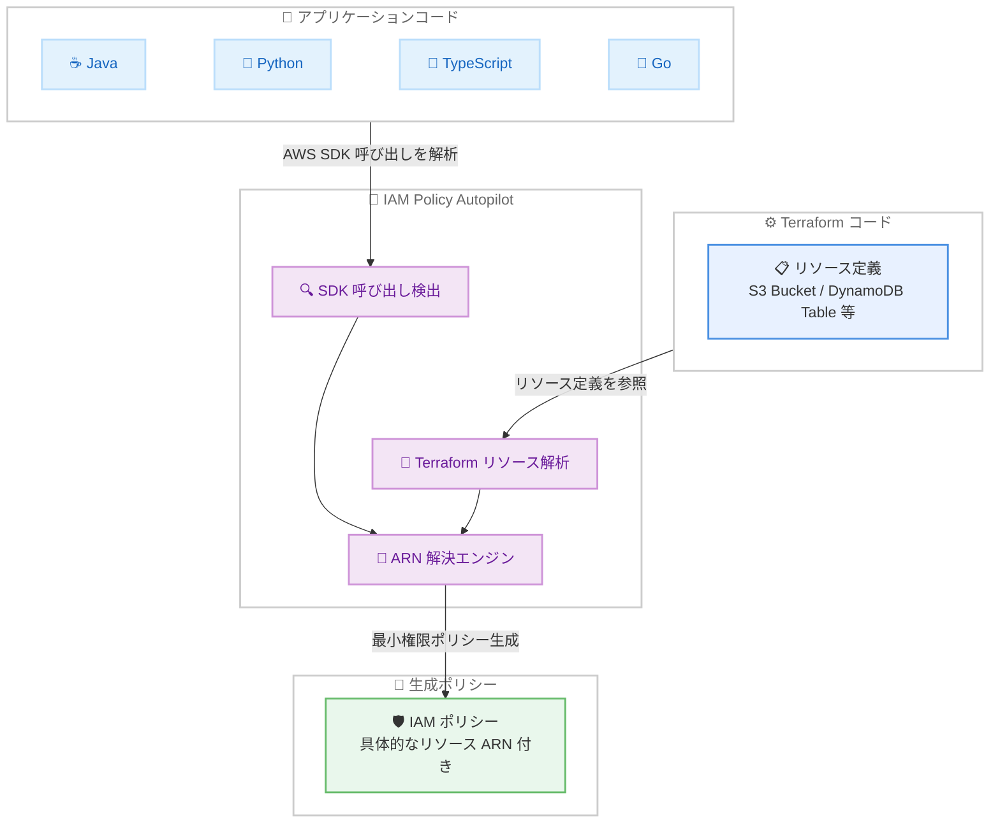

# AWS IAM Policy Autopilot - Java サポートと Terraform 連携ポリシー生成

**リリース日**: 2026 年 5 月 8 日
**サービス**: AWS IAM
**機能**: IAM Policy Autopilot - Java サポートおよび Terraform 対応ポリシー生成

📊 [このアップデートのインフォグラフィックを見る](https://takech9203.github.io/aws-news-summary/20260508-iam-policy-autopilot.html)

## 概要

AWS IAM Policy Autopilot に Java アプリケーションのサポートと Terraform 対応のポリシー生成機能が追加されました。IAM Policy Autopilot は re:Invent 2025 で発表されたオープンソースツールで、アプリケーションのソースコードを静的に解析し、必要な IAM ポリシーのベースラインを決定論的に生成します。今回のアップデートにより、対応言語が Python、TypeScript、Go に加えて Java に拡大し、さらに Terraform のリソース定義を参照して具体的なリソース ARN を解決する機能が追加されました。

Java は IAM Policy Autopilot ユーザーから最もリクエストの多い言語でした。また、Terraform 連携により、従来はワイルドカード (*) がデフォルトで使用されていたリソース指定が、Terraform で定義された実際のリソース ARN に置き換えられるようになり、より制限の厳しい (less permissive) IAM ポリシーの生成が可能になりました。

**アップデート前の課題**

- Java アプリケーションでは IAM Policy Autopilot を使用できず、手動で IAM ポリシーを作成する必要があった
- 生成されるポリシーのリソース指定がワイルドカード (*) になりがちで、最小権限の原則に沿ったポリシーへの調整が追加で必要だった
- Terraform でインフラを管理していても、ポリシー生成時に Terraform の定義情報を活用できなかった

**アップデート後の改善**

- Java 開発者がソースコードから IAM ポリシーを自動生成可能になった (Python、TypeScript、Go、Java の 4 言語対応)
- Terraform リソース定義とアプリケーションコードの SDK 呼び出しをクロスリファレンスし、実際のリソース ARN を解決
- 例えば S3 GetObject を呼び出すアプリケーションでは、Terraform で定義された特定のバケット ARN がポリシーに反映される

## アーキテクチャ図



IAM Policy Autopilot がアプリケーションコードから AWS SDK 呼び出しを検出し、同時に Terraform のリソース定義を参照することで、ワイルドカードではなく具体的なリソース ARN を含む IAM ポリシーを生成します。

## サービスアップデートの詳細

### 主要機能

1. **Java アプリケーションサポート**
   - Java ソースコードの AWS SDK 呼び出しを静的に解析
   - AWS SDK for Java v2 の API 呼び出しパターンを検出
   - Python、TypeScript、Go と同等の解析機能を Java でも利用可能
   - Java は IAM Policy Autopilot ユーザーから最もリクエストの多かった言語

2. **Terraform 対応ポリシー生成**
   - Terraform リソース定義とアプリケーションコードの SDK 呼び出しをクロスリファレンス
   - 各 IAM アクションに対して実際のリソース ARN を解決
   - ワイルドカード (*) の代わりに Terraform で定義された具体的なリソースを参照
   - 例: S3 GetObject アクションに対して、Terraform で定義された特定のバケット ARN を使用

3. **より制限の厳しいポリシー生成**
   - リソースレベルの権限制御が自動的に適用
   - 最小権限の原則により近いベースラインポリシーを生成
   - 本番環境デプロイ前のポリシー調整作業を軽減

## 技術仕様

### 対応言語とフレームワーク

| 言語 | 対応バージョン | SDK |
|------|---------------|-----|
| Java | AWS SDK for Java v2 | software.amazon.awssdk |
| Python | Boto3 | boto3 / botocore |
| TypeScript | AWS SDK for JavaScript v3 | @aws-sdk/* |
| Go | AWS SDK for Go v2 | github.com/aws/aws-sdk-go-v2 |

### Terraform 連携の動作

| 項目 | 説明 |
|------|------|
| 対応 Terraform バージョン | HCL 形式のリソース定義 |
| リソース解決の仕組み | SDK 呼び出しのサービス/リソースタイプと Terraform リソース定義をマッチング |
| ARN 構築方法 | Terraform リソースの属性からリソース ARN を構築 |
| フォールバック動作 | Terraform 定義が見つからない場合はワイルドカードを使用 |

### 生成されるポリシーの比較

**Terraform 連携なし (従来):**

```json
{
  "Version": "2012-10-17",
  "Statement": [
    {
      "Effect": "Allow",
      "Action": [
        "s3:GetObject",
        "s3:PutObject"
      ],
      "Resource": "arn:aws:s3:::*/*"
    }
  ]
}
```

**Terraform 連携あり (今回のアップデート):**

```json
{
  "Version": "2012-10-17",
  "Statement": [
    {
      "Effect": "Allow",
      "Action": [
        "s3:GetObject",
        "s3:PutObject"
      ],
      "Resource": "arn:aws:s3:::my-app-data-bucket/*"
    }
  ]
}
```

## 設定方法

### 前提条件

1. IAM Policy Autopilot がインストールされていること (pip、uvx、または Kiro Power)
2. 解析対象のアプリケーションコード (Java、Python、TypeScript、Go のいずれか)
3. Terraform 連携を使用する場合、Terraform リソース定義ファイル (.tf) が同一プロジェクト内に存在すること

### 手順

#### ステップ 1: IAM Policy Autopilot のインストール

```bash
# uvx を使用する場合
uvx iam-policy-autopilot --help

# pip を使用する場合
pip install iam-policy-autopilot
```

最新バージョンをインストールすることで、Java サポートと Terraform 連携機能が利用可能になります。

#### ステップ 2: Java アプリケーションの解析

```bash
# Java アプリケーションのソースコードを解析
iam-policy-autopilot analyze --language java --source-dir ./src/main/java
```

Java ソースコード内の AWS SDK for Java v2 の呼び出しを検出し、必要な IAM アクションを特定します。

#### ステップ 3: Terraform 連携によるポリシー生成

```bash
# Terraform リソース定義を参照してポリシーを生成
iam-policy-autopilot generate --source-dir ./src --terraform-dir ./terraform
```

`--terraform-dir` オプションで Terraform ファイルのディレクトリを指定することで、リソース ARN の解決が有効になります。Terraform で定義されたリソースと SDK 呼び出しを自動的にマッチングし、具体的な ARN を含むポリシーを生成します。

#### ステップ 4: MCP サーバーとしての使用

```json
{
  "mcpServers": {
    "iam-policy-autopilot": {
      "command": "uvx",
      "args": ["iam-policy-autopilot", "mcp-server"],
      "env": {
        "AWS_PROFILE": "your-profile-name",
        "AWS_REGION": "us-east-1"
      }
    }
  }
}
```

MCP サーバーとして設定することで、Kiro、Claude Code、Cursor、Cline などの AI アシスタントから IAM Policy Autopilot の機能を直接利用できます。

## メリット

### ビジネス面

- **Java エコシステムのカバレッジ拡大**: エンタープライズで広く使われる Java アプリケーションでの IAM ポリシー作成が自動化され、開発チームの生産性が向上
- **セキュリティコンプライアンスの強化**: Terraform 連携により生成されるポリシーがより制限的になり、セキュリティ監査での指摘事項が減少
- **本番デプロイまでの時間短縮**: ポリシーのスコープダウン作業が軽減され、開発からデプロイまでのリードタイムが短縮

### 技術面

- **リソースレベルの権限制御**: Terraform 定義を参照することで、ワイルドカードではなく具体的なリソース ARN を自動的に指定
- **4 言語対応**: Python、TypeScript、Go、Java の主要言語をカバーし、多様な技術スタックに対応
- **Infrastructure as Code との統合**: Terraform のリソース定義を解析に活用することで、インフラとアプリケーションの一貫性を確保

## デメリット・制約事項

### 制限事項

- 生成されるポリシーはアイデンティティベースポリシーのみ。リソースベースポリシー、Permission Boundaries、SCP、RCP は非対応
- Terraform 以外の IaC ツール (CloudFormation、AWS CDK、Pulumi) のリソース定義は現時点では参照できない
- ランタイムで決定される動的な値 (環境変数から取得するバケット名など) の解決は非対応
- サードパーティライブラリ内の AWS SDK 呼び出しの検出は非対応
- Terraform モジュール内のリソース定義の解決には制約がある場合がある

### 考慮すべき点

- 生成されたポリシーはベースラインであり、本番環境デプロイ前にセキュリティレビューを行うことが推奨される
- Terraform 連携は同一プロジェクト内のリソース定義を対象としており、リモートステートや別リポジトリのリソースは参照できない
- Java のラムダ式やリフレクションを使用した動的な SDK 呼び出しは検出されない場合がある

## ユースケース

### ユースケース 1: Java マイクロサービスの IAM ポリシー自動生成

**シナリオ**: Spring Boot ベースのマイクロサービスが複数の AWS サービス (S3、DynamoDB、SQS、SNS) を利用しており、各サービスに必要な IAM ポリシーを迅速に作成する。

**実装例**:
```bash
# Java マイクロサービスのソースコードを解析
iam-policy-autopilot analyze --language java --source-dir ./src/main/java

# Terraform 定義と組み合わせてポリシー生成
iam-policy-autopilot generate --source-dir ./src/main/java --terraform-dir ./infra/terraform
```

**効果**: 各マイクロサービスに対して、Terraform で定義された具体的なリソース ARN を含む最小権限に近いポリシーを数秒で生成。手動作成に比べて大幅な時間短縮を実現。

### ユースケース 2: Terraform プロジェクトのセキュリティ強化

**シナリオ**: 既存の Terraform プロジェクトで IAM ロールに過剰な権限 (ワイルドカード) が付与されており、セキュリティ監査に対応するためにリソースレベルの制限を追加する。

**実装例**:
```bash
# アプリケーションコードと Terraform 定義から最適なポリシーを生成
iam-policy-autopilot generate \
  --source-dir ./app/src \
  --terraform-dir ./terraform \
  --output ./terraform/generated-policy.json
```

**効果**: Terraform で定義済みのリソースに対して自動的に ARN を解決し、ワイルドカードを具体的なリソース指定に置き換えたポリシーを生成。セキュリティ監査対応の工数を削減。

### ユースケース 3: 多言語プロジェクトでの一括ポリシー生成

**シナリオ**: フロントエンドが TypeScript、バックエンドが Java、データパイプラインが Python で構築されたプロジェクトで、各コンポーネントの IAM ポリシーを統一的に管理する。

**実装例**:
```bash
# TypeScript フロントエンド
iam-policy-autopilot generate --source-dir ./frontend/src --terraform-dir ./terraform

# Java バックエンド
iam-policy-autopilot generate --source-dir ./backend/src/main/java --terraform-dir ./terraform

# Python データパイプライン
iam-policy-autopilot generate --source-dir ./pipeline/src --terraform-dir ./terraform
```

**効果**: 4 言語すべてに対応したことで、多言語プロジェクトでも統一的なアプローチで IAM ポリシーを生成可能。Terraform のリソース定義を共通の参照元として使用することで、一貫性のあるポリシー管理を実現。

## 料金

IAM Policy Autopilot はオープンソースツールであり、追加料金なしで利用可能です。開発者のローカルマシン上で動作するため、AWS リソースの使用料金も発生しません。

## 利用可能リージョン

IAM Policy Autopilot はローカルで動作する静的コード解析ツールのため、リージョンの制約はありません。生成されたポリシーはすべての AWS リージョンで使用可能です。

## 関連サービス・機能

- **AWS IAM Access Analyzer**: 未使用の権限を特定し、最小権限への改善を支援するサービス。IAM Policy Autopilot で生成したベースラインポリシーの継続的な改善に活用可能
- **Terraform**: HashiCorp の Infrastructure as Code ツール。今回のアップデートでリソース定義が IAM ポリシー生成に活用されるようになった
- **Kiro IDE**: AI アシスタントを内蔵した AWS の開発環境。IAM Policy Autopilot は Kiro Power としてワンクリックで利用可能
- **AWS IAM**: ユーザー、グループ、ロールのアクセス制御を管理するサービス

## 参考リンク

- 📊 [インフォグラフィック](https://takech9203.github.io/aws-news-summary/20260508-iam-policy-autopilot.html)
- [公式発表 (What's New)](https://aws.amazon.com/about-aws/whats-new/2026/05/iam-policy-autopilot/)
- [GitHub リポジトリ](https://github.com/awslabs/iam-policy-autopilot)
- [AWS News Blog - Simplify IAM policy creation with IAM Policy Autopilot](https://aws.amazon.com/blogs/aws/simplify-iam-policy-creation-with-iam-policy-autopilot-a-new-open-source-mcp-server-for-builders/)
- [AWS Security Blog - IAM Policy Autopilot: An open-source tool that brings IAM policy expertise to builders](https://aws.amazon.com/blogs/security/iam-policy-autopilot-an-open-source-tool-that-brings-iam-policy-expertise-to-builders-and-ai-coding-assistants/)

## まとめ

IAM Policy Autopilot に Java サポートと Terraform 対応ポリシー生成が追加されたことで、エンタープライズで広く使われる Java アプリケーションでのポリシー自動生成が可能になり、対応言語は Python、TypeScript、Go、Java の 4 言語に拡大しました。さらに、Terraform 連携により生成されるポリシーのリソース指定がワイルドカードから具体的な ARN に改善され、より制限の厳しいセキュリティポリシーを初期段階から適用できるようになりました。IAM ポリシーの作成とメンテナンスに時間を費やしている開発チームは、このツールの導入を検討することで、セキュリティとアジリティの両立を実現できます。
