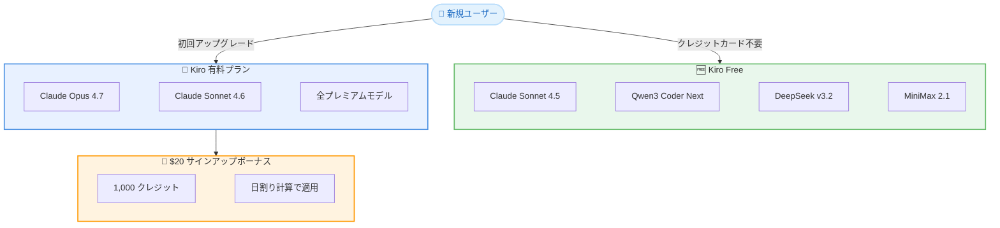

# Kiro - 有料プラン $20 サインアップボーナスの導入

**リリース日**: 2026年5月8日
**サービス**: Kiro
**機能**: 有料プラン新規登録時の $20 ボーナスクレジット

📊 [このアップデートのインフォグラフィックを見る](https://takech9203.github.io/aws-news-summary/20260508-kiro-new-paid-tier-bonus.html)

## 概要

Kiro は、新規有料プランサブスクライバー向けに $20 相当のサインアップボーナスクレジットを導入した。これは従来の 500 クレジットから 1,000 クレジットへと倍増された特典であり、初めて有料プランにアップグレードするユーザーが対象となる。Claude Opus 4.7 を含むプレミアムモデルへのフルアクセスが初日から利用可能になる。

この変更の背景には、開発者が Kiro を十分に試用して意思決定を行えるだけのクレジットを提供するという目的がある。従来の 500 クレジットでは、意味のあるプロジェクトを構築して Kiro の実力を正しく評価するには不十分であったという分析結果に基づいている。

同時に、無料プランでは Claude Sonnet 4.5、Auto エージェント、Qwen3 Coder Next、DeepSeek v3.2、MiniMax 2.1 などの高性能なオープンウェイトモデルが利用可能であり、クレジットカード不要で利用を開始できる。

**アップデート前の課題**

- 従来のサインアップボーナスは 500 クレジットであり、有意義なプロジェクトを構築するには不十分だった
- 開発者が Kiro の実力を正しく評価する前にクレジットを使い切ってしまうケースがあった
- 新規ユーザーが有料プランの価値を体験する前に離脱する可能性があった

**アップデート後の改善**

- サインアップボーナスが $20 相当 (1,000 クレジット) に倍増された
- 初日から Claude Opus 4.7 を含むプレミアムモデルにフルアクセス可能
- 日割り計算によるクレジット適用で、月途中のアップグレードでも無駄なく利用可能
- 無料プランのオープンウェイトモデルが強化され、有料プランへの移行判断をじっくり行える

## アーキテクチャ図

Kiro の料金プラン構成と、新規ユーザーがサインアップボーナスを取得するまでのフローを示している。

## サービスアップデートの詳細

### 主要機能

1. **$20 サインアップボーナスクレジット**
   - 初めて有料プランにアップグレードするユーザーに $20 相当のクレジットを付与
   - 1,000 クレジット分の利用が可能 (従来の 500 クレジットから倍増)
   - ソーシャルログインまたは Builder ID でアップグレードしたユーザーが対象
   - AWS Identity Center やサードパーティ ID プロバイダー経由のユーザーは対象外

2. **日割り計算による課金方式**
   - Kiro は毎月 1 日にサブスクリプションを処理
   - 月途中でアップグレードした場合、残日数に応じた日割りクレジットが適用
   - 翌月以降はボーナス残高を差し引いた金額が課金される
   - 例: 6 月 15 日に Pro ($20/月) にアップグレード → 6 月分は $10 の日割りクレジット → 7 月は $20 - $10 = $10 の課金

3. **無料プランの強化されたモデルラインナップ**
   - Claude Sonnet 4.5 および Auto エージェントが利用可能
   - Qwen3 Coder Next: SWE-Bench Verified で 70% 以上のスコア
   - DeepSeek v3.2: 複雑なエージェントワークフローに対応
   - MiniMax 2.1: 多言語対応とフロントエンド開発に強み
   - クレジットカード不要で利用開始可能

## 技術仕様

### 料金プラン比較

| プラン | 月額料金 | クレジット/月 | 利用可能モデル |
|--------|----------|---------------|----------------|
| Kiro Free | $0 | レート制限あり (週次クォータ) | Claude Sonnet 4.5、オープンウェイトモデル |
| Kiro Pro | $20 | 1,000 | 全プレミアムモデル (Claude Opus 4.7 含む) |
| Kiro Pro+ | $40 | 2,000 | 全プレミアムモデル (Claude Opus 4.7 含む) |
| Kiro Power | $200 | 10,000 | 全プレミアムモデル (Claude Opus 4.7 含む) |

### ボーナスクレジット適用条件

| 条件 | 詳細 |
|------|------|
| 対象ユーザー | 初めて有料プランにアップグレードするユーザー |
| ボーナス額 | $20 相当 (1,000 クレジット) |
| 認証方法 | ソーシャルログインまたは Builder ID |
| 対象外 | AWS Identity Center、サードパーティ ID プロバイダー |
| クレジットカード | 有料プランへのアップグレード時に必要 |
| 既存ユーザー | 従来の 500 ボーナスクレジットを未使用の場合、引き続き利用可能 |

## 設定方法

### 前提条件

1. Kiro のアカウントを持っていること
2. ソーシャルログインまたは Builder ID を使用していること
3. 有効なクレジットカードを用意すること
4. 過去に有料プランにアップグレードした経験がないこと

### 手順

#### ステップ 1: Kiro にサインイン

Kiro の Web サイトまたはデスクトップアプリからソーシャルログインまたは Builder ID でサインインする。

#### ステップ 2: 有料プランへのアップグレード

Pricing ページから希望するプラン (Pro / Pro+ / Power) を選択し、クレジットカード情報を入力してアップグレードを完了する。

#### ステップ 3: ボーナスクレジットの確認

アップグレード完了後、$20 相当 (1,000 クレジット) のボーナスが自動的にアカウントに反映される。利用状況は Kiro のアカウント設定画面から確認可能。

## メリット

### ビジネス面

- **評価期間の拡大**: 1,000 クレジットにより、意味のあるプロジェクトを構築してから有料プランの価値を判断できる
- **初期コストの軽減**: $20 のボーナスにより、最初の月は実質無料または大幅に割引された料金で利用可能
- **リスクフリーな試用**: 十分なクレジットで Kiro の全機能を体験してから継続を判断できる

### 技術面

- **プレミアムモデルへの即時アクセス**: Claude Opus 4.7 を含む最新モデルを初日から利用可能
- **無料プランのモデル強化**: SWE-Bench Verified 70% 以上のモデルが無料で利用可能
- **柔軟なモデル選択**: プロジェクトの要件に応じてプレミアムモデルとオープンウェイトモデルを使い分けられる

## デメリット・制約事項

### 制限事項

- ボーナスはソーシャルログインまたは Builder ID でアップグレードしたユーザーのみが対象
- AWS Identity Center やサードパーティ ID プロバイダー経由のユーザーはボーナス対象外
- 有効なクレジットカードの登録が必須
- 初回アップグレード時のみ適用 (再登録では利用不可)

### 考慮すべき点

- 新規ユーザーは従来の無料サインアップ時 500 ボーナスクレジットが廃止され、有料プランへのアップグレード時のみボーナスを受け取れる
- 既存の無料プランユーザーは従来の 500 クレジットを引き続き利用可能だが、新規ユーザーとの条件が異なる
- ボーナスクレジットは日割り計算で適用されるため、月初にアップグレードした方がボーナスの恩恵を最大化できる

## ユースケース

### ユースケース 1: 新規開発者による Kiro の本格評価

**シナリオ**: Web アプリケーション開発者が Kiro を既存の IDE から乗り換えるかどうかを検討している。

**効果**: $20 相当の 1,000 クレジットにより、実際のプロジェクトで 2-3 週間程度 Claude Opus 4.7 を活用したエージェント駆動開発を体験でき、生産性向上を正確に評価できる。

### ユースケース 2: スタートアップチームでの導入検討

**シナリオ**: 3 人のエンジニアチームが Kiro の有料プランを全員に導入するかどうかを検討している。

**効果**: 各メンバーが $20 のボーナスを活用して個別に十分な期間試用でき、チーム全体での導入判断を低コストで行える。初月は実質無料に近い形で全機能を評価可能。

### ユースケース 3: オープンウェイトモデルでの軽量利用

**シナリオ**: 個人開発者が小規模なサイドプロジェクトで AI コーディング支援を利用したいが、月額料金を払うほどの利用頻度ではない。

**効果**: 無料プランで Qwen3 Coder Next や DeepSeek v3.2 を活用し、クレジットカード不要で高品質な AI コーディング支援を受けられる。本格的なプロジェクトに着手する際に有料プランへ移行すれば $20 ボーナスを活用できる。

## 料金

Kiro の料金体系は以下の通り。全有料プランは月額課金制で、従量課金のオーバーレジ (超過分) にも対応している。

### 料金例

| プラン | 月額料金 | 含まれるクレジット | 初回ボーナス適用後の実質初月料金 |
|--------|----------|--------------------|---------------------------------|
| Kiro Free | $0 | レート制限あり | - |
| Kiro Pro | $20/月 | 1,000 | 実質 $0 (ボーナスで全額カバー) |
| Kiro Pro+ | $40/月 | 2,000 | 実質 $20 (ボーナスで $20 カバー) |
| Kiro Power | $200/月 | 10,000 | 実質 $180 (ボーナスで $20 カバー) |

## 利用可能リージョン

グローバル

## 関連サービス・機能

- **Kiro CLI**: コマンドラインインターフェースからも同一アカウントのクレジットを共有して利用可能
- **Kiro Web**: ブラウザベースの Kiro エディタでもサブスクリプションが適用される
- **Kiro Powers**: エージェントフックやスペック駆動開発など Kiro の高度な機能群

## 参考リンク

- 📊 [インフォグラフィック](https://takech9203.github.io/aws-news-summary/20260508-kiro-new-paid-tier-bonus.html)
- [公式ブログ記事](https://kiro.dev/blog/new-paid-tier-bonus/)
- [料金ページ](https://kiro.dev/pricing/)
- [ドキュメント - モデル比較](https://kiro.dev/docs/models/#quick-comparison)

## まとめ

Kiro の $20 サインアップボーナスは、新規ユーザーが有料プランの価値を十分に体験してから継続を判断できるようにするための施策である。1,000 クレジットへの倍増と Claude Opus 4.7 への即時アクセスにより、開発者は実際のプロジェクトで Kiro の実力を正確に評価できる。Kiro を検討中の開発者は、まず無料プランでオープンウェイトモデルを試し、本格的な利用を決めた際にボーナスを活用して有料プランにアップグレードすることを推奨する。
