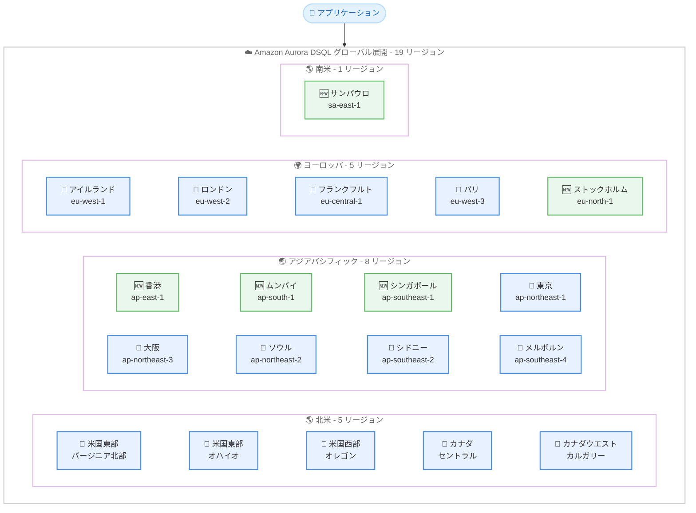

# Amazon Aurora DSQL - 5 つの追加 AWS リージョンで利用可能に

**リリース日**: 2026 年 5 月 11 日
**サービス**: Amazon Aurora DSQL
**機能**: シングルリージョンクラスターの 5 リージョン追加展開

[このアップデートのインフォグラフィックを見る](https://takech9203.github.io/aws-news-summary/20260511-amazon-aurora-dsql-five-additional-aws-regions.html)

## 概要

Amazon Aurora DSQL のシングルリージョンクラスターが、アジアパシフィック (香港)、アジアパシフィック (ムンバイ)、アジアパシフィック (シンガポール)、ヨーロッパ (ストックホルム)、南米 (サンパウロ) の 5 つの新しい AWS リージョンで利用可能になりました。Aurora DSQL は、常時可用なアプリケーションを構築するための最速のサーバーレス分散 SQL データベースであり、事実上無制限のスケーラビリティ、最高レベルの可用性、ゼロインフラストラクチャ管理を提供します。

今回の拡張により、Aurora DSQL は合計 19 の AWS リージョンで利用可能になりました。特に、東南アジア、南アジア、北欧、南米のお客様がより低レイテンシーで Aurora DSQL にアクセスできるようになり、グローバルなカバレッジが大幅に向上しています。

**アップデート前の課題**

- 東南アジア (シンガポール)、南アジア (ムンバイ)、北欧 (ストックホルム)、南米 (サンパウロ) のお客様は、地理的に離れたリージョンの Aurora DSQL クラスターに接続する必要があり、レイテンシーが高かった
- 香港のお客様は、東京やソウルなど他のアジアパシフィックリージョンに依存していた
- 南米にはこれまで Aurora DSQL を利用可能なリージョンが存在しなかった

**アップデート後の改善**

- アジアパシフィック (香港、ムンバイ、シンガポール)、ヨーロッパ (ストックホルム)、南米 (サンパウロ) で Aurora DSQL のシングルリージョンクラスターが利用可能に
- 合計 19 リージョンに拡大し、6 大陸をカバーするグローバルなプレゼンスを確立
- 各リージョンのお客様がより低レイテンシーでデータベースにアクセス可能に

## アーキテクチャ図



このアーキテクチャ図は、Aurora DSQL が利用可能な全 19 リージョンの分布を示しています。緑色のノードが今回新たに追加された 5 リージョンです。

## サービスアップデートの詳細

### 主要機能

1. **5 つの新リージョンでのシングルリージョンクラスター**
   - アジアパシフィック (香港) - ap-east-1
   - アジアパシフィック (ムンバイ) - ap-south-1
   - アジアパシフィック (シンガポール) - ap-southeast-1
   - ヨーロッパ (ストックホルム) - eu-north-1
   - 南米 (サンパウロ) - sa-east-1

2. **最速のサーバーレス分散 SQL データベース**
   - 最速の分散 SQL 読み取りおよび書き込みを提供
   - 事実上無制限のスケーラビリティ
   - ゼロインフラストラクチャ管理、ゼロダウンタイムメンテナンス

3. **高可用性アクティブ-アクティブアーキテクチャ**
   - シングルリージョンで 99.99% の可用性設計
   - マルチリージョンで 99.999% の可用性設計
   - 全コンポーネントにおける単一障害点の排除

## 技術仕様

### Aurora DSQL の主要特性

| 項目 | 詳細 |
|------|------|
| データベースタイプ | サーバーレス分散 SQL |
| PostgreSQL 互換性 | PostgreSQL 互換 |
| スケーラビリティ | 読み取り、書き込み、コンピュート、ストレージが独立してスケール |
| 可用性 SLA | シングルリージョン 99.99%、マルチリージョン 99.999% |
| トランザクション | ACID トランザクション、強整合性 |
| 同時実行制御 | 楽観的同時実行制御 (OCC) |
| インフラ管理 | ゼロ (完全マネージド) |
| 料金体系 | 従量課金制 (DPU + ストレージ) |
| セキュリティ | Firecracker microVM による強力なワークロード分離 |
| 認証 | AWS IAM ネイティブ統合 |
| 暗号化 | 保存時・転送時のデフォルト暗号化 (AWS KMS) |

### 新規リージョンのエンドポイント

| リージョン名 | リージョンコード | エンドポイント |
|-------------|----------------|---------------|
| アジアパシフィック (香港) | ap-east-1 | dsql.ap-east-1.api.aws |
| アジアパシフィック (ムンバイ) | ap-south-1 | dsql.ap-south-1.api.aws |
| アジアパシフィック (シンガポール) | ap-southeast-1 | dsql.ap-southeast-1.api.aws |
| ヨーロッパ (ストックホルム) | eu-north-1 | dsql.eu-north-1.api.aws |
| 南米 (サンパウロ) | sa-east-1 | dsql.sa-east-1.api.aws |

## 設定方法

### 前提条件

1. AWS アカウント
2. Aurora DSQL へのアクセス権限 (IAM ポリシー)
3. 対象リージョンへのアクセス

### 手順

#### ステップ 1: AWS CLI でシングルリージョンクラスターを作成

```bash
# シンガポールリージョンでシングルリージョンクラスターを作成
aws dsql create-cluster \
  --region ap-southeast-1 \
  --deletion-protection-enabled
```

このコマンドは、シンガポールリージョンに Aurora DSQL シングルリージョンクラスターを作成します。削除保護を有効にすることで、誤った削除を防止します。

#### ステップ 2: クラスターエンドポイントの確認

```bash
# クラスターの詳細情報を取得
aws dsql get-cluster \
  --region ap-southeast-1 \
  --identifier <cluster-id>
```

作成されたクラスターのエンドポイント情報を取得します。エンドポイントはアプリケーションからの接続に使用します。

#### ステップ 3: PostgreSQL 互換クライアントで接続

```bash
# 認証トークンの生成
aws dsql generate-db-connect-admin-auth-token \
  --region ap-southeast-1 \
  --endpoint <cluster-endpoint>

# psql で接続
psql "host=<cluster-endpoint> dbname=postgres user=admin sslmode=require"
```

IAM 認証トークンを生成し、PostgreSQL 互換クライアントを使用してクラスターに接続します。

## メリット

### ビジネス面

- **グローバルカバレッジの大幅拡大**: 19 リージョンに拡大し、6 大陸をカバーするグローバルプレゼンスを確立
- **南米市場への対応**: 南米初のリージョン追加により、ブラジルおよび南米全域のお客様にサービス提供可能
- **アジア市場の強化**: 香港、ムンバイ、シンガポールの追加により、金融ハブおよび成長市場をカバー
- **データレジデンシー対応**: 各地域のデータ保存規制要件に対応しやすくなった
- **AWS Free Tier 対応**: 新規リージョンでも毎月 100,000 DPU と 1 GB ストレージが無料

### 技術面

- **低レイテンシー**: 地理的に近いリージョンを選択することで、読み取り・書き込みレイテンシーを最小化
- **PostgreSQL 互換**: 既存の PostgreSQL ドライバー、ORM、フレームワークをそのまま使用可能
- **サーバーレスアーキテクチャ**: プロビジョニング、パッチ適用、スケーリングが完全に自動化
- **ゼロダウンタイムメンテナンス**: バージョンアップグレードやパッチ適用時のダウンタイムなし
- **VPC エンドポイント対応**: Gateway VPC エンドポイントおよび AWS PrivateLink によるプライベート接続

## デメリット・制約事項

### 制限事項

- 今回追加された 5 リージョンはシングルリージョンクラスターのみ対応 (マルチリージョンクラスターのリージョンセットには含まれていない可能性がある)
- マルチリージョンクラスターは同一リージョンセット内でのみ構成可能で、大陸をまたいだ構成は不可
- PostgreSQL 互換のみ (MySQL 非対応)
- 楽観的同時実行制御 (OCC) のため、書き込み競合が多いワークロードではコンフリクトが発生する可能性がある

### 考慮すべき点

- 楽観的同時実行制御 (OCC) の動作特性を理解した上でアプリケーション設計を行う必要がある
- DPU ベースの従量課金のため、ワークロードパターンによってはコスト予測が難しい場合がある
- 新規リージョンでのサービスクォータや制限値は、既存リージョンと異なる場合がある

## ユースケース

### ユースケース 1: 東南アジア向けフィンテックアプリケーション

**シナリオ**: シンガポールを拠点とするフィンテック企業が、東南アジア全域のユーザーに低レイテンシーの決済処理サービスを提供したい。強整合性と高可用性が必須要件。

**実装例**:
```bash
# シンガポールリージョンでクラスターを作成
aws dsql create-cluster \
  --region ap-southeast-1 \
  --deletion-protection-enabled

# テーブル作成例
psql -c "
CREATE TABLE transactions (
  id UUID DEFAULT gen_random_uuid() PRIMARY KEY,
  amount DECIMAL(15,2) NOT NULL,
  currency VARCHAR(3) NOT NULL,
  status VARCHAR(20) DEFAULT 'pending',
  created_at TIMESTAMP DEFAULT NOW()
);
"
```

**効果**: シンガポールリージョンで Aurora DSQL を利用することで、東南アジアのエンドユーザーに 1 桁ミリ秒台の読み取りレイテンシーと ACID トランザクションによる強整合性を提供可能

### ユースケース 2: インド市場向け SaaS プラットフォーム

**シナリオ**: インド市場向けのマルチテナント SaaS プラットフォームを構築しており、ユーザー数の急成長に対応できるスケーラブルなデータベースが必要

**実装例**:
```bash
# ムンバイリージョンでクラスターを作成
aws dsql create-cluster \
  --region ap-south-1 \
  --deletion-protection-enabled
```

**効果**: サーバーレスアーキテクチャにより、ユーザー数の増加に応じて自動スケールし、インフラ管理なしでインド市場の成長に対応可能。インドのデータレジデンシー要件にも準拠。

### ユースケース 3: ブラジル向け E コマースプラットフォーム

**シナリオ**: ブラジルおよび南米全域で E コマースサービスを展開しており、現地の低レイテンシー要件とデータ保護法 (LGPD) への対応が必要

**実装例**:
```bash
# サンパウロリージョンでクラスターを作成
aws dsql create-cluster \
  --region sa-east-1 \
  --deletion-protection-enabled
```

**効果**: 南米初の Aurora DSQL リージョンにより、ブラジルのユーザーに低レイテンシーのデータベースアクセスを提供し、LGPD に準拠したデータ保存が可能

## 料金

Aurora DSQL は完全な従量課金制で、アイドル時はゼロにスケールダウンします。

| 項目 | 説明 |
|------|------|
| DPU (Distributed Processing Unit) | データベースアクティビティ全体の課金単位。クエリ実行のコンピュートリソースおよび I/O を含む |
| ストレージ | データベースサイズ (GB-月)。3 AZ レプリケーション込みで 1 つの論理コピー分のみ課金 |

### 料金例

| 利用形態 | 月額料金（概算） |
|--------|------------------|
| AWS Free Tier 範囲内 (100,000 DPU + 1 GB) | 無料 |
| 開発・テスト環境 (低トラフィック) | Free Tier でカバー可能 |
| 小規模本番ワークロード | 従量課金 (利用パターンに依存) |

DPU の内訳は CloudWatch で ComputeDPU、ReadDPU、WriteDPU、MultiRegionWriteDPU として確認可能です。Database Savings Plans による割引も利用可能です。

詳細な料金については、[Aurora DSQL 料金ページ](https://aws.amazon.com/rds/aurora/dsql/pricing/) をご確認ください。

## 利用可能リージョン

今回のアップデートにより、Aurora DSQL は以下の 19 リージョンで利用可能になりました。

**新規対応リージョン (2026 年 5 月 11 日)**:
- アジアパシフィック (香港) - ap-east-1
- アジアパシフィック (ムンバイ) - ap-south-1
- アジアパシフィック (シンガポール) - ap-southeast-1
- ヨーロッパ (ストックホルム) - eu-north-1
- 南米 (サンパウロ) - sa-east-1

**既存対応リージョン**:
- 米国東部 (バージニア北部) - us-east-1
- 米国東部 (オハイオ) - us-east-2
- 米国西部 (オレゴン) - us-west-2
- カナダ (セントラル) - ca-central-1
- カナダウエスト (カルガリー) - ca-west-1
- アジアパシフィック (メルボルン) - ap-southeast-4
- アジアパシフィック (大阪) - ap-northeast-3
- アジアパシフィック (シドニー) - ap-southeast-2
- アジアパシフィック (東京) - ap-northeast-1
- アジアパシフィック (ソウル) - ap-northeast-2
- ヨーロッパ (アイルランド) - eu-west-1
- ヨーロッパ (ロンドン) - eu-west-2
- ヨーロッパ (フランクフルト) - eu-central-1
- ヨーロッパ (パリ) - eu-west-3

## 関連サービス・機能

- **Amazon Aurora**: リレーショナルデータベースサービスファミリー。DSQL は Aurora の分散 SQL エンジン
- **Amazon DynamoDB Global Tables**: NoSQL でのマルチリージョン対応。リレーショナルが不要な場合の代替選択肢
- **AWS IAM**: Aurora DSQL のデータベース認証・認可を IAM ネイティブで提供
- **Amazon CloudWatch**: DPU 使用量のモニタリングとアラート設定
- **AWS PrivateLink**: VPC エンドポイント経由のプライベート接続

## 参考リンク

- [インフォグラフィック](https://takech9203.github.io/aws-news-summary/20260511-amazon-aurora-dsql-five-additional-aws-regions.html)
- [公式発表 (What's New)](https://aws.amazon.com/about-aws/whats-new/2026/05/amazon-aurora-dsql-five-additional-aws-regions/)
- [Aurora DSQL ドキュメント](https://docs.aws.amazon.com/aurora-dsql/latest/userguide/what-is-aurora-dsql.html)
- [Aurora DSQL 製品ページ](https://aws.amazon.com/rds/aurora/dsql/)
- [Aurora DSQL 料金ページ](https://aws.amazon.com/rds/aurora/dsql/pricing/)
- [Aurora DSQL Features](https://aws.amazon.com/rds/aurora/dsql/features/)
- [AWS Free Tier](https://aws.amazon.com/free/)

## まとめ

Amazon Aurora DSQL がアジアパシフィック (香港、ムンバイ、シンガポール)、ヨーロッパ (ストックホルム)、南米 (サンパウロ) の 5 つの新リージョンで利用可能になり、合計 19 リージョンに拡大しました。特に南米初のリージョン追加は、ブラジルおよび南米全域のお客様にとって重要なマイルストーンです。東南アジア、南アジア、北欧の金融ハブや成長市場をカバーすることで、Aurora DSQL はグローバルなサーバーレス分散 SQL データベースとしての地位をさらに強化しています。AWS Free Tier を活用して、新規リージョンで Aurora DSQL を無料で試すことができます。
