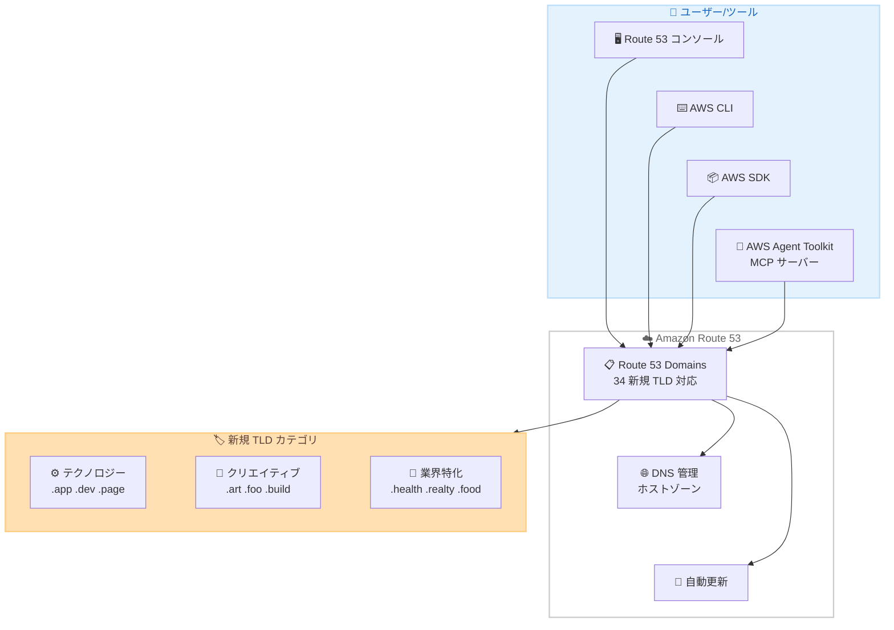

# Amazon Route 53 Domains - 34 の新しいトップレベルドメインをサポート

**リリース日**: 2026 年 5 月 11 日
**サービス**: Amazon Route 53 Domains
**機能**: 新規 TLD (.app, .dev, .health 等 34 種類) のドメイン登録・管理サポート

[このアップデートのインフォグラフィックを見る](https://takech9203.github.io/aws-news-summary/20260511-amazon-route-53-domains.html)

## 概要

Amazon Route 53 Domains が新たに 34 のトップレベルドメイン (TLD) の登録と管理をサポートした。今回追加された TLD には .app、.dev、.art、.forum、.health、.realty などが含まれ、業界固有・テクノロジー特化・目的別のドメイン名オプションが AWS 上で直接利用可能になった。

これにより、企業や個人がオンラインプレゼンスをより効果的に確立できるようになる。Route 53 コンソール、AWS CLI、SDK を通じたドメイン登録に加え、AWS Agent Toolkit を使用してフルマネージド MCP サーバー経由でプログラマティックにドメインを登録・管理することも可能である。

**アップデート前の課題**

- Route 53 Domains で登録可能な TLD が限定されており、.app や .dev など人気のある技術系ドメインを AWS 外のレジストラで登録する必要があった
- 外部レジストラで登録したドメインと Route 53 の DNS 管理を連携させるには追加の設定作業が必要だった
- AI エージェントワークフローからのドメイン管理が標準化されていなかった

**アップデート後の改善**

- .app、.dev、.health を含む 34 の新しい TLD を Route 53 内で直接登録・管理可能になった
- DNS ホストゾーンとドメイン登録を統合管理でき、自動更新も利用可能になった
- AWS Agent Toolkit のフルマネージド MCP サーバーを通じて AI エージェントからプログラマティックにドメイン操作が可能になった

## アーキテクチャ図



Route 53 コンソール、CLI、SDK、Agent Toolkit の各インターフェースから新規 TLD のドメイン登録が可能であり、DNS 管理と自動更新が統合されている。

## サービスアップデートの詳細

### 主要機能

1. **34 の新規 TLD サポート**
   - テクノロジー系: .app、.dev、.page、.build、.foo、.zip
   - クリエイティブ系: .art、.diy、.mov
   - 業界特化系: .health、.realty、.food、.menu、.fit
   - コミュニティ系: .forum、.earth、.love、.lifestyle、.living
   - プロフェッショナル系: .esq、.phd、.prof
   - その他: .bar、.boo、.dad、.day、.how、.my、.nexus、.one、.rest、.rsvp、.soy、.win

2. **統合 DNS 管理**
   - ドメイン登録と同時にホストゾーンが自動作成される
   - Route 53 の DNS レコード管理と完全に統合
   - ネームサーバーの設定が不要

3. **自動更新機能**
   - 登録したドメインの有効期限管理を自動化
   - 更新忘れによるドメイン失効リスクを低減

4. **AWS Agent Toolkit 連携**
   - フルマネージド MCP サーバーを通じてドメイン操作を自動化
   - AI エージェントワークフローからプログラマティックにドメイン登録・管理が可能

## 技術仕様

### 対応 TLD 一覧

| カテゴリ | TLD |
|----------|-----|
| テクノロジー | .app, .dev, .page, .build, .foo, .zip, .boo |
| クリエイティブ | .art, .diy, .mov |
| ヘルスケア/フィットネス | .health, .fit |
| 不動産 | .realty |
| 飲食/ライフスタイル | .food, .menu, .bar, .rest, .lifestyle, .living |
| コミュニティ | .forum, .earth, .love, .soy |
| プロフェッショナル | .esq, .phd, .prof |
| パーソナル | .dad, .day, .how, .my, .rsvp |
| その他 | .nexus, .one, .win |

### 登録インターフェース

| 方法 | 説明 |
|------|------|
| Route 53 コンソール | GUI ベースのドメイン検索・登録 |
| AWS CLI | `aws route53domains` コマンドによる操作 |
| AWS SDK | 各言語の SDK を使用したプログラマティック操作 |
| AWS Agent Toolkit | MCP サーバー経由の AI エージェント統合 |

### API 変更履歴

過去 3 日間に Route 53 関連の API 変更は検出されなかった。

## 設定方法

### 前提条件

1. AWS アカウント
2. Route 53 Domains へのアクセス権限 (IAM ポリシー)
3. ドメイン登録に必要な連絡先情報

### 手順

#### ステップ 1: ドメインの可用性を確認

```bash
aws route53domains check-domain-availability \
  --domain-name myproject.app
```

指定したドメイン名が登録可能かどうかを確認する。レスポンスの `Availability` フィールドが `AVAILABLE` であれば登録可能である。

#### ステップ 2: ドメインを登録

```bash
aws route53domains register-domain \
  --domain-name myproject.app \
  --duration-in-years 1 \
  --admin-contact '{
    "FirstName": "Taro",
    "LastName": "Yamada",
    "ContactType": "PERSON",
    "OrganizationName": "Example Corp",
    "AddressLine1": "1-1-1 Shibuya",
    "City": "Tokyo",
    "State": "Tokyo",
    "CountryCode": "JP",
    "ZipCode": "150-0002",
    "PhoneNumber": "+81.312345678",
    "Email": "admin@example.com"
  }' \
  --registrant-contact '{...}' \
  --tech-contact '{...}' \
  --auto-renew
```

ドメインを登録し、自動更新を有効にする。連絡先情報は admin、registrant、tech の 3 種類を指定する。

#### ステップ 3: DNS レコードを設定

```bash
# ホストゾーン ID を確認
aws route53 list-hosted-zones-by-name \
  --dns-name myproject.app

# A レコードを追加
aws route53 change-resource-record-sets \
  --hosted-zone-id Z1234567890 \
  --change-batch '{
    "Changes": [{
      "Action": "CREATE",
      "ResourceRecordSet": {
        "Name": "myproject.app",
        "Type": "A",
        "TTL": 300,
        "ResourceRecords": [{"Value": "203.0.113.1"}]
      }
    }]
  }'
```

ドメイン登録時に自動作成されたホストゾーンに DNS レコードを追加する。

#### ステップ 4: AWS Agent Toolkit を使用した登録 (オプション)

```python
# AWS Agent Toolkit MCP サーバーを使用した例
# AI エージェントからドメインを登録・管理する場合
import boto3

# Agent Toolkit を通じて MCP サーバー経由でドメイン操作
# 詳細は AWS Agent Toolkit ドキュメントを参照
```

AI エージェントワークフローから MCP サーバーを通じてドメイン管理を自動化する。

## メリット

### ビジネス面

- **ブランド価値の向上**: .app や .dev など業界に適した TLD を使用することで、ターゲットオーディエンスに対する信頼性と専門性を伝達できる
- **統合管理による効率化**: AWS 内でドメイン登録から DNS 設定まで完結するため、複数のサービスプロバイダーを管理する手間が削減される
- **自動化による運用コスト削減**: Agent Toolkit 連携により、大規模なドメインポートフォリオの管理を自動化できる

### 技術面

- **DNS 統合のシームレス化**: ドメイン登録と同時にホストゾーンが自動設定されるため、ネームサーバーの手動設定が不要
- **IaC との親和性**: AWS CLI/SDK 経由での操作により、Terraform や CloudFormation でのドメイン管理が容易
- **MCP サーバー連携**: AI エージェントからの自動化により、DevOps ワークフローへのドメイン管理統合が実現

## デメリット・制約事項

### 制限事項

- アカウントあたりのデフォルトドメイン登録上限は 20 件 (上限緩和申請が可能)
- ドメイン登録料金は TLD ごとに異なり、年単位での課金となる
- プロモーショナルクレジットはドメイン登録料金には使用不可
- 一部の TLD には登録要件がある場合がある (例: .health は医療関連組織向け)

### 考慮すべき点

- .zip や .mov などの TLD はファイル拡張子と同一であるため、フィッシングリスクやユーザーの混乱を招く可能性がある
- ドメイン移管 (トランスファーイン/アウト) のポリシーは TLD ごとに異なる
- WHOIS プライバシー保護の対応状況は TLD によって異なる場合がある

## ユースケース

### ユースケース 1: SaaS アプリケーションのブランディング

**シナリオ**: スタートアップが新しい SaaS 製品のドメインを .app TLD で取得し、AWS 上で完全に管理する。

**実装例**:
```bash
# ドメイン登録
aws route53domains register-domain \
  --domain-name myproduct.app \
  --duration-in-years 1 \
  --auto-renew

# CloudFront ディストリビューションへの ALIAS レコード設定
aws route53 change-resource-record-sets \
  --hosted-zone-id Z1234567890 \
  --change-batch '{
    "Changes": [{
      "Action": "CREATE",
      "ResourceRecordSet": {
        "Name": "myproduct.app",
        "Type": "A",
        "AliasTarget": {
          "HostedZoneId": "Z2FDTNDATAQYW2",
          "DNSName": "d123456.cloudfront.net",
          "EvaluateTargetHealth": false
        }
      }
    }]
  }'
```

**効果**: .app ドメインによりアプリケーション製品としての認知度が向上し、Route 53 と CloudFront の統合によりシームレスな HTTPS 配信が実現する。

### ユースケース 2: 開発者ポートフォリオサイト

**シナリオ**: 開発者が技術ポートフォリオや OSS プロジェクトのドキュメントサイト用に .dev ドメインを取得する。

**実装例**:
```bash
# .dev ドメインの登録
aws route53domains register-domain \
  --domain-name myname.dev \
  --duration-in-years 1 \
  --auto-renew

# GitHub Pages や S3 静的サイトへの CNAME 設定
aws route53 change-resource-record-sets \
  --hosted-zone-id Z1234567890 \
  --change-batch '{
    "Changes": [{
      "Action": "CREATE",
      "ResourceRecordSet": {
        "Name": "myname.dev",
        "Type": "CNAME",
        "TTL": 300,
        "ResourceRecords": [{"Value": "myname.github.io"}]
      }
    }]
  }'
```

**効果**: .dev ドメインにより技術者としてのブランディングが強化され、AWS での統合管理により運用が簡素化される。

### ユースケース 3: AI エージェントによるマルチドメイン管理

**シナリオ**: 不動産企業が複数の物件サイト用に .realty ドメインを一括登録し、AI エージェントで管理を自動化する。

**実装例**:
```python
# AWS Agent Toolkit を使用したドメイン一括管理
# MCP サーバー経由でドメイン操作を自動化
import boto3

client = boto3.client('route53domains')

# 複数ドメインの可用性チェック
domains = ['property1.realty', 'property2.realty', 'property3.realty']
for domain in domains:
    response = client.check_domain_availability(DomainName=domain)
    if response['Availability'] == 'AVAILABLE':
        print(f'{domain} is available for registration')
```

**効果**: Agent Toolkit の MCP サーバー連携により、大量のドメイン管理作業を AI エージェントに委譲でき、運用負荷を大幅に削減できる。

## 料金

ドメイン登録料金は TLD ごとに異なり、年単位で課金される。ボリュームディスカウントは提供されていない。

### 料金例

| TLD | 用途 | 年間料金 (参考) |
|-----|------|-----------------|
| .app | デジタルプロダクト | TLD により異なる (公式料金ページ参照) |
| .dev | 開発プロジェクト | TLD により異なる (公式料金ページ参照) |
| .health | ヘルスケア | TLD により異なる (公式料金ページ参照) |

**注記**: 正確な料金は [Route 53 料金ページ](https://aws.amazon.com/route53/pricing/) の TLD 別料金一覧を参照。プロモーショナルクレジットはドメイン登録には使用不可。

## 利用可能リージョン

Amazon Route 53 Domains はグローバルサービスとして提供されており、すべての AWS リージョンから利用可能である。ドメイン登録の API エンドポイントは us-east-1 (バージニア北部) を使用する。

## 関連サービス・機能

- **Amazon Route 53 DNS**: ドメイン登録と統合された DNS ホストゾーン管理、レコード設定
- **AWS Certificate Manager (ACM)**: 登録ドメインに対する SSL/TLS 証明書の無料発行・自動更新
- **Amazon CloudFront**: Route 53 との ALIAS レコード連携による CDN 配信
- **AWS Agent Toolkit**: MCP サーバーを通じた AI エージェントからのドメイン操作自動化
- **AWS CloudFormation**: IaC によるドメイン登録・DNS 設定のテンプレート化

## 参考リンク

- [インフォグラフィック](https://takech9203.github.io/aws-news-summary/20260511-amazon-route-53-domains.html)
- [公式発表 (What's New)](https://aws.amazon.com/about-aws/whats-new/2026/05/amazon-route-53-domains/)
- [Amazon Route 53 Domains ドキュメント](https://docs.aws.amazon.com/Route53/latest/DeveloperGuide/registrar.html)
- [Route 53 料金ページ](https://aws.amazon.com/route53/pricing/)
- [サポートされる TLD 一覧](https://docs.aws.amazon.com/Route53/latest/DeveloperGuide/registrar-tld-list.html)

## まとめ

Amazon Route 53 Domains が .app、.dev、.health を含む 34 の新しい TLD をサポートしたことで、AWS 内でのドメインライフサイクル管理がさらに充実した。特に AWS Agent Toolkit の MCP サーバー連携により、AI エージェントワークフローからのドメイン管理自動化が実現する点は、Infrastructure as Code やプラットフォームエンジニアリングの観点で注目に値する。既に Route 53 で DNS 管理を行っている組織は、外部レジストラからの移行を検討することで運用の一元化とコスト削減が期待できる。
