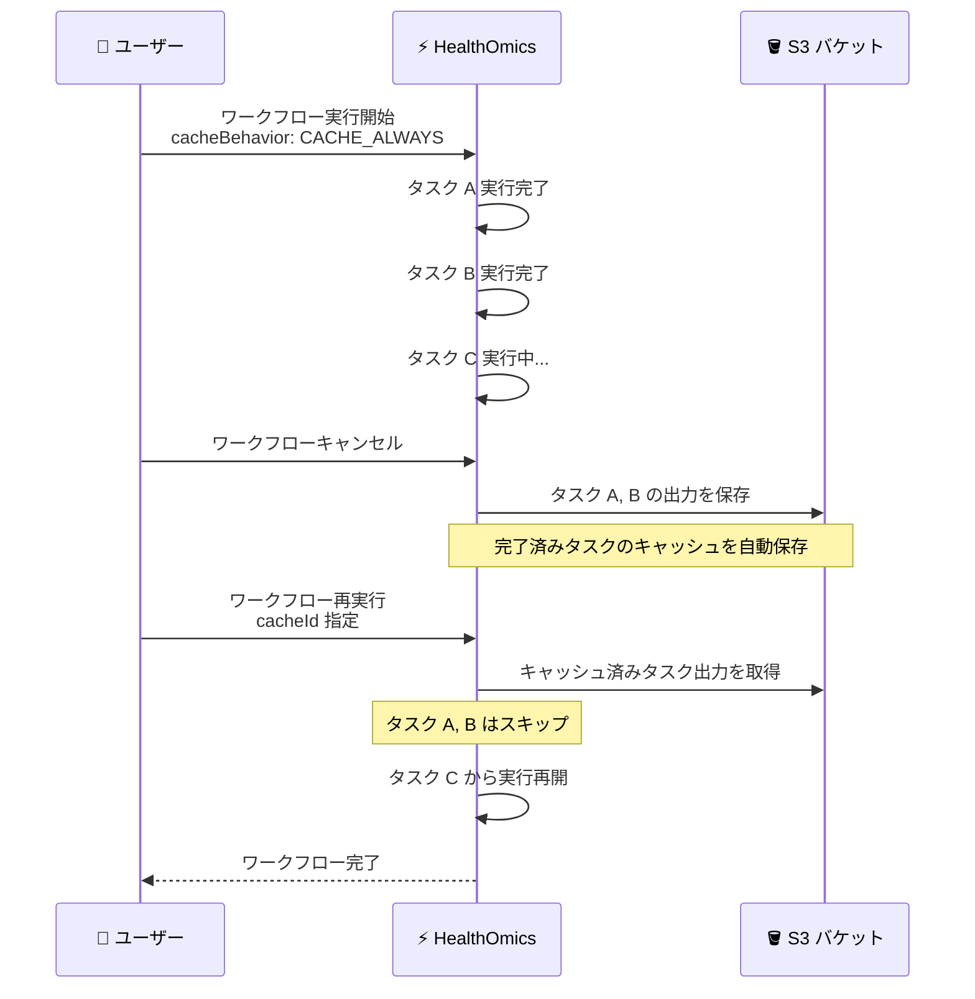

# AWS HealthOmics - キャンセルされたワークフロー実行のキャッシュサポート

**リリース日**: 2026年5月11日
**サービス**: AWS HealthOmics
**機能**: キャンセルされたワークフロー実行の完了タスク出力キャッシュ

📊 [このアップデートのインフォグラフィックを見る](https://takech9203.github.io/aws-news-summary/20260511-aws-healthomics-caching-cancelled-runs.html)

## 概要

AWS HealthOmics が、キャンセルされたワークフロー実行 (Run) の完了済みタスク出力をキャッシュする機能をサポートした。これにより、ワークフローがキャンセルされた場合でも、既に完了しているタスクの出力が顧客の S3 バケットに自動的に保存され、再実行時にキャンセル地点から処理を再開できるようになる。

AWS HealthOmics は HIPAA 対応のフルマネージドバイオインフォマティクスワークフローサービスであり、ヘルスケアおよびライフサイエンス分野の顧客が大規模な科学的発見を加速するために活用されている。今回のアップデートは、研究者、バイオインフォマティシャン、ワークフロー開発者がワークフローを効率的にデバッグおよび反復的に開発するための重要な改善である。

**アップデート前の課題**

- ワークフローをキャンセルした場合、完了済みタスクの出力が保存されず、再実行時にすべてのタスクを最初から実行し直す必要があった
- 長時間かかるタスクが完了していても、キャンセル後の再実行で同じ計算を繰り返すことによるコスト増大が発生していた
- ワークフロー開発中のデバッグ作業において、中間ファイルの確認ができないため、問題の特定に時間がかかっていた

**アップデート後の改善**

- キャッシュ有効時にワークフローがキャンセルされると、完了済みタスクの出力が自動的に顧客の S3 バケットに保存される
- 再実行時にキャンセル地点から処理を再開でき、未完了タスクのみが実行される
- 中間ファイルと完了タスク出力を検査用に保存できるため、デバッグと反復開発が効率化される

## アーキテクチャ図



キャンセルされたワークフローの完了済みタスク出力が S3 に自動保存され、再実行時にキャッシュから復元されることで、未完了タスクのみが実行される流れを示している。

## サービスアップデートの詳細

### 主要機能

1. **キャンセル済み実行の完了タスク出力キャッシュ**
   - キャッシュが有効な状態でワークフローがキャンセルされると、完了済みタスクの出力が自動的に保存される
   - 保存先は顧客が指定した S3 バケット
   - 追加の設定変更なしで既存のキャッシュ設定が適用される

2. **キャンセル地点からの再開**
   - 再実行時に cacheId を指定することで、前回のキャンセル地点から処理を再開
   - 完了済みタスクは再計算されず、キャッシュされた出力が再利用される
   - 未完了タスクのみが新たに実行される

3. **中間ファイルの検査**
   - キャッシュされた中間ファイルをデバッグ目的で検査可能
   - ワークフロー開発時の反復的なデバッグサイクルを効率化
   - タスク単位での出力確認が可能

## 技術仕様

### キャッシュ動作の設定

| 項目 | 詳細 |
|------|------|
| cacheBehavior | `CACHE_ON_FAILURE` または `CACHE_ALWAYS` |
| 保存先 | 顧客指定の S3 バケット (outputUri) |
| 対応ワークフロー言語 | Nextflow, WDL, CWL |
| キャッシュ対象 | キャンセル時点で完了していたタスクの出力 |

### API 変更履歴

| 日付 | サービス | 変更内容 |
|------|----------|----------|
| 2026/04/27 | [Amazon Omics](https://awsapichanges.com/archive/changes/9131bf-omics.html) | 3 updated api methods - BatchRun に Public Internet / VPC 設定を追加 |

### キャッシュ設定パラメータ

```json
{
  "cacheId": "string",
  "cacheBehavior": "CACHE_ALWAYS",
  "outputUri": "s3://my-bucket/workflow-outputs/",
  "retentionMode": "RETAIN"
}
```

## 設定方法

### 前提条件

1. AWS HealthOmics が利用可能なリージョンに AWS アカウントがあること
2. ワークフロー実行用の IAM ロールが設定されていること
3. キャッシュ出力を保存する S3 バケットが作成されていること

### 手順

#### ステップ 1: キャッシュ用の Run Cache を作成

```bash
aws omics create-run-cache \
  --cache-s3-uri s3://my-bucket/run-cache/ \
  --name "my-workflow-cache"
```

ワークフロー実行のキャッシュを保存するための Run Cache リソースを作成する。S3 URI には実際のバケットパスを指定する。

#### ステップ 2: キャッシュ有効でワークフローを実行

```bash
aws omics start-run \
  --workflow-id "1234567" \
  --role-arn "arn:aws:iam::123456789012:role/OmicsRole" \
  --output-uri "s3://my-bucket/outputs/" \
  --cache-id "cache-id-from-step1" \
  --cache-behavior "CACHE_ALWAYS" \
  --parameters file://params.json
```

`--cache-behavior` に `CACHE_ALWAYS` を指定することで、正常完了時だけでなくキャンセル時にも完了タスクの出力がキャッシュされる。

#### ステップ 3: キャンセル後の再実行

```bash
aws omics start-run \
  --workflow-id "1234567" \
  --role-arn "arn:aws:iam::123456789012:role/OmicsRole" \
  --output-uri "s3://my-bucket/outputs/" \
  --cache-id "cache-id-from-step1" \
  --cache-behavior "CACHE_ALWAYS" \
  --parameters file://params.json
```

同じ cache-id を指定して再実行することで、前回キャンセル時に保存されたタスク出力が再利用され、未完了タスクのみが実行される。

## メリット

### ビジネス面

- **コスト削減**: 完了済みタスクの再計算が不要となり、特に長時間かかるゲノム解析ワークフローで大幅なコスト削減が可能
- **開発サイクルの短縮**: ワークフロー開発者がデバッグと修正を迅速に行えるようになり、製品化までの時間を短縮
- **研究の加速**: 研究者が大規模なバイオインフォマティクスパイプラインを効率的に反復実行でき、科学的発見のスピードが向上

### 技術面

- **中間結果の可視性**: キャッシュされた中間ファイルを直接 S3 から検査でき、問題の特定と解決が容易
- **柔軟なワークフロー管理**: キャンセルと再実行のワークフローが効率的になり、リソース使用の最適化が可能
- **マルチ言語サポート**: Nextflow, WDL, CWL のすべてのワークフロー言語で利用可能

## デメリット・制約事項

### 制限事項

- キャッシュ動作を有効にしていない既存の実行には遡って適用されない
- キャッシュされた出力は顧客の S3 バケットに保存されるため、ストレージコストが発生する
- キャッシュの有効性はタスクの入力パラメータに依存し、入力が変更された場合はキャッシュが無効となる

### 考慮すべき点

- S3 バケットのライフサイクルポリシーを適切に設定し、不要になったキャッシュデータのストレージコストを管理する必要がある
- 大規模なゲノムデータセットの中間出力はサイズが大きくなる可能性があるため、ストレージ容量を事前に計画する

## ユースケース

### ユースケース 1: ゲノム解析パイプラインのデバッグ

**シナリオ**: バイオインフォマティシャンが新しいゲノム変異解析パイプラインを開発中に、後段のタスクでエラーが発生。パイプライン全体の実行に 8 時間かかるが、エラーは 6 時間目のタスクで発生する。

**実装例**:
```bash
# 初回実行 (キャッシュ有効)
aws omics start-run \
  --workflow-id "variant-calling-wf" \
  --cache-id "dev-cache-001" \
  --cache-behavior "CACHE_ALWAYS" \
  --parameters '{"sample": "NA12878", "reference": "hg38"}'

# エラー確認後にキャンセルし、修正版を再実行
# 最初の 6 時間分のタスクはスキップされる
```

**効果**: 8 時間のパイプラインで 6 時間分の計算を節約し、修正後のデバッグサイクルを 2 時間に短縮

### ユースケース 2: コスト管理によるワークフロー中断と再開

**シナリオ**: 研究チームが大規模な WGS (全ゲノムシーケンシング) 解析を実行中に、予算上限に達したため一時的にワークフローをキャンセルする必要がある。

**実装例**:
```bash
# 予算上限到達時にキャンセル
aws omics cancel-run --id "run-12345"

# 次月の予算が割り当てられた後に再実行
aws omics start-run \
  --workflow-id "wgs-pipeline" \
  --cache-id "budget-managed-cache" \
  --cache-behavior "CACHE_ALWAYS" \
  --parameters file://wgs-params.json
```

**効果**: 予算管理と計算効率を両立し、既に完了した解析ステップのコストを重複して支払う必要がない

### ユースケース 3: マルチサンプル解析での段階的実行

**シナリオ**: CWL ワークフローで 100 サンプルのバッチ解析を実行中に、優先度の高いジョブが入ったためワークフローをキャンセル。後で残りのサンプルを処理する。

**実装例**:
```bash
# 優先ジョブのためにキャンセル
aws omics cancel-run --id "batch-run-001"

# 優先ジョブ完了後に再開 - 処理済みサンプルはスキップ
aws omics start-run \
  --workflow-id "multi-sample-analysis" \
  --cache-id "batch-cache-001" \
  --cache-behavior "CACHE_ALWAYS" \
  --parameters file://batch-params.json
```

**効果**: リソースの優先度管理が柔軟になり、処理済みタスクの再実行コストを回避

## 料金

AWS HealthOmics のキャッシュ機能自体には追加料金は発生しない。ただし、以下のコストが関連する。

### 料金例

| 項目 | 料金 |
|------|------|
| HealthOmics ワークフロー実行 | 使用した OMICS CPUhour および GPUhour に基づく |
| S3 キャッシュストレージ | S3 標準ストレージ料金 (例: $0.023/GB/月、us-east-1) |
| S3 データ取得 | S3 GET リクエスト料金 |

キャッシュにより再計算を回避できるため、特に長時間のワークフローではコンピューティング費用の削減がストレージコストを大幅に上回る。

## 利用可能リージョン

本機能は AWS HealthOmics が利用可能なすべてのリージョンで提供されている。

| リージョン | コード |
|------|------|
| 米国東部 (バージニア北部) | us-east-1 |
| 米国西部 (オレゴン) | us-west-2 |
| 欧州 (フランクフルト) | eu-central-1 |
| 欧州 (アイルランド) | eu-west-1 |
| 欧州 (ロンドン) | eu-west-2 |
| イスラエル (テルアビブ) | il-central-1 |
| アジアパシフィック (シンガポール) | ap-southeast-1 |
| アジアパシフィック (ソウル) | ap-northeast-2 |

## 関連サービス・機能

- **Amazon S3**: キャッシュされたタスク出力の保存先。ライフサイクルポリシーによるコスト最適化が可能
- **AWS HealthOmics Run Cache**: ワークフロー実行間でタスク出力を共有するためのキャッシュリソース
- **AWS HealthOmics Batch Run**: 複数ワークフロー実行のバッチ処理機能。キャッシュと組み合わせてさらなる効率化が可能

## 参考リンク

- 📊 [インフォグラフィック](https://takech9203.github.io/aws-news-summary/20260511-aws-healthomics-caching-cancelled-runs.html)
- [公式発表 (What's New)](https://aws.amazon.com/about-aws/whats-new/2026/05/aws-healthomics-caching-cancelled-runs/)
- [AWS HealthOmics ドキュメント](https://docs.aws.amazon.com/omics/latest/dev/what-is-service.html)
- [AWS HealthOmics 料金ページ](https://aws.amazon.com/omics/pricing/)

## まとめ

AWS HealthOmics のキャンセル済みワークフロー実行のキャッシュサポートは、バイオインフォマティクスワークフローの開発効率とコスト最適化に大きく貢献するアップデートである。特にゲノム解析のような長時間ワークフローにおいて、キャンセル後の再実行コストを大幅に削減できる。Nextflow, WDL, CWL のすべてのワークフロー言語に対応しており、すべての HealthOmics 対応リージョンで即座に利用可能であるため、既存のワークフローに対してキャッシュ設定を有効にすることを推奨する。
