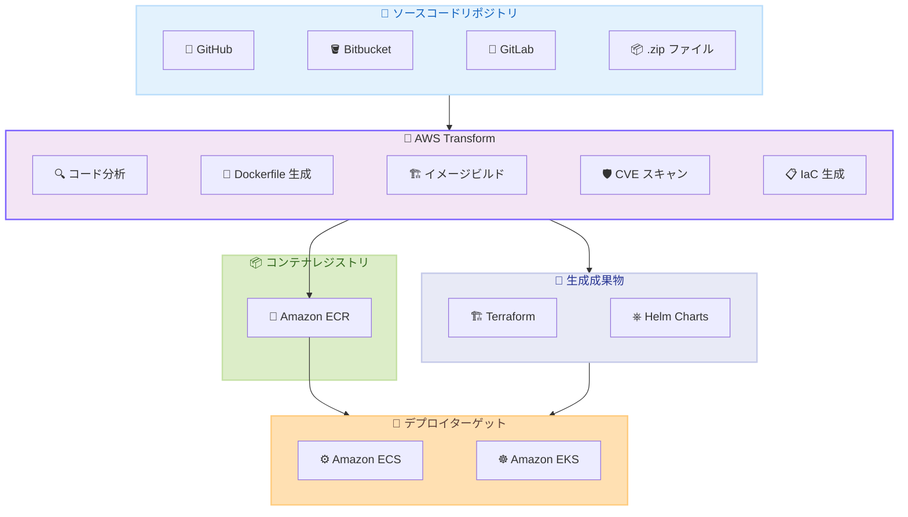

# AWS Transform - コンテナ化機能の追加

**リリース日**: 2026年5月11日
**サービス**: AWS Transform
**機能**: マイグレーション中のコンテナ化 (Replatform to Containers)

[このアップデートのインフォグラフィックを見る](https://takech9203.github.io/aws-news-summary/20260511-aws-transform-containerization.html)

## 概要

AWS Transform にマイグレーション中のアプリケーションをコンテナにリプラットフォームする機能が追加されました。このリリースにより、AWS Transform のエージェント AI 機能が拡張され、ソースコードのコンテナ化を自動化することで、マイグレーションとモダナイゼーションを並行して実施できるようになります。オンプレミスからクラウドネイティブアーキテクチャへの移行にかかる時間と複雑さが大幅に削減されます。

マイグレーションチームは GitHub、Bitbucket、GitLab、または .zip ファイルからソースコードをコンテナ化し、Docker イメージを生成して Amazon ECR にパブリッシュし、Amazon ECS または Amazon EKS にデプロイできます。これにより、リホストマイグレーションの計画・実行に使用するワークフローにコンテナ化が統合されます。

**アップデート前の課題**

- マイグレーションとモダナイゼーション (コンテナ化) は別々のフェーズとして実施する必要があり、移行完了後にコンテナ化を行うのが一般的だった
- ソースコードからの Dockerfile 作成、コンテナイメージのビルド、セキュリティスキャン、IaC 生成を手動で行う必要があった
- 数千のアプリケーションを大規模にコンテナ化するには、膨大な工数と専門知識が必要だった

**アップデート後の改善**

- マイグレーションウェーブプランニングでリホストまたはリプラットフォーム (コンテナ化) のパスを選択でき、移行と近代化を同時に進められるようになった
- エージェント AI がソースコードを分析し、Dockerfile 生成、イメージビルド、CVE スキャン、Terraform IaC / Helm チャートの生成を自動で実行する
- モノレポ、マルチレポ構造、AWS CodeArtifact 経由のプライベート依存関係解決に対応し、大規模なコンテナ化が可能になった

## アーキテクチャ図



AWS Transform がソースコードリポジトリを取り込み、エージェント AI による分析・Dockerfile 生成・ビルド・セキュリティスキャン・IaC 生成を自動実行し、Amazon ECR 経由で ECS/EKS へデプロイするパイプライン全体を示しています。

## サービスアップデートの詳細

### 主要機能

1. **エージェント AI によるソースコード分析とコンテナ化**
   - ソースコードリポジトリを自動分析し、アプリケーション構造を理解
   - 適切な Dockerfile を自動生成
   - Docker コンテナイメージをビルドし、Amazon ECR にパブリッシュ
   - 統合セキュリティスキャンで CVE (共通脆弱性識別子) を検出

2. **デプロイ対応の IaC 成果物生成**
   - Terraform によるインフラストラクチャコードを自動生成
   - Helm チャートをターゲット環境向けに生成
   - Amazon ECS または Amazon EKS へのデプロイに即座に使用可能
   - 本番環境対応のインフラ構成をコードとして管理

3. **大規模マイグレーション対応**
   - モノリシックリポジトリ (モノレポ) とマルチレポ構造の両方をサポート
   - AWS CodeArtifact を通じたプライベート依存関係の解決
   - 数千のアプリケーションを一括でコンテナ化可能
   - マイグレーションウェーブプランニングでリホストとリプラットフォームのパスを選択

4. **マルチソースコード対応**
   - GitHub リポジトリから直接取り込み
   - Bitbucket リポジトリから直接取り込み
   - GitLab リポジトリから直接取り込み
   - .zip ファイルによるソースコードアップロード

## 技術仕様

### 対応コンポーネント

| 項目 | 詳細 |
|------|------|
| ソース対応 | GitHub、Bitbucket、GitLab、.zip ファイル |
| コンテナレジストリ | Amazon ECR |
| コンテナオーケストレーション | Amazon ECS、Amazon EKS |
| IaC 出力形式 | Terraform、Helm Charts |
| 依存関係管理 | AWS CodeArtifact (プライベート依存関係) |
| セキュリティ | 統合 CVE スキャン |
| リポジトリ構造 | モノレポ、マルチレポ |
| スケール | 数千アプリケーション対応 |

### マイグレーションパスの選択

| パス | 説明 | ユースケース |
|------|------|-------------|
| リホスト | 既存アプリケーションをそのまま AWS に移行 | 迅速な移行が必要な場合 |
| リプラットフォーム (コンテナ化) | コンテナ化して AWS に移行 | モダナイゼーションと移行を同時に進めたい場合 |

## 設定方法

### 前提条件

1. AWS Transform へのアクセス権限が設定されていること
2. ソースコードリポジトリ (GitHub、Bitbucket、GitLab) への接続設定、または .zip ファイルが用意されていること
3. Amazon ECR リポジトリが作成されていること
4. デプロイターゲット (Amazon ECS クラスターまたは Amazon EKS クラスター) が準備されていること

### 手順

#### ステップ 1: マイグレーションウェーブプランニングでパスを選択

AWS Transform コンソールのマイグレーションウェーブプランニング画面で、各アプリケーションに対してリホストまたはリプラットフォーム (コンテナ化) パスを割り当てます。

#### ステップ 2: ソースコードリポジトリの接続

```bash
# GitHub、Bitbucket、GitLab のいずれかを接続設定
# AWS Transform コンソールからリポジトリ接続を設定
# もしくは .zip ファイルをアップロード
```

ソースコードの取り込み元を設定します。プライベートリポジトリの場合は適切な認証情報を設定します。

#### ステップ 3: コンテナ化の実行

AWS Transform がソースコードを分析し、以下を自動実行します。

- Dockerfile の生成
- コンテナイメージのビルド
- CVE セキュリティスキャンの実施
- Amazon ECR へのイメージパブリッシュ
- Terraform コードと Helm チャートの生成

#### ステップ 4: デプロイ

生成された Terraform コードと Helm チャートを使用して、Amazon ECS または Amazon EKS にデプロイします。

```bash
# Terraform による ECS/EKS インフラのデプロイ例
terraform init
terraform plan
terraform apply
```

生成された IaC を使用してターゲット環境にコンテナ化されたアプリケーションをデプロイします。

## メリット

### ビジネス面

- **移行期間の短縮**: マイグレーションとモダナイゼーションを並行実施することで、クラウド移行にかかる総期間を大幅に短縮
- **コスト削減**: 手動でのコンテナ化作業を AI が自動化するため、エンジニアリングコストを削減
- **早期のクラウドネイティブ活用**: 移行完了時点で既にコンテナ化されているため、すぐにクラウドネイティブのメリットを享受可能

### 技術面

- **一貫性のある自動化**: エージェント AI による分析と生成により、人的ミスを減少させ一貫した品質を担保
- **セキュリティの組み込み**: CVE スキャンが統合されているため、脆弱性のあるイメージのデプロイを防止
- **IaC ベースのデプロイ**: Terraform と Helm チャートにより、再現可能でバージョン管理されたインフラ管理を実現
- **スケーラビリティ**: 数千のアプリケーションを一括処理でき、大規模エンタープライズの移行に対応

## デメリット・制約事項

### 制限事項

- 自動生成された Dockerfile や IaC が全てのアプリケーション要件を完全にカバーしない場合があり、カスタマイズが必要になることがある
- 複雑な依存関係やレガシーフレームワークを使用するアプリケーションでは、追加の手動調整が必要になる可能性がある
- CVE スキャンはビルド時点のイメージに対して実施されるため、実行時の脆弱性は別途監視が必要

### 考慮すべき点

- コンテナ化されたアプリケーションの運用には、コンテナオーケストレーション (ECS/EKS) に関する知識が必要
- モノリシックアプリケーションをそのままコンテナ化する場合、マイクロサービス分割は別途検討が必要
- プライベート依存関係の解決には AWS CodeArtifact のセットアップが前提となる

## ユースケース

### ユースケース 1: 大規模エンタープライズのクラウド移行

**シナリオ**: 数百のオンプレミスアプリケーションを AWS に移行する企業が、移行と同時にコンテナ化を実施したいケース。

**実装例**:
```
マイグレーションウェーブプランニング:
- Wave 1: 重要度低のアプリケーション 50 本 → リプラットフォーム (コンテナ化)
- Wave 2: 重要度中のアプリケーション 100 本 → リプラットフォーム (コンテナ化)
- Wave 3: 重要度高のアプリケーション 30 本 → リホスト (安定性優先)
```

**効果**: 移行完了時に 150 本のアプリケーションが既にコンテナ化されており、追加のモダナイゼーションフェーズが不要になる。

### ユースケース 2: モノレポからの段階的コンテナ化

**シナリオ**: 単一のモノリシックリポジトリに複数のサービスが含まれている組織が、各サービスを個別のコンテナとして分離したいケース。

**実装例**:
```
ソース: GitHub モノレポ
  /services/user-api/
  /services/order-api/
  /services/payment-api/

AWS Transform による生成成果物:
  - user-api: Dockerfile + Terraform + Helm chart
  - order-api: Dockerfile + Terraform + Helm chart
  - payment-api: Dockerfile + Terraform + Helm chart
```

**効果**: モノレポ内の各サービスが自動的に識別・分離され、個別のコンテナイメージとして ECR にパブリッシュされる。

### ユースケース 3: セキュリティ要件の厳しい金融機関の移行

**シナリオ**: 金融機関がコンプライアンス要件を満たしながらコンテナ化を進めたいケース。

**実装例**:
```
1. ソースコード取り込み (プライベート GitLab)
2. AWS Transform による Dockerfile 生成
3. コンテナイメージビルド
4. 統合 CVE スキャン → 脆弱性検出時はビルド停止
5. スキャン通過後 Amazon ECR にパブリッシュ
6. Terraform + Helm チャート生成 (VPC、セキュリティグループ含む)
7. Amazon EKS にデプロイ
```

**効果**: CVE スキャンが自動的に統合されているため、脆弱性のあるイメージがデプロイされるリスクを排除し、コンプライアンス要件を満たす。

## 料金

AWS Transform の料金は公式料金ページを参照してください。コンテナ化機能の利用に伴い、以下の関連サービスの料金が発生します。

| サービス | 料金の発生条件 |
|----------|----------------|
| AWS Transform | コンテナ化ジョブの実行 |
| Amazon ECR | コンテナイメージの保存 |
| Amazon ECS / EKS | コンテナのデプロイ・実行 |
| AWS CodeArtifact | プライベート依存関係の解決 (使用する場合) |

## 利用可能リージョン

AWS Transform が提供されている全ての AWS リージョンで利用可能です。

## 関連サービス・機能

- **Amazon ECR**: コンテナイメージのプライベートレジストリとして、ビルドされたイメージの保存・管理に使用
- **Amazon ECS**: AWS が管理するコンテナオーケストレーションサービスとして、コンテナ化されたアプリケーションのデプロイ先
- **Amazon EKS**: Kubernetes ベースのコンテナオーケストレーションサービスとして、より柔軟な管理が必要な場合のデプロイ先
- **AWS CodeArtifact**: プライベート依存関係のホスティングと解決に使用
- **AWS Application Migration Service (MGN)**: リホストパスで使用されるリフトアンドシフト移行サービス

## 参考リンク

- [公式発表 (What's New)](https://aws.amazon.com/about-aws/whats-new/2026/05/aws-transform-containerization/)
- [AWS Transform ドキュメント](https://docs.aws.amazon.com/transform/)
- [AWS Transform 製品ページ](https://aws.amazon.com/transform/)
- [Amazon ECR ドキュメント](https://docs.aws.amazon.com/ecr/)
- [Amazon ECS ドキュメント](https://docs.aws.amazon.com/ecs/)
- [Amazon EKS ドキュメント](https://docs.aws.amazon.com/eks/)

## まとめ

AWS Transform のコンテナ化機能は、クラウド移行プロジェクトにおいて「まず移行し、後からモダナイゼーション」という従来のアプローチを根本的に変える機能です。エージェント AI を活用してマイグレーションとコンテナ化を同時に実行できるため、クラウドネイティブアーキテクチャへの移行期間を大幅に短縮できます。大規模な移行プロジェクトを計画している組織は、マイグレーションウェーブプランニングでリプラットフォームパスの活用を検討することを推奨します。
