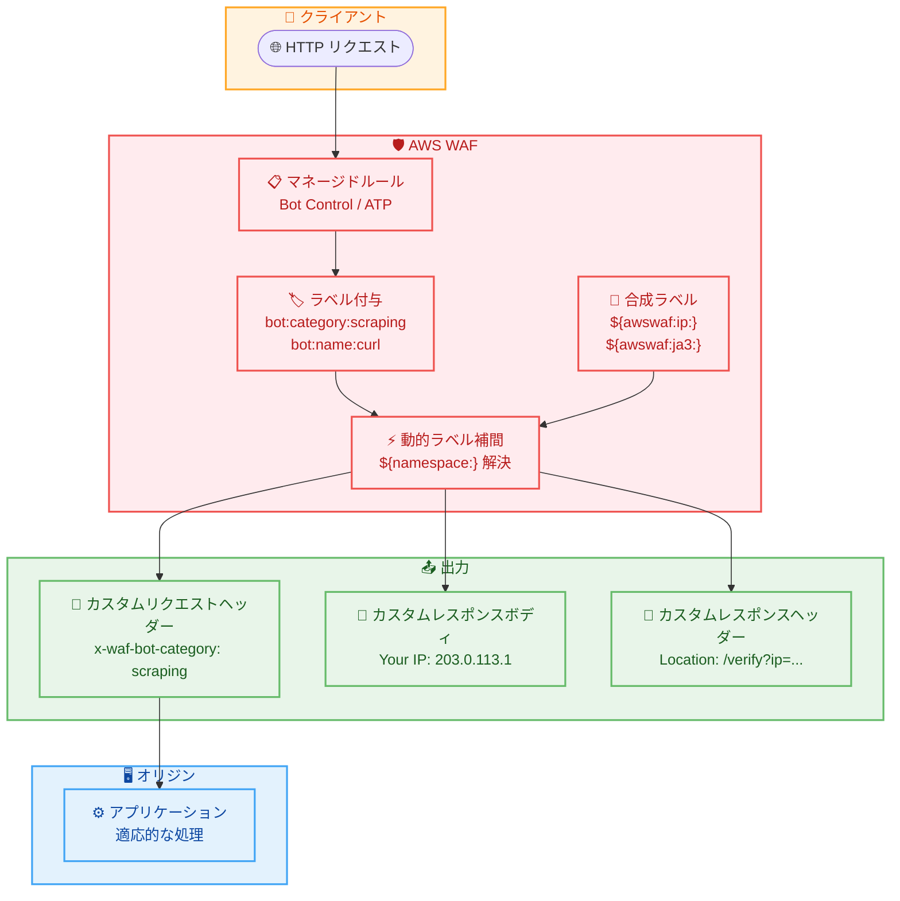

# AWS WAF - 動的ラベル補間 (Dynamic Label Interpolation)

**リリース日**: 2026年5月11日
**サービス**: AWS WAF
**機能**: Dynamic Label Interpolation (動的ラベル補間)

📊 [このアップデートのインフォグラフィックを見る](https://takech9203.github.io/aws-news-summary/20260511-aws-waf-dynamic-label-interpolation.html)

## 概要

AWS WAF に動的ラベル補間 (Dynamic Label Interpolation) 機能が追加された。この機能により、WAF の分類シグナルをオリジンに転送したり、レスポンスにコンテキスト情報を埋め込む作業を、単一のルールで実現できるようになった。従来はシグナル値ごとに個別のルールを作成・管理する必要があったが、`${namespace:}` 構文を使用することで、ラベル名前空間全体を一括で転送できる。

さらに、合成ラベル (Synthetic Labels) が導入され、クライアント IP アドレス、WAF リクエスト ID、JA3/JA4 フィンガープリントなど、リクエストコンテキストから解決される組み込み値をカスタムブロックページやチャレンジページに埋め込むことが可能になった。

**アップデート前の課題**

- シグナル値ごとに個別のルールを作成する必要があり、Bot Control のカテゴリ数だけルールが増加していた
- ラベル値をオリジンに転送するには、値ごとにハードコードされた静的な 1 対 1 マッピングが必要だった
- カスタムブロックページにリクエスト固有の情報 (IP、リクエスト ID) を含めることができなかった
- TLS フィンガープリントをアプリケーションに転送するには追加の仕組みが必要だった

**アップデート後の改善**

- `${namespace:}` 構文により、1 つのルールでラベル名前空間全体をヘッダーやレスポンスに動的展開できるようになった
- 新しいラベルが名前空間に追加されると、ヘッダーが自動的に適応する
- 合成ラベルにより、リクエストコンテキスト情報を直接埋め込み可能になった
- 追加の API フィールドや設定手順は不要で、既存の WAF 設定にそのまま適用できる

## アーキテクチャ図



WAF がリクエストを評価してラベルを付与した後、動的ラベル補間が `${namespace:}` 構文を解決し、合成ラベルと共にカスタムヘッダーやレスポンスボディに値を挿入するフローを示している。

## サービスアップデートの詳細

### 主要機能

1. **動的ラベル補間 `${namespace:}` 構文**
   - ラベル名前空間をインラインで解決する構文
   - カスタムリクエストヘッダー、レスポンスヘッダー、レスポンスボディで使用可能
   - 単一のラベルが一致する場合はその終端値に解決 (例: `scraping`)
   - 複数のラベルが一致する場合はカンマ区切りリストに解決 (例: `non_browser_user_agent,automated_browser`)
   - 一致なしの場合は空文字列に解決

2. **合成ラベル (Synthetic Labels)**
   - `${awswaf:ip:}` - クライアント IP アドレス
   - `${awswaf:request_id:}` - WAF リクエスト ID
   - `${awswaf:ja3:}` - JA3 TLS フィンガープリント
   - `${awswaf:ja4:}` - JA4 TLS フィンガープリント
   - リクエストコンテキストから自動的に解決される組み込み値

3. **広範な互換性**
   - AWS Managed Rules (Bot Control、ATP など) のラベルに対応
   - AWS Marketplace ルールグループのラベルに対応
   - ユーザー独自のカスタムラベルに対応
   - 名前空間に新しいラベルが追加されると自動的に適応

## 技術仕様

### 補間が機能するサーフェス

| サーフェス | 使用例 | 用途 |
|------|------|------|
| カスタムリクエストヘッダー | `"value": "${awswaf:managed:aws:bot-control:bot:category:}"` | オリジンへのラベル転送 |
| カスタムレスポンスボディ | `"Content": "Your IP: ${awswaf:ip:}"` | ブロック/チャレンジページへの値埋め込み |
| カスタムレスポンスヘッダー | `"Value": "/verify?ip=${awswaf:ip:}&rid=${awswaf:request_id:}"` | 動的リダイレクト |

### 解決動作

| 条件 | 動作 | 例 |
|------|------|------|
| 単一ラベル一致 | 終端値に解決 | `scraping` |
| 複数ラベル一致 | カンマ区切りリスト | `non_browser_user_agent,automated_browser` |
| 一致なし | 空文字列 | (空) |

### API 変更履歴

今回のアップデートでは新しい API フィールドは追加されていない。既存の `CustomRequestHandling`、`CustomResponse` の値フィールド内で `${namespace:}` 構文を使用する形式となっている。

## 設定方法

### 前提条件

1. AWS WAF の WebACL が設定済みであること
2. カスタムリクエストヘッダーまたはカスタムレスポンスが使用可能なルールアクションを持つルールが存在すること
3. ラベルを生成するルール (マネージドルール、カスタムルールなど) が WebACL 内で先に評価されること

### 手順

#### ステップ 1: ラベルを生成するルールの配置

Bot Control などのマネージドルールグループを WebACL に追加し、カウントモードで動作させてラベルを生成する。

```json
{
  "Name": "bot-control",
  "Priority": 100,
  "Statement": {
    "ManagedRuleGroupStatement": {
      "VendorName": "AWS",
      "Name": "AWSManagedRulesBotControlRuleSet",
      "ManagedRuleGroupConfigs": [
        {
          "AWSManagedRulesBotControlRuleSet": {
            "InspectionLevel": "TARGETED"
          }
        }
      ]
    }
  },
  "OverrideAction": { "Count": {} }
}
```

Bot Control V5 をターゲットモードでカウント動作に設定し、ラベルのみを生成するルールを追加する。

#### ステップ 2: 動的補間を使用するルールの作成

ラベル名前空間をリクエストヘッダーに転送するルールを作成する。

```json
{
  "Name": "app-signalling",
  "Priority": 500,
  "Statement": {
    "MatchAllStatement": {}
  },
  "Action": {
    "Allow": {
      "CustomRequestHandling": {
        "InsertHeaders": [
          {
            "Name": "x-waf-bot-category",
            "Value": "${awswaf:managed:aws:bot-control:bot:category:}"
          },
          {
            "Name": "x-waf-bot-name",
            "Value": "${awswaf:managed:aws:bot-control:bot:name:}"
          },
          {
            "Name": "x-waf-client-ip",
            "Value": "${awswaf:ip:}"
          },
          {
            "Name": "x-waf-fingerprint",
            "Value": "${awswaf:ja4:}"
          }
        ]
      }
    }
  }
}
```

全リクエストに対して、Bot Control のカテゴリ、ボット名、クライアント IP、JA4 フィンガープリントをヘッダーとしてオリジンに転送する。

#### ステップ 3: カスタムブロックページでの使用

ブロックレスポンスにリクエスト固有の情報を埋め込む。

```json
{
  "Name": "block-with-custom-page",
  "Priority": 300,
  "Statement": {
    "LabelMatchStatement": {
      "Scope": "LABEL",
      "Key": "awswaf:managed:aws:bot-control:bot:verified:false"
    }
  },
  "Action": {
    "Block": {
      "CustomResponse": {
        "ResponseCode": 403,
        "CustomResponseBodyKey": "block-page",
        "ResponseHeaders": [
          {
            "Name": "x-waf-request-id",
            "Value": "${awswaf:request_id:}"
          }
        ]
      }
    }
  }
}
```

未検証ボットをブロックする際に、WAF リクエスト ID をレスポンスヘッダーに含めることで、誤検知報告時の参照 ID として利用できる。

## メリット

### ビジネス面

- **運用コスト削減**: 数百のルールを 1 つに集約でき、ルールの作成・更新・テストの工数が大幅に削減される
- **追加費用なし**: 全 WAF リージョンで追加コストなしで利用可能
- **誤検知対応の効率化**: ブロックページにリクエスト ID を含めることで、ユーザーからの報告と WAF ログの照合が容易になる

### 技術面

- **ルール容量の節約**: 1 つのルールで名前空間全体をカバーするため、WebACL のルール容量を節約できる
- **自動適応**: 新しいラベルが追加されても設定変更不要で自動的に転送される
- **適応的セキュリティ**: TLS フィンガープリントやボット分類をアプリケーションに転送し、MFA 強制や段階的な対策を実装できる
- **API 変更不要**: 既存の設定フィールドに構文を記述するだけで利用でき、移行コストが低い

## デメリット・制約事項

### 制限事項

- 一致するラベルがない場合は空文字列に解決されるため、アプリケーション側での空値ハンドリングが必要
- 複数ラベル一致時のカンマ区切りリストのパースをアプリケーション側で実装する必要がある
- 合成ラベルは現時点で IP、リクエスト ID、JA3、JA4 の 4 種類に限定

### 考慮すべき点

- カスタムヘッダーに機密情報 (IP アドレスなど) を含める場合、CloudFront やオリジン間の通信が暗号化されていることを確認する必要がある
- JA3/JA4 フィンガープリントは WAF トークンが生成された後に利用可能になるため、Challenge ルールとの組み合わせが必要
- ラベル値がそのままヘッダーやレスポンスに挿入されるため、下流でのインジェクション対策を考慮すること

## ユースケース

### ユースケース 1: アプリケーションシグナリング

**シナリオ**: ボット分類に基づいてアプリケーション側で適応的な処理を行いたい (スクレイパーには CAPTCHA を表示、検索エンジンには許可)

**実装例**:
```json
{
  "InsertHeaders": [
    {
      "Name": "x-waf-bot-category",
      "Value": "${awswaf:managed:aws:bot-control:bot:category:}"
    },
    {
      "Name": "x-waf-bot-signals",
      "Value": "${awswaf:managed:aws:bot-control:signal:}"
    }
  ]
}
```

**効果**: 1 つのルールで全ボットカテゴリと検出シグナルをオリジンに転送し、アプリケーション側でカテゴリに応じた処理 (MFA 強制、レート制限、CAPTCHA 表示) を実装できる。

### ユースケース 2: カスタムブロックページ with 参照 ID

**シナリオ**: ブロックされたユーザーが誤検知を報告する際に、サポートチームが迅速に調査できるよう参照情報を提供したい

**実装例**:
```html
<html>
<body>
  <h1>Access Denied</h1>
  <p>Your request has been blocked.</p>
  <p>Reference ID: ${awswaf:request_id:}</p>
  <p>If you believe this is an error, please contact support with the Reference ID above.</p>
</body>
</html>
```

**効果**: ブロックページにリクエスト ID を自動埋め込みすることで、ユーザーがサポートに連絡する際の参照情報を提供でき、WAF ログとの照合が即座に可能になる。

### ユースケース 3: CloudFront キャッシュセグメンテーション

**シナリオ**: ボットカテゴリごとに異なるキャッシュエントリを保持し、スクレイパーには低品質のキャッシュコンテンツを返したい

**実装例**:
```json
{
  "InsertHeaders": [
    {
      "Name": "x-waf-bot-category",
      "Value": "${awswaf:managed:aws:bot-control:bot:category:}"
    }
  ]
}
```

CloudFront のキャッシュポリシーで `x-waf-bot-category` ヘッダーをキャッシュキーに含める設定を追加する。

**効果**: ボットカテゴリ別にキャッシュが分離され、正規ユーザーとスクレイパーに異なるコンテンツを提供できる。ルールの追加なしで新しいボットカテゴリにも自動対応する。

## 料金

動的ラベル補間は追加費用なしで利用可能。AWS WAF の既存料金体系が適用される。

### 料金例

| 項目 | 月額料金 (概算) |
|--------|------------------|
| WebACL | $5.00 |
| ルール (1 ルールあたり) | $1.00 |
| リクエスト (100 万リクエストあたり) | $0.60 |

動的ラベル補間により従来の数百ルールが 1 ルールに集約できるため、ルール課金の大幅な削減が期待できる。

## 利用可能リージョン

AWS WAF が利用可能な全リージョンで利用可能 (CloudFront グローバルスコープを含む)。

## 関連サービス・機能

- **AWS WAF Bot Control**: ボットカテゴリ、シグナル強度、ボット名などのラベルを生成するマネージドルール
- **AWS WAF Account Takeover Prevention**: クレデンシャルスタッフィング検出のラベルを生成
- **Amazon CloudFront**: WAF と統合し、カスタムヘッダーによるキャッシュセグメンテーションが可能
- **AWS WAF カスタムレスポンス**: ブロックページやチャレンジページのカスタマイズ機能

## 参考リンク

- 📊 [インフォグラフィック](https://takech9203.github.io/aws-news-summary/20260511-aws-waf-dynamic-label-interpolation.html)
- [公式発表 (What's New)](https://aws.amazon.com/about-aws/whats-new/2026/05/aws-waf-dynamic-label-interpolation/)
- [AWS WAF Developer Guide - Dynamic label interpolation](https://docs.aws.amazon.com/waf/latest/developerguide/dynamic-label-interpolation.html)
- [GitHub サンプル](https://github.com/aws-samples/sample-aws-waf-dynamic-labels)
- [AWS WAF 料金ページ](https://aws.amazon.com/waf/pricing/)

## まとめ

AWS WAF の動的ラベル補間は、セキュリティエンジニアのルール管理を劇的に簡素化する機能である。従来は数百のルールで個別にマッピングしていたラベル転送を単一ルールで実現でき、合成ラベルによりリクエストコンテキスト情報もブロックページやヘッダーに直接埋め込める。追加費用なし、API 変更なしで即座に利用開始できるため、WAF を運用している全ての環境で導入を検討すべきアップデートである。
