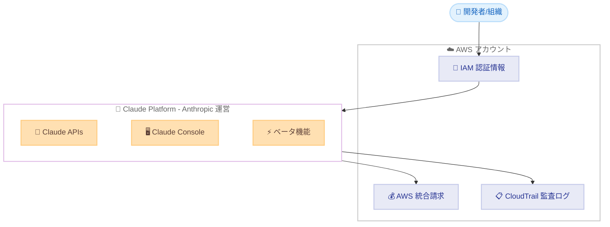

# Claude Platform on AWS - 一般提供開始

**リリース日**: 2026 年 5 月 11 日
**サービス**: Claude Platform on AWS
**機能**: Anthropic のネイティブ Claude Platform エクスペリエンスへの AWS アカウント経由のアクセス

:bar_chart: [このアップデートのインフォグラフィックを見る](https://takech9203.github.io/aws-news-summary/20260511-claude-platform-aws.html)

## 概要

AWS は、Claude Platform on AWS の一般提供 (GA) を発表した。これは、既存の AWS アカウントを通じて Anthropic のネイティブ Claude Platform エクスペリエンスに直接アクセスできる新しいサービスである。AWS は、ネイティブ Claude Platform エクスペリエンスへのアクセスを提供する最初のクラウドプロバイダーとなった。

Claude Platform on AWS は Anthropic によって運営され、顧客データは AWS セキュリティ境界の外部で処理される。開発チームやエンタープライズ向けに設計されており、Anthropic のネイティブ Claude Platform 開発エクスペリエンスへのアクセスを希望し、特定のリージョンデータレジデンシー要件がない組織に最適である。

**アップデート前の課題**

- Anthropic の Claude Platform を利用するには、Anthropic への個別アカウント登録が必要であり、AWS とは別の請求管理が発生していた
- AWS の IAM 認証情報やアクセス制御を Claude Platform に適用できず、セキュリティポリシーの統一管理が困難だった
- Claude Platform の利用状況を AWS CloudTrail で監査できず、ガバナンスの一貫性が確保しにくかった

**アップデート後の改善**

- 既存の AWS アカウントから Anthropic のネイティブ Claude Platform に直接アクセスが可能になった
- 別途アカウント登録、請求管理、トラッキングが不要になり、運用負荷が大幅に軽減された
- IAM 認証情報、AWS 統合請求、CloudTrail 監査ログによるセキュリティ可視性が確保された

## アーキテクチャ図



AWS アカウントの認証情報を使用して Claude Platform にアクセスし、請求と監査ログは AWS 側で統合管理される構成を示している。Claude Platform 自体は Anthropic によって運営され、データ処理は AWS セキュリティ境界の外部で行われる。

## サービスアップデートの詳細

### 主要機能

1. **Claude Managed Agents (ベータ)**
   - AI エージェントを構築・管理するためのマネージド環境
   - 複雑なタスクの自律的な実行を支援

2. **Advisor Strategy (ベータ)**
   - AI アドバイザー戦略の構築と最適化
   - ユースケースに応じたカスタマイズが可能

3. **Web Search / Web Fetch**
   - Claude がリアルタイムで Web 情報を検索・取得
   - 最新情報に基づく回答生成を実現

4. **Code Execution**
   - Claude がコードを実行して結果を返す機能
   - データ分析や計算タスクに対応

5. **Files API (ベータ)**
   - ファイルのアップロードと処理
   - ドキュメント分析や大容量データの処理に対応

6. **Skills (ベータ)**
   - カスタムスキルの定義と実行
   - 特定のドメインタスクへの対応力を強化

7. **MCP Connector (ベータ)**
   - Model Context Protocol によるツール連携
   - 外部システムやデータソースとの統合

8. **Prompt Caching**
   - プロンプトのキャッシュによるレイテンシとコスト削減
   - 繰り返し利用するプロンプトの効率化

9. **Citations**
   - 回答の根拠となるソースの引用機能
   - 情報の信頼性と透明性の向上

10. **Batch Processing**
    - 大量リクエストの一括処理
    - コスト効率の高いバッチ実行

11. **Claude Console**
    - プロンプトの開発と評価のためのコンソール
    - 対話的なプロンプトエンジニアリング環境

## 技術仕様

### セキュリティとガバナンス

| 項目 | 詳細 |
|------|------|
| 認証 | 既存の IAM 認証情報を使用 |
| アクセス制御 | IAM ポリシーによる制御 |
| 請求 | AWS 統合請求に統合 |
| 監査 | CloudTrail による API アクティビティログ |
| データ処理 | AWS セキュリティ境界の外部で Anthropic が処理 |
| 運営主体 | Anthropic |

### データレジデンシーに関する注意事項

| 項目 | 詳細 |
|------|------|
| データ処理場所 | AWS セキュリティ境界外 |
| 適合対象 | リージョンデータレジデンシー要件がない組織 |
| 不適合対象 | 特定地域へのデータレジデンシーが必須の場合 |

## 設定方法

### 前提条件

1. 有効な AWS アカウント
2. 適切な IAM 権限の設定
3. Claude Platform on AWS へのアクセス有効化

### 手順

#### ステップ 1: AWS マネジメントコンソールからアクセス

```bash
# AWS CLI で Claude Platform on AWS のサービスエンドポイントを確認
aws claude-platform describe-service --region us-east-1
```

既存の AWS アカウントで Claude Platform on AWS サービスにアクセスする。別途 Anthropic アカウントの作成は不要である。

#### ステップ 2: IAM ポリシーの設定

```json
{
  "Version": "2012-10-17",
  "Statement": [
    {
      "Effect": "Allow",
      "Action": [
        "claude-platform:*"
      ],
      "Resource": "*"
    }
  ]
}
```

利用者に対して Claude Platform on AWS への適切なアクセス権限を付与する IAM ポリシーを作成する。

#### ステップ 3: Claude Console でプロンプト開発を開始

Claude Console にアクセスし、API キーの発行やプロンプトの開発・評価を開始する。すべてのアクセスは IAM 認証情報で管理され、利用料金は AWS 請求に統合される。

## メリット

### ビジネス面

- **運用コスト削減**: 別途アカウント管理や請求管理が不要になり、管理工数が削減される
- **ガバナンス統合**: 既存の AWS セキュリティポリシーとコンプライアンスフレームワークの活用が可能
- **迅速な導入**: AWS アカウントがあれば即座に利用開始でき、調達プロセスの簡素化が実現

### 技術面

- **シームレスな認証統合**: IAM 認証情報をそのまま利用でき、追加の認証基盤構築が不要
- **最新機能へのアクセス**: Anthropic のベータ機能を含む最新の Claude Platform 機能をいち早く利用可能
- **監査の一元管理**: CloudTrail による API 呼び出しの可視化で、セキュリティ監査を統一的に実施

## デメリット・制約事項

### 制限事項

- データは AWS セキュリティ境界の外部で処理されるため、AWS のデータ保護メカニズムの適用範囲外となる
- 特定のリージョンデータレジデンシー要件がある場合は利用に適さない
- Anthropic によって運営されるため、AWS のサービスレベルアグリーメントとは異なるガバナンスモデルとなる

### 考慮すべき点

- 厳格なデータ主権要件がある規制産業では、Amazon Bedrock 経由の Claude 利用の方が適切な場合がある
- ベータ機能は変更または中止される可能性があり、本番ワークロードでの利用には注意が必要

## ユースケース

### ユースケース 1: スタートアップの迅速な AI 開発

**シナリオ**: AI プロダクトを開発するスタートアップが、既存の AWS インフラを活用しつつ、Anthropic の最新機能にアクセスしたい

**実装例**:
```python
# Claude Platform on AWS API を利用
# 既存の AWS 認証情報で自動認証
import anthropic

client = anthropic.Client()

# Managed Agents (ベータ) でタスク自動化
response = client.agents.create(
    name="research-agent",
    tools=["web_search", "code_execution"],
    instructions="ユーザーの質問に対してリサーチを行い回答する"
)
```

**効果**: 個別のアカウント管理なしに最新の Claude 機能を即座に活用し、プロダクト開発を加速

### ユースケース 2: エンタープライズのガバナンス統合

**シナリオ**: 大企業の IT 部門が、全社的な AI 利用を AWS の既存ガバナンスフレームワーク内で管理したい

**実装例**:
```json
{
  "Version": "2012-10-17",
  "Statement": [
    {
      "Effect": "Allow",
      "Action": ["claude-platform:InvokeModel"],
      "Resource": "*",
      "Condition": {
        "StringEquals": {
          "aws:PrincipalOrgID": "o-example123"
        }
      }
    }
  ]
}
```

**効果**: IAM ポリシーと Organizations による統一的なアクセス管理で、シャドー AI の防止とコスト可視化を実現

### ユースケース 3: 開発チームのプロンプトエンジニアリング

**シナリオ**: 複数チームが Claude Console を使用してプロンプトを開発・評価し、チーム間でベストプラクティスを共有したい

**実装例**:
```bash
# Claude Console でプロンプトを開発・評価
# バッチ処理で大規模テスト実行
aws claude-platform create-batch-job \
  --input-file s3://my-bucket/test-prompts.jsonl \
  --model claude-opus-4-6 \
  --output-file s3://my-bucket/results.jsonl
```

**効果**: Claude Console による対話的なプロンプト開発と、バッチ処理による体系的な評価で、AI アプリケーションの品質向上

## 料金

Claude Platform on AWS の利用料金は AWS 統合請求に統合される。具体的な料金体系は Anthropic のモデル利用料金に準じ、API 呼び出し量やトークン使用量に基づいて課金される。詳細な料金情報は公式ドキュメントを参照のこと。

## 利用可能リージョン

以下の 18 以上のリージョンで利用可能。

| 地域 | リージョン |
|------|-----------|
| 北米 | US East (N. Virginia)、US East (Ohio)、US West (Oregon)、Canada (Central) |
| 南米 | South America (Sao Paulo) |
| 欧州 | Europe (Dublin、London、Frankfurt、Milan、Zurich、Paris、Stockholm) |
| アジア太平洋 | Asia Pacific (Tokyo、Seoul、Melbourne、Jakarta、Sydney) |

東京リージョンを含むグローバルな展開により、日本のユーザーも低レイテンシでサービスにアクセスできる。

## 関連サービス・機能

- **Amazon Bedrock**: AWS セキュリティ境界内で Claude モデルを利用する場合の代替選択肢。データレジデンシー要件がある場合に適している
- **AWS IAM**: Claude Platform on AWS へのアクセス制御の基盤。既存のポリシーとロールをそのまま活用可能
- **AWS CloudTrail**: Claude Platform on AWS の API 呼び出しを記録し、セキュリティ監査とコンプライアンスに活用
- **AWS Billing and Cost Management**: Claude Platform on AWS の利用料金を他の AWS サービスと統合管理

## 参考リンク

- :bar_chart: [インフォグラフィック](https://takech9203.github.io/aws-news-summary/20260511-claude-platform-aws.html)
- [公式発表 (What's New)](https://aws.amazon.com/about-aws/whats-new/2026/05/claude-platform-aws/)

## まとめ

Claude Platform on AWS の GA により、AWS ユーザーは既存のアカウントとセキュリティ基盤を活用しながら、Anthropic のネイティブ Claude Platform の全機能にアクセスできるようになった。IAM 統合、統合請求、CloudTrail 監査により、エンタープライズレベルのガバナンスを維持したまま AI 開発を加速できる。データレジデンシー要件がない組織は、Amazon Bedrock と Claude Platform on AWS のどちらが要件に適しているかを評価し、適切なアクセス方法を選択することが推奨される。
