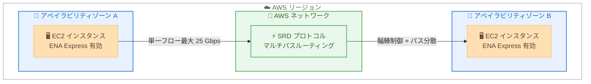

# ENA Express - アベイラビリティゾーン間トラフィックのサポート

**リリース日**: 2026 年 5 月 11 日
**サービス**: Amazon EC2
**機能**: ENA Express cross-AZ support (Availability Zone 間通信)

[このアップデートのインフォグラフィックを見る](https://takech9203.github.io/aws-news-summary/20260511-ena-express-availability-zones.html)

## 概要

Elastic Network Adapter (ENA) Express が、同一リージョン内の異なるアベイラビリティゾーン (AZ) 間の EC2 インスタンストラフィックをサポートするようになった。これにより、AZ 間の単一フロー帯域幅が従来の ENA の最大 5 Gbps から最大 25 Gbps へと 5 倍に向上する。ENA Express は AWS Scalable Reliable Datagram (SRD) プロトコルを活用し、高度な輻輳制御とマルチパスルーティングにより、アプリケーションに透過的にネットワークパフォーマンスを改善する。

この機能は追加コストなしで利用でき、TCP および UDP プロトコルの両方に対応している。分散ストレージ、データベース、ファイルシステムなど、高可用性のために複数の AZ にまたがるワークロードに特に有効である。

**アップデート前の課題**

- AZ 間の単一フロー帯域幅は ENA で最大 5 Gbps に制限されていた
- マルチ AZ 構成の分散システムでは、AZ 間の帯域幅がボトルネックとなることがあった
- ENA Express は同一 AZ 内の通信のみをサポートしており、AZ 間通信では SRD の恩恵を受けられなかった
- 高帯域幅を必要とする AZ 間レプリケーションでは複数の並列接続を管理する必要があった

**アップデート後の改善**

- AZ 間の単一フロー帯域幅が最大 25 Gbps に向上 (5 倍の改善)
- SRD のマルチパスルーティングにより、AZ 間トラフィックの信頼性が向上
- パケットの順序到着を必要としないため、ヘッドオブラインブロッキングを回避
- アプリケーション側の変更は不要で、ENA Express を有効化するだけで利用可能

## アーキテクチャ図



ENA Express を有効にした 2 つの EC2 インスタンスが異なる AZ に配置されている場合、SRD プロトコルがマルチパスルーティングと輻輳制御を透過的に適用し、最大 25 Gbps の単一フロー帯域幅を実現する。

## サービスアップデートの詳細

### 主要機能

1. **AZ 間 SRD 通信の確立**
   - 送信側と受信側の両方で ENA Express が有効であることを自動検出
   - 互換性が確認されると SRD 接続を自動的に確立
   - 互換性がない場合は標準の ENA 伝送にフォールバック

2. **マルチパスルーティング**
   - SRD がトラフィックを複数のネットワークパスに分散
   - パケットの到着順序を保証する必要がないため、ヘッドオブラインブロッキングを回避
   - 輻輳を検知すると動的にパスを変更

3. **TCP/UDP 両プロトコル対応**
   - TCP トラフィックはデフォルトで ENA Express を利用可能
   - UDP トラフィックは明示的に有効化が必要 (EnaSrdUdpEnabled)
   - アプリケーション層への変更は不要

4. **パケット再送とリオーダリングのオフロード**
   - ネットワーク層でパケットの再順序付けを処理
   - 必要な再送の大部分をネットワーク層で直接処理
   - アプリケーション層のリソースを他の処理に解放

## 技術仕様

### パフォーマンス比較

| 項目 | 標準 ENA | ENA Express (AZ 間) |
|------|----------|---------------------|
| 最大単一フロー帯域幅 | 5 Gbps | 25 Gbps |
| プロトコル | TCP/UDP | SRD (TCP/UDP 上で動作) |
| マルチパス | なし | あり |
| 輻輳制御 | 標準 | 高度な SRD 輻輳制御 |
| パケットリオーダリング | アプリケーション層 | ネットワーク層 |

### 要件

| 項目 | 詳細 |
|------|------|
| 送信側インスタンス | ENA Express 対応インスタンスタイプ、ENA Express 有効化済み |
| 受信側インスタンス | ENA Express 対応インスタンスタイプ、ENA Express 有効化済み |
| ネットワークパス | ミドルウェアボックスを含まないこと |
| Linux ドライバーバージョン | 2.2.9 以上 (フル帯域幅)、2.8 以上 (メトリクス) |
| 通信範囲 | 同一リージョン内の異なる AZ 間 |

### 対応インスタンスタイプ (一部)

| カテゴリ | インスタンスファミリー |
|----------|----------------------|
| 汎用 | m6a, m6i, m6id, m6idn, m6in, m7a, m7g, m7gd, m7i |
| コンピューティング最適化 | c6a, c6i, c6id, c6in, c7a, c7g, c7gd, c7i |
| メモリ最適化 | r6a, r6i, r6id, r6idn, r6in, r7a, r7g, r7gd, r7i |
| ストレージ最適化 | i4i, im4gn, is4gen |
| 高速コンピューティング | p4d, p5, trn1 |

**注意**: すべてのサイズが対象ではなく、一般的に 8xlarge 以上のサイズで対応。詳細は [EC2 ドキュメント](https://docs.aws.amazon.com/AWSEC2/latest/UserGuide/ena-express.html) を参照。

### API 変更履歴

今回のアップデートに関連する新規 API 変更は確認されていない。ENA Express の設定には既存の API を使用する。

## 設定方法

### 前提条件

1. ENA Express 対応のインスタンスタイプを使用していること
2. Linux インスタンスの場合、ENA ドライバーバージョン 2.2.9 以上がインストールされていること
3. 送信側と受信側の両方のインスタンスで ENA Express を有効化する必要がある

### 手順

#### ステップ 1: インスタンスのネットワークインターフェースの確認

```bash
aws ec2 describe-instances \
  --instance-ids i-1234567890abcdef0 \
  --query "Reservations[].Instances[].NetworkInterfaces[].Attachment.{AttachmentId:AttachmentId,EnaSrdEnabled:EnaSrdSpecification.EnaSrdEnabled}"
```

対象インスタンスのネットワークインターフェースアタッチメント ID と現在の ENA Express 設定状態を確認する。

#### ステップ 2: ENA Express の有効化 (TCP)

```bash
aws ec2 modify-network-interface-attribute \
  --network-interface-id eni-1234567890abcdef0 \
  --ena-srd-specification "EnaSrdEnabled=true"
```

ネットワークインターフェースの ENA Express (SRD) を有効化する。これにより TCP トラフィックで ENA Express が利用可能になる。

#### ステップ 3: UDP トラフィックでの ENA Express 有効化 (オプション)

```bash
aws ec2 modify-network-interface-attribute \
  --network-interface-id eni-1234567890abcdef0 \
  --ena-srd-specification "EnaSrdEnabled=true,EnaSrdUdpSpecification={EnaSrdUdpEnabled=true}"
```

UDP トラフィックでも ENA Express を利用する場合は、EnaSrdUdpEnabled を明示的に有効化する。送信側と受信側の両方で UDP 設定を有効にする必要がある。

#### ステップ 4: 受信側インスタンスでも同様に設定

```bash
aws ec2 modify-network-interface-attribute \
  --network-interface-id eni-0987654321fedcba0 \
  --ena-srd-specification "EnaSrdEnabled=true,EnaSrdUdpSpecification={EnaSrdUdpEnabled=true}"
```

受信側インスタンスのネットワークインターフェースにも同じ設定を適用する。送信側と受信側の両方で有効化されていない場合、標準の ENA 伝送にフォールバックする。

#### ステップ 5: ENA Express メトリクスの確認

```bash
aws ec2 describe-instances \
  --instance-ids i-1234567890abcdef0 \
  --query "Reservations[].Instances[].NetworkInterfaces[].Attachment.EnaSrdSpecification"
```

設定が正しく適用されたことを確認する。また、CloudWatch で ENA Express メトリクスを監視し、SRD 接続が確立されていることを確認する。

## メリット

### ビジネス面

- **高可用性設計の帯域幅制約解消**: マルチ AZ 構成で高帯域幅を必要とするワークロードの制約が解消され、設計の自由度が向上
- **追加コストなし**: ENA Express の AZ 間サポートは無料で利用可能 (通常の AZ 間データ転送料金のみ)
- **運用の簡素化**: 複数の並列接続を管理する代わりに、単一フローで高帯域幅を実現できるためアプリケーション設計が簡素化

### 技術面

- **5 倍の帯域幅向上**: 単一フロー 5 Gbps から 25 Gbps への大幅な改善
- **ネットワーク輻輳の自動回避**: SRD のマルチパスルーティングが混雑パスを検知して動的にルート変更
- **アプリケーション透過**: TCP/UDP プロトコルレベルで透過的に動作するため、アプリケーションコードの変更が不要
- **パケット処理のオフロード**: パケットのリオーダリングや再送をネットワーク層で処理し、CPU リソースを解放

## デメリット・制約事項

### 制限事項

- 送信側と受信側の両方で ENA Express が有効化されている必要がある (一方のみでは標準 ENA にフォールバック)
- ミドルウェアボックス (ネットワークアプライアンスなど) を経由するパスではサポートされない
- Local Zone でのトラフィックには使用できない
- 南米 (サンパウロ)、中東 (バーレーン)、中東 (UAE) リージョンでは AZ 間 ENA Express が利用不可
- 対応インスタンスタイプは一般的に 8xlarge 以上のサイズに限定される
- 単一フロー帯域幅はインスタンスの集約帯域幅上限にも制限される (例: 12.5 Gbps 対応インスタンスでは最大 12.5 Gbps)

### 考慮すべき点

- 軽負荷時に中央値パケットレイテンシーがわずかに増加する可能性がある (数十マイクロ秒)
- パケット毎秒 (PPS) の要件が高く、非輻輳時のレイテンシー最適化を優先する場合は、Enhanced Networking の方が適切な場合がある
- Linux ドライバーのバージョン確認が必要 (フル帯域幅: 2.2.9 以上、メトリクス: 2.8 以上)
- UDP トラフィックは明示的に有効化が必要であり、送信/受信の設定が不一致の場合は標準 ENA にフォールバックする

## ユースケース

### ユースケース 1: マルチ AZ 分散データベースのレプリケーション

**シナリオ**: Amazon Aurora や自己管理の分散データベースが複数の AZ にまたがって同期レプリケーションを実行している。大規模なトランザクションやバルク書き込み時に、AZ 間の 5 Gbps 制限がレプリケーションラグの原因となっていた。

**実装例**:
```bash
# プライマリ DB インスタンス (AZ-a) で ENA Express を有効化
aws ec2 modify-network-interface-attribute \
  --network-interface-id eni-primary-db \
  --ena-srd-specification "EnaSrdEnabled=true"

# レプリカ DB インスタンス (AZ-b) で ENA Express を有効化
aws ec2 modify-network-interface-attribute \
  --network-interface-id eni-replica-db \
  --ena-srd-specification "EnaSrdEnabled=true"
```

**効果**: レプリケーション帯域幅が最大 5 倍に向上し、大規模トランザクション時のレプリケーションラグが大幅に減少。RPO (Recovery Point Objective) の改善にも寄与する。

### ユースケース 2: マルチ AZ 分散ファイルシステム

**シナリオ**: 複数の AZ に分散配置された GlusterFS や Lustre ベースのファイルシステムクラスターで、大容量ファイルのストライピングやミラーリング時に AZ 間帯域幅がボトルネックになっていた。

**実装例**:
```bash
# ストレージノード群の全ネットワークインターフェースで ENA Express を有効化
for eni in eni-storage-node-1 eni-storage-node-2 eni-storage-node-3; do
  aws ec2 modify-network-interface-attribute \
    --network-interface-id $eni \
    --ena-srd-specification "EnaSrdEnabled=true"
done
```

**効果**: AZ 間のデータストライピング速度が向上し、ファイルシステム全体のスループットが改善。マルチ AZ 構成でも単一 AZ に近いパフォーマンスを実現する。

### ユースケース 3: 災害復旧のためのリアルタイムデータ同期

**シナリオ**: ミッションクリティカルなアプリケーションが AZ-a をプライマリ、AZ-b をスタンバイとして DR 構成を組んでいる。大量のデータ変更を低レイテンシーで同期する必要がある。

**実装例**:
```bash
# DR 構成の両サイドで ENA Express と UDP を有効化
aws ec2 modify-network-interface-attribute \
  --network-interface-id eni-primary-app \
  --ena-srd-specification "EnaSrdEnabled=true,EnaSrdUdpSpecification={EnaSrdUdpEnabled=true}"

aws ec2 modify-network-interface-attribute \
  --network-interface-id eni-standby-app \
  --ena-srd-specification "EnaSrdEnabled=true,EnaSrdUdpSpecification={EnaSrdUdpEnabled=true}"
```

**効果**: DR サイトへの同期帯域幅が向上し、RPO を短縮。SRD のマルチパスルーティングによりネットワーク障害時のフェイルオーバーも迅速化する。

## 料金

ENA Express の AZ 間サポートには追加料金は発生しない。

| 項目 | 料金 |
|------|------|
| ENA Express 機能利用料 | 無料 |
| AZ 間データ転送料金 | 通常の AZ 間データ転送料金が適用 ($0.01/GB 程度、リージョンにより異なる) |

**注意**: ENA Express 自体は無料だが、AZ 間のデータ転送には通常の AWS データ転送料金が適用される。帯域幅の向上により転送量が増加した場合、データ転送コストが増加する可能性がある。

## 利用可能リージョン

以下のリージョンで AZ 間 ENA Express が利用可能。

- **アフリカ**: ケープタウン
- **アジアパシフィック**: 香港、ハイデラバード、ジャカルタ、マレーシア、メルボルン、ムンバイ、ニュージーランド、大阪、ソウル、シンガポール、シドニー、台北、タイ、東京
- **カナダ**: セントラル、カルガリー
- **ヨーロッパ**: フランクフルト、アイルランド、ロンドン、ミラノ、パリ、スペイン、ストックホルム、チューリッヒ
- **イスラエル**: テルアビブ
- **メキシコ**: セントラル
- **米国東部**: バージニア北部、オハイオ
- **米国西部**: 北カリフォルニア、オレゴン
- **AWS GovCloud**: US

**未対応リージョン**: 南米 (サンパウロ)、中東 (バーレーン)、中東 (UAE)

## 関連サービス・機能

- **Amazon EBS io2 Block Express**: 同じ SRD プロトコルを活用してストレージ I/O パフォーマンスを実現
- **Elastic Fabric Adapter (EFA)**: HPC および ML ワークロード向けに SRD を活用した高性能ネットワーキング
- **Enhanced Networking (ENA)**: ENA Express のベースとなる基本的な拡張ネットワーキング機能
- **AWS Scalable Reliable Datagram (SRD)**: ENA Express、EBS io2 Block Express、EFA の基盤となるネットワークトランスポートプロトコル
- **Amazon EC2 Placement Groups**: 同一 AZ 内の低レイテンシー通信に最適化されたインスタンス配置

## 参考リンク

- [インフォグラフィック](https://takech9203.github.io/aws-news-summary/20260511-ena-express-availability-zones.html)
- [公式発表 (What's New)](https://aws.amazon.com/about-aws/whats-new/2026/05/ena-express-availability-zones/)
- [ENA Express ドキュメント](https://docs.aws.amazon.com/AWSEC2/latest/UserGuide/ena-express.html)
- [ENA Express 対応インスタンスタイプ一覧](https://docs.aws.amazon.com/AWSEC2/latest/UserGuide/ena-express.html#ena-express-supported-instance-types)
- [EC2 料金ページ](https://aws.amazon.com/ec2/pricing/)
- [AWS データ転送料金](https://aws.amazon.com/ec2/pricing/on-demand/#Data_Transfer)

## まとめ

ENA Express の AZ 間サポートは、マルチ AZ 構成のワークロードにおける帯域幅制約を大幅に解消する重要なアップデートである。追加コストなしで単一フロー帯域幅が 5 倍 (最大 25 Gbps) に向上するため、分散データベース、ストレージシステム、DR 構成など、AZ 間で大量のデータ同期を行うシステムにおいて早期の有効化を推奨する。送信側と受信側の両方で設定が必要であることに留意し、既存のマルチ AZ ワークロードのネットワークインターフェースで ENA Express を有効化することを検討すべきである。
