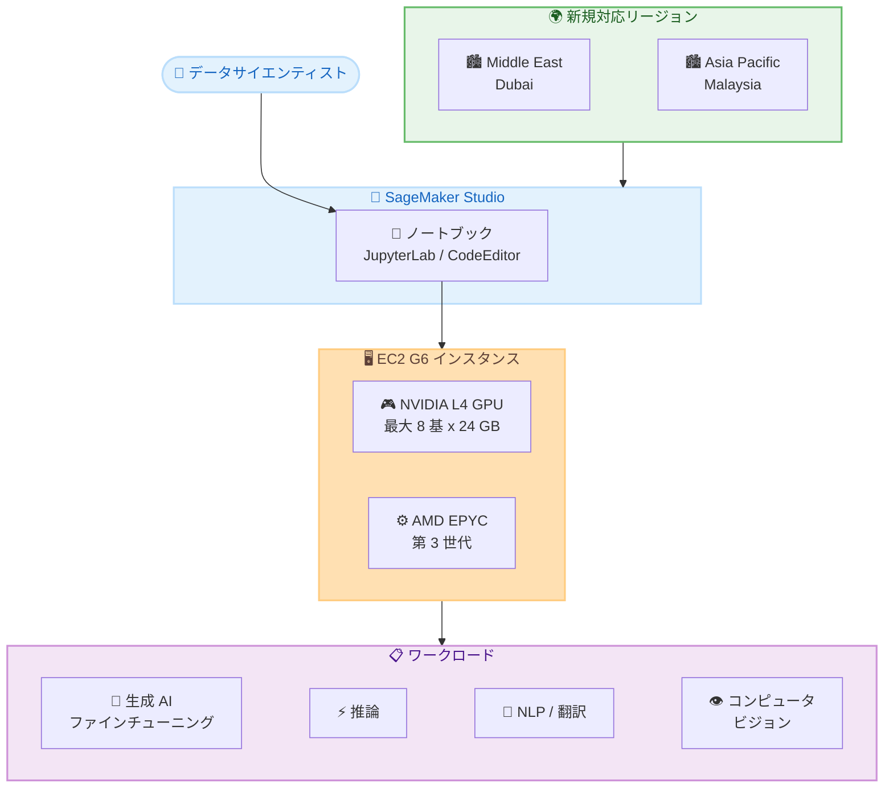

# Amazon SageMaker Studio - G6 インスタンスのリージョン拡大

**リリース日**: 2026年5月11日
**サービス**: Amazon SageMaker Studio
**機能**: G6 インスタンス (NVIDIA L4 GPU) の Middle East (Dubai) および Asia Pacific (Malaysia) リージョン対応

📊 [このアップデートのインフォグラフィックを見る](https://takech9203.github.io/aws-news-summary/20260511-g6-region-expansion-sagemaker-studio-notebooks.html)

## 概要

Amazon EC2 G6 インスタンスが SageMaker Studio ノートブックにおいて、Middle East (Dubai) および Asia Pacific (Malaysia) リージョンで一般利用可能 (GA) になった。G6 インスタンスは最大 8 基の NVIDIA L4 Tensor Core GPU (各 GPU あたり 24 GB メモリ) と第 3 世代 AMD EPYC プロセッサを搭載し、EC2 G4dn インスタンスと比較して深層学習推論で 2 倍のパフォーマンスを提供する。

このアップデートにより、中東および東南アジア地域のユーザーが SageMaker Studio のインタラクティブな環境で GPU アクセラレーテッドコンピューティングを活用し、生成 AI のファインチューニングや推論、自然言語処理、コンピュータビジョンなどのワークロードをローカルリージョンで実行できるようになった。

**アップデート前の課題**

- Middle East (Dubai) および Asia Pacific (Malaysia) リージョンでは SageMaker Studio ノートブックで G6 インスタンスが利用できなかった
- これらのリージョンのユーザーは GPU を活用した ML ワークロードのために他のリージョンを使用する必要があり、レイテンシーやデータ主権の観点で課題があった
- ローカルリージョンでの生成 AI モデルのインタラクティブな開発・テストが制限されていた

**アップデート後の改善**

- Middle East (Dubai) および Asia Pacific (Malaysia) で G6 インスタンスを SageMaker Studio ノートブックから直接利用可能になった
- NVIDIA L4 GPU を活用した深層学習推論のインタラクティブなテストがローカルリージョンで実行可能になった
- データのローカリティを維持しながら、生成 AI のファインチューニングや推論ワークロードを実行できるようになった

## アーキテクチャ図



SageMaker Studio ノートブックから G6 インスタンスを起動し、NVIDIA L4 GPU を活用して各種 ML ワークロードを新規リージョンで実行する構成を示す。

## サービスアップデートの詳細

### 主要機能

1. **G6 インスタンスのリージョン拡大**
   - Middle East (Dubai) リージョンでの一般利用可能
   - Asia Pacific (Malaysia) リージョンでの一般利用可能
   - SageMaker Studio ノートブック (JupyterLab および CodeEditor) からアクセス可能

2. **NVIDIA L4 Tensor Core GPU**
   - 最大 8 基の NVIDIA L4 GPU を搭載
   - GPU あたり 24 GB のメモリ
   - Ada Lovelace アーキテクチャベース
   - FP8、INT8、FP32、TF32 など多様な精度をサポート

3. **高性能プロセッサ**
   - 第 3 世代 AMD EPYC プロセッサを搭載
   - EC2 G4dn と比較して深層学習推論で 2 倍のパフォーマンス向上

## 技術仕様

### G6 インスタンスファミリー

| 項目 | 詳細 |
|------|------|
| GPU | NVIDIA L4 Tensor Core (最大 8 基) |
| GPU メモリ | 24 GB / GPU |
| CPU | 第 3 世代 AMD EPYC |
| GPU アーキテクチャ | Ada Lovelace |
| 推論パフォーマンス | G4dn 比 2 倍 |
| 対応アプリケーション | JupyterLab、CodeEditor |

### G6 インスタンスサイズ (参考)

| インスタンスサイズ | GPU 数 | GPU メモリ | vCPU | メモリ |
|-------------------|--------|-----------|------|--------|
| g6.xlarge | 1 | 24 GB | 4 | 16 GB |
| g6.2xlarge | 1 | 24 GB | 8 | 32 GB |
| g6.4xlarge | 1 | 24 GB | 16 | 64 GB |
| g6.8xlarge | 1 | 24 GB | 32 | 128 GB |
| g6.12xlarge | 4 | 96 GB | 48 | 192 GB |
| g6.16xlarge | 1 | 24 GB | 64 | 256 GB |
| g6.24xlarge | 4 | 96 GB | 96 | 384 GB |
| g6.48xlarge | 8 | 192 GB | 192 | 768 GB |

### API 変更履歴

今回のリージョン拡大に直接関連する API 変更は確認されなかった。ただし、SageMaker 関連で以下の API 更新があった。

| 日付 | サービス | 変更内容 |
|------|----------|----------|
| 2026/05/06 | [Amazon SageMaker Service](https://awsapichanges.com/archive/changes/7068f3-api.sagemaker.html) | 3 updated methods - HyperPod の ImageVersionStatus フィールド追加 |

## 設定方法

### 前提条件

1. Middle East (Dubai) または Asia Pacific (Malaysia) リージョンで有効な AWS アカウント
2. SageMaker Studio ドメインおよびユーザープロファイルの設定
3. G6 インスタンスタイプに対する適切なサービスクォータ

### 手順

#### ステップ 1: SageMaker Studio へのアクセス

```bash
# AWS CLI で SageMaker Studio ドメインを確認
aws sagemaker list-domains --region me-south-1
```

対象リージョン (me-south-1: Dubai、ap-southeast-5: Malaysia) で SageMaker Studio ドメインが設定されていることを確認する。

#### ステップ 2: JupyterLab アプリケーションの起動

```bash
# JupyterLab アプリケーションを G6 インスタンスで起動
aws sagemaker create-app \
  --domain-id <domain-id> \
  --user-profile-name <user-profile> \
  --app-type JupyterLab \
  --app-name my-g6-notebook \
  --resource-spec InstanceType=ml.g6.xlarge \
  --region me-south-1
```

G6 インスタンスタイプを指定して JupyterLab アプリケーションを作成する。用途に応じて g6.xlarge から g6.48xlarge まで選択可能である。

#### ステップ 3: サービスクォータの確認

```bash
# G6 インスタンスのサービスクォータを確認
aws service-quotas get-service-quota \
  --service-code sagemaker \
  --quota-code L-<quota-code> \
  --region me-south-1
```

必要に応じてサービスクォータの引き上げをリクエストする。新規リージョンではデフォルトクォータが低く設定されている場合がある。

## メリット

### ビジネス面

- **データローカリティの確保**: 中東・東南アジア地域のデータを域外に移動させずに ML ワークロードを実行可能
- **レイテンシーの削減**: ローカルリージョンでの推論により、エンドユーザーへの応答時間を短縮
- **コンプライアンス対応**: 地域のデータ規制要件を満たしながら GPU コンピューティングを活用可能

### 技術面

- **2 倍の推論パフォーマンス**: G4dn と比較して深層学習推論で 2 倍の性能向上
- **高いメモリ容量**: GPU あたり 24 GB のメモリにより大規模モデルの推論に対応
- **インタラクティブな開発**: SageMaker Studio のノートブック環境で GPU リソースに直接アクセス可能

## デメリット・制約事項

### 制限事項

- 対象リージョンは Middle East (Dubai) と Asia Pacific (Malaysia) のみの追加 (他のリージョンでは別途対応状況を確認する必要がある)
- SageMaker Studio ノートブック (JupyterLab および CodeEditor) 経由でのみ利用可能
- G6 インスタンスの利用可能なサイズやクォータはリージョンにより異なる可能性がある

### 考慮すべき点

- 新規リージョンではデフォルトのサービスクォータが低い場合があるため、事前にクォータ引き上げをリクエストすることを推奨
- GPU インスタンスは CPU インスタンスと比較してコストが高いため、ワークロードに応じた適切なサイズ選択が重要
- リージョンによって他の SageMaker 機能の利用可能状況が異なる場合がある

## ユースケース

### ユースケース 1: 生成 AI モデルのファインチューニング

**シナリオ**: 中東地域の企業がアラビア語対応の大規模言語モデルをファインチューニングしたい。データ主権要件によりデータを地域外に移動できない。

**実装例**:
```python
# SageMaker Studio JupyterLab (G6 インスタンス) 上で実行
from transformers import AutoModelForCausalLM, AutoTokenizer, TrainingArguments
from peft import LoraConfig, get_peft_model

# G6 の NVIDIA L4 GPU を活用した LoRA ファインチューニング
model = AutoModelForCausalLM.from_pretrained(
    "base-model",
    device_map="auto",
    torch_dtype=torch.float16
)

lora_config = LoraConfig(r=16, lora_alpha=32, target_modules=["q_proj", "v_proj"])
model = get_peft_model(model, lora_config)

training_args = TrainingArguments(
    output_dir="./results",
    per_device_train_batch_size=4,
    fp16=True,
    num_train_epochs=3
)
```

**効果**: Dubai リージョン内でデータを保持したまま、NVIDIA L4 GPU の高い推論・学習性能を活用してモデルをカスタマイズ可能。

### ユースケース 2: リアルタイム推論のテスト

**シナリオ**: マレーシアのスタートアップがコンピュータビジョンモデルのデプロイ前に推論パフォーマンスをインタラクティブにテストしたい。

**実装例**:
```python
# SageMaker Studio CodeEditor 上で実行
import torch
from torchvision import models, transforms
from PIL import Image

# NVIDIA L4 GPU で推論
device = torch.device("cuda")
model = models.efficientnet_v2_l(pretrained=True).to(device)
model.eval()

# バッチ推論テスト
with torch.no_grad():
    batch = torch.randn(32, 3, 224, 224).to(device)
    output = model(batch)
    print(f"Batch inference time: {elapsed:.2f}ms")
```

**効果**: Asia Pacific (Malaysia) リージョンでローカルにモデルの推論レイテンシーを検証し、本番デプロイの判断材料とする。

### ユースケース 3: 自然言語処理パイプラインの開発

**シナリオ**: 多言語対応のレコメンデーションエンジンを開発するチームが、GPU アクセラレーションを活用してテキスト埋め込みの生成と類似度検索のプロトタイピングを行いたい。

**実装例**:
```python
# SageMaker Studio JupyterLab 上で実行
from sentence_transformers import SentenceTransformer
import numpy as np

# G6 インスタンスの GPU を活用した高速埋め込み生成
model = SentenceTransformer("multilingual-e5-large", device="cuda")

# 大規模コーパスの埋め込み生成
corpus = load_product_descriptions()  # 数万件の商品説明
embeddings = model.encode(corpus, batch_size=256, show_progress_bar=True)

# コサイン類似度による推薦
query_embedding = model.encode(["user query"])
similarities = np.dot(embeddings, query_embedding.T)
```

**効果**: NVIDIA L4 GPU の高いスループットにより、大規模なテキストデータの埋め込み生成を高速に実行し、レコメンデーションシステムのプロトタイプを迅速に構築可能。

## 料金

G6 インスタンスの料金はリージョンおよびインスタンスサイズにより異なる。SageMaker Studio ノートブックではインスタンスの使用時間に基づいて課金される。

### 料金例

| インスタンスサイズ | GPU 数 | 想定用途 |
|-------------------|--------|----------|
| ml.g6.xlarge | 1 | 小規模推論テスト、プロトタイピング |
| ml.g6.2xlarge | 1 | 中規模モデルの推論・学習 |
| ml.g6.12xlarge | 4 | マルチ GPU 学習、大規模モデル |
| ml.g6.48xlarge | 8 | 大規模分散学習、LLM ファインチューニング |

詳細な料金については [SageMaker 料金ページ](https://aws.amazon.com/sagemaker/pricing/) を参照。

## 利用可能リージョン

今回のアップデートで G6 インスタンスが SageMaker Studio ノートブックで利用可能になったリージョン。

| リージョン | リージョンコード |
|-----------|----------------|
| Middle East (Dubai) | me-south-1 |
| Asia Pacific (Malaysia) | ap-southeast-5 |

G6 インスタンスは上記以外にも複数のリージョンで SageMaker Studio ノートブックに対応済みである。

## 関連サービス・機能

- **Amazon EC2 G6 インスタンス**: SageMaker Studio 以外でも利用可能な GPU インスタンスファミリー
- **Amazon SageMaker Training**: G6 インスタンスを活用したマネージドトレーニングジョブ
- **Amazon SageMaker Inference**: G6 インスタンスを使用したリアルタイム推論エンドポイント
- **NVIDIA L4 GPU**: Ada Lovelace アーキテクチャベースの推論最適化 GPU

## 参考リンク

- 📊 [インフォグラフィック](https://takech9203.github.io/aws-news-summary/20260511-g6-region-expansion-sagemaker-studio-notebooks.html)
- [公式発表 (What's New)](https://aws.amazon.com/about-aws/whats-new/2026/03/g6-region-expansion-sagemaker-studio-notebooks/)
- [SageMaker Studio JupyterLab 開発者ガイド](https://docs.aws.amazon.com/sagemaker/latest/dg/studio-updated-jl.html)
- [SageMaker Studio CodeEditor 開発者ガイド](https://docs.aws.amazon.com/sagemaker/latest/dg/code-editor.html)
- [SageMaker 料金ページ](https://aws.amazon.com/sagemaker/pricing/)
- [Amazon EC2 G6 インスタンス](https://aws.amazon.com/ec2/instance-types/g6/)

## まとめ

Amazon EC2 G6 インスタンスが SageMaker Studio ノートブックで Middle East (Dubai) および Asia Pacific (Malaysia) リージョンに拡大されたことにより、これらの地域のユーザーがローカルリージョンで GPU アクセラレーテッドな ML ワークロードを実行できるようになった。NVIDIA L4 GPU による G4dn 比 2 倍の推論パフォーマンスを活かし、生成 AI のファインチューニングや推論テストを、データローカリティを維持しながらインタラクティブに行うことを推奨する。
