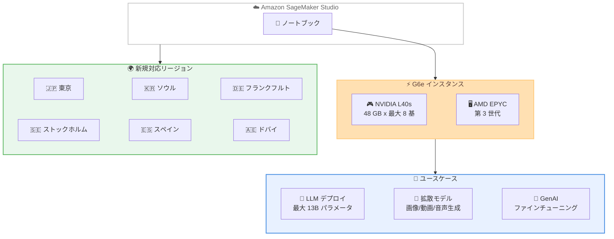

# Amazon SageMaker Studio - G6e インスタンスのリージョン拡大

**リリース日**: 2026 年 5 月 11 日
**サービス**: Amazon SageMaker Studio
**機能**: EC2 G6e インスタンス (NVIDIA L40s GPU) のリージョン拡大

📊 [このアップデートのインフォグラフィックを見る](https://takech9203.github.io/aws-news-summary/20260511-g6e-region-expansion-sagemaker-studio-notebooks.html)

## 概要

Amazon SageMaker Studio ノートブックにおいて、Amazon EC2 G6e インスタンスが新たに 6 つのリージョンで一般利用可能 (GA) になった。追加されたリージョンは、中東 (ドバイ)、アジアパシフィック (東京、ソウル)、欧州 (フランクフルト、ストックホルム、スペイン) である。

G6e インスタンスは最大 8 基の NVIDIA L40s Tensor Core GPU (GPU あたり 48 GB メモリ) と第 3 世代 AMD EPYC プロセッサを搭載しており、EC2 G5 インスタンスと比較して最大 2.5 倍のパフォーマンスを提供する。大規模言語モデル (LLM) のデプロイやファインチューニング、拡散モデルによる画像・動画・音声生成など、生成 AI ワークロードに最適なインスタンスタイプである。

東京リージョンでの利用が可能になったことにより、日本のお客様はレイテンシーを抑えた環境でインタラクティブな ML 開発やモデルデプロイのテストを実施できるようになった。

**アップデート前の課題**

- G6e インスタンスは一部のリージョンでのみ利用可能であり、東京やソウルなどのアジアパシフィックリージョンでは SageMaker Studio ノートブック上で使用できなかった
- 日本のお客様が G6e インスタンスを利用するには、米国リージョンなど遠隔のリージョンにアクセスする必要があり、レイテンシーやデータ転送コストの課題があった
- G5 インスタンスでは性能が不十分なワークロードに対して、対象リージョンでの GPU 選択肢が限られていた

**アップデート後の改善**

- 東京、ソウル、フランクフルト、ストックホルム、スペイン、ドバイの 6 リージョンで G6e インスタンスが利用可能になった
- 日本のお客様は東京リージョンで低レイテンシーに G6e インスタンスを活用した ML 開発が可能になった
- G5 比 2.5 倍の性能向上により、13B パラメータまでの LLM デプロイやファインチューニングをより効率的に実行できるようになった

## アーキテクチャ図



SageMaker Studio ノートブックから G6e インスタンスを選択し、GPU 集約型の ML ワークロードを新規リージョンで実行できる構成を示している。

## サービスアップデートの詳細

### 主要機能

1. **NVIDIA L40s GPU によるハイパフォーマンスコンピューティング**
   - 最大 8 基の NVIDIA L40s Tensor Core GPU を搭載
   - GPU あたり 48 GB の GDDR6X メモリ
   - Ada Lovelace アーキテクチャベースで AI/ML 推論とグラフィックスに最適化
   - FP8、INT8、FP16 などの混合精度演算をサポート

2. **G5 インスタンス比 2.5 倍の性能向上**
   - G5 (NVIDIA A10G) から G6e (NVIDIA L40s) への世代交代による大幅な性能改善
   - 特に推論スループットと学習速度において顕著な性能差
   - メモリ帯域幅の向上により大規模モデルの処理が高速化

3. **生成 AI ワークロード対応**
   - 最大 13B パラメータの大規模言語モデル (LLM) のデプロイをサポート
   - 拡散モデルによる画像、動画、音声の生成
   - インタラクティブなモデルトレーニングとファインチューニング
   - モデルデプロイのテストをノートブック環境で実行可能

## 技術仕様

### G6e インスタンスの仕様

| 項目 | 詳細 |
|------|------|
| GPU | NVIDIA L40s Tensor Core (最大 8 基) |
| GPU メモリ | 48 GB/GPU (GDDR6X) |
| CPU | 第 3 世代 AMD EPYC プロセッサ |
| G5 比性能 | 最大 2.5 倍 |
| 対応モデルサイズ | LLM: 最大 13B パラメータ |
| 主な用途 | 推論、ファインチューニング、拡散モデル生成 |

### G5 vs G6e 比較

| 項目 | G5 | G6e |
|------|-----|------|
| GPU | NVIDIA A10G | NVIDIA L40s |
| GPU メモリ | 24 GB/GPU | 48 GB/GPU |
| GPU アーキテクチャ | Ampere | Ada Lovelace |
| 相対性能 | 1x (基準) | 最大 2.5x |
| CPU | 第 2 世代 AMD EPYC | 第 3 世代 AMD EPYC |

### API 変更履歴

| 日付 | サービス | 変更内容 |
|------|----------|----------|
| 2026/05/05 | [Amazon SageMaker Service](https://awsapichanges.com/archive/changes/2d415e-api.sagemaker.html) | 12 updated methods - SageMaker Studio JupyterLab/CodeEditor アプリで ml.p5.4xlarge インスタンスタイプのサポートを追加 |
| 2026/05/06 | [Amazon SageMaker Service](https://awsapichanges.com/archive/changes/7068f3-api.sagemaker.html) | 3 updated methods - HyperPod で ImageVersionStatus をレスポンスに追加 |

## 設定方法

### 前提条件

1. SageMaker Studio ドメインが対象リージョンに作成済みであること
2. G6e インスタンスタイプに対するサービスクォータが十分であること
3. 適切な IAM ロールが設定されていること

### 手順

#### ステップ 1: サービスクォータの確認

```bash
# G6e インスタンスのクォータを確認 (東京リージョンの例)
aws service-quotas get-service-quota \
  --service-code sagemaker \
  --quota-code L-12345678 \
  --region ap-northeast-1
```

G6e インスタンスを使用する前に、対象リージョンでのサービスクォータが十分であるか確認する。初期状態ではクォータが 0 に設定されている場合があるため、必要に応じてクォータ引き上げをリクエストする。

#### ステップ 2: SageMaker Studio ノートブックの起動

```bash
# SageMaker Studio でノートブックインスタンスを作成
aws sagemaker create-app \
  --domain-id <domain-id> \
  --user-profile-name <user-profile> \
  --app-type JupyterLab \
  --app-name default \
  --resource-spec InstanceType=ml.g6e.xlarge \
  --region ap-northeast-1
```

SageMaker Studio コンソールまたは CLI からノートブックを起動する際に、インスタンスタイプとして `ml.g6e.*` サイズを選択する。

#### ステップ 3: インスタンスタイプの変更 (既存ノートブック)

SageMaker Studio コンソールで既存のノートブックインスタンスのインスタンスタイプを変更する場合は、以下の手順で行う。

1. SageMaker Studio にログイン
2. 実行中のノートブックを停止
3. インスタンスタイプのドロップダウンから `ml.g6e.*` を選択
4. ノートブックを再起動

## メリット

### ビジネス面

- **レイテンシー削減**: 東京リージョンでの利用により、日本のお客様はデータの国内保持とともに低レイテンシーで ML 開発が可能
- **コスト効率**: G5 比 2.5 倍の性能向上により、同じワークロードをより短時間で完了でき、時間課金の GPU コストを削減
- **データコンプライアンス**: データレジデンシー要件がある場合に、近隣リージョンで GPU インスタンスを利用可能

### 技術面

- **GPU メモリ倍増**: G5 (24 GB) から G6e (48 GB) への GPU メモリ増加により、より大きなモデルをメモリに載せることが可能
- **インタラクティブ開発**: ノートブック環境で直接 GPU リソースを活用し、モデルのプロトタイピングとテストを迅速に実施
- **スケーラビリティ**: 最大 8 GPU 構成により、マルチ GPU 並列処理が必要なワークロードにも対応

## デメリット・制約事項

### 制限事項

- LLM デプロイは最大 13B パラメータまでが推奨範囲 (それ以上はより大規模なインスタンスが必要)
- サービスクォータの引き上げが必要な場合、承認までに時間がかかる可能性がある
- SageMaker Studio ノートブック環境でのみ利用可能 (EC2 直接利用とは別)

### 考慮すべき点

- G6e インスタンスは G5 より高い時間単価のため、小規模なワークロードでは G5 の方がコスト効率が良い場合がある
- GPU メモリ 48 GB は 13B パラメータ規模のモデルに最適だが、70B 以上のモデルにはマルチノード構成や p5 インスタンスの検討が必要
- 新規リージョンではアベイラビリティーゾーンによって利用可能なインスタンスサイズが異なる場合がある

## ユースケース

### ユースケース 1: LLM ファインチューニング

**シナリオ**: 日本語対応の LLM (7B - 13B パラメータ) を社内データでファインチューニングする場合

**実装例**:
```python
# SageMaker Studio ノートブックでの LoRA ファインチューニング例
from transformers import AutoModelForCausalLM, AutoTokenizer
from peft import get_peft_model, LoraConfig
import torch

# G6e の 48GB GPU メモリを活用して 13B モデルをロード
model = AutoModelForCausalLM.from_pretrained(
    "meta-llama/Llama-2-13b-hf",
    torch_dtype=torch.bfloat16,
    device_map="auto"
)

lora_config = LoraConfig(
    r=16, lora_alpha=32, target_modules=["q_proj", "v_proj"]
)
model = get_peft_model(model, lora_config)
```

**効果**: 48 GB の GPU メモリにより 13B パラメータモデルを効率的にファインチューニングでき、G5 比で学習時間を約 60% 短縮

### ユースケース 2: 画像生成モデルのプロトタイピング

**シナリオ**: Stable Diffusion XL などの拡散モデルを使用して画像生成パイプラインのプロトタイプを開発する場合

**実装例**:
```python
# SDXL モデルでの画像生成
from diffusers import StableDiffusionXLPipeline
import torch

pipe = StableDiffusionXLPipeline.from_pretrained(
    "stabilityai/stable-diffusion-xl-base-1.0",
    torch_dtype=torch.float16,
    variant="fp16"
).to("cuda")

# G6e の高スループットで高速な画像生成
image = pipe(
    prompt="A beautiful Japanese garden in autumn",
    num_inference_steps=30
).images[0]
```

**効果**: G6e の L40s GPU により SDXL の推論速度が G5 比で大幅に向上し、インタラクティブなプロトタイピングサイクルが短縮

### ユースケース 3: モデルデプロイテスト

**シナリオ**: 本番デプロイ前に SageMaker Studio ノートブック上でモデルの推論パフォーマンスとレイテンシーをテストする場合

**実装例**:
```python
# ノートブック上でのモデル推論テスト
from transformers import pipeline
import time

# G6e インスタンスで推論パイプラインを構築
generator = pipeline(
    "text-generation",
    model="your-finetuned-model",
    device_map="auto",
    torch_dtype=torch.float16
)

# レイテンシー計測
start = time.time()
output = generator("テスト入力テキスト", max_new_tokens=256)
latency = time.time() - start
print(f"推論レイテンシー: {latency:.3f} 秒")
```

**効果**: 本番環境と同等の GPU 環境でデプロイ前テストを実施でき、リージョン内でのレイテンシー特性を事前に把握可能

## 料金

G6e インスタンスの SageMaker Studio ノートブック利用時の料金は、インスタンスサイズと利用時間に基づく従量課金制である。料金はリージョンによって異なる。

### 料金例

| インスタンスサイズ | GPU 数 | 用途の目安 |
|-------------------|--------|-----------|
| ml.g6e.xlarge | 1 | 小規模推論テスト、モデル検証 |
| ml.g6e.2xlarge | 1 | 中規模モデルの推論、ファインチューニング |
| ml.g6e.12xlarge | 4 | マルチ GPU トレーニング |
| ml.g6e.48xlarge | 8 | 大規模モデルの並列トレーニング |

※ 最新の料金情報は [Amazon SageMaker 料金ページ](https://aws.amazon.com/sagemaker/pricing/) を参照のこと。

## 利用可能リージョン

今回のアップデートで追加されたリージョン。

| リージョン | リージョンコード |
|-----------|----------------|
| 中東 (ドバイ) | me-central-1 |
| アジアパシフィック (東京) | ap-northeast-1 |
| アジアパシフィック (ソウル) | ap-northeast-2 |
| 欧州 (フランクフルト) | eu-central-1 |
| 欧州 (ストックホルム) | eu-north-1 |
| 欧州 (スペイン) | eu-south-2 |

既存の利用可能リージョンと合わせて、G6e インスタンスはグローバルに広く展開されている。

## 関連サービス・機能

- **Amazon EC2 G6e インスタンス**: SageMaker Studio 外での直接利用も可能な同一インスタンスタイプ
- **Amazon SageMaker HyperPod**: 大規模分散トレーニング向けのマネージドクラスター。G6e をワーカーノードとして使用可能
- **Amazon SageMaker Endpoints**: Studio で検証したモデルを本番推論エンドポイントとしてデプロイ
- **Amazon Bedrock**: フルマネージドの基盤モデル API。カスタムモデルが不要な場合の代替選択肢

## 参考リンク

- 📊 [インフォグラフィック](https://takech9203.github.io/aws-news-summary/20260511-g6e-region-expansion-sagemaker-studio-notebooks.html)
- [公式発表 (What's New)](https://aws.amazon.com/about-aws/whats-new/2026/04/g6e-region-expansion-sagemaker-studio-notebooks/)
- [Amazon SageMaker Studio ドキュメント](https://docs.aws.amazon.com/sagemaker/latest/dg/studio.html)
- [Amazon EC2 G6e インスタンス](https://aws.amazon.com/ec2/instance-types/g6e/)
- [Amazon SageMaker 料金](https://aws.amazon.com/sagemaker/pricing/)

## まとめ

今回のアップデートにより、NVIDIA L40s GPU 搭載の G6e インスタンスが東京を含む 6 リージョンで SageMaker Studio ノートブックから利用可能になった。G5 比 2.5 倍の性能向上と GPU メモリの倍増により、13B パラメータまでの LLM ファインチューニングや拡散モデルの開発を効率的に実施できる。日本のお客様は東京リージョンでデータを国内に保持しつつ、高性能 GPU を活用したインタラクティブな ML 開発環境を構築することが推奨される。
