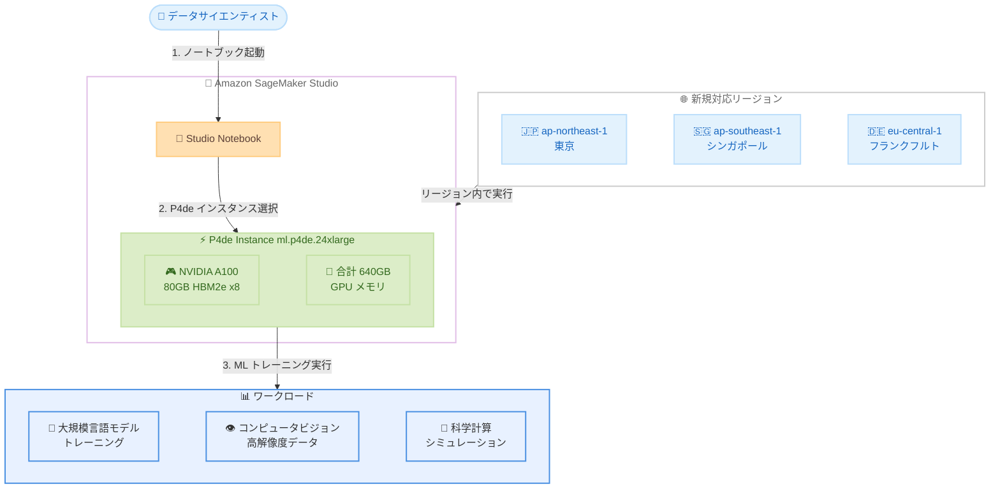

# Amazon SageMaker Studio - P4de インスタンスのリージョン拡張

**リリース日**: 2026 年 5 月 11 日
**サービス**: Amazon SageMaker Studio
**機能**: P4de インスタンスのリージョン拡張 (東京、シンガポール、フランクフルト)

📊 [このアップデートのインフォグラフィックを見る](https://takech9203.github.io/aws-news-summary/20260511-p4de-region-expansion-sagemaker-studio-notebooks.html)

## 概要

Amazon EC2 P4de インスタンスが、SageMaker Studio ノートブック上でアジアパシフィック (東京、シンガポール) およびヨーロッパ (フランクフルト) リージョンにて一般提供開始されました。P4de インスタンスは 8 基の NVIDIA A100 GPU を搭載し、GPU あたり 80GB の高性能 HBM2e メモリを備えています。これは現行の P4d インスタンスの 2 倍のメモリ容量です。

P4de インスタンスは合計 640GB の GPU メモリを提供し、P4d インスタンスと比較して最大 60% の ML トレーニング性能向上と 20% のトレーニングコスト削減を実現します。これにより、モデルのトレーニング時間を短縮し、市場投入までの時間を加速できます。

今回のリージョン拡張により、アジアパシフィックおよびヨーロッパのお客様がデータレジデンシー要件を満たしながら、高性能な GPU コンピューティングリソースをローカルリージョンで利用できるようになりました。

**アップデート前の課題**

- P4de インスタンスの SageMaker Studio ノートブックでの利用が限られたリージョンでのみ可能であり、アジアパシフィックやヨーロッパのお客様はデータを他リージョンに転送する必要がありました
- 東京、シンガポール、フランクフルトのお客様は P4d インスタンス (GPU あたり 40GB) を使用するしかなく、大規模モデルのトレーニングにおいてメモリ制約がありました
- データレジデンシー要件のある組織は、高性能 GPU インスタンスの利用と法規制遵守の間でトレードオフを迫られていました

**アップデート後の改善**

- 東京、シンガポール、フランクフルトリージョンで P4de インスタンスを SageMaker Studio ノートブックから直接利用できるようになりました
- GPU あたり 80GB のメモリ (合計 640GB) により、大規模モデルのトレーニングがローカルリージョンで可能になりました
- P4d 比で最大 60% の性能向上と 20% のコスト削減を享受しながら、データレジデンシー要件を満たせるようになりました

## アーキテクチャ図



この図は、データサイエンティストが新規対応リージョンの SageMaker Studio ノートブックから P4de インスタンスを選択し、大規模言語モデルのトレーニングや高解像度データの処理などのワークロードを実行するフローを示しています。

## サービスアップデートの詳細

### 主要機能

1. **P4de インスタンスのリージョン拡張**
   - アジアパシフィック (東京) ap-northeast-1 で利用可能
   - アジアパシフィック (シンガポール) ap-southeast-1 で利用可能
   - ヨーロッパ (フランクフルト) eu-central-1 で利用可能
   - SageMaker Studio ノートブックから直接起動可能

2. **NVIDIA A100 GPU の高性能メモリ**
   - GPU あたり 80GB の HBM2e メモリ (P4d の 2 倍)
   - 8 基の GPU で合計 640GB のメモリ容量
   - 大規模モデルやデータセットのメモリ内処理が可能

3. **性能とコストの最適化**
   - P4d 比で最大 60% の ML トレーニング性能向上
   - P4d 比で 20% のトレーニングコスト削減
   - モデルトレーニング時間の短縮による市場投入加速

## 技術仕様

### P4de インスタンス仕様

| 項目 | P4de.24xlarge | P4d.24xlarge (参考) |
|------|---------------|---------------------|
| GPU | NVIDIA A100 x8 | NVIDIA A100 x8 |
| GPU メモリ (per GPU) | 80GB HBM2e | 40GB HBM2e |
| GPU メモリ (合計) | 640GB | 320GB |
| ML トレーニング性能 | 最大 60% 向上 (P4d 比) | ベースライン |
| トレーニングコスト | 20% 削減 (P4d 比) | ベースライン |
| インターコネクト | NVSwitch, 600GB/s | NVSwitch, 600GB/s |
| ネットワーク | 400Gbps EFA | 400Gbps EFA |

### API 変更履歴

| 日付 | サービス | 変更内容 |
|------|----------|----------|
| 2026/05/06 | [Amazon SageMaker Service](https://awsapichanges.com/archive/changes/7068f3-api.sagemaker.html) | 3 updated methods - HyperPod の DescribeCluster, DescribeClusterNode, ListClusterNodes に ImageVersionStatus フィールドを追加 |

### SageMaker Studio でのインスタンスタイプ

SageMaker Studio ノートブックで P4de インスタンスを使用する場合、インスタンスタイプ `ml.p4de.24xlarge` を指定します。

```json
{
  "InstanceType": "ml.p4de.24xlarge",
  "LifecycleConfigArn": "arn:aws:sagemaker:<region>:<account>:studio-lifecycle-config/<config-name>"
}
```

## 設定方法

### 前提条件

1. 対象リージョン (ap-northeast-1, ap-southeast-1, eu-central-1) に SageMaker Studio ドメインが作成されていること
2. P4de インスタンスの Service Quotas が承認されていること (デフォルトは 0 のため、引き上げリクエストが必要)
3. IAM ロールに SageMaker Studio ノートブックの起動権限が付与されていること

### 手順

#### ステップ 1: Service Quotas の確認と引き上げリクエスト

```bash
aws service-quotas get-service-quota \
  --service-code sagemaker \
  --quota-code L-XXXXX \
  --region ap-northeast-1
```

P4de インスタンスの制限値を確認し、必要に応じて引き上げリクエストを送信します。デフォルトでは 0 に設定されているため、利用前に引き上げが必要です。

#### ステップ 2: SageMaker Studio ノートブックの起動

```bash
aws sagemaker create-app \
  --domain-id <domain-id> \
  --user-profile-name <user-profile> \
  --app-type KernelGateway \
  --app-name <app-name> \
  --resource-spec '{"InstanceType": "ml.p4de.24xlarge", "SageMakerImageArn": "<image-arn>"}' \
  --region ap-northeast-1
```

SageMaker Studio ノートブックを P4de インスタンスタイプで起動します。SageMaker Studio の UI からもインスタンスタイプを選択して起動できます。

#### ステップ 3: GPU の動作確認

```python
import torch

# GPU の利用可能性を確認
print(f"GPU available: {torch.cuda.is_available()}")
print(f"GPU count: {torch.cuda.device_count()}")
print(f"GPU name: {torch.cuda.get_device_name(0)}")
print(f"GPU memory: {torch.cuda.get_device_properties(0).total_mem / 1e9:.1f} GB")
```

ノートブック上で GPU が正しく認識されていることを確認します。8 基の NVIDIA A100 GPU と各 80GB のメモリが表示されるはずです。

## メリット

### ビジネス面

- **市場投入時間の短縮**: 60% の性能向上により、モデルトレーニングのイテレーションサイクルが大幅に短縮されます
- **コスト最適化**: P4d 比で 20% のトレーニングコスト削減により、ML プロジェクトの ROI が向上します
- **データレジデンシー遵守**: 東京、シンガポール、フランクフルトでの利用により、各地域のデータ保護規制に準拠した ML ワークロードの実行が可能になります

### 技術面

- **大規模モデルのサポート**: 合計 640GB の GPU メモリにより、数十億パラメータの大規模モデルをメモリ内に保持してトレーニングできます
- **高解像度データの処理**: 増加した GPU メモリにより、高解像度の画像、動画、科学データのバッチ処理サイズを拡大できます
- **低レイテンシーアクセス**: ローカルリージョンでの実行により、データ転送のオーバーヘッドと通信レイテンシーが削減されます

## デメリット・制約事項

### 制限事項

- Service Quotas の引き上げリクエストが必要であり、承認まで数日かかる場合があります
- P4de インスタンスは高コストなため、小規模なトレーニングジョブには過剰スペックとなる可能性があります
- すべての SageMaker Studio ノートブックカーネルが P4de の全 GPU を効率的に活用できるわけではありません

### 考慮すべき点

- GPU メモリ使用率を監視し、リソースの無駄を防ぐために適切なインスタンスサイズを選択する必要があります
- 分散トレーニングの設定 (NCCL, PyTorch DDP など) を適切に行わないと、マルチ GPU の恩恵を最大化できません
- スポットインスタンスとの組み合わせによるさらなるコスト削減も検討すべきです

## ユースケース

### ユースケース 1: 大規模言語モデルのファインチューニング

**シナリオ**: 日本語特化の LLM を東京リージョンのデータレジデンシー要件下でファインチューニングする必要がある組織

**実装例**:
```python
import sagemaker
from sagemaker.huggingface import HuggingFace

estimator = HuggingFace(
    entry_point='train.py',
    instance_type='ml.p4de.24xlarge',
    instance_count=1,
    transformers_version='4.36',
    pytorch_version='2.1',
    py_version='py310',
    hyperparameters={
        'model_name': 'japanese-llm-base',
        'per_device_train_batch_size': 8,
        'gradient_accumulation_steps': 4,
    }
)
```

**効果**: 640GB の GPU メモリにより、モデルパラメータとオプティマイザ状態をメモリ内に保持し、より大きなバッチサイズでのトレーニングが可能になります。データを国外に転送することなくファインチューニングを完了できます。

### ユースケース 2: 高解像度医療画像の深層学習

**シナリオ**: シンガポールの医療機関が、高解像度の病理画像を用いた画像分類モデルのトレーニングを行う場合

**実装例**:
```python
from sagemaker.pytorch import PyTorch

estimator = PyTorch(
    entry_point='train_medical_imaging.py',
    instance_type='ml.p4de.24xlarge',
    instance_count=1,
    framework_version='2.1',
    py_version='py310',
    hyperparameters={
        'image_size': 4096,
        'batch_size': 32,
        'num_gpus': 8,
    }
)
```

**効果**: 増加した GPU メモリにより、高解像度画像をダウンサンプリングせずにフル解像度でトレーニングに使用でき、診断精度の向上が期待できます。

### ユースケース 3: マルチモーダル基盤モデルの事前学習

**シナリオ**: ヨーロッパの研究機関が GDPR 準拠のフランクフルトリージョンで、テキストと画像を組み合わせたマルチモーダルモデルの事前学習を行う場合

**実装例**:
```python
from sagemaker.pytorch import PyTorch

estimator = PyTorch(
    entry_point='pretrain_multimodal.py',
    instance_type='ml.p4de.24xlarge',
    instance_count=4,
    framework_version='2.1',
    py_version='py310',
    distribution={
        'torch_distributed': {'enabled': True}
    },
    hyperparameters={
        'model_type': 'vision_language',
        'total_params': '7B',
        'data_parallel_size': 4,
        'tensor_parallel_size': 8,
    }
)
```

**効果**: 4 ノード x 8 GPU の分散トレーニングにより、70 億パラメータ規模のマルチモーダルモデルを GDPR 準拠環境で効率的に事前学習できます。P4d 比で 60% 高速化されるため、研究サイクルの大幅な短縮が可能です。

## 料金

P4de インスタンスの料金はリージョンによって異なります。SageMaker Studio ノートブックでの利用は時間単位の課金となります。

### 料金例

| リージョン | インスタンスタイプ | オンデマンド料金 (概算) |
|-----------|-------------------|------------------------|
| ap-northeast-1 (東京) | ml.p4de.24xlarge | 約 $40-45/時間 |
| ap-southeast-1 (シンガポール) | ml.p4de.24xlarge | 約 $40-45/時間 |
| eu-central-1 (フランクフルト) | ml.p4de.24xlarge | 約 $40-45/時間 |

※ 正確な料金は AWS 公式料金ページを参照してください。P4d 比で 20% のコスト削減は、同等のトレーニングジョブを完了するまでの総コストに基づいています。

## 利用可能リージョン

今回のアップデートにより、以下のリージョンで SageMaker Studio ノートブック上の P4de インスタンスが利用可能になりました。

| リージョン | リージョンコード | 状態 |
|-----------|-----------------|------|
| アジアパシフィック (東京) | ap-northeast-1 | 新規追加 |
| アジアパシフィック (シンガポール) | ap-southeast-1 | 新規追加 |
| ヨーロッパ (フランクフルト) | eu-central-1 | 新規追加 |
| 米国東部 (バージニア北部) | us-east-1 | 既存 |
| 米国西部 (オレゴン) | us-west-2 | 既存 |

## 関連サービス・機能

- **Amazon EC2 P4de インスタンス**: SageMaker Studio ノートブックの基盤となるコンピューティングインスタンス。EC2 上でも同じ P4de インスタンスを直接利用可能
- **Amazon SageMaker Training Jobs**: ノートブックでのプロトタイピング後に、マネージドトレーニングジョブとしてスケールアウトする際に利用
- **Amazon SageMaker HyperPod**: 大規模な分散トレーニングクラスターとして P4de インスタンスを活用する場合に使用

## 参考リンク

- 📊 [インフォグラフィック](https://takech9203.github.io/aws-news-summary/20260511-p4de-region-expansion-sagemaker-studio-notebooks.html)
- [公式発表 (What's New)](https://aws.amazon.com/about-aws/whats-new/2026/02/p4de-region-expansion-sagemaker-studio-notebooks/)
- [Amazon SageMaker Studio ドキュメント](https://docs.aws.amazon.com/sagemaker/latest/dg/studio.html)
- [Amazon EC2 P4de インスタンス](https://aws.amazon.com/ec2/instance-types/p4/)
- [SageMaker 料金ページ](https://aws.amazon.com/sagemaker/pricing/)

## まとめ

P4de インスタンスの東京、シンガポール、フランクフルトリージョンへの拡張は、アジアパシフィックおよびヨーロッパのお客様にとって重要なアップデートです。データレジデンシー要件を満たしながら、640GB の大容量 GPU メモリによる高性能な ML トレーニングをローカルリージョンで実行できるようになりました。大規模モデルのトレーニングや高解像度データの処理を行っているお客様は、Service Quotas の引き上げリクエストを事前に申請し、P4de インスタンスへの移行を検討することを推奨します。
