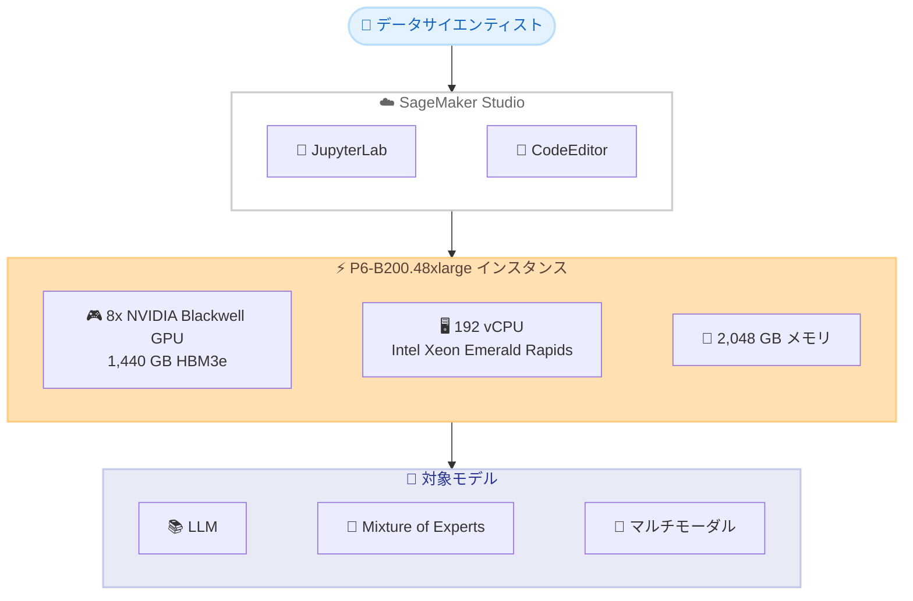

# Amazon SageMaker Studio - P6-B200 インスタンスのリージョン拡大

**リリース日**: 2026年5月11日
**サービス**: Amazon SageMaker Studio
**機能**: P6-B200 インスタンスの US East (N. Virginia) リージョンでの一般提供開始

📊 [このアップデートのインフォグラフィックを見る](https://takech9203.github.io/aws-news-summary/20260511-p6-b200-region-expansion-sagemaker-studio-notebooks.html)

## 概要

Amazon EC2 P6-B200 インスタンスが SageMaker Studio ノートブックにおいて US East (N. Virginia) リージョンで一般提供 (GA) を開始した。P6-B200 インスタンスは 8 基の NVIDIA Blackwell GPU を搭載し、1,440 GB の高帯域幅 GPU メモリと第 5 世代 Intel Xeon プロセッサ (Emerald Rapids) を備えている。

このインスタンスは AI トレーニングにおいて P5en インスタンスと比較して最大 2 倍のパフォーマンスを提供する。ユーザーは SageMaker Studio の JupyterLab または CodeEditor 環境で直接、大規模な基盤モデル (LLM、Mixture of Experts モデル、マルチモーダル推論モデルなど) のインタラクティブな開発やファインチューニングを行うことができる。

**アップデート前の課題**

- SageMaker Studio ノートブックで P6-B200 インスタンスを利用できるリージョンが限定されていた
- US East (N. Virginia) リージョンのユーザーは、大規模モデルの開発に P5en 以下のインスタンスを使用する必要があった
- データレジデンシー要件により、特定リージョンでの高性能 GPU リソースへのアクセスが制約されていた

**アップデート後の改善**

- US East (N. Virginia) リージョンで P6-B200 インスタンスが SageMaker Studio ノートブック上で利用可能になった
- P5en 比で最大 2 倍の AI トレーニングパフォーマンスをノートブック環境で直接活用できる
- 1,440 GB の GPU メモリにより、より大規模なモデルをノートブック内で直接実験可能になった

## アーキテクチャ図



SageMaker Studio のノートブック環境から P6-B200 インスタンスを利用し、大規模基盤モデルの開発とファインチューニングを行う構成を示す。

## サービスアップデートの詳細

### 主要機能

1. **P6-B200 インスタンスの SageMaker Studio 対応**
   - JupyterLab 環境での P6-B200 インスタンス利用が可能
   - CodeEditor 環境での P6-B200 インスタンス利用が可能
   - インタラクティブな開発・実験をノートブック上で直接実行

2. **大規模基盤モデルの開発支援**
   - LLM (大規模言語モデル) のファインチューニング
   - Mixture of Experts (MoE) モデルの実験
   - マルチモーダル推論モデルの開発

3. **生成 AI アプリケーション開発**
   - エンタープライズコパイロットの構築
   - テキスト、画像、動画にわたるコンテンツ生成
   - 大規模モデルを活用したプロトタイプの迅速な検証

## 技術仕様

### P6-B200.48xlarge インスタンス仕様

| 項目 | 詳細 |
|------|------|
| インスタンスタイプ | p6-b200.48xlarge |
| GPU | 8x NVIDIA Blackwell B200 |
| GPU メモリ | 1,432 GB HBM3e (約 1,440 GB) |
| vCPU | 192 |
| インスタンスメモリ | 2,048 GB |
| ローカルストレージ | 8 x 3.84 TB NVMe SSD |
| ネットワーク帯域幅 | 3,200 Gbps (EFA) |
| EBS 帯域幅 | 100 Gbps |
| プロセッサ | 第 5 世代 Intel Xeon (Emerald Rapids) |

### パフォーマンス比較

| 項目 | P6-B200 | P5en | 改善比 |
|------|---------|------|--------|
| AI トレーニング性能 | - | - | 最大 2 倍 |
| GPU メモリ | 1,440 GB | 640 GB | 2.25 倍 |
| GPU 世代 | NVIDIA Blackwell | NVIDIA Hopper | 1 世代上 |

### GPU 間接続

- NVIDIA NVLink による GPU 間高速通信
- 8 基の GPU 間でメモリを共有的に利用可能
- 大規模モデルのテンソル並列処理に最適

## 設定方法

### 前提条件

1. AWS アカウントと適切な IAM 権限
2. SageMaker Studio ドメインの作成済み
3. P6-B200 インスタンスのサービスクォータの申請・承認
4. US East (N. Virginia) リージョン (us-east-1) の利用

### 手順

#### ステップ 1: サービスクォータの確認と申請

```bash
# 現在のクォータを確認
aws service-quotas get-service-quota \
  --service-code sagemaker \
  --quota-code <P6-B200-quota-code> \
  --region us-east-1
```

P6-B200 インスタンスを使用するには、事前にサービスクォータの引き上げ申請が必要な場合がある。Service Quotas コンソールから申請を行う。

#### ステップ 2: SageMaker Studio で JupyterLab を起動

```bash
# AWS CLI で SageMaker Studio アプリケーションを作成
aws sagemaker create-app \
  --domain-id <domain-id> \
  --user-profile-name <user-profile> \
  --app-type JupyterLab \
  --app-name default \
  --resource-spec InstanceType=ml.p6-b200.48xlarge \
  --region us-east-1
```

SageMaker Studio コンソールからも JupyterLab アプリケーションを起動する際にインスタンスタイプとして `ml.p6-b200.48xlarge` を選択できる。

#### ステップ 3: CodeEditor 環境の利用

SageMaker Studio コンソールで CodeEditor アプリケーションを作成し、インスタンスタイプに P6-B200 を選択する。VS Code ベースの環境で大規模モデルの開発が可能になる。

## メリット

### ビジネス面

- **開発サイクルの短縮**: ノートブック環境で直接大規模モデルを実験できるため、イテレーション速度が向上
- **インフラ管理の簡素化**: SageMaker Studio がインフラを管理するため、GPU クラスタの構築・運用が不要
- **コスト効率**: 必要な時にのみインスタンスを起動し、使用分のみ課金されるため固定費を削減

### 技術面

- **2 倍の性能向上**: P5en 比で最大 2 倍の AI トレーニング性能を実現
- **大容量 GPU メモリ**: 1,440 GB の HBM3e メモリにより、モデル分割なしでより大規模なモデルを扱える
- **統合開発環境**: JupyterLab と CodeEditor の両方で利用可能なため、開発スタイルに応じた選択が可能

## デメリット・制約事項

### 制限事項

- 現時点で利用可能なリージョンは US East (N. Virginia) に限定される
- P6-B200 インスタンスのサービスクォータは事前申請が必要であり、即座に利用開始できない場合がある
- インスタンスサイズは p6-b200.48xlarge の 1 種類のみ (より小さいサイズは未提供)

### 考慮すべき点

- 高性能インスタンスのため、時間単位の料金が高額になる可能性がある (利用時間の管理が重要)
- 大規模インスタンスの起動には数分の待機時間が発生する場合がある
- GPU メモリが大容量であっても、数百 B パラメータを超えるモデルの完全なファインチューニングには複数インスタンスが必要

## ユースケース

### ユースケース 1: LLM のファインチューニング

**シナリオ**: 企業が社内ドキュメントに特化した大規模言語モデルをファインチューニングしたい場合

**実装例**:
```python
# SageMaker Studio JupyterLab 上での実装例
from transformers import AutoModelForCausalLM, AutoTokenizer, TrainingArguments, Trainer

model = AutoModelForCausalLM.from_pretrained(
    "meta-llama/Llama-3-70B",
    device_map="auto",  # 8 GPU に自動分散
    torch_dtype="bfloat16"
)

training_args = TrainingArguments(
    output_dir="./results",
    per_device_train_batch_size=4,
    gradient_accumulation_steps=8,
    num_train_epochs=3,
    bf16=True,
)
```

**効果**: 1,440 GB の GPU メモリにより 70B パラメータクラスのモデルをモデル分割なしでロード・ファインチューニング可能

### ユースケース 2: Mixture of Experts モデルの実験

**シナリオ**: 研究チームが MoE アーキテクチャの新しいルーティング戦略を検証したい場合

**実装例**:
```python
# MoE モデルの読み込みと実験
from transformers import AutoModelForCausalLM

model = AutoModelForCausalLM.from_pretrained(
    "mistralai/Mixtral-8x22B-v0.1",
    device_map="auto",
    torch_dtype="bfloat16",
    load_in_8bit=False  # 大容量 GPU メモリを活かしフル精度で実験
)

# インタラクティブに推論結果を確認
output = model.generate(input_ids, max_new_tokens=512)
```

**効果**: ノートブック上でインタラクティブに MoE モデルの動作を確認し、パラメータ調整のイテレーションを高速化

### ユースケース 3: マルチモーダルコンテンツ生成

**シナリオ**: メディア企業がテキスト・画像・動画を統合的に扱うマルチモーダルモデルを開発する場合

**実装例**:
```python
# マルチモーダルモデルの開発
import torch
from diffusers import StableDiffusionXLPipeline

# 複数の生成パイプラインを同時にGPUにロード
text_model = load_text_model()      # GPU 0-3
image_model = load_image_model()    # GPU 4-5
video_model = load_video_model()    # GPU 6-7

# 統合パイプラインのプロトタイプをノートブック上で検証
result = unified_pipeline(
    prompt="企業向けプレゼンテーション資料を生成",
    modalities=["text", "image", "video"]
)
```

**効果**: 8 基の GPU を活用し、複数のモーダリティに対応するモデルを同時にロードしてエンドツーエンドの生成パイプラインを検証

## 料金

SageMaker Studio ノートブックでの P6-B200 インスタンス利用料金は、インスタンスの使用時間に基づいて課金される。具体的な料金は SageMaker AI 料金ページで確認が必要。

### 料金の考慮事項

| 項目 | 説明 |
|------|------|
| 課金単位 | 秒単位 (最低 1 分) |
| 課金対象 | ノートブックインスタンスが起動している時間 |
| アイドルタイムアウト | 自動停止設定を推奨 |
| ストレージ | EBS ストレージは別途課金 |

**コスト最適化のヒント**:
- 自動シャットダウンポリシーの設定により不要なコストを削減
- ライフサイクル設定でアイドル時の自動停止を構成
- 開発・実験フェーズのみ P6-B200 を使用し、軽量な作業には小さいインスタンスを活用

## 利用可能リージョン

| リージョン | ステータス |
|-----------|-----------|
| US East (N. Virginia) - us-east-1 | 利用可能 (GA) |

今後のリージョン拡大については AWS の公式アナウンスを確認する必要がある。

## 関連サービス・機能

- **Amazon EC2 P6 インスタンス**: SageMaker Studio 外で直接 EC2 として利用する場合のベースインスタンスタイプ
- **Amazon SageMaker Training**: 大規模な分散トレーニングジョブの実行基盤
- **Amazon SageMaker HyperPod**: 大規模クラスタでの継続的なモデルトレーニング
- **AWS Elastic Fabric Adapter (EFA)**: 3,200 Gbps の高帯域・低レイテンシーネットワーク
- **Amazon FSx for Lustre**: 大規模トレーニングデータの高速ストレージ

## 参考リンク

- 📊 [インフォグラフィック](https://takech9203.github.io/aws-news-summary/20260511-p6-b200-region-expansion-sagemaker-studio-notebooks.html)
- [公式発表 (What's New)](https://aws.amazon.com/about-aws/whats-new/2026/05/p6-b200-region-expansion-sagemaker-studio-notebooks/)
- [Amazon EC2 P6 インスタンスタイプ](https://aws.amazon.com/ec2/instance-types/p6/)
- [SageMaker Studio JupyterLab ドキュメント](https://docs.aws.amazon.com/sagemaker/latest/dg/studio-updated-jl.html)
- [SageMaker Studio CodeEditor ドキュメント](https://docs.aws.amazon.com/sagemaker/latest/dg/code-editor.html)
- [SageMaker Studio ドキュメント](https://docs.aws.amazon.com/sagemaker/latest/dg/studio-updated.html)
- [SageMaker AI 料金ページ](https://aws.amazon.com/sagemaker/ai/pricing/)

## まとめ

P6-B200 インスタンスの SageMaker Studio ノートブックへのリージョン拡大により、US East (N. Virginia) のユーザーは NVIDIA Blackwell GPU の 2 倍のパフォーマンス向上と 1,440 GB の大容量 GPU メモリを JupyterLab や CodeEditor 環境で直接活用できるようになった。大規模基盤モデルの開発・ファインチューニングを行うデータサイエンティストや ML エンジニアは、サービスクォータの申請を行い、次世代 GPU を活用したインタラクティブな実験環境の構築を検討することを推奨する。
