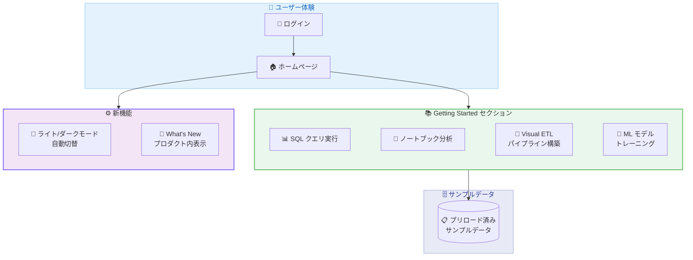

# Amazon SageMaker Unified Studio - Getting Started チュートリアルおよびプロダクト内リリースノートの追加

**リリース日**: 2026年5月11日
**サービス**: Amazon SageMaker Unified Studio
**機能**: Getting Started チュートリアル、開発環境のダーク/ライトモード自動切替、プロダクト内リリースノート

[このアップデートのインフォグラフィックを見る](https://takech9203.github.io/aws-news-summary/20260511-smus-getting-started.html)

## 概要

Amazon SageMaker Unified Studio に、新規ユーザーの生産性向上を加速するための Getting Started チュートリアルセクション、OS のシステム設定に自動的に適応する開発環境のアピアランス設定、およびプロダクト内でのリリースノート表示機能が追加された。

これらの機能により、SageMaker Unified Studio を初めて利用するユーザーが、事前にロードされたサンプルデータを使用して 10 分以内にコアワークフローを体験できるようになった。2026 年に入ってから SageMaker Unified Studio には 20 以上の新機能が追加されており、今回のアップデートはそれらの機能へのアクセシビリティを向上させるものである。

**アップデート前の課題**

- 新規ユーザーが SageMaker Unified Studio の基本的なワークフローを理解するまでに時間がかかっていた
- 自分自身でデータを準備し、環境設定を行わなければ機能を試すことができなかった
- 開発環境のテーマ設定を手動で変更する必要があった
- 新機能のリリース情報を確認するために外部の What's New ページを参照する必要があった

**アップデート後の改善**

- ホームページの Getting Started セクションからガイド付きチュートリアルで即座にコアワークフローを体験可能になった
- プリロードされたサンプルデータを使用して 10 分以内にチュートリアルを完了できるようになった
- 開発環境が OS のライト/ダークモード設定に自動的に追従するようになった
- プロダクト内の "What's New" セクションで最新の機能アナウンスメントを直接確認できるようになった

## アーキテクチャ図

ユーザーがホームページにアクセスすると、Getting Started セクションから 4 種類のチュートリアルにアクセスでき、それぞれプリロードされたサンプルデータを使用して即座に体験可能。

## サービスアップデートの詳細

### 主要機能

1. **Getting Started チュートリアル**
   - ホームページに新しい Getting Started セクションを追加
   - コアワークフローをステップバイステップで案内
   - プリロードされたサンプルデータを使用するため、事前のデータ準備が不要
   - 各チュートリアルは 10 分以内で完了可能

2. **提供されるチュートリアル**
   - **SQL クエリの実行**: 初めての SQL クエリをサンプルデータに対して実行
   - **ノートブックによるデータ分析**: ノートブック環境でデータの探索・分析を実施
   - **Visual ETL によるデータパイプライン構築**: GUI ベースで ETL パイプラインを作成
   - **ML モデルのトレーニング**: 機械学習モデルのトレーニングワークフローを体験

3. **開発環境のアピアランス自動切替**
   - OS のシステム設定 (ライトモード/ダークモード) に自動的に追従
   - デフォルトでシステム設定に合わせた表示になる
   - 手動でのテーマ変更が不要

4. **プロダクト内 What's New セクション**
   - SageMaker Unified Studio 内から直接最新の機能アナウンスメントを確認可能
   - 2026 年に追加された 20 以上の新機能情報にアクセス可能
   - 外部ページへの遷移が不要

## 技術仕様

### チュートリアル仕様

| 項目 | 詳細 |
|------|------|
| チュートリアル数 | 4 種類 |
| 完了目安時間 | 各 10 分以内 |
| データ | プリロード済みサンプルデータ |
| 対象ドメイン | IAM ベースドメイン |
| 前提知識 | 不要 (初回ユーザー向け) |

### 開発環境アピアランス

| 項目 | 詳細 |
|------|------|
| デフォルト動作 | OS のシステム設定に追従 |
| 対応モード | ライトモード、ダークモード |
| 切替方式 | 自動 (OS 設定連動) |

### API 変更履歴

今回のアップデートに関連する API 変更は確認されていない。Getting Started チュートリアルおよびプロダクト内 UI の改善であり、API レベルでの変更は伴わない。

## 設定方法

### 前提条件

1. Amazon SageMaker Unified Studio が利用可能な AWS アカウント
2. IAM ベースのドメインが設定済みであること
3. SageMaker Unified Studio へのアクセス権限を持つ IAM ユーザーまたはロール

### 手順

#### ステップ 1: SageMaker Unified Studio にアクセス

AWS マネジメントコンソールから Amazon SageMaker Unified Studio にアクセスする。IAM ベースのドメインにサインインする。

#### ステップ 2: Getting Started チュートリアルの利用

ホームページに表示される Getting Started セクションから、実行したいチュートリアルを選択する。以下の 4 つのチュートリアルから選択可能。

- 初めての SQL クエリを実行する
- ノートブックからデータを分析する
- Visual ETL でデータパイプラインを構築する
- ML モデルをトレーニングする

各チュートリアルはプリロードされたサンプルデータを使用するため、追加のデータ準備は不要。

#### ステップ 3: 開発環境のアピアランス確認

開発環境は OS のシステム設定に自動的に追従する。ライトモードまたはダークモードが自動的に適用される。追加の設定は不要。

#### ステップ 4: What's New セクションの確認

ホームページまたはナビゲーションから "What's New" セクションにアクセスし、最新の機能リリース情報を確認する。

## メリット

### ビジネス面

- **オンボーディング時間の短縮**: 新規ユーザーが数分で生産的な作業を開始でき、学習コストを大幅に削減
- **チーム全体の生産性向上**: データエンジニア、データサイエンティスト、アナリストが統一されたプラットフォームで迅速に作業を開始
- **情報の一元化**: プロダクト内で最新機能情報を確認でき、チームが最新の機能を活用しやすくなる

### 技術面

- **環境準備の省力化**: サンプルデータがプリロードされているため、チュートリアル用のデータセットアップが不要
- **ユーザビリティの向上**: OS 設定に連動したテーマ切替により、開発者の目の負担を軽減し快適な開発環境を提供
- **機能の発見性向上**: プロダクト内リリースノートにより、新機能の認知度が向上し、活用率が改善される

## デメリット・制約事項

### 制限事項

- IAM ベースのドメインでのみ利用可能 (AWS IAM Identity Center ベースのドメインでの対応状況は要確認)
- チュートリアルはサンプルデータに限定されており、独自データでのカスタムチュートリアルは提供されない
- チュートリアルの内容は 4 種類のコアワークフローに限定される

### 考慮すべき点

- チュートリアルのサンプルデータはデモ用であり、本番環境のデータとは異なる場合がある
- ダーク/ライトモードの自動切替は OS レベルの設定に依存するため、ブラウザ単独での設定変更には対応しない可能性がある
- Getting Started セクションは初回ユーザー向けに最適化されており、上級ユーザーには別途ドキュメントの参照が必要

## ユースケース

### ユースケース 1: 新規チームメンバーのオンボーディング

**シナリオ**: データ分析チームに新しいメンバーが加入し、SageMaker Unified Studio の基本操作を短時間で習得する必要がある。

**実装例**:
1. 新規メンバーに SageMaker Unified Studio への IAM アクセス権限を付与
2. ホームページの Getting Started セクションから「初めての SQL クエリを実行する」チュートリアルを案内
3. 続けて「ノートブックからデータを分析する」チュートリアルを実施

**効果**: 従来数時間かかっていた初期学習が 20 分程度で完了し、即日から業務データの分析に着手可能。

### ユースケース 2: データエンジニアの ETL パイプライン構築入門

**シナリオ**: SQL やコーディングに慣れたデータエンジニアが、SageMaker Unified Studio の Visual ETL 機能を初めて使用する。

**実装例**:
1. Getting Started セクションから「Visual ETL でデータパイプラインを構築する」を選択
2. サンプルデータを使用して GUI ベースの ETL フローを構築
3. チュートリアル完了後、実際の業務データで同様のパイプラインを構築

**効果**: Visual ETL の操作方法を 10 分以内に習得し、コードレスでのデータパイプライン構築スキルを獲得。

### ユースケース 3: ML エンジニアのクイックスタート

**シナリオ**: 機械学習エンジニアが SageMaker Unified Studio 上での ML モデルトレーニングワークフローを素早く把握したい。

**実装例**:
1. Getting Started セクションから「ML モデルをトレーニングする」を選択
2. プリロードされたサンプルデータで ML トレーニングのエンドツーエンドフローを体験
3. ワークフローを理解した上で、実際のモデル開発に着手

**効果**: SageMaker Unified Studio 固有のトレーニングワークフローを短時間で習得し、環境固有の設定や操作に迷うことなく ML 開発を開始可能。

## 料金

Getting Started チュートリアル、開発環境のアピアランス設定、プロダクト内 What's New セクションの利用に追加料金は発生しない。これらは SageMaker Unified Studio の標準機能として提供される。

ただし、チュートリアル内でのコンピューティングリソースの使用 (ノートブックの実行、ML モデルのトレーニングなど) には、通常の SageMaker の料金体系が適用される。

## 利用可能リージョン

Amazon SageMaker Unified Studio が IAM ベースドメインでサポートされているすべての AWS リージョンで利用可能。

## 関連サービス・機能

- **Amazon SageMaker AI**: ML モデルの構築、トレーニング、デプロイのための統合プラットフォーム
- **AWS Glue**: Visual ETL チュートリアルの基盤となるデータ統合サービス
- **Amazon Athena**: SQL クエリチュートリアルで使用されるサーバーレスクエリサービス
- **Amazon SageMaker Lakehouse**: データレイクとデータウェアハウスを統合したストレージ基盤

## 参考リンク

- [インフォグラフィック](https://takech9203.github.io/aws-news-summary/20260511-smus-getting-started.html)
- [公式発表 (What's New)](https://aws.amazon.com/about-aws/whats-new/2026/05/smus-getting-started)
- [Amazon SageMaker Unified Studio ドキュメント](https://docs.aws.amazon.com/sagemaker-unified-studio/latest/userguide/)
- [Amazon SageMaker 料金ページ](https://aws.amazon.com/sagemaker/pricing/)

## まとめ

Amazon SageMaker Unified Studio に Getting Started チュートリアルが追加されたことで、新規ユーザーが 10 分以内にコアワークフローを体験できるようになった。SQL クエリ、ノートブック分析、Visual ETL、ML トレーニングの 4 つのチュートリアルが提供され、プリロードされたサンプルデータにより即座に利用を開始できる。組織で SageMaker Unified Studio を導入する際のオンボーディングコスト削減に貢献するアップデートであり、IAM ベースドメインを利用している環境では早期に活用を検討すべきである。
