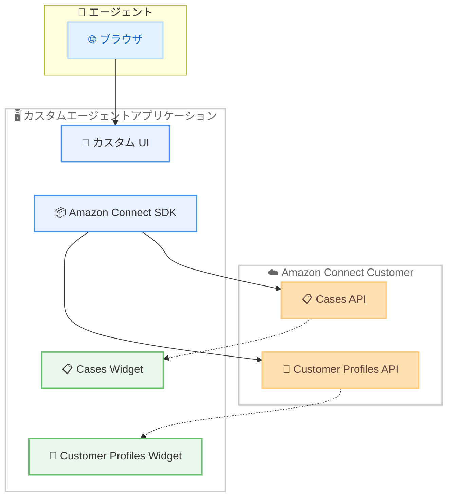

# Amazon Connect Customer - SDK による Cases と Customer Profiles のカスタムエージェントアプリケーション埋め込み

**リリース日**: 2026 年 5 月 12 日
**サービス**: Amazon Connect Customer
**機能**: Amazon Connect SDK による Cases / Customer Profiles の埋め込みサポート

[このアップデートのインフォグラフィックを見る](https://takech9203.github.io/aws-news-summary/20260512-amazon-connect-sdk-cases-customer-profiles.html)

## 概要

Amazon Connect Customer が、Amazon Connect SDK を通じて Cases と Customer Profiles をカスタムエージェントアプリケーションに埋め込む機能をサポートした。これにより、エージェントは既存のツールと並行して、ケースの詳細情報や顧客コンテキストにアクセスしながら問題解決に取り組むことが可能になる。

開発者は Amazon Connect SDK を使用して、Connect のネイティブエクスペリエンスをカスタムアプリケーションに統合できるようになった。これまでこれらの機能を独自に構築・保守する必要があったが、SDK を利用することでその負担が大幅に軽減される。

**アップデート前の課題**

- カスタムエージェントアプリケーションで Cases や Customer Profiles の情報を表示するには、独自の UI コンポーネントとバックエンド統合をゼロから構築する必要があった
- Connect のネイティブ CCP (Contact Control Panel) とカスタムアプリケーション間で画面を切り替える必要があり、エージェントの生産性が低下していた
- Cases と Customer Profiles の機能を自前で実装・保守するコストと工数が発生していた

**アップデート後の改善**

- Amazon Connect SDK を使用して、Cases と Customer Profiles のネイティブ UI をカスタムアプリケーションに直接埋め込み可能になった
- エージェントは単一のアプリケーション内でケース詳細と顧客プロファイルを確認でき、コンテキストスイッチが不要になった
- 構築・保守の負担が軽減され、開発者はビジネスロジックに集中できるようになった

## アーキテクチャ図



Amazon Connect SDK を介して、カスタムアプリケーション内に Cases と Customer Profiles のネイティブウィジェットを埋め込む構成を示している。

## サービスアップデートの詳細

### 主要機能

1. **Cases の埋め込み**
   - ケースの作成、表示、更新をカスタムアプリケーション内で実行可能
   - ケースの詳細情報 (ステータス、優先度、関連するコンタクト履歴) をエージェントに表示
   - Connect のネイティブ Cases UI と同等のエクスペリエンスを提供

2. **Customer Profiles の埋め込み**
   - 顧客プロファイル情報をカスタムアプリケーション内に直接表示
   - 顧客の連絡先情報、過去のインタラクション履歴、カスタム属性へのアクセス
   - リアルタイムでの顧客コンテキストの提供

3. **Amazon Connect SDK による統合**
   - JavaScript ベースの SDK でフロントエンド統合が容易
   - Connect のネイティブコンポーネントをカスタムアプリケーションにレンダリング
   - 既存の CCP 埋め込み機能と同様のアプローチで実装可能

## 技術仕様

### SDK 統合方式

| 項目 | 詳細 |
|------|------|
| SDK 名称 | Amazon Connect SDK |
| 統合対象 | Cases、Customer Profiles |
| 配布形式 | GitHub リポジトリ経由 |
| 対応フレームワーク | JavaScript / Web アプリケーション |
| ドキュメント | Administrator Guide、Developer Guide |

### 必要な権限

| 権限カテゴリ | 説明 |
|------|------|
| Cases アクセス | ケースの読み取り・書き込み権限 |
| Customer Profiles アクセス | プロファイルデータの読み取り権限 |
| Connect インスタンスアクセス | 対象 Connect インスタンスへの接続権限 |

## 設定方法

### 前提条件

1. Amazon Connect インスタンスが作成済みであること
2. Cases 機能が有効化されていること
3. Customer Profiles ドメインが設定されていること
4. カスタムエージェントアプリケーションが存在すること

### 手順

#### ステップ 1: Amazon Connect SDK の導入

```bash
# GitHub リポジトリからSDKを取得
git clone https://github.com/amazon-connect/AmazonConnectSDK.git
```

Amazon Connect SDK のリポジトリをクローンし、プロジェクトに組み込む。

#### ステップ 2: SDK の初期化とウィジェットの埋め込み

```javascript
// Amazon Connect SDK を初期化
import { AmazonConnectSDK } from 'amazon-connect-sdk';

const sdk = new AmazonConnectSDK({
  instanceId: 'your-connect-instance-id',
  region: 'your-aws-region'
});

// Cases ウィジェットの埋め込み
sdk.renderCases({
  containerId: 'cases-container',
  // 追加設定
});

// Customer Profiles ウィジェットの埋め込み
sdk.renderCustomerProfiles({
  containerId: 'profiles-container',
  // 追加設定
});
```

SDK を初期化し、HTML コンテナ要素に Cases と Customer Profiles のウィジェットをレンダリングする。

#### ステップ 3: IAM 権限の設定

```json
{
  "Version": "2012-10-17",
  "Statement": [
    {
      "Effect": "Allow",
      "Action": [
        "connect:GetCase",
        "connect:CreateCase",
        "connect:UpdateCase",
        "connect:SearchCases",
        "connect:GetCustomerProfile",
        "connect:SearchProfiles"
      ],
      "Resource": "arn:aws:connect:*:*:instance/your-instance-id/*"
    }
  ]
}
```

エージェントが Cases と Customer Profiles にアクセスするために必要な最小限の IAM 権限を付与する。

## メリット

### ビジネス面

- **エージェント生産性の向上**: 単一アプリケーション内で全ての情報にアクセスでき、コンテキストスイッチによる時間ロスを削減
- **顧客体験の改善**: エージェントが迅速に顧客情報とケース履歴を参照し、より的確な対応が可能
- **運用コストの削減**: 独自の Cases / Profiles UI を構築・保守する必要がなくなり、開発リソースを節約

### 技術面

- **開発工数の削減**: SDK を使用することで、複雑な API 統合をゼロから実装する必要がない
- **一貫性の確保**: Connect のネイティブ UI コンポーネントを使用するため、機能アップデートが自動的に反映
- **柔軟な統合**: 既存のカスタムアプリケーションに段階的に統合可能

## デメリット・制約事項

### 制限事項

- Amazon Connect Customer が利用可能なリージョンのみでサポート
- カスタムアプリケーションは Web ベースである必要がある (JavaScript SDK)
- SDK のバージョンアップに伴い、互換性の確認が必要な場合がある

### 考慮すべき点

- Cases と Customer Profiles の機能を有効化していない既存インスタンスでは、事前の設定が必要
- エージェントの IAM 権限を適切に設定し、最小権限の原則を遵守する必要がある
- ネットワークレイテンシによって、埋め込みウィジェットの表示速度に影響が出る可能性がある

## ユースケース

### ユースケース 1: 統合型カスタマーサポートデスク

**シナリオ**: 企業が独自の CRM システムを持ち、その中に Amazon Connect の Cases と Customer Profiles を統合したい場合

**実装例**:
```javascript
// CRM ダッシュボード内に Cases パネルを埋め込み
sdk.renderCases({
  containerId: 'crm-cases-panel',
  defaultView: 'list',
  filters: { status: 'open' }
});
```

**効果**: エージェントが CRM を離れることなくケース管理が可能になり、平均処理時間 (AHT) の短縮が期待できる

### ユースケース 2: マルチチャネル対応エージェントワークスペース

**シナリオ**: 電話、チャット、メールを統合したカスタムエージェントワークスペースで、顧客のプロファイル情報を即座に表示したい場合

**実装例**:
```javascript
// コンタクト着信時に顧客プロファイルを自動表示
sdk.onContactConnected((contact) => {
  sdk.renderCustomerProfiles({
    containerId: 'customer-context-panel',
    contactId: contact.contactId
  });
});
```

**効果**: 顧客接続時に自動的にプロファイル情報が表示され、パーソナライズされた対応が即座に可能になる

### ユースケース 3: バックオフィス向けケース管理ツール

**シナリオ**: コンタクトセンターのスーパーバイザーやバックオフィスチームが、専用のケース管理画面でケースを監視・管理する場合

**実装例**:
```javascript
// スーパーバイザー向けケース一覧ビュー
sdk.renderCases({
  containerId: 'supervisor-cases-view',
  defaultView: 'list',
  filters: {
    status: 'escalated',
    priority: 'high'
  }
});
```

**効果**: エスカレーションされたケースの迅速な把握と対応が可能になり、SLA 遵守率が向上する

## 料金

Amazon Connect SDK の使用自体に追加料金は発生しない。料金は Amazon Connect Customer の既存の料金体系に基づく。

| 項目 | 料金 |
|------|------|
| Amazon Connect SDK | 無料 (追加コストなし) |
| Cases | Amazon Connect Cases の従量課金に準拠 |
| Customer Profiles | Amazon Connect Customer Profiles の従量課金に準拠 |

詳細は [Amazon Connect の料金ページ](https://aws.amazon.com/connect/pricing/) を参照。

## 利用可能リージョン

Amazon Connect Customer が利用可能な全てのリージョンでサポートされる。主要なリージョンは以下の通り。

- 米国東部 (バージニア北部) - us-east-1
- 米国西部 (オレゴン) - us-west-2
- アジアパシフィック (東京) - ap-northeast-1
- アジアパシフィック (シドニー) - ap-southeast-2
- アジアパシフィック (シンガポール) - ap-southeast-1
- 欧州 (フランクフルト) - eu-central-1
- 欧州 (ロンドン) - eu-west-2
- カナダ (中部) - ca-central-1

## 関連サービス・機能

- **Amazon Connect Cases**: ケースの作成・追跡・管理を行うサービス。今回の SDK 埋め込みの対象
- **Amazon Connect Customer Profiles**: 顧客の統合プロファイルを作成・管理するサービス。今回の SDK 埋め込みの対象
- **Amazon Connect Streams (CCP)**: 既存の Contact Control Panel 埋め込み機能。今回の SDK はこれを拡張する位置づけ
- **Amazon Connect Agent Workspace**: Connect 標準のエージェントワークスペース。カスタムアプリケーションの代替として利用可能

## 参考リンク

- [このアップデートのインフォグラフィック](https://takech9203.github.io/aws-news-summary/20260512-amazon-connect-sdk-cases-customer-profiles.html)
- [公式発表 (What's New)](https://aws.amazon.com/about-aws/whats-new/2026/05/amazon-connect-sdk-cases-customer-profiles/)
- [管理者ガイド - AWS Managed Apps Streams 統合](https://docs.aws.amazon.com/agentworkspace/latest/devguide/integrate-aws-managed-apps-streams.html)
- [開発者ガイド - Amazon Connect SDK (GitHub)](https://github.com/amazon-connect/AmazonConnectSDK/)
- [Amazon Connect 料金ページ](https://aws.amazon.com/connect/pricing/)

## まとめ

今回のアップデートにより、Amazon Connect SDK を使用して Cases と Customer Profiles をカスタムエージェントアプリケーションに直接埋め込むことが可能になった。これは独自のエージェントデスクトップを構築・運用している組織にとって大きな前進であり、Connect のネイティブ機能を活用しながら開発・保守コストを削減できる。既存のカスタムアプリケーションを持つ組織は、段階的に SDK を導入し、エージェントの生産性向上を検討することを推奨する。
