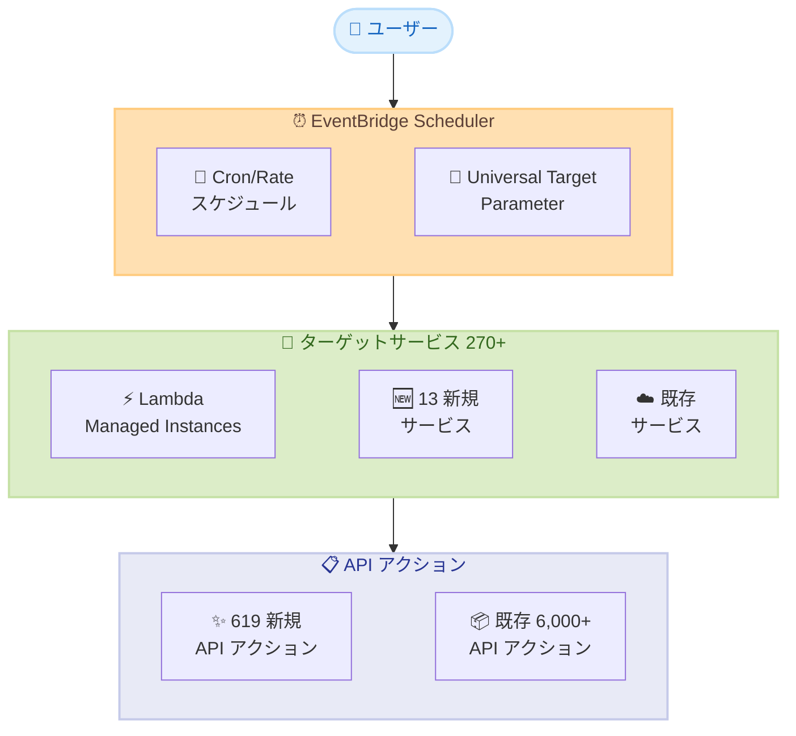

# Amazon EventBridge Scheduler - SDK インテグレーション拡張 (619 新規 API アクション)

**リリース日**: 2026年5月12日
**サービス**: Amazon EventBridge Scheduler
**機能**: AWS SDK インテグレーション拡張 (13 サービス追加、619 新規 API アクション)

📊 [このアップデートのインフォグラフィックを見る](https://takech9203.github.io/aws-news-summary/20260512-amazon-eventbridge-sdk-integrations.html)

## 概要

Amazon EventBridge Scheduler が AWS SDK インテグレーションを大幅に拡張し、13 の追加サービスと 619 の新規 API アクションをサポートするようになった。これにより、カスタム統合コードを記述することなく、より多くの AWS サービスへのスケジュール済み呼び出しを直接設定できるようになる。

EventBridge Scheduler は、270 以上の AWS サービスにわたって数十億のスケジュール済みイベントおよびタスクを作成・実行・管理できるサーバーレススケジューラである。今回の拡張により、AWS Lambda Managed Instances のスケーリング操作を含む、より幅広い AWS API アクションを Scheduler から直接スケジュールできるようになった。これにより、時間ベースのスケジュールで Lambda マネージドインスタンスのスケールアップ・スケールダウンを制御し、キャパシティプロビジョニングを精密に管理できる。

この機能強化は、AWS EventBridge Scheduler が利用可能なすべての AWS リージョンで一般提供 (GA) されている。

**アップデート前の課題**

- EventBridge Scheduler から直接呼び出せる API アクションが限定的であり、一部のサービスでは Lambda 関数等を介したカスタム統合コードが必要だった
- Lambda Managed Instances のキャパシティ管理を時間ベースでスケジュールするには、独自のオーケストレーションロジックを構築する必要があった
- SDK インテグレーションでカバーされていないサービスに対して、追加の中間レイヤーを構築・保守するコストが発生していた

**アップデート後の改善**

- 619 の新規 API アクションにより、カスタムコードなしで直接サービスを呼び出し可能
- Lambda Managed Instances のスケールアップ・スケールダウンを時間ベースで直接スケジュール可能
- 13 の新規サービスが追加され、EventBridge Scheduler の Universal Target で利用可能なサービス範囲が拡大

## アーキテクチャ図



EventBridge Scheduler がユニバーサルターゲットパラメータ (UTP) を通じて、新規 13 サービスを含む 270 以上の AWS サービスの API アクションを直接呼び出す構成を示している。

## サービスアップデートの詳細

### 主要機能

1. **619 新規 API アクションの追加**
   - 新規および既存の AWS サービスにわたる 619 の API アクションが Universal Target で利用可能に
   - カスタム統合コードを記述せずに、スケジュールから直接 AWS API を呼び出し可能
   - 読み取り専用 API (get, describe, list 等) を除く書き込み系アクションが対象

2. **13 新規サービスのサポート**
   - EventBridge Scheduler の Universal Target から呼び出せるサービスが 13 追加
   - 合計 270 以上の AWS サービスをカバー
   - 各サービスの対象 API アクションは、そのサービスのリージョン提供状況に依存

3. **Lambda Managed Instances のスケーリングサポート**
   - 時間ベースのスケジュールで Lambda Managed Instances のスケールアップ・スケールダウンを制御
   - キャパシティプロビジョニングの精密な管理が可能
   - ピークタイムに合わせた事前ウォームアップや、オフピーク時のスケールダウンを自動化

## 技術仕様

### Universal Target Parameter (UTP) の構成

| 項目 | 詳細 |
|------|------|
| 対象サービス数 | 270 以上 |
| 対象 API アクション数 | 6,000 以上 (今回 619 追加) |
| 新規追加サービス | 13 サービス |
| サポート対象外 | get, describe, list, poll, receive, search, scan, query, select, read 等の読み取り専用 API |

### Universal Target ARN 形式

```
arn:aws:scheduler:::aws-sdk:<service>:<apiAction>
```

**例**: Lambda Invoke の場合
```
arn:aws:scheduler:::aws-sdk:lambda:invoke
```

### API 変更履歴

今回のアップデートに関連する API 変更は、過去 3 日間で検出されていない。

### 必要な IAM ロール設定

```json
{
  "Version": "2012-10-17",
  "Statement": [
    {
      "Effect": "Allow",
      "Action": [
        "lambda:InvokeManagedInstance",
        "lambda:ScaleManagedInstance"
      ],
      "Resource": "arn:aws:lambda:*:123456789012:managed-instance/*"
    }
  ]
}
```

## 設定方法

### 前提条件

1. EventBridge Scheduler 用の IAM 実行ロールが作成済みであること
2. ターゲットサービスの API を呼び出すための適切な IAM 権限が設定されていること
3. AWS CLI v2 または AWS SDK がインストール済みであること

### 手順

#### ステップ 1: IAM 実行ロールの確認

```bash
# EventBridge Scheduler の実行ロールに必要な権限を確認
aws iam get-role-policy --role-name EventBridgeSchedulerRole --policy-name TargetPolicy
```

EventBridge Scheduler がターゲット API を呼び出すために使用する実行ロールに、対象サービスの API アクションを呼び出す権限が付与されていることを確認する。

#### ステップ 2: スケジュールの作成 (Lambda Managed Instances のスケーリング例)

```bash
# Lambda Managed Instances のスケールアップスケジュールを作成
aws scheduler create-schedule \
  --name "lambda-managed-instance-scale-up" \
  --schedule-expression "cron(0 8 * * ? *)" \
  --target '{
    "RoleArn": "arn:aws:iam::123456789012:role/EventBridgeSchedulerRole",
    "Arn": "arn:aws:scheduler:::aws-sdk:lambda:scaleManagedInstance",
    "Input": "{\"ManagedInstanceName\":\"my-instance\",\"DesiredCapacity\":10}"
  }' \
  --flexible-time-window '{"Mode": "OFF"}'
```

毎日午前 8 時 (UTC) に Lambda Managed Instances のキャパシティを 10 にスケールアップするスケジュールを作成する。

#### ステップ 3: スケールダウンスケジュールの作成

```bash
# Lambda Managed Instances のスケールダウンスケジュールを作成
aws scheduler create-schedule \
  --name "lambda-managed-instance-scale-down" \
  --schedule-expression "cron(0 22 * * ? *)" \
  --target '{
    "RoleArn": "arn:aws:iam::123456789012:role/EventBridgeSchedulerRole",
    "Arn": "arn:aws:scheduler:::aws-sdk:lambda:scaleManagedInstance",
    "Input": "{\"ManagedInstanceName\":\"my-instance\",\"DesiredCapacity\":2}"
  }' \
  --flexible-time-window '{"Mode": "FLEXIBLE", "MaximumWindowInMinutes": 15}'
```

毎日午後 10 時 (UTC) に Lambda Managed Instances のキャパシティを 2 にスケールダウンするスケジュールを作成する。Flexible Time Window を 15 分に設定し、スケジュール実行の分散を図る。

## メリット

### ビジネス面

- **運用コスト削減**: カスタム統合コード (Lambda 関数等) の開発・保守が不要になり、運用コストを削減
- **Time-to-Market の短縮**: 619 の新規 API アクションにより、新しい自動化シナリオを迅速に構築可能
- **コスト最適化**: Lambda Managed Instances の時間ベーススケーリングにより、ピーク外のリソースコストを最小化

### 技術面

- **アーキテクチャの簡素化**: 中間レイヤーを排除し、Scheduler からターゲットサービスへの直接呼び出しが可能
- **信頼性の向上**: マネージドサービスによるリトライ機構とエラーハンドリングを活用可能
- **スケーラビリティ**: 数十億のスケジュール済みタスクをインフラ管理なしで実行可能
- **精密なキャパシティ管理**: Lambda Managed Instances のプロビジョニングをスケジュールで事前制御

## デメリット・制約事項

### 制限事項

- 読み取り専用 API アクション (get, describe, list, poll, receive, search, scan, query, select, read, lookup, discover, validate 等) はサポート対象外
- 各 API アクションの利用可否は、ターゲットサービスのリージョン提供状況に依存
- Universal Target の Input には正しい JSON 形式でリクエストパラメータを指定する必要がある
- ペイロードサイズは 64 KB ごとに 1 イベントとして課金される

### 考慮すべき点

- IAM 実行ロールにターゲット API の呼び出し権限を適切に設定する必要がある
- Universal Target ARN のサービス識別子は AWS SDK サービス識別子と一致させる必要があり、エンドポイントプレフィックスとは異なる場合がある (例: Amazon Cognito Identity Provider は `cognitoidentityprovider` を使用)
- 新規追加された 13 サービスおよび 619 API アクションの具体的な一覧は、公式ドキュメントの Developer Guide を参照する必要がある

## ユースケース

### ユースケース 1: Lambda Managed Instances の時間ベーススケーリング

**シナリオ**: EC サイトが毎日 9 時から 21 時にトラフィックのピークを迎え、それ以外の時間帯はアクセスが少ない。Lambda Managed Instances を使用しているが、ピーク時のコールドスタートを回避しつつ、夜間のコストを最小化したい。

**実装例**:
```bash
# 朝 8:45 にスケールアップ (ピーク前に準備)
aws scheduler create-schedule \
  --name "ecommerce-scale-up" \
  --schedule-expression "cron(45 8 * * ? *)" \
  --target '{
    "RoleArn": "arn:aws:iam::123456789012:role/SchedulerRole",
    "Arn": "arn:aws:scheduler:::aws-sdk:lambda:scaleManagedInstance",
    "Input": "{\"ManagedInstanceName\":\"ecommerce-api\",\"DesiredCapacity\":20}"
  }' \
  --flexible-time-window '{"Mode": "OFF"}'

# 夜 22:00 にスケールダウン
aws scheduler create-schedule \
  --name "ecommerce-scale-down" \
  --schedule-expression "cron(0 22 * * ? *)" \
  --target '{
    "RoleArn": "arn:aws:iam::123456789012:role/SchedulerRole",
    "Arn": "arn:aws:scheduler:::aws-sdk:lambda:scaleManagedInstance",
    "Input": "{\"ManagedInstanceName\":\"ecommerce-api\",\"DesiredCapacity\":3}"
  }' \
  --flexible-time-window '{"Mode": "OFF"}'
```

**効果**: ピーク時のコールドスタートを完全に排除しつつ、オフピーク時のコストを最大 85% 削減。カスタムスケーリングロジックの開発・保守が不要。

### ユースケース 2: 定期的なデータ処理パイプラインの自動化

**シナリオ**: 毎日深夜にデータレイクのパーティション再構成や ETL ジョブのトリガーを行いたい。複数の AWS サービスを連携させる必要があるが、Step Functions を使うほど複雑ではない。

**実装例**:
```bash
# Glue Crawler を毎日 AM 2:00 に起動
aws scheduler create-schedule \
  --name "daily-glue-crawler" \
  --schedule-expression "cron(0 2 * * ? *)" \
  --target '{
    "RoleArn": "arn:aws:iam::123456789012:role/SchedulerRole",
    "Arn": "arn:aws:scheduler:::aws-sdk:glue:startCrawler",
    "Input": "{\"Name\":\"data-lake-crawler\"}"
  }' \
  --flexible-time-window '{"Mode": "FLEXIBLE", "MaximumWindowInMinutes": 30}'
```

**効果**: Lambda 関数やステートマシンを介さず、EventBridge Scheduler から直接 AWS サービスの API を呼び出すことで、アーキテクチャを簡素化し運用負荷を軽減。

### ユースケース 3: マルチサービスの定期メンテナンス自動化

**シナリオ**: 週末に開発環境のリソースを停止し、月曜日に再起動したい。RDS インスタンス、ECS サービス、SageMaker エンドポイントなど複数のサービスを横断して制御する必要がある。

**実装例**:
```bash
# 金曜 22:00 に RDS インスタンスを停止
aws scheduler create-schedule \
  --name "dev-rds-stop-weekend" \
  --schedule-expression "cron(0 22 ? * FRI *)" \
  --target '{
    "RoleArn": "arn:aws:iam::123456789012:role/SchedulerRole",
    "Arn": "arn:aws:scheduler:::aws-sdk:rds:stopDBInstance",
    "Input": "{\"DBInstanceIdentifier\":\"dev-database\"}"
  }' \
  --flexible-time-window '{"Mode": "OFF"}'

# 月曜 7:00 に RDS インスタンスを起動
aws scheduler create-schedule \
  --name "dev-rds-start-monday" \
  --schedule-expression "cron(0 7 ? * MON *)" \
  --target '{
    "RoleArn": "arn:aws:iam::123456789012:role/SchedulerRole",
    "Arn": "arn:aws:scheduler:::aws-sdk:rds:startDBInstance",
    "Input": "{\"DBInstanceIdentifier\":\"dev-database\"}"
  }' \
  --flexible-time-window '{"Mode": "OFF"}'
```

**効果**: 開発環境の週末コストを最大 60% 削減。各サービスの停止・起動を個別のスケジュールで管理し、カスタムスクリプトの保守を不要にする。

## 料金

EventBridge Scheduler の料金は呼び出し回数に基づく従量課金制である。

### 料金体系

| 項目 | 料金 |
|------|------|
| 月間呼び出し | $1.00 / 100 万回 |
| 無料利用枠 | 月間 14,000,000 回の呼び出し |
| ペイロード課金 | 64 KB ごとに 1 イベントとしてカウント |

### 料金例

| 使用量 | 月額料金 (概算) |
|--------|------------------|
| 月間 1,000 万回 | $0 (無料枠内) |
| 月間 2,000 万回 | $6.00 |
| 月間 5,000 万回 | $36.00 |
| 月間 1 億回 | $86.00 |

**注意**: ターゲットサービスの API 呼び出しに対する料金は別途発生する。例えば、Lambda Managed Instances のスケーリングを行う場合、Lambda 側のインスタンス料金も課金される。

## 利用可能リージョン

AWS EventBridge Scheduler が利用可能なすべての AWS リージョンで一般提供されている。ただし、特定のサービスおよび API アクションの利用可否は、ターゲットサービスのリージョン提供状況に依存する。

主要リージョンを含む以下のリージョンで利用可能。

- 米国東部 (バージニア北部、オハイオ)
- 米国西部 (オレゴン、北カリフォルニア)
- アジアパシフィック (東京、大阪、ソウル、シンガポール、シドニー、ムンバイ、香港)
- 欧州 (アイルランド、フランクフルト、ロンドン、パリ、ストックホルム)
- その他 EventBridge Scheduler 対応リージョン

## 関連サービス・機能

- **Amazon EventBridge**: イベント駆動アーキテクチャの中核サービス。EventBridge Scheduler は EventBridge ファミリーの一部
- **AWS Lambda Managed Instances**: スケーリング対象としてサポートされた新機能。時間ベースのキャパシティ管理が可能に
- **AWS Step Functions**: 複雑なワークフローオーケストレーション。EventBridge Scheduler は単純なスケジュール実行に最適
- **Amazon EventBridge Pipes**: イベントのフィルタリング・変換・ルーティング。Scheduler と組み合わせてイベント駆動パイプラインを構築
- **AWS Systems Manager Automation**: 定期的な運用タスクの自動化。Scheduler の Universal Target から直接呼び出し可能

## 参考リンク

- 📊 [インフォグラフィック](https://takech9203.github.io/aws-news-summary/20260512-amazon-eventbridge-sdk-integrations.html)
- [公式発表 (What's New)](https://aws.amazon.com/about-aws/whats-new/2026/05/amazon-eventbridge-sdk-integrations/)
- [EventBridge Scheduler Developer Guide - Universal Targets](https://docs.aws.amazon.com/scheduler/latest/UserGuide/managing-targets-universal.html)
- [EventBridge Scheduler とは](https://docs.aws.amazon.com/scheduler/latest/UserGuide/what-is-scheduler.html)
- [EventBridge 料金ページ](https://aws.amazon.com/eventbridge/pricing/)

## まとめ

Amazon EventBridge Scheduler の SDK インテグレーション拡張により、619 の新規 API アクションと 13 の追加サービスが利用可能となった。特に Lambda Managed Instances の時間ベーススケーリングのサポートは、サーバーレスアーキテクチャにおけるキャパシティ管理の精度向上に大きく貢献する。カスタム統合コードの削減によるアーキテクチャ簡素化と運用コスト削減を実現するため、既存のスケジュール自動化ワークフローを見直し、Universal Target への移行を検討することを推奨する。
