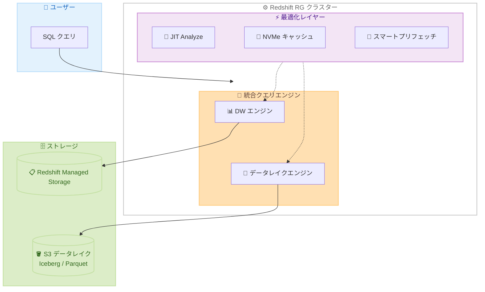

# Amazon Redshift - RG インスタンス (AWS Graviton 搭載)

**リリース日**: 2026 年 5 月 12 日
**サービス**: Amazon Redshift
**機能**: RG インスタンス (AWS Graviton プロセッサ搭載の新世代プロビジョンドクラスターノード)

📊 [このアップデートのインフォグラフィックを見る](https://takech9203.github.io/aws-news-summary/20260512-amazon-redshift-rg-instances-powered-by-graviton.html)

## 概要

Amazon Redshift が AWS Graviton プロセッサを搭載した新世代のプロビジョンドクラスターノード「RG インスタンス」の一般提供 (GA) を開始した。RG インスタンスは、前世代の RA3 インスタンスと比較してデータウェアハウスおよびデータレイクワークロードを最大 2.4 倍高速に実行し、vCPU あたりの価格が 30% 低減されている。

RG インスタンスには、Redshift 独自のベクトル化データレイククエリエンジンが組み込まれており、Apache Iceberg および Parquet データをクラスターノード上で直接処理できる。これにより、Redshift Spectrum の別途スキャニングフリートとテラバイトあたりの課金が不要になり、単一エンジンでデータウェアハウスとデータレイクの SQL 分析を実行できる。

**アップデート前の課題**

- RA3 インスタンスでのデータレイククエリには Redshift Spectrum の利用が必要で、テラバイトあたりの追加課金が発生していた
- データウェアハウスとデータレイクで別々のクエリエンジンを使い分ける必要があった
- テーブル統計情報の手動更新 (ANALYZE コマンド) が必要で、統計が古くなるとクエリパフォーマンスが低下していた
- vCPU あたりのコストが高く、大規模ワークロードでのコスト効率に課題があった

**アップデート後の改善**

- 組み込みデータレイクエンジンにより Redshift Spectrum が不要になり、データレイクアクセスの追加コストが削減された
- 単一エンジンでデータウェアハウスと S3 上のオープンフォーマットデータの両方をクエリ可能になった
- JIT Analyze による自動統計収集で手動チューニングが不要になった
- vCPU あたり 30% のコスト削減と最大 2.4 倍のパフォーマンス向上を実現した

## アーキテクチャ図



RG インスタンスでは統合クエリエンジンが Redshift Managed Storage と S3 データレイクの両方に直接アクセスし、NVMe キャッシュや JIT Analyze などの最適化レイヤーが自動的にパフォーマンスを向上させる。

## サービスアップデートの詳細

### 主要機能

1. **ベクトル化データレイククエリエンジン**
   - Apache Iceberg および Parquet データをクラスターノード上で直接処理
   - Redshift Spectrum の別途スキャニングフリートが不要
   - 単一エンジンでデータウェアハウスとデータレイクを統合クエリ
   - テラバイトあたりの Spectrum 課金が不要

2. **Just-in-Time (JIT) Analyze**
   - テーブル統計情報を自動で収集・更新
   - データやワークロードパターンの変化に自動適応
   - 手動チューニングなしで一貫して高速なクエリを実現
   - ANALYZE コマンドの手動実行が不要

3. **インテリジェント NVMe キャッシング**
   - 頻繁にアクセスされるデータセットをコンピュートの近くに保持
   - データレイクへのラウンドトリップを削減
   - 繰り返しクエリの応答時間を高速化
   - スマートプリフェッチ機能との連携でさらに効率化

4. **高性能 I/O サブシステム**
   - 専用設計のスマートプリフェッチ機能
   - ベクトル化 Parquet スキャン
   - 高度なファイルレベルおよびパーティションレベルのプルーニング
   - データレイク読み取りに最適化されたアーキテクチャ

## 技術仕様

### パフォーマンス比較 (RA3 インスタンス対比)

| ワークロードタイプ | パフォーマンス向上 |
|------|------|
| データウェアハウスワークロード | 最大 2.2 倍高速 |
| Apache Iceberg クエリ | 最大 2.4 倍高速 |
| Parquet ワークロード | 最大 1.5 倍高速 |
| vCPU あたりの価格 | 30% 低減 |

### インスタンスサイズ

| インスタンスタイプ | オンデマンド料金 (US East) |
|------|------|
| rg.xlarge | 公式料金ページ参照 |
| rg.4xlarge | $3.04267/時間 |
| rg.large | 公式料金ページ参照 |
| rg.12xlarge | 公式料金ページ参照 |

### API 変更履歴

過去 3 日間で Redshift に関連する API 変更は確認されなかった。

### 主要技術要素

| 項目 | 詳細 |
|------|------|
| プロセッサ | AWS Graviton |
| ストレージ | Redshift Managed Storage (RMS) |
| キャッシュ | NVMe SSD |
| データレイクフォーマット | Apache Iceberg、Parquet |
| クエリエンジン | ベクトル化統合エンジン |
| 統計管理 | JIT Analyze (自動) |

## 設定方法

### 前提条件

1. AWS アカウントと Amazon Redshift へのアクセス権限
2. 新規クラスター作成またはマイグレーション対象の既存 RA3 クラスター
3. VPC およびセキュリティグループの設定

### 手順

#### ステップ 1: 新規 RG クラスターの作成

```bash
aws redshift create-cluster \
  --cluster-identifier my-rg-cluster \
  --node-type rg.4xlarge \
  --number-of-nodes 4 \
  --master-username admin \
  --master-user-password <password> \
  --db-name mydb
```

新規の RG クラスターを 4 ノード構成で作成する。ノードタイプには rg.xlarge または rg.4xlarge を指定する。

#### ステップ 2: 既存 RA3 クラスターからのマイグレーション (Elastic Resize)

```bash
aws redshift resize-cluster \
  --cluster-identifier my-ra3-cluster \
  --cluster-type multi-node \
  --node-type rg.4xlarge \
  --number-of-nodes 4
```

Elastic Resize を使用して既存の RA3 クラスターを RG インスタンスに変更する。この方法では数分でリサイズが完了する。

#### ステップ 3: Snapshot & Restore によるマイグレーション

```bash
# スナップショットの作成
aws redshift create-cluster-snapshot \
  --cluster-identifier my-ra3-cluster \
  --snapshot-identifier my-migration-snapshot

# RG インスタンスでリストア
aws redshift restore-from-cluster-snapshot \
  --cluster-identifier my-rg-cluster \
  --snapshot-identifier my-migration-snapshot \
  --node-type rg.4xlarge \
  --number-of-nodes 4
```

既存 RA3 クラスターのスナップショットを取得し、新しい RG クラスターとしてリストアする。データの整合性を保ちながらマイグレーションが可能。

#### ステップ 4: データレイクテーブルへのクエリ

```sql
-- Iceberg テーブルへの直接クエリ (Spectrum 不要)
SELECT *
FROM my_iceberg_catalog.my_database.my_table
WHERE event_date >= '2026-01-01';

-- Parquet データへの直接クエリ
SELECT *
FROM my_data_lake_schema.parquet_table
WHERE partition_key = '2026-05';
```

RG インスタンスでは組み込みデータレイクエンジンにより、Redshift Spectrum を設定せずに S3 上の Iceberg や Parquet データを直接クエリできる。

## メリット

### ビジネス面

- **コスト削減**: vCPU あたり 30% の価格低減に加え、Redshift Spectrum のテラバイトあたり課金が不要になりデータレイククエリのコストが大幅に削減される
- **運用効率の向上**: JIT Analyze による自動統計管理で DBA の手動チューニング作業が削減される
- **TCO 最適化**: 単一エンジンでデータウェアハウスとデータレイクを統合し、別途 Spectrum クラスターの管理が不要になる

### 技術面

- **パフォーマンス向上**: Graviton プロセッサとベクトル化エンジンにより最大 2.4 倍の処理速度を実現
- **アーキテクチャ簡素化**: データウェアハウスとデータレイクのクエリを単一エンジンに統合し、設計がシンプルになる
- **インテリジェントキャッシュ**: NVMe キャッシングとスマートプリフェッチにより、繰り返しクエリのレイテンシが大幅に削減される
- **自動最適化**: JIT Analyze がワークロードパターンの変化に自動適応し、常に最適なクエリプランを維持

## デメリット・制約事項

### 制限事項

- 現時点で利用可能なインスタンスサイズは rg.xlarge と rg.4xlarge の 2 種類 (発表時点)
- 既存 RA3 クラスターからのマイグレーションには Snapshot & Restore、Elastic Resize、または Classic Resize が必要
- DC2 や DS2 などの旧世代ノードからの直接マイグレーションパスは公式に言及されていない

### 考慮すべき点

- マイグレーション中の一時的なダウンタイムやパフォーマンス影響の評価が必要
- 既存の Redshift Spectrum を使用したワークロードの移行計画とテストが必要
- Reserved Instance の既存契約がある場合、RG への移行タイミングの検討が必要
- Parquet ワークロードの改善倍率 (1.5 倍) は Iceberg (2.4 倍) と比較して控えめなため、ワークロード特性に応じた評価が望ましい

## ユースケース

### ユースケース 1: データウェアハウスとデータレイクの統合分析

**シナリオ**: 企業がデータウェアハウス (Redshift テーブル) とデータレイク (S3 上の Iceberg テーブル) の両方のデータを結合してビジネスインテリジェンスレポートを作成する必要がある。

**実装例**:
```sql
-- RG インスタンスでの統合クエリ (Spectrum 不要)
SELECT
    w.customer_id,
    w.total_revenue,
    dl.clickstream_count
FROM warehouse_schema.customers w
JOIN iceberg_catalog.analytics.clickstreams dl
    ON w.customer_id = dl.customer_id
WHERE w.region = 'APAC'
    AND dl.event_date >= '2026-04-01';
```

**効果**: Redshift Spectrum を別途設定・管理する必要がなくなり、テラバイトあたりのスキャン課金も不要。パフォーマンスは最大 2.4 倍向上しつつコストが削減される。

### ユースケース 2: 大規模データウェアハウスのコスト最適化

**シナリオ**: 大規模な RA3 クラスター (10 ノード以上) を運用しているが、コスト削減とパフォーマンス向上を同時に達成したい。

**実装例**:
```bash
# Elastic Resize で RA3 から RG にマイグレーション
aws redshift resize-cluster \
  --cluster-identifier production-dw \
  --cluster-type multi-node \
  --node-type rg.4xlarge \
  --number-of-nodes 8
```

**効果**: vCPU あたり 30% のコスト削減と最大 2.2 倍のパフォーマンス向上を同時に実現。10 ノードの rg.4xlarge クラスターの場合、1 時間あたり約 $33.66 で運用可能。

### ユースケース 3: リアルタイム分析基盤の構築

**シナリオ**: IoT デバイスからのストリーミングデータが S3 に Parquet 形式で保存されており、これをリアルタイムに近い形で分析したい。

**実装例**:
```sql
-- NVMe キャッシュとスマートプリフェッチが自動最適化
SELECT
    device_id,
    AVG(temperature) as avg_temp,
    MAX(pressure) as max_pressure
FROM data_lake.iot_events
WHERE event_timestamp >= DATEADD(hour, -1, GETDATE())
GROUP BY device_id
HAVING AVG(temperature) > 80;
```

**効果**: インテリジェント NVMe キャッシュが頻繁にアクセスされるデータを自動保持し、繰り返しクエリの応答時間を短縮。JIT Analyze がデータパターンの変化に自動適応する。

## 料金

RG インスタンスは On-Demand、1 年リザーブド、3 年リザーブド (前払いなし) の料金オプションで提供される。Redshift Managed Storage (RMS) の料金はデータ使用量に基づき別途課金される。

### 料金例

| 構成 | 月額料金 (概算、US East) |
|--------|------------------|
| 4 x rg.4xlarge + 40 TB RMS | 約 $9,868 (RG: $8,885 + RMS: $983) |
| 4 x rg.4xlarge Multi-AZ + 40 TB RMS | 約 $18,752 (RG: $17,769 + RMS: $983) |
| RMS ストレージ | $0.024/GB/月 |
| Redshift Spectrum (データレイク) | RG インスタンスでは不要 ($0) |

**注記**: RG インスタンスではデータレイクへのクエリに Redshift Spectrum の別途課金は発生しない。従来 RA3 + Spectrum で $5/TB のスキャン課金が発生していた部分が RG インスタンスの組み込みエンジンでカバーされる。

## 利用可能リージョン

以下の 25 リージョンで利用可能。

- US East (N. Virginia)
- US East (Ohio)
- US West (Oregon)
- US West (N. California)
- Canada (Central)
- South America (Sao Paulo)
- Europe (Ireland)
- Europe (Frankfurt)
- Europe (London)
- Europe (Paris)
- Europe (Stockholm)
- Europe (Milan)
- Europe (Spain)
- Asia Pacific (Tokyo)
- Asia Pacific (Seoul)
- Asia Pacific (Singapore)
- Asia Pacific (Sydney)
- Asia Pacific (Mumbai)
- Asia Pacific (Jakarta)
- Asia Pacific (Hong Kong)
- Asia Pacific (Osaka)
- Asia Pacific (Malaysia)
- Asia Pacific (Hyderabad)
- Asia Pacific (Taiwan)
- Asia Pacific (Melbourne)

## 関連サービス・機能

- **Amazon Redshift Managed Storage (RMS)**: RG インスタンスのデータストレージバックエンド。コンピュートとストレージの独立スケーリングを実現
- **Amazon S3**: データレイクのストレージ基盤。RG インスタンスから Iceberg/Parquet データに直接アクセス
- **Apache Iceberg**: RG インスタンスの組み込みエンジンでネイティブサポートされるオープンテーブルフォーマット
- **AWS Graviton**: RG インスタンスに搭載される Arm ベースプロセッサ。高いコストパフォーマンスを提供
- **Amazon Redshift Spectrum**: RG インスタンスでは不要になるが、RA3 インスタンスでのデータレイクアクセスには引き続き利用可能

## 参考リンク

- 📊 [インフォグラフィック](https://takech9203.github.io/aws-news-summary/20260512-amazon-redshift-rg-instances-powered-by-graviton.html)
- [公式発表 (What's New)](https://aws.amazon.com/about-aws/whats-new/2026/05/amazon-redshift-rg-instances-powered-by-graviton)
- [Amazon Redshift RG Instance Documentation](https://docs.aws.amazon.com/redshift/latest/mgmt/working-with-clusters.html)
- [RA3 to RG Upgrade Guide](https://docs.aws.amazon.com/redshift/latest/mgmt/managing-cluster-operations.html)
- [料金ページ](https://aws.amazon.com/redshift/pricing/)

## まとめ

Amazon Redshift RG インスタンスは、AWS Graviton プロセッサの採用と組み込みベクトル化データレイクエンジンにより、パフォーマンスとコスト効率の両面で大幅な改善を実現する重要なアップデートである。特に、Redshift Spectrum が不要になることでアーキテクチャが簡素化され、データレイククエリのコストが削減される点は、データウェアハウスとデータレイクを併用する環境にとって大きなメリットとなる。既存の RA3 ユーザーは、Elastic Resize を活用した段階的なマイグレーション計画を検討することを推奨する。
