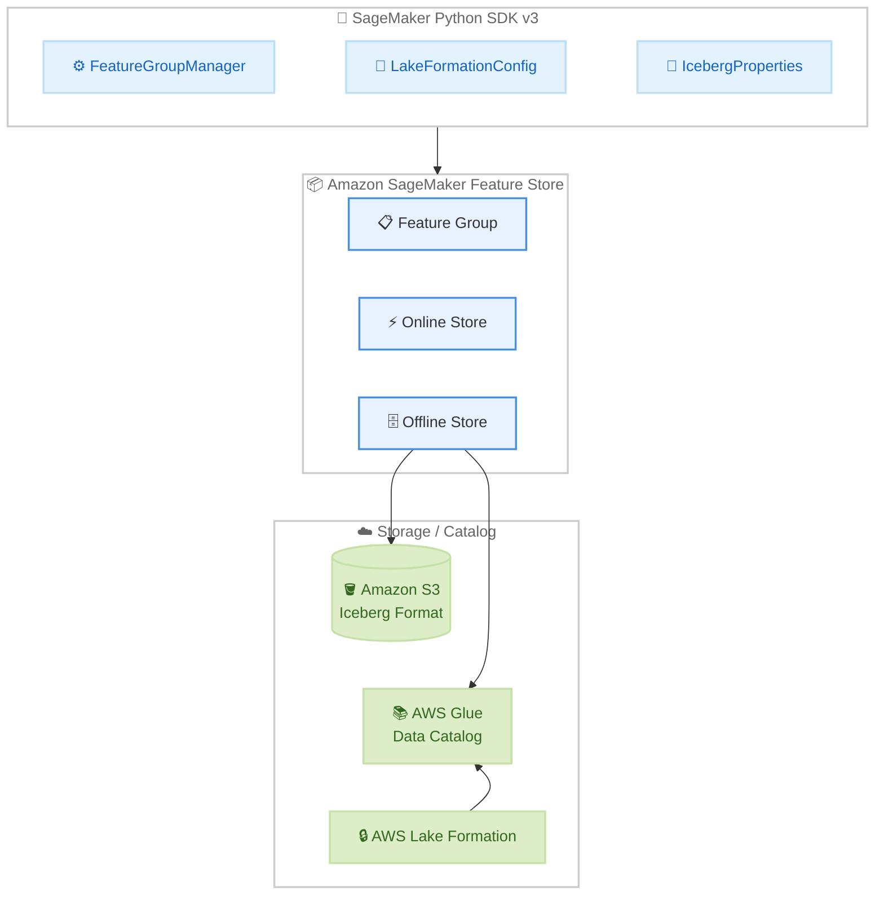

# Amazon SageMaker Feature Store - SageMaker Python SDK v3 サポート

**リリース日**: 2026年5月12日
**サービス**: Amazon SageMaker Feature Store
**機能**: SageMaker Python SDK v3 対応 (Lake Formation アクセス制御 / Apache Iceberg テーブルプロパティ設定)

📊 [このアップデートのインフォグラフィックを見る](https://takech9203.github.io/aws-news-summary/20260512-amazon-sagemaker-feature-store-pyv3.html)

## 概要

Amazon SageMaker Feature Store が SageMaker Python SDK v3 をサポートし、AWS Lake Formation によるアクセス制御と Apache Iceberg テーブルプロパティの設定機能が追加された。Feature Store は ML モデル向けの特徴量を保存・共有・管理するフルマネージドリポジトリであり、今回のアップデートにより、データサイエンティストはモダンなモジュラー SDK v3 インターフェースを使用して、きめ細かなアクセス制御と最適化されたオフラインストレージでフィーチャーグループを管理できるようになった。

SDK v3 では合理化されたワークフローと削減されたボイラープレートコードにより、フィーチャーグループの管理が簡素化される。Lake Formation 統合によりオフラインストアデータに対する列レベルおよび行レベルのアクセス制御が可能となり、Iceberg プロパティサポートによりコンパクションやスナップショット有効期限などのテーブルプロパティを SDK から直接設定できるようになった。

**アップデート前の課題**

- Feature Store のオフラインストアデータに対するアクセス制御は IAM ポリシーのみで管理する必要があり、列レベル・行レベルの細粒度アクセス制御が困難だった
- Iceberg テーブルのプロパティ (コンパクション、スナップショット保持など) を設定するには AWS Glue API を直接操作する必要があった
- SDK v2 のインターフェースは冗長でボイラープレートコードが多く、フィーチャーグループの管理に手間がかかっていた
- アクセス制御とストレージ最適化に別々のツールを使い分ける必要があった

**アップデート後の改善**

- Lake Formation 統合により、フィーチャーグループ作成時にオプトインするだけでオフラインストアに列レベル・行レベル・セルレベルのアクセス制御を適用可能になった
- SDK v3 から Iceberg テーブルプロパティを直接設定でき、ストレージとクエリパフォーマンスの最適化が容易になった
- モジュラーな SDK v3 インターフェースにより、ワークフローが合理化されボイラープレートが削減された
- 単一の SDK からアクセスガバナンスとオフラインストアのパフォーマンス最適化の両方を管理可能になった

## アーキテクチャ図



SDK v3 の `FeatureGroupManager` を中心に、Lake Formation によるアクセス制御と Iceberg プロパティ設定がオフラインストアに適用される構成を示す。

## サービスアップデートの詳細

### 主要機能

1. **SageMaker Python SDK v3 対応**
   - モダンなモジュラーアーキテクチャによる新しい `FeatureGroupManager` クラスの提供
   - `sagemaker.mlops.feature_store` モジュールを使用したフィーチャーグループ管理
   - ワークフローの合理化とボイラープレートコードの削減
   - フィーチャーグループの作成・取得・更新を統一的な API で実行

2. **AWS Lake Formation アクセス制御統合**
   - オフラインストアデータに対する列レベル、行レベル、セルレベルのセキュリティ適用
   - `LakeFormationConfig` クラスによる設定のカプセル化
   - ハイブリッドアクセスモード: IAM ポリシーと Lake Formation 権限の共存が可能
   - Lake Formation 専用モード: Lake Formation 権限のみで評価する厳格なアクセス制御
   - クロスアカウントアクセスのサポート
   - `acknowledge_risk` パラメータによる安全確認ゲート

3. **Apache Iceberg テーブルプロパティ設定**
   - `IcebergProperties` クラスによるバリデーション付きプロパティ設定
   - スナップショット保持、メタデータファイル管理、書き込み動作の制御
   - フィーチャーグループ作成時または既存グループへの更新で設定可能
   - 許可されたプロパティのみ設定可能なバリデーション機能

## 技術仕様

### Lake Formation 設定パラメータ

| パラメータ | 型 | デフォルト | 説明 |
|------|------|------|------|
| `enabled` | bool | False | Lake Formation をアクティブにするかどうか |
| `use_service_linked_role` | bool | True | Lake Formation サービスリンクロールを使用するか |
| `registration_role_arn` | str | None | カスタム登録ロールの ARN |
| `hybrid_access_mode_enabled` | bool | - | IAM と Lake Formation の共存を許可するか |
| `acknowledge_risk` | bool | - | リスク確認の安全ゲート |

### 許可された Iceberg テーブルプロパティ

| プロパティ | デフォルト値 | 説明 |
|------|------|------|
| `write.metadata.delete-after-commit.enabled` | false | コミット後に古いメタデータファイルを削除するか |
| `write.metadata.previous-versions-max` | 100 | 追跡する過去バージョンメタデータファイルの最大数 |
| `history.expire.max-snapshot-age-ms` | 432000000 (5日) | スナップショットの最大保持期間 |
| `history.expire.min-snapshots-to-keep` | 1 | 保持するスナップショットの最小数 |
| `history.expire.max-ref-age-ms` | Long.MAX_VALUE | スナップショット参照の最大保持期間 |
| `write.target-file-size-bytes` | 536870912 (512 MB) | 生成ファイルのターゲットサイズ |
| `write.delete.target-file-size-bytes` | 67108864 (64 MB) | 削除ファイルのターゲットサイズ |
| `write.delete.mode` | copy-on-write | 削除コマンドのモード |
| `write.update.mode` | copy-on-write | 更新コマンドのモード |
| `write.delete.granularity` | partition | 削除ファイルの粒度 |
| `write.parquet.row-group-size-bytes` | 134217728 (128 MB) | Parquet 行グループサイズ |
| `read.split.target-size` | 134217728 (128 MB) | データ入力スプリットのターゲットサイズ |
| `read.split.metadata-target-size` | 33554432 (32 MB) | メタデータスプリットのターゲットサイズ |
| `read.split.open-file-cost` | 4194304 (4 MB) | ファイルオープンの推定コスト |

### API 変更履歴

過去 3 日間に関連する API 変更は確認されていない。

## 設定方法

### 前提条件

1. SageMaker Python SDK v3.8.0 以降がインストールされていること
2. オフラインストアが設定された SageMaker Feature Group (Iceberg テーブル形式)
3. Lake Formation 使用時: Lake Formation 管理者が設定済みであること
4. 適切な IAM 権限 (`AmazonSageMakerFeatureStoreAccess`、`AmazonSageMakerFullAccess`)

### 手順

#### ステップ 1: SDK のインストールまたはアップグレード

```bash
pip install --upgrade sagemaker>=3.8.0
```

SageMaker Python SDK v3.8.0 以降をインストールする。既存の環境がある場合はアップグレードを実行する。

#### ステップ 2: Lake Formation を有効化したフィーチャーグループの作成

```python
from sagemaker.mlops.feature_store import (
    FeatureGroupManager,
    LakeFormationConfig,
    OfflineStoreConfig,
    S3StorageConfig,
)

fg = FeatureGroupManager.create(
    # ... 他のパラメータ ...
    offline_store_config=OfflineStoreConfig(
        s3_storage_config=S3StorageConfig(s3_uri="s3://my-bucket/features/"),
        table_format="Iceberg",
    ),
    lake_formation_config=LakeFormationConfig(
        enabled=True,
        hybrid_access_mode_enabled=True,
        acknowledge_risk=True,
    ),
)
```

`LakeFormationConfig` で Lake Formation を有効化し、ハイブリッドアクセスモードを選択する。`acknowledge_risk=True` は安全確認のために必須。

#### ステップ 3: Iceberg プロパティの設定

```python
from sagemaker.mlops.feature_store import (
    FeatureGroupManager,
    IcebergProperties,
    OfflineStoreConfig,
    S3StorageConfig,
)

fg = FeatureGroupManager.create(
    # ... 他のパラメータ ...
    offline_store_config=OfflineStoreConfig(
        s3_storage_config=S3StorageConfig(s3_uri="s3://my-bucket/features/"),
        table_format="Iceberg",
    ),
    iceberg_properties=IcebergProperties(
        properties={
            "write.target-file-size-bytes": "536870912",
            "history.expire.min-snapshots-to-keep": "3",
        }
    ),
)
```

`IcebergProperties` クラスでテーブルプロパティを設定する。バリデーション機能により、許可されていないプロパティを指定するとエラーが発生する。

#### ステップ 4: 既存フィーチャーグループの Iceberg プロパティ更新

```python
fg = FeatureGroupManager.get(feature_group_name="my-feature-group")
fg.update(
    iceberg_properties=IcebergProperties(
        properties={
            "write.target-file-size-bytes": "268435456",
            "write.delete.mode": "merge-on-read",
        }
    ),
)
```

既存のフィーチャーグループに対して Iceberg プロパティを後から変更する。

#### ステップ 5: 設定済みプロパティの確認

```python
fg = FeatureGroupManager.get(
    feature_group_name="my-feature-group",
    include_iceberg_properties=True,
)
print(fg.iceberg_properties.properties)
# 例: {"write.target-file-size-bytes": "536870912"}
```

`include_iceberg_properties=True` を指定して、設定済みの Iceberg プロパティを確認する。

## メリット

### ビジネス面

- **データガバナンスの強化**: Lake Formation による細粒度アクセス制御により、コンプライアンス要件 (GDPR、HIPAA など) への対応が容易になる
- **運用コストの削減**: 単一の SDK からアクセス制御とストレージ最適化の両方を管理できるため、ツール管理の負担が軽減される
- **段階的な移行が可能**: ハイブリッドアクセスモードにより既存のワークフローを維持しながら Lake Formation への移行が可能

### 技術面

- **ストレージ最適化**: Iceberg プロパティによりコンパクション、スナップショット保持、ファイルサイズを最適化し、クエリパフォーマンスが向上する
- **開発生産性の向上**: SDK v3 のモジュラー設計とバリデーション機能により、設定ミスを防止しつつ迅速な開発が可能
- **クロスアカウントアクセス**: Lake Formation のクロスアカウント共有機能により、組織間でのフィーチャーデータ共有が安全に実現できる

## デメリット・制約事項

### 制限事項

- Lake Formation アクセス制御はオフラインストアのみに適用される。オンラインストアへのアクセスは引き続き IAM ポリシーで制御する
- 許可リスト外の Iceberg プロパティを変更した場合、Feature Store の互換性が保証されず、オフラインストアへの書き込み不能につながる可能性がある
- Iceberg テーブル形式を使用するフィーチャーグループでクロスアカウントアクセスを行う場合、ハイブリッドアクセスモードを無効にする必要がある
- `hybrid_access_mode_enabled=False` を設定すると、IAM ポリシーのみでアクセスしていた既存のジョブやノートブックが即座にアクセスを失う

### 考慮すべき点

- Lake Formation 有効化後、SDK は自動的に S3 拒否ポリシーを適用しない。推奨されるバケットポリシーを手動で適用する必要がある
- サードパーティのクエリエンジン (Apache Spark など) を使用する場合、サービスリンクロールは使用できず、カスタム登録ロールが必要
- SDK v2 から v3 への移行が必要であり、既存コードの書き換えが発生する場合がある

## ユースケース

### ユースケース 1: マルチチームでの特徴量共有とアクセス制御

**シナリオ**: 大規模な ML 組織で、複数のデータサイエンスチームが共通の特徴量ストアを使用しているが、チームごとにアクセスできる特徴量を制限したい。

**実装例**:
```python
from sagemaker.mlops.feature_store import (
    FeatureGroupManager,
    LakeFormationConfig,
)

# Lake Formation を有効化してフィーチャーグループを作成
fg = FeatureGroupManager.create(
    feature_group_name="customer-features",
    lake_formation_config=LakeFormationConfig(
        enabled=True,
        hybrid_access_mode_enabled=True,
        acknowledge_risk=True,
    ),
    # ... 他のパラメータ ...
)

# Lake Formation コンソールで列レベル権限を設定:
# チーム A: 全列アクセス可
# チーム B: PII 列を除くアクセスのみ
```

**効果**: 個別の IAM ポリシーを各チームに作成する代わりに、Lake Formation の統一されたアクセス制御モデルで管理でき、運用負荷が大幅に軽減される。

### ユースケース 2: 大規模特徴量テーブルのパフォーマンス最適化

**シナリオ**: 数億レコードの特徴量データを持つオフラインストアで、クエリレスポンス時間が増加している。スナップショットの肥大化とファイルサイズの最適化が必要。

**実装例**:
```python
from sagemaker.mlops.feature_store import (
    FeatureGroupManager,
    IcebergProperties,
)

fg = FeatureGroupManager.get(feature_group_name="large-feature-group")
fg.update(
    iceberg_properties=IcebergProperties(
        properties={
            "write.target-file-size-bytes": "268435456",  # 256 MB
            "history.expire.max-snapshot-age-ms": "259200000",  # 3 日
            "history.expire.min-snapshots-to-keep": "2",
            "write.metadata.delete-after-commit.enabled": "true",
            "write.metadata.previous-versions-max": "50",
        }
    ),
)
```

**効果**: スナップショットの保持期間を短縮しメタデータを自動クリーンアップすることで、テーブルのメタデータサイズを抑制し、クエリパフォーマンスが改善される。

### ユースケース 3: コンプライアンス要件に基づく行レベルセキュリティ

**シナリオ**: 金融機関で、地域ごとに異なる規制要件があり、各地域のデータサイエンティストは自地域の顧客データのみにアクセスする必要がある。

**実装例**:
```python
from sagemaker.mlops.feature_store import (
    FeatureGroupManager,
    LakeFormationConfig,
)

# Lake Formation 専用モードで最大限のセキュリティを確保
fg = FeatureGroupManager.create(
    feature_group_name="customer-financial-features",
    lake_formation_config=LakeFormationConfig(
        enabled=True,
        hybrid_access_mode_enabled=False,  # Lake Formation のみ
        acknowledge_risk=True,
    ),
    # ... 他のパラメータ ...
)

# Lake Formation で行フィルタリングを設定:
# 地域 A チーム: region='asia' のレコードのみ
# 地域 B チーム: region='europe' のレコードのみ
```

**効果**: Lake Formation の行レベルフィルタリングにより、IAM ポリシーでは実現困難だった行レベルのデータアクセス制御が実現され、規制要件への準拠が容易になる。

## 料金

Amazon SageMaker Feature Store の料金は、今回のアップデートによる追加料金はない。既存の Feature Store 料金体系が適用される。

### 料金例

| 項目 | 料金 |
|------|------|
| オンラインストア (読み取り/書き込み) | リクエスト数に応じた従量課金 |
| オンラインストア (ストレージ) | GB あたりの月額料金 |
| オフラインストア (ストレージ) | S3 標準ストレージ料金 |
| AWS Lake Formation | Lake Formation 自体は追加料金なし (基盤サービスの料金が適用) |

**注**: 正確な料金は [Amazon SageMaker の料金ページ](https://aws.amazon.com/sagemaker/ai/pricing/) を参照。

## 利用可能リージョン

Amazon SageMaker Feature Store が利用可能なすべての AWS リージョンで利用可能。

## 関連サービス・機能

- **AWS Lake Formation**: データレイクのアクセス制御を一元管理するサービス。Feature Store のオフラインストアに対する細粒度アクセス制御を提供
- **Apache Iceberg**: オープンテーブルフォーマット。Feature Store のオフラインストアのストレージ形式として使用
- **AWS Glue Data Catalog**: Feature Store のオフラインストアテーブルのメタデータを管理
- **Amazon S3**: Feature Store のオフラインストアデータの物理ストレージ
- **Amazon SageMaker AI**: ML モデルの構築・学習・デプロイの統合プラットフォーム

## 参考リンク

- 📊 [インフォグラフィック](https://takech9203.github.io/aws-news-summary/20260512-amazon-sagemaker-feature-store-pyv3.html)
- [公式発表 (What's New)](https://aws.amazon.com/about-aws/whats-new/2026/05/amazon-sagemaker-feature-store-pyv3/)
- [Lake Formation アクセス制御ドキュメント](https://docs.aws.amazon.com/sagemaker/latest/dg/feature-store-lf-governance.html)
- [Iceberg メタデータ管理ドキュメント](https://docs.aws.amazon.com/sagemaker/latest/dg/feature-store-iceberg-metadata-management.html)
- [SageMaker Python SDK ドキュメント](https://sagemaker.readthedocs.io/en/stable/)
- [Amazon SageMaker Feature Store](https://aws.amazon.com/sagemaker/ai/feature-store/)
- [料金ページ](https://aws.amazon.com/sagemaker/ai/pricing/)

## まとめ

Amazon SageMaker Feature Store の SageMaker Python SDK v3 サポートは、ML 特徴量管理におけるセキュリティとパフォーマンス最適化の両面で重要なアップデートである。Lake Formation 統合により企業レベルのデータガバナンスが実現でき、Iceberg プロパティ設定によりオフラインストアのパフォーマンスチューニングが容易になった。既存の Feature Store ユーザーは SDK v3.8.0 以降へのアップグレードを推奨する。特にマルチチーム環境や規制対応が求められる組織にとって、Lake Formation によるアクセス制御の導入を検討すべきである。
