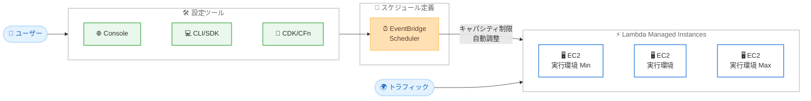

# AWS Lambda - Lambda Managed Instances でのスケジュールスケーリング

**リリース日**: 2026年5月12日
**サービス**: AWS Lambda
**機能**: Scheduled Scaling for Lambda Managed Instances

📊 [このアップデートのインフォグラフィックを見る](https://takech9203.github.io/aws-news-summary/20260512-aws-lambda-managed-instances.html)

## 概要

AWS Lambda は、Lambda Managed Instances 上で実行される関数に対するスケジュールスケーリング機能のサポートを発表した。Amazon EventBridge Scheduler を使用して、1 回限りまたは定期的なスケジュールを定義し、予想されるトラフィックに先立って関数のキャパシティ制限をプロアクティブに調整できる。

Lambda Managed Instances は、マネージド Amazon EC2 インスタンス上で Lambda 関数を実行し、ルーティング、ロードバランシング、オートスケーリングを組み込みで提供するサービスである。キャパシティは、設定された最小値と最大値の実行環境制限の間でトラフィックに基づいてスケールする。今回のアップデートにより、ビジネスアワーアプリケーションやマーケティングイベントなど、予測可能なトラフィックパターンを持つワークロードに対して、事前にキャパシティを自動調整できるようになった。

この機能は、ピーク時のパフォーマンス目標を達成しつつ、アイドル期間のコストを回避したいユーザーを対象としている。EventBridge Scheduler コンソール、AWS CLI、AWS SDK、AWS CDK、AWS CloudFormation から設定が可能である。

**アップデート前の課題**

- 予測可能なトラフィックパターンを持つ顧客は、手動でキャパシティ制限を調整する必要があった
- スケジュールに基づくスケーリング管理のためにカスタム自動化を構築する必要があった
- トラフィック到着前にキャパシティを事前準備する標準的な方法が存在しなかった
- アイドル期間中もキャパシティを維持し続けることでコストが発生していた

**アップデート後の改善**

- EventBridge Scheduler を使用して 1 回限りまたは定期的なスケジュールでキャパシティ制限を自動調整可能になった
- ビジネスアワー開始前にキャパシティを増加させ、最初のリクエスト到着時に実行環境が準備済みの状態を実現できるようになった
- アイドル期間中にキャパシティをゼロにスケールダウンし、トラフィック再開前にスケールアップするスケジュール設定が可能になった
- カスタム自動化ソリューションの構築が不要になった

## アーキテクチャ図



EventBridge Scheduler がスケジュールに基づいて Lambda Managed Instances のキャパシティ制限を自動調整するフローを示している。

## サービスアップデートの詳細

### 主要機能

1. **スケジュールベースのキャパシティ調整**
   - 1 回限りのスケジュール (one-time schedule) を定義可能
   - 定期的なスケジュール (recurring schedule) を定義可能
   - キャパシティの最小値と最大値の実行環境制限を事前に調整

2. **EventBridge Scheduler との統合**
   - Amazon EventBridge Scheduler を使用してスケジュールを管理
   - cron 式や rate 式による柔軟なスケジュール定義
   - 既存の EventBridge エコシステムとの統合

3. **ゼロスケーリング対応**
   - アイドル期間中にキャパシティをゼロにスケールダウン可能
   - トラフィックが再開する前にスケールアップをスケジュール
   - アクティブにトラフィックを処理している時のみ課金

## 技術仕様

### スケーリング設定

| 項目 | 詳細 |
|------|------|
| スケジュールタイプ | 1 回限り (one-time) / 定期 (recurring) |
| 調整対象 | 実行環境の最小値・最大値制限 |
| スケーリング方向 | スケールアップ・スケールダウン (ゼロまで) |
| 設定方法 | EventBridge Scheduler コンソール、AWS CLI、SDK、CDK、CloudFormation |
| 基盤 | マネージド Amazon EC2 インスタンス |
| 組み込み機能 | ルーティング、ロードバランシング、オートスケーリング |

### 設定ツール対応

| ツール | 対応状況 |
|--------|----------|
| EventBridge Scheduler コンソール | 対応 |
| AWS CLI | 対応 |
| AWS SDK | 対応 |
| AWS CDK | 対応 |
| AWS CloudFormation | 対応 |

## 設定方法

### 前提条件

1. Lambda Managed Instances が有効化されている Lambda 関数が存在すること
2. Amazon EventBridge Scheduler を使用するための IAM 権限が設定されていること
3. Lambda Managed Instances がサポートされているリージョンを使用していること

### 手順

#### ステップ 1: Lambda Managed Instances 関数の確認

```bash
# Lambda Managed Instances で実行されている関数の一覧を確認
aws lambda list-functions --query "Functions[?PackageType=='Image']"
```

Lambda Managed Instances 上で実行されている関数の設定を確認する。

#### ステップ 2: EventBridge Scheduler でスケジュールを作成

```bash
# ビジネスアワー開始前にキャパシティを増加するスケジュールの例
aws scheduler create-schedule \
  --name "scale-up-business-hours" \
  --schedule-expression "cron(0 8 ? * MON-FRI *)" \
  --schedule-expression-timezone "Asia/Tokyo" \
  --target '{
    "Arn": "arn:aws:lambda:ap-northeast-1:123456789012:function:my-function",
    "RoleArn": "arn:aws:iam::123456789012:role/scheduler-role",
    "Input": "{\"MinCapacity\": 10, \"MaxCapacity\": 100}"
  }' \
  --flexible-time-window '{"Mode": "OFF"}'
```

平日の朝 8 時 (JST) にキャパシティの最小値を 10、最大値を 100 に設定するスケジュールを作成する。

#### ステップ 3: アイドル時間のスケールダウンスケジュールを作成

```bash
# ビジネスアワー終了後にキャパシティをゼロにスケールダウン
aws scheduler create-schedule \
  --name "scale-down-after-hours" \
  --schedule-expression "cron(0 20 ? * MON-FRI *)" \
  --schedule-expression-timezone "Asia/Tokyo" \
  --target '{
    "Arn": "arn:aws:lambda:ap-northeast-1:123456789012:function:my-function",
    "RoleArn": "arn:aws:iam::123456789012:role/scheduler-role",
    "Input": "{\"MinCapacity\": 0, \"MaxCapacity\": 0}"
  }' \
  --flexible-time-window '{"Mode": "OFF"}'
```

平日の夜 20 時 (JST) にキャパシティをゼロにスケールダウンし、コストを削減する。

## メリット

### ビジネス面

- **コスト最適化**: アイドル期間にキャパシティをゼロに設定することで、不要なコストを回避できる
- **運用負荷の軽減**: カスタム自動化スクリプトの構築・保守が不要になり、運用コストが削減される
- **予測可能なパフォーマンス**: ピークトラフィック前にキャパシティを準備することで、SLA を安定的に達成できる

### 技術面

- **コールドスタートの最小化**: 事前にキャパシティを確保することで、トラフィック急増時のコールドスタートを大幅に削減
- **Infrastructure as Code 対応**: CDK・CloudFormation でスケジュール設定をコード管理可能
- **既存エコシステムとの統合**: EventBridge Scheduler の既存機能 (再試行、DLQ など) を活用可能

## デメリット・制約事項

### 制限事項

- Lambda Managed Instances 上で実行される関数のみが対象 (通常の Lambda 関数は非対応)
- Lambda Managed Instances がサポートされているリージョンでのみ利用可能
- EventBridge Scheduler の制限 (スケジュール数の上限など) が適用される

### 考慮すべき点

- スケジュール設定が不適切な場合、キャパシティ不足やコスト超過が発生する可能性がある
- 予測不可能なトラフィックパターンには、リアクティブなオートスケーリングとの併用が必要
- EventBridge Scheduler の追加費用が発生する

## ユースケース

### ユースケース 1: ビジネスアワーアプリケーション

**シナリオ**: 社内の業務システムが平日の 9:00 - 18:00 にのみ使用され、夜間や週末はほぼトラフィックがない。

**実装例**:
```bash
# 平日朝にスケールアップ
aws scheduler create-schedule \
  --name "weekday-scale-up" \
  --schedule-expression "cron(45 8 ? * MON-FRI *)" \
  --schedule-expression-timezone "Asia/Tokyo" \
  --target '{"Arn": "arn:aws:lambda:...", "Input": "{\"MinCapacity\": 20, \"MaxCapacity\": 200}"}'

# 平日夜にスケールダウン
aws scheduler create-schedule \
  --name "weekday-scale-down" \
  --schedule-expression "cron(0 19 ? * MON-FRI *)" \
  --schedule-expression-timezone "Asia/Tokyo" \
  --target '{"Arn": "arn:aws:lambda:...", "Input": "{\"MinCapacity\": 0, \"MaxCapacity\": 0}"}'
```

**効果**: 夜間・週末のコストを完全に削減しつつ、ビジネスアワー開始 15 分前にキャパシティを準備することでコールドスタートを回避。

### ユースケース 2: マーケティングイベント対応

**シナリオ**: EC サイトで特定日時にタイムセールを実施し、通常の 10 倍のトラフィックが予想される。

**実装例**:
```bash
# セール開始30分前にキャパシティを拡大
aws scheduler create-schedule \
  --name "sale-event-scale-up" \
  --schedule-expression "at(2026-06-01T09:30:00)" \
  --schedule-expression-timezone "Asia/Tokyo" \
  --target '{"Arn": "arn:aws:lambda:...", "Input": "{\"MinCapacity\": 100, \"MaxCapacity\": 1000}"}'

# セール終了後にキャパシティを通常に戻す
aws scheduler create-schedule \
  --name "sale-event-scale-down" \
  --schedule-expression "at(2026-06-01T22:00:00)" \
  --schedule-expression-timezone "Asia/Tokyo" \
  --target '{"Arn": "arn:aws:lambda:...", "Input": "{\"MinCapacity\": 5, \"MaxCapacity\": 50}"}'
```

**効果**: 1 回限りのスケジュールで特定イベントに備え、セール開始時にキャパシティ不足によるレイテンシー増加を防止。

### ユースケース 3: バッチ処理のスケジュール最適化

**シナリオ**: 毎日深夜 2:00 に大量のデータ処理バッチが実行され、日中は軽量なリクエストのみ処理する。

**実装例**:
```bash
# バッチ処理開始前にキャパシティを拡大
aws scheduler create-schedule \
  --name "batch-scale-up" \
  --schedule-expression "cron(50 1 * * ? *)" \
  --schedule-expression-timezone "Asia/Tokyo" \
  --target '{"Arn": "arn:aws:lambda:...", "Input": "{\"MinCapacity\": 50, \"MaxCapacity\": 500}"}'

# バッチ処理完了後にキャパシティを縮小
aws scheduler create-schedule \
  --name "batch-scale-down" \
  --schedule-expression "cron(0 5 * * ? *)" \
  --schedule-expression-timezone "Asia/Tokyo" \
  --target '{"Arn": "arn:aws:lambda:...", "Input": "{\"MinCapacity\": 2, \"MaxCapacity\": 20}"}'
```

**効果**: バッチ処理時に十分なキャパシティを確保し、処理完了後は日中の軽量トラフィックに適したサイズに自動調整。

## 料金

スケジュールスケーリング機能自体には追加料金は発生しないが、以下のコストが関連する。

| 項目 | 料金 |
|------|------|
| Lambda Managed Instances | EC2 インスタンスの実行時間に基づく課金 |
| EventBridge Scheduler | スケジュール呼び出しごとに課金 |
| アイドル時キャパシティゼロ | 関数がトラフィックを処理していない場合は課金なし |

詳細は [AWS Lambda 料金ページ](https://aws.amazon.com/lambda/pricing/) および [Amazon EventBridge 料金ページ](https://aws.amazon.com/eventbridge/pricing/) を参照。

## 利用可能リージョン

Lambda Managed Instances がサポートされているすべての AWS リージョンで利用可能。

## 関連サービス・機能

- **Amazon EventBridge Scheduler**: スケジュールの定義と実行を管理するサービス
- **AWS Lambda Managed Instances**: マネージド EC2 インスタンス上で Lambda 関数を実行する基盤サービス
- **AWS Lambda Provisioned Concurrency**: 通常の Lambda 関数向けのウォームスタート機能 (Lambda Managed Instances とは別のアプローチ)
- **Amazon EC2 Auto Scaling**: EC2 インスタンスレベルでのスケジュールスケーリング (類似概念)

## 参考リンク

- 📊 [インフォグラフィック](https://takech9203.github.io/aws-news-summary/20260512-aws-lambda-managed-instances.html)
- [公式発表 (What's New)](https://aws.amazon.com/about-aws/whats-new/2026/05/aws-lambda-managed-instances/)
- [Lambda Managed Instances スケジュールスケーリング ドキュメント](https://docs.aws.amazon.com/lambda/latest/dg/lambda-managed-instances-scaling.html#lambda-managed-instances-scheduled-scaling)
- [Amazon EventBridge Scheduler ドキュメント](https://docs.aws.amazon.com/scheduler/latest/UserGuide/managing-targets-universal.html)
- [AWS Lambda 料金ページ](https://aws.amazon.com/lambda/pricing/)
- [Amazon EventBridge 料金ページ](https://aws.amazon.com/eventbridge/pricing/)

## まとめ

Lambda Managed Instances でのスケジュールスケーリングは、予測可能なトラフィックパターンを持つワークロードのコスト最適化とパフォーマンス改善を大幅に簡素化する。EventBridge Scheduler との統合により、Infrastructure as Code でスケジュールを管理でき、カスタム自動化の構築が不要になる。Lambda Managed Instances を使用している場合は、トラフィックパターンを分析し、ビジネスアワーやイベントに合わせたスケジュールスケーリングの導入を推奨する。
