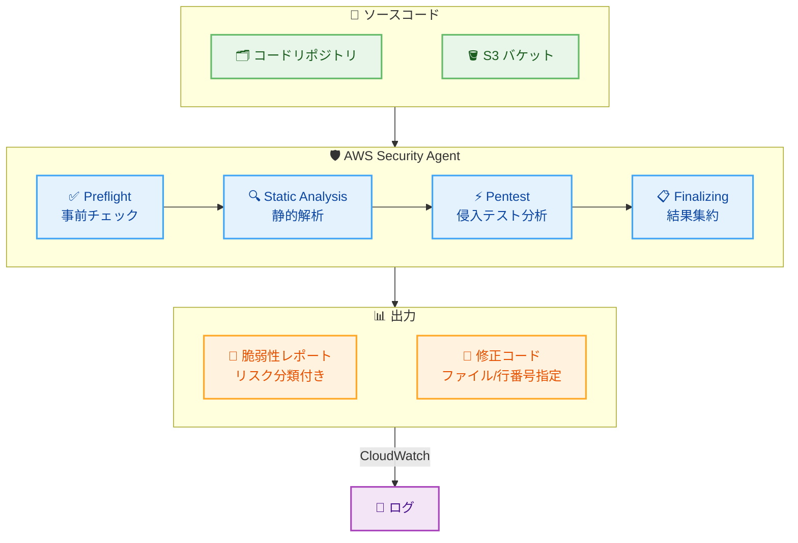

# AWS Security Agent - Full Repository Code Review

**リリース日**: 2026 年 5 月 12 日
**サービス**: AWS Security Agent
**機能**: Full Repository Code Review (リポジトリ全体コードレビュー)

[このアップデートのインフォグラフィックを見る](https://takech9203.github.io/aws-news-summary/20260512-aws-security-agent-full-repository-code-review.html)

## 概要

AWS Security Agent に Full Repository Code Review (リポジトリ全体コードレビュー) 機能が追加された。この新機能は、コードベース全体に対してコンテキストを考慮したディープセキュリティ分析を実行する。従来のパターンマッチングベースの静的解析ツールとは異なり、アプリケーションのアーキテクチャ、信頼境界、データフローを推論し、パターンマッチングツールでは検出できないシステミックな脆弱性を発見する。

脆弱性が検出された場合、具体的なファイルと行番号に紐付いたコード修正案を自動生成する。これにより、チームはセキュリティ脆弱性の特定から修正までを従来よりも大幅に高速化できる。プレビュー期間中は、既存の AWS Security Agent 利用者に対して追加料金なしで提供される。

**アップデート前の課題**

- 従来の静的解析ツールは既知の脆弱性パターンとのマッチングに依存しており、アプリケーション固有のアーキテクチャに起因するシステミックな脆弱性を検出できなかった
- 信頼境界をまたぐデータフローの問題や、複数ファイルにまたがるセキュリティ上の設計上の欠陥を発見するのが困難だった
- 脆弱性が検出されても修正案が抽象的で、開発者が具体的な修正コードを自分で考える必要があった

**アップデート後の改善**

- アプリケーション全体のアーキテクチャ、信頼境界、データフローを考慮した AI 駆動のセキュリティ分析が可能になった
- パターンマッチングでは検出不可能だったシステミックな脆弱性を発見できるようになった
- 脆弱性に対して具体的なファイル名と行番号に紐付いた修正コードが自動生成されるようになった

## アーキテクチャ図



AWS Security Agent の Full Repository Code Review は、ソースコードをリポジトリ連携または S3 経由で取得し、4 段階の分析パイプライン (Preflight、Static Analysis、Pentest、Finalizing) を通じてセキュリティ脆弱性を検出する。検出結果にはリスク分類と具体的な修正コードが含まれる。

## サービスアップデートの詳細

### 主要機能

1. **コンテキスト認識型セキュリティ分析**
   - アプリケーションのアーキテクチャ全体を理解した上で分析を実施
   - 信頼境界 (Trust Boundaries) の特定と検証
   - データフローの追跡によるシステミック脆弱性の検出
   - 複数ファイルにまたがる脆弱性パターンの検出

2. **自動コード修正 (Code Remediation)**
   - 脆弱性に対する具体的な修正コードの自動生成
   - ファイル名と行番号を指定した正確な修正箇所の特定
   - 修正戦略の選択: AUTOMATIC (自動修正) または DISABLED (無効)
   - `StartCodeRemediation` API による修正の実行

3. **多段階分析パイプライン**
   - PREFLIGHT: 事前チェックとソースコードの検証
   - STATIC_ANALYSIS: コンテキスト認識型の静的解析
   - PENTEST: 侵入テスト観点でのセキュリティ検証
   - FINALIZING: 結果の集約と修正案の生成

4. **リポジトリ統合**
   - ソースコードリポジトリとの直接連携
   - S3 経由でのソースコード提供
   - 複数リポジトリの一括分析対応

## 技術仕様

### 検出可能なリスクタイプ

| カテゴリ | リスクタイプ |
|----------|-------------|
| インジェクション | SQL_INJECTION, COMMAND_INJECTION, CODE_INJECTION, SERVER_SIDE_TEMPLATE_INJECTION |
| クロスサイト攻撃 | CROSS_SITE_SCRIPTING |
| ファイル操作 | PATH_TRAVERSAL, LOCAL_FILE_INCLUSION, ARBITRARY_FILE_UPLOAD, FILE_DELETION, FILE_ACCESS, FILE_CREATION |
| 認証/認可 | DEFAULT_CREDENTIALS, PRIVILEGE_ESCALATION, INSECURE_DIRECT_OBJECT_REFERENCE, JSON_WEB_TOKEN_VULNERABILITIES |
| サーバーサイド | SERVER_SIDE_REQUEST_FORGERY, INSECURE_DESERIALIZATION, XML_EXTERNAL_ENTITY |
| データベース | DATABASE_MODIFICATION, DATABASE_ACCESS |
| その他 | INFORMATION_DISCLOSURE, DENIAL_OF_SERVICE, GRAPHQL_VULNERABILITIES, BUSINESS_LOGIC_VULNERABILITIES, CRYPTOGRAPHIC_VULNERABILITIES, OUTBOUND_SERVICE_REQUEST |

### API 変更履歴

| 日付 | サービス | 変更内容 |
|------|----------|----------|
| 2026/05/13 | [securityagent](https://awsapichanges.com/archive/changes/74501c-securityagent.html) | 11 new 3 updated api methods - コードレビュー機能の追加 |

### 新規 API メソッド

| メソッド名 | 用途 |
|-----------|------|
| CreateCodeReview | コードレビューリソースの作成 |
| BatchGetCodeReviews | 複数コードレビューの一括取得 |
| ListCodeReviews | コードレビュー一覧の取得 |
| BatchDeleteCodeReviews | 複数コードレビューの一括削除 |
| UpdateCodeReview | コードレビュー設定の更新 |
| StartCodeReviewJob | コードレビュージョブの開始 |
| StopCodeReviewJob | コードレビュージョブの停止 |
| BatchGetCodeReviewJobs | 複数ジョブの一括取得 |
| ListCodeReviewJobsForCodeReview | レビュー別ジョブ一覧の取得 |
| BatchGetCodeReviewJobTasks | ジョブタスクの一括取得 |
| ListCodeReviewJobTasks | ジョブタスク一覧の取得 |
| BatchGetFindings | 検出結果の一括取得 |
| ListFindings | 検出結果一覧の取得 |
| StartCodeRemediation | 自動修正の開始 |

### 主要パラメータ

```json
{
  "title": "コードレビューのタイトル",
  "agentSpaceId": "Agent Space ID",
  "assets": {
    "sourceCode": [
      { "s3Location": "s3://bucket/source-code.zip" }
    ],
    "integratedRepositories": [
      {
        "integrationId": "リポジトリ連携 ID",
        "providerResourceId": "リポジトリリソース ID"
      }
    ],
    "endpoints": [
      { "uri": "https://api.example.com" }
    ],
    "actors": [
      {
        "identifier": "アクター識別子",
        "uris": ["https://example.com"],
        "authentication": {
          "providerType": "SECRETS_MANAGER",
          "value": "secret-arn"
        }
      }
    ]
  },
  "serviceRole": "arn:aws:iam::123456789012:role/SecurityAgentRole",
  "logConfig": {
    "logGroup": "/aws/security-agent/code-review",
    "logStream": "review-stream"
  },
  "codeRemediationStrategy": "AUTOMATIC"
}
```

## 設定方法

### 前提条件

1. AWS Security Agent が有効化された AWS アカウント
2. Agent Space が作成済みであること
3. ソースコードへのアクセス権限 (S3 またはリポジトリ連携)
4. IAM サービスロールの作成 (Security Agent がリソースにアクセスするため)

### 手順

#### ステップ 1: IAM サービスロールの作成

```bash
aws iam create-role \
  --role-name SecurityAgentCodeReviewRole \
  --assume-role-policy-document '{
    "Version": "2012-10-17",
    "Statement": [
      {
        "Effect": "Allow",
        "Principal": {
          "Service": "security-agent.amazonaws.com"
        },
        "Action": "sts:AssumeRole"
      }
    ]
  }'
```

Security Agent がコードレビュー実行時に使用するサービスロールを作成する。このロールには S3 バケットへの読み取り権限や CloudWatch Logs への書き込み権限を付与する。

#### ステップ 2: コードレビューの作成

```bash
aws security-agent create-code-review \
  --title "Full Repository Security Review" \
  --agent-space-id "your-agent-space-id" \
  --assets '{
    "sourceCode": [
      {"s3Location": "s3://your-bucket/source-code.zip"}
    ]
  }' \
  --service-role "arn:aws:iam::123456789012:role/SecurityAgentCodeReviewRole" \
  --log-config '{
    "logGroup": "/aws/security-agent/code-review",
    "logStream": "my-review"
  }' \
  --code-remediation-strategy "AUTOMATIC"
```

S3 に配置したソースコードを対象にコードレビューリソースを作成する。`codeRemediationStrategy` を `AUTOMATIC` にすると修正コードが自動生成される。

#### ステップ 3: コードレビュージョブの実行

```bash
aws security-agent start-code-review-job \
  --agent-space-id "your-agent-space-id" \
  --code-review-id "your-code-review-id"
```

作成したコードレビューに対してスキャンジョブを開始する。ジョブはバックグラウンドで実行され、ステータスを確認しながら完了を待つ。

#### ステップ 4: 結果の確認

```bash
aws security-agent list-findings \
  --agent-space-id "your-agent-space-id" \
  --code-review-job-id "your-job-id"
```

ジョブ完了後、検出された脆弱性の一覧を取得する。各 Finding にはリスクタイプ、影響を受けるファイルと行番号、修正案が含まれる。

## メリット

### ビジネス面

- **セキュリティリスクの早期発見**: リリース前にシステミックな脆弱性を検出し、本番環境でのインシデントを未然に防止
- **修正コストの削減**: 脆弱性の発見から修正案の生成までが自動化され、セキュリティ対応の工数を大幅に削減
- **コンプライアンス対応の強化**: 包括的なセキュリティスキャンの実行証跡を CloudWatch Logs で管理可能

### 技術面

- **コンテキスト認識型分析**: 単なるパターンマッチではなく、アプリケーション全体の構造を理解した上での分析が可能
- **26 種類以上のリスクタイプ対応**: SQL インジェクションから SSRF、ビジネスロジック脆弱性まで幅広い脅威を検出
- **API による自動化**: CI/CD パイプラインへの組み込みが容易で、継続的なセキュリティ検証が実現可能
- **具体的な修正コード生成**: ファイル名と行番号に紐付いた修正案により、開発者の修正作業を直接支援

## デメリット・制約事項

### 制限事項

- プレビュー段階の機能であり、GA までに仕様変更の可能性がある
- AI 駆動の分析であるため、誤検知 (False Positive) が発生する可能性がある
- 大規模リポジトリの場合、分析に時間がかかる可能性がある
- 自動生成された修正コードは必ず人間のレビューが必要

### 考慮すべき点

- ソースコードを AWS に送信するため、機密コードの取り扱いポリシーとの整合性確認が必要
- 既存のセキュリティツール (SAST/DAST) との役割分担と使い分けの整理が必要
- 修正コードの自動適用 (AUTOMATIC) を有効にする場合のガバナンス体制の検討

## ユースケース

### ユースケース 1: リリース前セキュリティゲート

**シナリオ**: マイクロサービスアーキテクチャのアプリケーションで、リリース前に全リポジトリのセキュリティレビューを自動実行したい。

**実装例**:
```bash
# CI/CD パイプラインから実行
CODE_REVIEW_ID=$(aws security-agent create-code-review \
  --title "Pre-release Security Scan - v2.3.0" \
  --agent-space-id "$AGENT_SPACE_ID" \
  --assets "{\"integratedRepositories\": [{\"integrationId\": \"$INTEGRATION_ID\", \"providerResourceId\": \"$REPO_ID\"}]}" \
  --service-role "$SERVICE_ROLE_ARN" \
  --code-remediation-strategy "AUTOMATIC" \
  --query 'codeReviewId' --output text)

aws security-agent start-code-review-job \
  --agent-space-id "$AGENT_SPACE_ID" \
  --code-review-id "$CODE_REVIEW_ID"
```

**効果**: デプロイ前にシステミックな脆弱性を自動検出し、修正案とともにチームに通知することで、セキュリティインシデントを予防する。

### ユースケース 2: レガシーコードのセキュリティ監査

**シナリオ**: 長期運用されているモノリシックアプリケーションのセキュリティ状態を把握し、優先的に修正すべき脆弱性を特定したい。

**実装例**:
```bash
# レガシーコードを S3 にアップロード
aws s3 cp ./legacy-app.zip s3://security-review-bucket/legacy-app.zip

# コードレビューを作成して実行
aws security-agent create-code-review \
  --title "Legacy App Security Audit" \
  --agent-space-id "$AGENT_SPACE_ID" \
  --assets '{"sourceCode": [{"s3Location": "s3://security-review-bucket/legacy-app.zip"}]}' \
  --service-role "$SERVICE_ROLE_ARN" \
  --code-remediation-strategy "AUTOMATIC"
```

**効果**: データフローと信頼境界の分析により、長年見過ごされてきたシステミックな脆弱性を発見し、修正の優先順位付けに活用できる。

### ユースケース 3: サードパーティコードの受入検査

**シナリオ**: 外部ベンダーから納品されたコードのセキュリティ品質を検証したい。

**実装例**:
```bash
# 納品コードのセキュリティ検証
aws security-agent create-code-review \
  --title "Vendor Code Acceptance - Project X" \
  --agent-space-id "$AGENT_SPACE_ID" \
  --assets '{
    "sourceCode": [{"s3Location": "s3://vendor-delivery/project-x.zip"}],
    "endpoints": [{"uri": "https://api.project-x.example.com"}]
  }' \
  --service-role "$SERVICE_ROLE_ARN" \
  --code-remediation-strategy "DISABLED"
```

**効果**: 納品コードに含まれる脆弱性を客観的に評価し、ベンダーへの修正依頼を具体的な根拠とともに行える。

## 料金

プレビュー期間中は、既存の AWS Security Agent 利用者に対して追加料金なしで提供される。GA 後の料金体系については公式発表を確認する必要がある。

| 条件 | 料金 |
|------|------|
| プレビュー期間中 (既存 Security Agent 利用者) | 追加料金なし |
| GA 後 | 未発表 |

## 利用可能リージョン

AWS Security Agent が利用可能なすべての AWS リージョンで提供される。

## 関連サービス・機能

- **AWS Security Agent**: 本機能の母体サービス。AI 駆動のセキュリティエージェントで、脆弱性スキャンやペネトレーションテストを自動実行
- **Amazon CodeGuru Reviewer**: コード品質とセキュリティのレビューを行う既存サービス。Full Repository Code Review はより深いセキュリティ分析に特化
- **AWS Security Hub**: セキュリティ検出結果の集約と優先順位付け。コードレビューの検出結果を Security Hub に統合可能
- **Amazon Inspector**: 実行環境の脆弱性スキャン。コードレベルのレビューと組み合わせることで多層的なセキュリティ対策を実現
- **AWS CloudWatch Logs**: コードレビュージョブのログ出力先として使用

## 参考リンク

- [このアップデートのインフォグラフィック](https://takech9203.github.io/aws-news-summary/20260512-aws-security-agent-full-repository-code-review.html)
- [公式発表 (What's New)](https://aws.amazon.com/about-aws/whats-new/2026/05/aws-security-agent-full-repository-code-review/)
- [AWS API Changes - Security Agent](https://awsapichanges.com/archive/changes/74501c-securityagent.html)

## まとめ

AWS Security Agent の Full Repository Code Review は、従来のパターンマッチング型静的解析を超える AI 駆動のセキュリティ分析機能である。アプリケーション全体のアーキテクチャ、信頼境界、データフローを理解した上で、システミックな脆弱性を検出し、具体的な修正コードを自動生成する点が最大の差別化要因となる。プレビュー期間中は追加料金なしで利用可能なため、既存の Security Agent 利用者は早期に評価を開始し、CI/CD パイプラインへの統合を検討することを推奨する。
