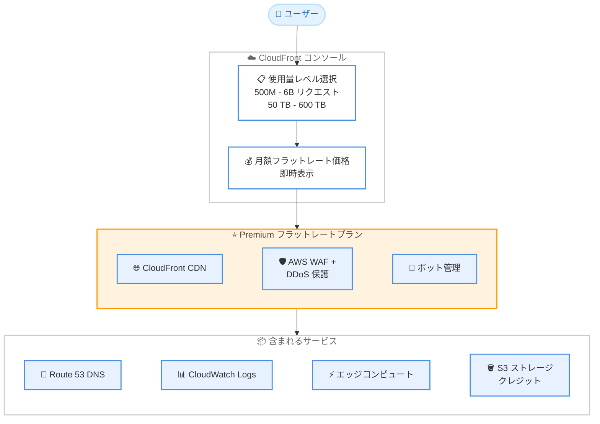

# Amazon CloudFront - Premium フラットレートプランの使用量レベル設定機能

**リリース日**: 2026年5月12日
**サービス**: Amazon CloudFront
**機能**: Premium フラットレートプランのセルフサービス使用量レベル設定

[このアップデートのインフォグラフィックを見る](https://takech9203.github.io/aws-news-summary/20260512-cloudfront-configurable-premium-flat-rate-plans.html)

## 概要

Amazon CloudFront の Premium フラットレートプランにおいて、月間使用量レベルをセルフサービスで選択・変更できる機能が追加された。従来の Premium プランは単一の使用量レベル (500 million リクエスト、50 TB) のみをサポートしていたが、今回のアップデートにより最大 60 億リクエスト・600 TB まで段階的にスケールアップできるようになった。

CloudFront のフラットレートプランは 2025 年 11 月に導入されたもので、CDN、AWS WAF、DDoS 保護、ボット管理、Route 53 DNS、CloudWatch Logs 取り込み、サーバーレスエッジコンピュート、S3 ストレージクレジットを単一の月額料金で提供する。超過料金は発生しない。

**アップデート前の課題**

- Premium プランは月間 5 億リクエスト・50 TB の単一使用量レベルのみサポートしていた
- 使用量がこのレベルを超えた場合、カスタム料金の相談のために AWS に直接連絡する必要があった
- ベースライントラフィックが Premium プランの使用量を超える企業や中規模ビジネスは、フラットレートプランを採用できなかった
- アプリケーションの成長に合わせてプラン内でスケールする選択肢がなかった

**アップデート後の改善**

- 月間 5 億から 60 億リクエスト、50 TB から 600 TB の範囲で使用量レベルを選択可能になった
- CloudFront コンソールからセルフサービスで使用量レベルを即座に変更できるようになった
- コミットメント不要で、いつでも使用量レベルを変更できるようになった
- すべての使用量レベルで Premium プランの全機能が利用可能

## アーキテクチャ図

Premium フラットレートプランの構成を示す。ユーザーはコンソールから使用量レベルを選択するだけで、すべてのサービスが単一月額料金に含まれる。

## サービスアップデートの詳細

### 主要機能

1. **セルフサービスの使用量レベル選択**
   - CloudFront コンソールから直接使用量レベルを選択
   - 月額フラットレート価格が即座に表示される
   - いつでも変更可能、コミットメント不要

2. **拡張された使用量レンジ**
   - リクエスト数: 5 億から 60 億リクエスト/月
   - データ転送量: 50 TB から 600 TB/月
   - 1 ディストリビューションあたりの使用量

3. **超過料金なしモデルの継続**
   - 月間使用量の最大 3 倍までの最初のスパイクは当月内で全額カバー
   - それを超える超過使用量は複数月にわたって評価
   - 超過料金は一切発生しない

4. **全機能の包含**
   - すべての使用量レベルで Premium プランの全機能が利用可能
   - Origin Shield、自動オリジンフェイルオーバー、高度な DDoS 保護
   - ボット管理とアナリティクス (AI ボット含む)、VPC オリジン、相互 TLS

## 技術仕様

### Premium プラン使用量レベル

| 項目 | 最小 | 最大 |
|------|------|------|
| 月間リクエスト数 | 5 億 | 60 億 |
| 月間データ転送量 | 50 TB | 600 TB |
| 基本月額料金 | $1,000 | スケールに応じて増加 |
| スパイク許容 | 月間使用量の最大 3 倍 | 月間使用量の最大 3 倍 |

### フラットレートプラン全体比較

| プラン | 月額 | リクエスト | データ転送 | S3 ストレージ |
|--------|------|-----------|-----------|--------------|
| Free | $0 | 1M | - | 5 GB |
| Pro | $15 | 10M | - | 50 GB |
| Business | $200 | 125M | - | 1 TB |
| Premium | $1,000~ | 500M - 6B (設定可能) | 50 TB - 600 TB | 5 TB |

### Premium プラン含有機能一覧

| 機能 | 詳細 |
|------|------|
| CloudFront CDN | グローバルコンテンツ配信 |
| AWS WAF | 高度な保護、75 ルール |
| DDoS 保護 | 高度な DDoS 保護 |
| ボット管理 | 高度な難読化ボット対応 |
| Route 53 DNS | DNS サービス |
| CloudWatch Logs | ログ取り込み |
| エッジコンピュート | サーバーレスエッジコンピュート |
| S3 ストレージ | 月間 5 TB クレジット |
| Origin Shield | キャッシュレイヤー |
| オリジンフェイルオーバー | 自動フェイルオーバー |
| VPC オリジン | プライベートオリジン接続 |
| 相互 TLS | mTLS 認証 |

## 設定方法

### 前提条件

1. AWS アカウントを所有していること
2. CloudFront ディストリビューションが作成済み (または新規作成予定) であること
3. CloudFront コンソールへのアクセス権限があること

### 手順

#### ステップ 1: CloudFront コンソールにアクセス

AWS マネジメントコンソールにログインし、CloudFront サービスのコンソールを開く。

#### ステップ 2: フラットレートプランの選択

新規または既存のディストリビューションに対して Premium フラットレートプランを選択する。既存のディストリビューションに対してもサブスクリプションが可能。

#### ステップ 3: 使用量レベルの設定

Premium プランのサブスクリプション時に使用量レベルを選択する。コンソール上で月額フラットレート価格が即座に表示される。

#### ステップ 4: 使用量レベルの変更 (必要時)

アプリケーションの成長に合わせて、いつでもコンソールから使用量レベルを変更できる。コミットメントは不要で、即座に反映される。

### 補足事項

- フラットレートプランと従量課金 (pay-as-you-go) を異なるディストリビューション間で混在させることが可能
- 各フラットレートプランは 1 つの CloudFront ディストリビューションと最大 1 つのルートドメインをカバー
- いつでもアップグレード可能、年間コミットメント不要

## メリット

### ビジネス面

- **コスト予測可能性**: 月初に料金が確定し、月末の請求書で驚くことがない
- **スケーラビリティ**: アプリケーションの成長に合わせてプラン内でシームレスにスケール
- **参入障壁の低下**: 以前は対象外だった中規模ビジネスや大企業もフラットレートプランを採用可能
- **請求の簡素化**: CloudFront、WAF、Route 53、CloudWatch の個別追跡が不要で、1 つの請求項目に統合

### 技術面

- **セルフサービス運用**: AWS への連絡不要で即座に使用量レベルを変更可能
- **スパイク対応**: トラフィックスパイクやDDoS 攻撃時も超過料金なし (月間使用量の 3 倍まで即座にカバー)
- **統合セキュリティ**: WAF、DDoS、ボット管理がデフォルトで含まれ、追加設定不要
- **柔軟な構成**: フラットレートと従量課金をディストリビューション単位で使い分け可能

## デメリット・制約事項

### 制限事項

- 1 プランあたり 1 ディストリビューション・1 ルートドメインのみカバー
- 複数ディストリビューションを持つ場合、それぞれに個別のプランが必要
- 最大使用量レベルは 60 億リクエスト・600 TB で、それを超える場合はカスタム料金の相談が必要
- ダウングレードに関する詳細な制約は公式ドキュメントで確認が必要

### 考慮すべき点

- 使用量が常にプランの使用量レベルを大幅に下回る場合、従量課金の方がコスト効率が良い可能性がある
- スパイク許容は月間使用量の 3 倍までで、それを超えた場合は複数月にわたる評価となる
- AWS からのデータ転送 (S3、ALB、API Gateway から CloudFront) は無料だが、プランとは別にオリジンサービス自体の料金が発生する

## ユースケース

### ユースケース 1: 成長中の E コマースプラットフォーム

**シナリオ**: 月間トラフィックが急成長している E コマースサイトで、セール期間のスパイクへの対応と予算管理の両立が求められている。月間 10 億リクエスト程度のベースライントラフィックがあり、セール時に 3 倍に跳ね上がる。

**実装例**:
- Premium プランで月間 10 億リクエスト・100 TB の使用量レベルを選択
- セール期間のスパイク (最大 30 億リクエスト) も超過料金なしでカバー
- 成長に合わせて使用量レベルを段階的に引き上げ

**効果**: 月額料金が固定され、予算計画が容易に。セール時の予期せぬ請求リスクを排除。

### ユースケース 2: AI ボットトラフィックが急増するメディアサイト

**シナリオ**: ニュースメディアサイトで AI クローラーやボットからのトラフィックが予測不能に増加している。従来の従量課金ではコスト管理が困難になっていた。

**実装例**:
- Premium プランのボット管理機能を活用して AI ボットを可視化・制御
- 月間 20 億リクエストレベルを選択し、ボットトラフィック込みでも固定料金
- CloudWatch Logs でトラフィックパターンを分析

**効果**: AI ボットトラフィックの増減に関わらずコストが固定。ボット管理機能により不要なトラフィックを制御しつつ、正当なクローラーにはアクセスを許可。

### ユースケース 3: グローバル展開する SaaS アプリケーション

**シナリオ**: グローバルに展開する B2B SaaS で、複数リージョンからのアクセスがあり、WAF・DDoS 保護・DNS を個別に管理するコストと運用負荷が大きい。月間 30 億リクエスト規模。

**実装例**:
- Premium プランで 30 億リクエスト・300 TB の使用量レベルを選択
- CDN、WAF、DDoS、DNS、ログが一括で提供され運用を簡素化
- VPC オリジンでバックエンドへのセキュアな接続を確保

**効果**: 複数サービスの個別管理・請求追跡が不要になり、運用工数を大幅削減。セキュリティ機能がデフォルトで有効なため、設定漏れのリスクも低減。

## 料金

フラットレートプランは月額固定料金で、超過料金は発生しない。

### Premium プラン料金

Premium プランの基本料金は月額 $1,000 から。使用量レベルに応じて月額料金が変動する。具体的な使用量レベルごとの料金は、CloudFront コンソールで使用量レベルを選択すると即座に表示される。

### 料金に含まれるサービス

| サービス | 内容 |
|---------|------|
| CloudFront CDN | グローバルコンテンツ配信 |
| AWS WAF | Web アプリケーションファイアウォール (75 ルール) |
| DDoS 保護 | 高度な DDoS 保護 |
| ボット管理 | ボット管理とアナリティクス |
| Route 53 | DNS サービス |
| CloudWatch Logs | ログ取り込み |
| エッジコンピュート | サーバーレスエッジコンピュート |
| S3 ストレージ | 月間 5 TB クレジット |

### 補足

- AWS オリジン (S3、ALB、API Gateway) から CloudFront へのデータ転送は無料
- 年間コミットメント不要
- 使用量レベルはいつでも変更可能
- 各プランは 1 ディストリビューション・1 ルートドメインをカバー

## 利用可能リージョン

Amazon CloudFront はグローバルサービスであり、フラットレートプランはすべての CloudFront エッジロケーションで利用可能。使用量レベルの設定は CloudFront コンソールから全リージョンに対して一元的に管理される。

## 関連サービス・機能

- **AWS WAF**: フラットレートプランに含まれる Web アプリケーションファイアウォール。最大 75 ルールで高度な保護を提供
- **Amazon Route 53**: フラットレートプランに含まれる DNS サービス
- **Amazon CloudWatch**: フラットレートプランに含まれるログ取り込みサービス
- **Amazon S3**: フラットレートプランに月間 5 TB のストレージクレジットが含まれる
- **AWS Shield**: DDoS 保護機能としてフラットレートプランに統合
- **CloudFront Functions / Lambda@Edge**: サーバーレスエッジコンピュートとしてプランに含まれる

## 参考リンク

- [このアップデートのインフォグラフィック](https://takech9203.github.io/aws-news-summary/20260512-cloudfront-configurable-premium-flat-rate-plans.html)
- [公式発表 (What's New)](https://aws.amazon.com/about-aws/whats-new/2026/05/cloudfront-configurable-premium-flat-rate-plans/)
- [AWS Blog - Amazon CloudFront Premium flat-rate pricing plan now supports higher, configurable usage allowances](https://aws.amazon.com/blogs/networking-and-content-delivery/cloudfront-premium-flat-rate-plan-supports-configurable-usage-allowances/)
- [CloudFront フラットレートプラン料金ページ](https://aws.amazon.com/cloudfront/pricing/)
- [Amazon CloudFront デベロッパーガイド](https://docs.aws.amazon.com/AmazonCloudFront/latest/DeveloperGuide/)

## まとめ

Amazon CloudFront Premium フラットレートプランのセルフサービス使用量レベル設定は、フラットレートプランの予測可能性と簡素性を維持しながら、より幅広い規模のワークロードに対応できるようにする重要なアップデートである。月間 5 億から 60 億リクエスト、50 TB から 600 TB の範囲で柔軟にスケールでき、コミットメントなしでいつでも変更可能なため、成長するアプリケーションを持つ組織は早期にフラットレートプランの評価を行い、従量課金との比較検討を推奨する。
