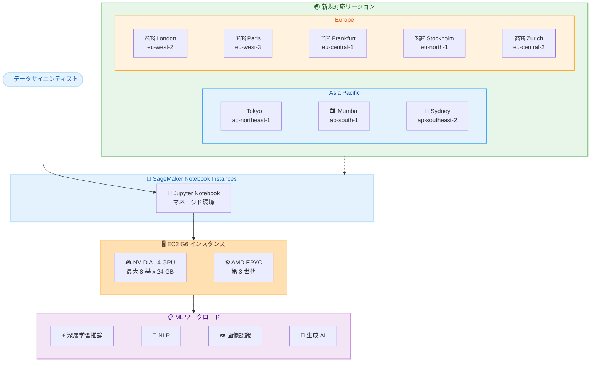

# Amazon SageMaker Notebook Instances - G6 インスタンスのリージョン拡大

**リリース日**: 2026年5月12日
**サービス**: Amazon SageMaker AI (Notebook Instances)
**機能**: G6 インスタンス (NVIDIA L4 GPU) の Asia Pacific および Europe リージョン対応

📊 [このアップデートのインフォグラフィックを見る](https://takech9203.github.io/aws-news-summary/20260512-g6-region-expansion-sagemaker-notebook-instances.html)

## 概要

Amazon EC2 G6 インスタンスが SageMaker ノートブックインスタンスにおいて、Asia Pacific (Tokyo、Mumbai、Sydney) および Europe (London、Paris、Frankfurt、Stockholm、Zurich) の 8 リージョンで一般利用可能 (GA) になった。G6 インスタンスは最大 8 基の NVIDIA L4 Tensor Core GPU (各 GPU あたり 24 GB メモリ) と第 3 世代 AMD EPYC プロセッサを搭載し、EC2 G4dn インスタンスと比較して深層学習推論で 2 倍のパフォーマンスを提供する。

特に **東京リージョン (ap-northeast-1)** での利用が可能になったことは、日本のユーザーにとって重要なアップデートである。国内のデータレジデンシー要件を満たしながら、高性能な GPU アクセラレーテッドコンピューティングを SageMaker ノートブックインスタンスで活用できるようになった。

**アップデート前の課題**

- 東京リージョンを含む上記 8 リージョンでは SageMaker ノートブックインスタンスで G6 インスタンスが利用できなかった
- 日本のユーザーは NVIDIA L4 GPU を活用した ML ワークロードのために他のリージョン (例: us-east-1、us-west-2) を使用する必要があり、レイテンシーやデータ主権の観点で課題があった
- G4dn インスタンスは利用可能だったが、推論パフォーマンスが G6 の半分であり、最新の GPU アーキテクチャの恩恵を受けられなかった

**アップデート後の改善**

- 東京リージョンを含む 8 リージョンで G6 インスタンスを SageMaker ノートブックインスタンスで直接利用可能になった
- NVIDIA L4 GPU による G4dn 比 2 倍の推論パフォーマンスをローカルリージョンで享受可能になった
- データを国内に保持したまま、高性能な GPU アクセラレーテッドコンピューティングによる ML 開発・推論テストが可能になった

## アーキテクチャ図



SageMaker ノートブックインスタンスで G6 インスタンスを起動し、NVIDIA L4 GPU を活用して ML ワークロードを新規 8 リージョンで実行する構成を示す。

## サービスアップデートの詳細

### 主要機能

1. **G6 インスタンスの 8 リージョン同時展開**
   - Asia Pacific: Tokyo (ap-northeast-1)、Mumbai (ap-south-1)、Sydney (ap-southeast-2)
   - Europe: London (eu-west-2)、Paris (eu-west-3)、Frankfurt (eu-central-1)、Stockholm (eu-north-1)、Zurich (eu-central-2)
   - SageMaker ノートブックインスタンスから直接利用可能

2. **NVIDIA L4 Tensor Core GPU**
   - 最大 8 基の NVIDIA L4 GPU を搭載
   - GPU あたり 24 GB のメモリ
   - Ada Lovelace アーキテクチャベース
   - 第 4 世代 Tensor Core によるディープラーニング推論の高速化
   - 第 3 世代 RT Core によるグラフィックスワークロードのサポート

3. **G4dn 比 2 倍の推論パフォーマンス**
   - NVIDIA L4 GPU による深層学習推論の大幅な高速化
   - TensorRT、CUDA、cuDNN などの NVIDIA ライブラリとの互換性
   - FP8、INT8、FP16、FP32、TF32 など多様な精度をサポート

## 技術仕様

### G6 インスタンスと G4dn インスタンスの比較

| 項目 | G6 | G4dn |
|------|-----|------|
| GPU | NVIDIA L4 | NVIDIA T4 |
| GPU アーキテクチャ | Ada Lovelace | Turing |
| GPU メモリ / GPU | 24 GB | 16 GB |
| 最大 GPU 数 | 8 | 8 |
| CPU | 第 3 世代 AMD EPYC | 第 2 世代 Intel Cascade Lake |
| 最大 vCPU | 192 | 96 |
| 最大ネットワーク帯域幅 | 100 Gbps | 100 Gbps |
| 最大ローカル NVMe ストレージ | 7.52 TB | 7.2 TB |
| 推論パフォーマンス比 | 2x | 1x (基準) |
| Tensor Core 世代 | 第 4 世代 | 第 3 世代 |

### G6 インスタンスサイズ一覧

| インスタンスサイズ | GPU 数 | GPU メモリ | vCPU | メモリ | ネットワーク帯域幅 |
|-------------------|--------|-----------|------|--------|-------------------|
| g6.xlarge | 1 | 24 GB | 4 | 16 GB | 最大 10 Gbps |
| g6.2xlarge | 1 | 24 GB | 8 | 32 GB | 最大 10 Gbps |
| g6.4xlarge | 1 | 24 GB | 16 | 64 GB | 最大 25 Gbps |
| g6.8xlarge | 1 | 24 GB | 32 | 128 GB | 25 Gbps |
| g6.12xlarge | 4 | 96 GB | 48 | 192 GB | 40 Gbps |
| g6.16xlarge | 1 | 24 GB | 64 | 256 GB | 25 Gbps |
| g6.24xlarge | 4 | 96 GB | 96 | 384 GB | 50 Gbps |
| g6.48xlarge | 8 | 192 GB | 192 | 768 GB | 100 Gbps |

### SageMaker ノートブックインスタンスでの利用

SageMaker ノートブックインスタンスでは `ml.g6.*` のプレフィックスで G6 インスタンスを指定する。

| SageMaker インスタンス名 | EC2 相当 | 想定用途 |
|-------------------------|----------|----------|
| ml.g6.xlarge | g6.xlarge | プロトタイピング、小規模推論テスト |
| ml.g6.2xlarge | g6.2xlarge | 中規模モデルの推論 |
| ml.g6.4xlarge | g6.4xlarge | 大規模モデルの単一 GPU 推論 |
| ml.g6.8xlarge | g6.8xlarge | メモリ集約型ワークロード |
| ml.g6.12xlarge | g6.12xlarge | マルチ GPU 学習・推論 |
| ml.g6.16xlarge | g6.16xlarge | 大規模 CPU + 単一 GPU |
| ml.g6.24xlarge | g6.24xlarge | マルチ GPU 大規模モデル |
| ml.g6.48xlarge | g6.48xlarge | 最大規模の分散ワークロード |

## 設定方法

### 前提条件

1. 対象リージョン (例: ap-northeast-1) で有効な AWS アカウント
2. SageMaker ノートブックインスタンスを作成する IAM 権限
3. G6 インスタンスタイプに対する適切なサービスクォータ
4. VPC およびサブネットの設定 (ノートブックインスタンスはサブネット内で起動される)

### 手順

#### ステップ 1: サービスクォータの確認

```bash
# 東京リージョンでの G6 インスタンスのサービスクォータを確認
aws service-quotas get-service-quota \
  --service-code sagemaker \
  --quota-code L-B87F5E30 \
  --region ap-northeast-1
```

SageMaker ノートブックインスタンスで使用できる GPU インスタンスのクォータを確認する。新規対応リージョンではデフォルトクォータが低い場合があるため、必要に応じて引き上げリクエストを行う。

#### ステップ 2: ノートブックインスタンスの作成

```bash
# G6 インスタンスを使用してノートブックインスタンスを作成
aws sagemaker create-notebook-instance \
  --notebook-instance-name "my-g6-notebook" \
  --instance-type ml.g6.xlarge \
  --role-arn arn:aws:iam::<account-id>:role/SageMakerExecutionRole \
  --volume-size-in-gb 50 \
  --region ap-northeast-1
```

東京リージョンで ml.g6.xlarge インスタンスを使用したノートブックインスタンスを作成する。用途に応じてインスタンスサイズと EBS ボリュームサイズを調整する。

#### ステップ 3: ノートブックインスタンスの起動と確認

```bash
# ノートブックインスタンスのステータスを確認
aws sagemaker describe-notebook-instance \
  --notebook-instance-name "my-g6-notebook" \
  --region ap-northeast-1

# ステータスが InService になったら Jupyter にアクセス可能
aws sagemaker create-presigned-notebook-instance-url \
  --notebook-instance-name "my-g6-notebook" \
  --region ap-northeast-1
```

ノートブックインスタンスのステータスが InService になったことを確認し、署名付き URL を生成して Jupyter 環境にアクセスする。

#### ステップ 4: GPU の動作確認

```python
# Jupyter ノートブック上で GPU の確認
import torch

print(f"CUDA available: {torch.cuda.is_available()}")
print(f"GPU count: {torch.cuda.device_count()}")
print(f"GPU name: {torch.cuda.get_device_name(0)}")
print(f"GPU memory: {torch.cuda.get_device_properties(0).total_mem / 1e9:.1f} GB")
```

NVIDIA L4 GPU が正しく認識されていることを確認する。

## メリット

### ビジネス面

- **日本国内でのデータ処理**: 東京リージョン対応により、日本のデータレジデンシー要件を満たしながら GPU コンピューティングを活用可能
- **レイテンシーの削減**: ローカルリージョンでの ML 開発により、データ転送のレイテンシーを最小化
- **グローバル展開の柔軟性**: 8 リージョン同時対応により、APAC および欧州でのマルチリージョン戦略が容易に

### 技術面

- **2 倍の推論パフォーマンス**: G4dn と比較して深層学習推論で 2 倍の性能向上により、推論テストの反復速度が向上
- **大容量 GPU メモリ**: GPU あたり 24 GB (G4dn の 16 GB から 50% 増加) により、より大規模なモデルをロード可能
- **最新 GPU アーキテクチャ**: Ada Lovelace アーキテクチャの第 4 世代 Tensor Core による FP8 推論サポート
- **AWS Nitro System**: GPU パススルーモードによりベアメタルに近いパフォーマンスを実現

## デメリット・制約事項

### 制限事項

- SageMaker ノートブックインスタンス (クラシック) での対応であり、SageMaker Studio ノートブックとは別サービスである
- リージョンによって利用可能な G6 インスタンスサイズが異なる可能性がある
- 新規対応リージョンではデフォルトのサービスクォータが低く設定されている場合がある

### 考慮すべき点

- GPU インスタンスは CPU インスタンスと比較してコストが高いため、不要時は必ずノートブックインスタンスを停止する
- SageMaker ノートブックインスタンスは単一インスタンスで動作するため、分散学習には SageMaker Training Job の利用を検討する
- ライフサイクル設定スクリプトで自動停止を設定し、コスト超過を防止することを推奨
- 大規模モデルを扱う場合は EBS ボリュームサイズを十分に確保する必要がある

## ユースケース

### ユースケース 1: 東京リージョンでの LLM 推論テスト

**シナリオ**: 日本の企業がオンプレミスのデータを活用して LLM の推論パフォーマンスを評価したい。データを海外リージョンに転送することはセキュリティポリシー上許可されていない。

**実装例**:
```python
# SageMaker ノートブックインスタンス (ml.g6.2xlarge) 上で実行
from transformers import AutoModelForCausalLM, AutoTokenizer
import torch

# NVIDIA L4 GPU を活用した推論
model_name = "rinna/japanese-gpt-neox-3.6b"
tokenizer = AutoTokenizer.from_pretrained(model_name)
model = AutoModelForCausalLM.from_pretrained(
    model_name,
    torch_dtype=torch.float16,
    device_map="auto"
)

# 推論実行
inputs = tokenizer("日本の機械学習の未来は", return_tensors="pt").to("cuda")
with torch.no_grad():
    outputs = model.generate(**inputs, max_new_tokens=100)
    print(tokenizer.decode(outputs[0]))
```

**効果**: 東京リージョン内でデータを保持したまま、NVIDIA L4 GPU の高い推論性能を活用して日本語 LLM のパフォーマンス評価が可能。G4dn 比 2 倍の推論速度により、評価の反復サイクルを短縮できる。

### ユースケース 2: コンピュータビジョンモデルの開発

**シナリオ**: 欧州の製造業企業が製品の外観検査 AI を開発するために、Frankfurt リージョンで画像認識モデルのトレーニングとテストを行いたい。GDPR 要件によりデータは EU 内に保持する必要がある。

**実装例**:
```python
# SageMaker ノートブックインスタンス (ml.g6.4xlarge) 上で実行
import torch
from torchvision import models, transforms
from torch.utils.data import DataLoader

# 事前学習済みモデルの転移学習
model = models.efficientnet_v2_l(weights="IMAGENET1K_V1")
model.classifier[-1] = torch.nn.Linear(1280, num_classes)
model = model.to("cuda")

# NVIDIA L4 GPU による高速学習
optimizer = torch.optim.AdamW(model.parameters(), lr=1e-4)
for epoch in range(10):
    for images, labels in train_loader:
        images, labels = images.to("cuda"), labels.to("cuda")
        outputs = model(images)
        loss = criterion(outputs, labels)
        loss.backward()
        optimizer.step()
        optimizer.zero_grad()
```

**効果**: EU リージョン内でデータガバナンスを維持しながら、NVIDIA L4 GPU の高スループットを活用して画像分類モデルの学習を高速に実行可能。

### ユースケース 3: 生成 AI モデルのプロトタイピング

**シナリオ**: インドのスタートアップが多言語対応のテキスト生成モデルをプロトタイピングしたい。Mumbai リージョンで低レイテンシーの開発環境が必要である。

**実装例**:
```python
# SageMaker ノートブックインスタンス (ml.g6.12xlarge) 上で実行
from transformers import AutoModelForCausalLM, AutoTokenizer, BitsAndBytesConfig
from peft import LoraConfig, get_peft_model, prepare_model_for_kbit_training

# 4bit 量子化で大規模モデルをロード
bnb_config = BitsAndBytesConfig(
    load_in_4bit=True,
    bnb_4bit_quant_type="nf4",
    bnb_4bit_compute_dtype=torch.float16
)

model = AutoModelForCausalLM.from_pretrained(
    "meta-llama/Llama-3-8B",
    quantization_config=bnb_config,
    device_map="auto"  # 4 GPU に自動分散
)

# LoRA によるパラメータ効率的ファインチューニング
lora_config = LoraConfig(
    r=16, lora_alpha=32,
    target_modules=["q_proj", "v_proj", "k_proj", "o_proj"],
    lora_dropout=0.05
)
model = get_peft_model(model, lora_config)
```

**効果**: 4 基の NVIDIA L4 GPU (合計 96 GB GPU メモリ) を活用し、大規模モデルの量子化ロードと LoRA ファインチューニングを Mumbai リージョン内で実行可能。

## 料金

SageMaker ノートブックインスタンスの G6 インスタンスは、利用時間に基づく従量課金制である。料金はリージョンおよびインスタンスサイズにより異なる。

### 料金例 (東京リージョン参考)

| インスタンスサイズ | GPU 数 | 想定用途 | 概算時間単価 |
|-------------------|--------|----------|-------------|
| ml.g6.xlarge | 1 | プロトタイピング、小規模推論 | EC2 g6.xlarge 相当 + SageMaker 付加料金 |
| ml.g6.2xlarge | 1 | 中規模モデルの推論テスト | EC2 g6.2xlarge 相当 + SageMaker 付加料金 |
| ml.g6.4xlarge | 1 | 大規模モデルの単一 GPU 推論 | EC2 g6.4xlarge 相当 + SageMaker 付加料金 |
| ml.g6.12xlarge | 4 | マルチ GPU 学習・大規模モデル | EC2 g6.12xlarge 相当 + SageMaker 付加料金 |
| ml.g6.48xlarge | 8 | 最大規模の分散ワークロード | EC2 g6.48xlarge 相当 + SageMaker 付加料金 |

**コスト最適化のポイント**:
- 未使用時はノートブックインスタンスを停止する (停止中は EBS ストレージ料金のみ)
- ライフサイクル設定で自動停止を設定する
- ワークロードに適切なインスタンスサイズを選択する

詳細な料金については [SageMaker AI 料金ページ](https://aws.amazon.com/sagemaker-ai/pricing/) を参照。

## 利用可能リージョン

今回のアップデートで G6 インスタンスが SageMaker ノートブックインスタンスで新たに利用可能になったリージョン。

| リージョン | リージョンコード | 備考 |
|-----------|----------------|------|
| **Asia Pacific (Tokyo)** | **ap-northeast-1** | **日本ユーザー向け - 新規対応** |
| Asia Pacific (Mumbai) | ap-south-1 | 新規対応 |
| Asia Pacific (Sydney) | ap-southeast-2 | 新規対応 |
| Europe (London) | eu-west-2 | 新規対応 |
| Europe (Paris) | eu-west-3 | 新規対応 |
| Europe (Frankfurt) | eu-central-1 | 新規対応 |
| Europe (Stockholm) | eu-north-1 | 新規対応 |
| Europe (Zurich) | eu-central-2 | 新規対応 |

G6 インスタンスは上記以外にも US East (N. Virginia)、US West (Oregon) などのリージョンで SageMaker ノートブックインスタンスに対応済みである。

## 関連サービス・機能

- **Amazon EC2 G6 インスタンス**: SageMaker 以外の EC2 環境でも利用可能な同一の GPU インスタンスファミリー
- **Amazon SageMaker Studio ノートブック**: より新しいマネージド開発環境。G6 インスタンスの対応状況は別途確認
- **Amazon SageMaker Training**: G6 インスタンスを活用したマネージドトレーニングジョブの実行
- **Amazon SageMaker Inference**: G6 インスタンスを使用したリアルタイム推論エンドポイントのデプロイ
- **NVIDIA L4 GPU**: Ada Lovelace アーキテクチャベースの推論最適化 GPU。TensorRT、CUDA、cuDNN をサポート

## 参考リンク

- 📊 [インフォグラフィック](https://takech9203.github.io/aws-news-summary/20260512-g6-region-expansion-sagemaker-notebook-instances.html)
- [公式発表 (What's New)](https://aws.amazon.com/about-aws/whats-new/2026/01/g6-region-expansion-sagemaker-notebook-instances/)
- [SageMaker ノートブックインスタンス開発者ガイド](https://docs.aws.amazon.com/sagemaker/latest/dg/nbi.html)
- [Amazon EC2 G6 インスタンス](https://aws.amazon.com/ec2/instance-types/g6/)
- [SageMaker AI 料金ページ](https://aws.amazon.com/sagemaker-ai/pricing/)

## まとめ

Amazon EC2 G6 インスタンスが SageMaker ノートブックインスタンスで東京リージョンを含む 8 リージョンに拡大されたことにより、日本および欧州のユーザーがローカルリージョンで NVIDIA L4 GPU による高性能な ML ワークロードを実行できるようになった。G4dn 比 2 倍の推論パフォーマンスと GPU あたり 24 GB のメモリを活かし、深層学習推論テストや生成 AI モデルのプロトタイピングを、データローカリティを維持しながら実行することを推奨する。東京リージョンのユーザーは、既存の G4dn ベースのワークロードを G6 に移行することで、大幅なパフォーマンス向上を実現できる。
