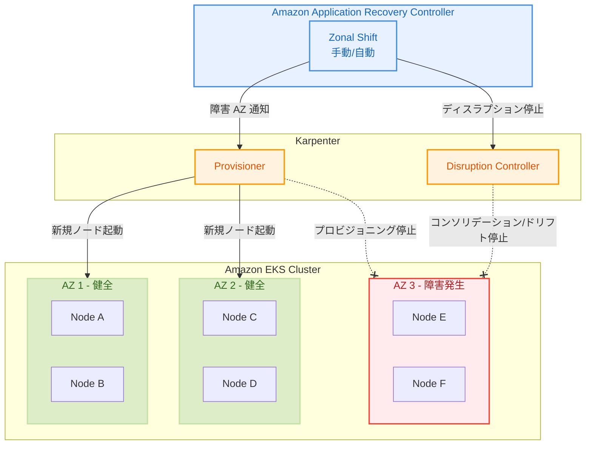

# Karpenter - Amazon Application Recovery Controller ゾーンシフト対応

**リリース日**: 2026年5月12日
**サービス**: Amazon EKS / Karpenter
**機能**: ARC zonal shift および zonal autoshift のサポート

[このアップデートのインフォグラフィックを見る](https://takech9203.github.io/aws-news-summary/20260512-karpenter-arc-zonal-shift.html)

## 概要

Amazon EKS で Karpenter をコンピュートプロビジョニングに使用している環境において、Amazon Application Recovery Controller (ARC) の zonal shift および zonal autoshift がサポートされた。ARC は AWS リージョンおよびアベイラビリティゾーン (AZ) 全体でアプリケーションの復旧を管理・調整するサービスであり、今回の統合により Karpenter 環境でも AZ 障害時にクラスタ内ネットワークトラフィックを自動的に障害 AZ から切り離すことが可能になった。

これまで EKS の ARC zonal shift は Managed Node Groups でのみ利用可能であり、Karpenter を使用している場合は手動で NodePool 設定から障害 AZ を除外する必要があった。今回のアップデートにより、Karpenter が ARC と直接統合され、zonal shift が有効化された際に自動的にプロビジョニングとディスラプション動作を調整するようになった。

**アップデート前の課題**

- Karpenter 環境では ARC zonal shift が非対応であり、AZ 障害時に手動で NodePool 設定を変更する必要があった
- 障害 AZ へのノードプロビジョニングを停止するためにオペレーターの介入が不可欠だった
- Karpenter のコンソリデーションやドリフト処理が障害 AZ のノードに対しても実行され、復旧を複雑にする可能性があった
- 自動化された AZ 障害対応のために Managed Node Groups への移行を検討する必要があった

**アップデート後の改善**

- Karpenter が ARC zonal shift と直接統合され、`ENABLE_ZONAL_SHIFT` 設定で有効化可能になった
- zonal shift 有効時に Karpenter が自動的に障害 AZ へのプロビジョニングを停止する
- コンソリデーションやドリフトなどの自発的ディスラプションが障害 AZ のノードに対して停止される
- 健全な AZ のノードであっても、障害 AZ への Pod スケジューリングに依存する場合はディスラプションが防止される
- zonal autoshift との統合によりフルオートメーションの AZ 障害対応が実現した

## アーキテクチャ図



ARC が zonal shift を発行すると、Karpenter は障害 AZ へのプロビジョニングを停止し、健全な AZ のみに新規ノードを起動する。同時にコンソリデーションやドリフトなどの自発的ディスラプションも障害 AZ に対して停止される。

## サービスアップデートの詳細

### 主要機能

1. **Zonal Shift 時のプロビジョニング停止**
   - zonal shift が有効化されると、Karpenter は障害 AZ に新規キャパシティをプロビジョニングしない
   - ボリュームアフィニティなど障害 AZ を必要とする厳格なスケジューリング要件を持つ Pod はローンチを試行しない
   - 健全な AZ に対してのみノードプロビジョニングが継続される

2. **自発的ディスラプションの停止**
   - 障害 AZ 内のノードに対するコンソリデーション (統合) とドリフト処理が停止される
   - 健全な AZ のノードであっても、障害 AZ への Pod スケジューリングに依存する場合はディスラプションが防止される
   - ノードの終了や Pod のエビクションは行われず、復旧時に即座にトラフィックを戻すことが可能

3. **Zonal Autoshift 統合**
   - AWS による自動的な AZ 障害検知とシフトの管理が可能
   - プラクティスラン (練習実行) によりクラスタが 1 つの AZ なしで正常に機能することを事前検証できる
   - 手動の zonal shift と自動の zonal autoshift の両方に対応

4. **既存 EKS ARC リソースとの統合**
   - カスタム ARC リソースの作成は不要
   - Karpenter が既存の EKS クラスタ ARC リソースと直接統合
   - zonal shift の有効期限切れまたはキャンセル時に Karpenter は通常運用を再開

## 技術仕様

### 設定パラメータ

| 項目 | 詳細 |
|------|------|
| 設定名 | `ENABLE_ZONAL_SHIFT` |
| 設定場所 | Karpenter 設定 (ConfigMap または環境変数) |
| 対応シフトタイプ | 手動 zonal shift、zonal autoshift |
| カスタム ARC リソース | 不要 |
| 統合方式 | 既存 EKS クラスタ ARC リソースを使用 |

### Karpenter の動作変更 (zonal shift 中)

| 動作 | 通常時 | Zonal Shift 中 |
|------|--------|----------------|
| 障害 AZ へのプロビジョニング | 実行 | 停止 |
| 障害 AZ ノードのコンソリデーション | 実行 | 停止 |
| 障害 AZ ノードのドリフト処理 | 実行 | 停止 |
| 健全 AZ ノードのディスラプション (障害 AZ 依存) | 実行 | 停止 |
| 障害 AZ 必須の Pod ローンチ | 試行 | 停止 |
| 健全 AZ へのプロビジョニング | 実行 | 継続 |

### API 変更履歴

今回のアップデートに関連する API 変更は確認されていない。Karpenter はオープンソースプロジェクトであり、設定変更による機能有効化となる。

## 設定方法

### 前提条件

1. Amazon EKS クラスタが複数の AZ にまたがるワーカーノードを持つこと
2. Karpenter がインストール済みであること (zonal shift 対応バージョン)
3. AZ 障害時に残りの AZ で負荷を吸収できる十分なコンピュートキャパシティが確保されていること
4. ワークロードが複数 AZ に分散されていること (TopologySpreadConstraints の設定推奨)

### 手順

#### ステップ 1: Karpenter 設定で Zonal Shift を有効化

```bash
# Karpenter の ConfigMap で ENABLE_ZONAL_SHIFT を有効化
kubectl -n kube-system edit configmap karpenter-global-settings
```

ConfigMap に以下の設定を追加する。

```yaml
apiVersion: v1
kind: ConfigMap
metadata:
  name: karpenter-global-settings
  namespace: kube-system
data:
  ENABLE_ZONAL_SHIFT: "true"
```

Karpenter が ARC zonal shift イベントを監視し、EKS クラスタの ARC リソースと連携して動作を自動調整する。

#### ステップ 2: ARC Zonal Autoshift の有効化 (オプション)

```bash
# AWS CLI で EKS クラスタに対する zonal autoshift を有効化
aws arc-zonal-shift update-zonal-autoshift-configuration \
  --resource-identifier arn:aws:eks:ap-northeast-1:123456789012:cluster/my-cluster \
  --zonal-autoshift-status ENABLED
```

zonal autoshift を有効化すると、AWS が AZ の健全性を監視し、障害検知時に自動的にシフトを実行する。

#### ステップ 3: プラクティスランの設定 (推奨)

```bash
# プラクティスランの設定を確認
aws arc-zonal-shift get-managed-resource \
  --resource-identifier arn:aws:eks:ap-northeast-1:123456789012:cluster/my-cluster
```

プラクティスランにより、AZ が 1 つ減少した状態でクラスタが正常に動作するか事前検証できる。本番環境でのシフト前に必ず実施することが推奨される。

#### ステップ 4: 手動 Zonal Shift の実行 (必要時)

```bash
# 手動で zonal shift を開始
aws arc-zonal-shift start-zonal-shift \
  --resource-identifier arn:aws:eks:ap-northeast-1:123456789012:cluster/my-cluster \
  --away-from ap-northeast-1a \
  --expires-in 1h \
  --comment "AZ impairment detected"
```

手動 zonal shift を開始すると、Karpenter は指定した AZ へのプロビジョニングを即座に停止し、ディスラプションを抑制する。

#### ステップ 5: Zonal Shift のキャンセル

```bash
# zonal shift をキャンセルして通常運用に戻す
aws arc-zonal-shift cancel-zonal-shift \
  --zonal-shift-id <shift-id>
```

キャンセルまたは有効期限切れにより、Karpenter は通常運用を再開し、全 AZ へのプロビジョニングとディスラプション処理が復元される。

## メリット

### ビジネス面

- **アプリケーション可用性の向上**: AZ 障害時にクラスタ内トラフィックを自動的に健全な AZ に切り替えることで、サービス中断を最小化できる
- **復旧時間の短縮**: 手動でのノードプール設定変更が不要になり、障害対応の初動が大幅に迅速化される
- **運用コストの削減**: 自動化によりオンコールエンジニアの負担が軽減され、人的対応エラーのリスクが低減する

### 技術面

- **Karpenter ネイティブ統合**: カスタム ARC リソースの作成が不要で、既存の EKS クラスタ ARC リソースと直接統合される
- **インテリジェントなディスラプション制御**: 障害 AZ に関連するノードのコンソリデーションやドリフト処理を自動停止し、予期せぬ Pod エビクションを防止する
- **スケジューリング依存関係の考慮**: 健全な AZ のノードであっても障害 AZ への依存がある場合はディスラプションを防止し、カスケード障害を回避する
- **シームレスな復旧**: zonal shift キャンセル時に通常運用へ自動復帰し、追加の設定変更が不要

## デメリット・制約事項

### 制限事項

- ステートフルアプリケーションでボリュームアフィニティが障害 AZ にバインドされている場合、Pod の再スケジューリングが不可能
- zonal shift 中は障害 AZ のリソースが利用されないため、健全な AZ で十分なキャパシティを事前確保する必要がある
- EKS Fargate との組み合わせでは利用不可 (Fargate は独自のゾーン健全性対応メカニズムを持つ)
- 障害 AZ のノードは終了されず Pod もエビクションされないため、ノードコストは引き続き発生する

### 考慮すべき点

- 事前にワークロードを複数 AZ に分散し、TopologySpreadConstraints を適切に設定する必要がある
- CoreDNS を含むクリティカルなシステムコンポーネントも複数 AZ に分散する必要がある
- N+1 の冗長キャパシティ戦略 (3 AZ 環境で 2 AZ 分のキャパシティを確保) によりコストが増加する可能性がある
- プラクティスランによる事前検証が強く推奨されており、未検証での本番利用はリスクが伴う

## ユースケース

### ユースケース 1: マルチ AZ E コマースプラットフォームの AZ 障害対応

**シナリオ**: 3 AZ にまたがる EKS クラスタで E コマースアプリケーションを運用中に、1 つの AZ でネットワーク障害が発生した。

**実装例**:
```yaml
# Karpenter 設定で zonal shift を有効化
apiVersion: v1
kind: ConfigMap
metadata:
  name: karpenter-global-settings
  namespace: kube-system
data:
  ENABLE_ZONAL_SHIFT: "true"

---
# ワークロードの TopologySpreadConstraints 設定
apiVersion: apps/v1
kind: Deployment
metadata:
  name: order-service
spec:
  replicas: 9
  template:
    spec:
      topologySpreadConstraints:
      - maxSkew: 1
        topologyKey: "topology.kubernetes.io/zone"
        whenUnsatisfiable: ScheduleAnyway
        labelSelector:
          matchLabels:
            app: order-service
```

**効果**: AZ 障害検知時に自動的にトラフィックと新規ノードプロビジョニングが健全な AZ に切り替わり、注文処理の中断を防止する。

### ユースケース 2: Zonal Autoshift による完全自動化された障害対応

**シナリオ**: 金融サービスのバッチ処理システムで、24 時間 365 日の無人運用が求められており、AZ 障害時の人的対応を排除したい。

**実装例**:
```bash
# Zonal autoshift を有効化
aws arc-zonal-shift update-zonal-autoshift-configuration \
  --resource-identifier arn:aws:eks:ap-northeast-1:123456789012:cluster/payment-cluster \
  --zonal-autoshift-status ENABLED

# プラクティスランで事前検証
aws arc-zonal-shift create-practice-run-configuration \
  --resource-identifier arn:aws:eks:ap-northeast-1:123456789012:cluster/payment-cluster \
  --outcome-alarms '[{"alarmIdentifier":{"name":"payment-cluster-alarm","accountId":"123456789012"},"type":"CLOUDWATCH"}]'
```

**効果**: AWS が AZ の健全性を監視し、障害検知時にオペレーターの介入なく自動シフトが実行される。プラクティスランにより事前に動作検証も自動化される。

### ユースケース 3: ステートレスマイクロサービスのレジリエンス強化

**シナリオ**: API ゲートウェイ、認証サービス、通知サービスなどのステートレスなマイクロサービス群を EKS + Karpenter で運用しており、AZ 障害時も API レスポンスタイムを維持したい。

**実装例**:
```yaml
# NodePool で複数 AZ を指定
apiVersion: karpenter.sh/v1
kind: NodePool
metadata:
  name: default
spec:
  template:
    spec:
      requirements:
      - key: topology.kubernetes.io/zone
        operator: In
        values: ["ap-northeast-1a", "ap-northeast-1c", "ap-northeast-1d"]
      - key: karpenter.sh/capacity-type
        operator: In
        values: ["on-demand"]
  disruption:
    consolidationPolicy: WhenEmptyOrUnderutilized
    consolidateAfter: 1m
```

**効果**: zonal shift 発動時に Karpenter が障害 AZ へのプロビジョニングを停止しつつ、健全な AZ で必要なスケールアウトを継続する。コンソリデーションも障害 AZ では停止されるため、既存 Pod への影響がない。

## 料金

ARC zonal shift および zonal autoshift の EKS クラスタでの利用に追加料金は発生しない。ただし、以下のコストを考慮する必要がある。

| 項目 | コスト影響 |
|------|-----------|
| ARC zonal shift / autoshift | 追加料金なし |
| 事前プロビジョニングされたノード | 通常の EC2 インスタンス料金 |
| 障害 AZ の未使用ノード (shift 中) | 継続課金 (ノード終了されないため) |
| クロス AZ トラフィック | データ転送料金が発生する可能性 |

高可用性のためには N+1 のキャパシティプロビジョニングが推奨されるため、通常運用時より 33-50% のコンピュートコスト増加を見込む必要がある (3 AZ 構成で 2 AZ 分のキャパシティを確保する場合)。

## 利用可能リージョン

ARC zonal shift が利用可能なすべての AWS リージョンで、Karpenter の zonal shift 統合を利用可能。主要リージョンを含む。

- 東京 (ap-northeast-1)
- バージニア北部 (us-east-1)
- オレゴン (us-west-2)
- アイルランド (eu-west-1)
- その他 ARC 対応リージョン

## 関連サービス・機能

- **Amazon Application Recovery Controller (ARC)**: AZ およびリージョン障害からの復旧を管理するサービス。今回の統合により Karpenter と連携してゾーンシフトを実行する
- **Amazon EKS Managed Node Groups**: 既に ARC zonal shift に対応しているノードグループ管理方式。Auto Scaling Group の AZ 設定が自動調整される
- **Karpenter Consolidation/Drift**: Karpenter のコスト最適化機能。zonal shift 中は障害 AZ のノードに対して自動停止される
- **Elastic Load Balancing**: ALB/NLB と連携し、外部トラフィックも障害 AZ から自動的にルーティング変更される
- **Amazon Route 53 ARC**: DNS レベルでのフェイルオーバーと組み合わせることで多層的な障害対応が可能

## 参考リンク

- [このアップデートのインフォグラフィック](https://takech9203.github.io/aws-news-summary/20260512-karpenter-arc-zonal-shift.html)
- [公式発表 (What's New)](https://aws.amazon.com/about-aws/whats-new/2026/05/karpenter-arc-zonal-shift/)
- [EKS Zonal Shift ドキュメント](https://docs.aws.amazon.com/eks/latest/userguide/zone-shift.html)
- [ARC Zonal Shift ドキュメント](https://docs.aws.amazon.com/r53recovery/latest/dg/arc-zonal-shift.html)
- [ARC Zonal Autoshift ドキュメント](https://docs.aws.amazon.com/r53recovery/latest/dg/arc-zonal-autoshift.html)
- [Karpenter ドキュメント](https://karpenter.sh/docs/)
- [Operating resilient workloads on Amazon EKS](https://aws.amazon.com/blogs/containers/operating-resilient-workloads-on-amazon-eks)

## まとめ

Karpenter の ARC zonal shift サポートにより、EKS + Karpenter 環境における AZ 障害対応が大幅に自動化・簡素化された。`ENABLE_ZONAL_SHIFT` 設定を有効にするだけで、障害時のプロビジョニング制御とディスラプション抑制が自動的に行われるため、マルチ AZ で高可用性を必要とするワークロードを運用する場合は早急に検証・導入を推奨する。特に zonal autoshift とプラクティスランを組み合わせることで、完全自動化された AZ 障害対応パイプラインを構築できる。
