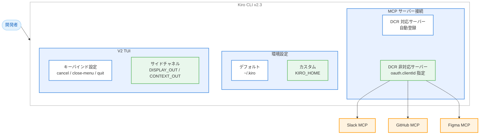

# Kiro CLI - MCP OAuth Client ID, KIRO_HOME 環境変数、TUI キーバインド設定

**リリース日**: 2026 年 5 月 12 日
**サービス**: Kiro (AWS AI-powered IDE)
**機能**: OAuth Client ID for MCP Servers / KIRO_HOME Environment Variable / Configurable V2 TUI Keybindings / Agent Output Side Channels (CLI v2.3)

[このアップデートのインフォグラフィックを見る](https://takech9203.github.io/aws-news-summary/20260512-kiro-changelog-2026-05-12.html)

## 概要

Kiro CLI v2.3.0 では、MCP サーバーへの接続範囲の拡大、Kiro のグローバル設定ディレクトリの再配置、TUI のキーバインドカスタマイズ、そしてエージェント出力のサイドチャネルという 4 つの主要機能が追加された。

このリリースのテーマは「より多くの MCP サーバーに接続し、Kiro の配置場所を自由に選び、TUI の操作を自分好みにカスタマイズする」ことである。外部サービス連携の拡充、環境管理の柔軟性向上、操作性のパーソナライズにより、多様な開発環境での Kiro 活用を促進する。

**アップデート前の課題**

- Dynamic Client Registration (DCR) をサポートしない HTTP ベースの MCP サーバー (Slack、GitHub、Figma など) には直接接続できず、独自のプロキシを構築する必要があった
- Kiro のグローバル設定は `~/.kiro` に固定されており、複数プロファイルの管理やコンテナ環境での分離が困難だった
- V2 TUI のキーバインド (`Ctrl+C`、`Esc` など) はハードコードされており、tmux プレフィックスやターミナルバインディングと競合する場合に回避策が必要だった
- エージェントが実行するシェルコマンドの出力は stdout のみで、TUI 表示用やコンテキスト注入用の出力を分離する手段がなかった

**アップデート後の改善**

- `oauth.clientId` を MCP 設定に指定することで、DCR 非対応の MCP サーバーにもプロキシなしで直接接続可能になった
- `KIRO_HOME` 環境変数により、グローバルエージェント、プロンプト、スキル、ステアリング、設定、セッションの格納ディレクトリを任意の場所に変更可能になった
- V2 TUI の cancel、close-menu、quit アクションのキーバインドをユーザーが自由にリマップ可能になった
- `$$AGENT_DISPLAY_OUT` と `$$AGENT_CONTEXT_OUT` の 2 つのサイドチャネルにより、エージェントのコンテキストを肥大化させずに TUI にリッチな進捗を表示したり、ツール結果に情報を注入したりできるようになった

## アーキテクチャ図



Kiro CLI v2.3 の主要機能の関係を示す。MCP OAuth 接続により外部サービスへのアクセスが拡大し、KIRO_HOME による環境分離、TUI のキーバインドとサイドチャネルによる操作性向上が実現されている。

## サービスアップデートの詳細

### 主要機能

1. **OAuth Client ID for MCP Servers (MCP サーバー向け OAuth クライアント ID)**
   - Dynamic Client Registration をサポートしない HTTP ベースの MCP サーバーに対して、事前登録済みの `oauth.clientId` を MCP 設定に指定して接続可能
   - **Slack**、**GitHub**、**Figma** など、手動アプリ登録が必要な OAuth ベースの MCP サーバーに、独自プロキシなしで接続できる
   - MCP 設定ファイル内の `oauth.clientId` フィールドで指定

2. **KIRO_HOME Environment Variable (KIRO_HOME 環境変数)**
   - Kiro の起動前に `KIRO_HOME` 環境変数を設定することで、グローバルエージェント、プロンプト、スキル、ステアリング、設定、セッションの格納ディレクトリを変更可能
   - 以下のユースケースに対応。
     - dotfiles を複数マシン間で管理する場合
     - 仕事用と個人用のプロファイルを分離する場合
     - コンテナ化された環境で Kiro の状態を分離する必要がある場合

3. **Configurable V2 TUI Keybindings (V2 TUI キーバインド設定)**
   - V2 TUI の cancel、close-menu、quit アクションをユーザーが好みのキーにリマップ可能
   - `Ctrl+C` や `Esc` が tmux プレフィックスやターミナルバインディングと競合する場合に、別のキーを割り当てて回避可能

4. **Agent Output Side Channels (エージェント出力サイドチャネル)**
   - エージェントが実行するシェルコマンドから、2 つの追加出力チャネルを利用可能
   - `$$AGENT_DISPLAY_OUT`: TUI にリッチな進捗情報を表示 (エージェントのコンテキストを肥大化させない)
   - `$$AGENT_CONTEXT_OUT`: ツール結果の `agent_notes` フィールドに情報を注入
   - 従来の stdout は引き続き通常通り動作

### 改善点

- **展開可能なペーストチップ**: 折りたたまれたペーストチップ上で `Tab` を押すと、インライン編集可能なテキストに展開される
- **/session-id コマンド**: 現在のセッション ID を表示する新しいスラッシュコマンド。終了時にリジューム用ヒントも表示
- **LSP file_patterns**: 言語設定でファイル名のグロブマッチングをサポート (`Dockerfile`、`*.gradle.kts` など)
- **ツール呼び出し失敗の詳細表示**: V2 TUI でツール名、試行された引数、実際の失敗理由を表示
- **HTTP リトライ警告**: リトライ時の警告がサイレントログではなく TUI に表示される
- **スキルの末尾テキストをコンテキストとして渡す**: `$$ARGUMENTS` や `$${N}` プレースホルダーのないスキルスラッシュコマンドで、末尾テキストがコンテキストとして渡される

### バグ修正

- 複数の折りたたみテキストをペーストした際に、カーソルがチップの後ではなく内部に移動する問題を修正
- リモート SSH セッションでのレンダリング問題を修正
- npm および pypi MCP レジストリサーバーで、パッケージ識別子にバージョンタグが含まれている場合に失敗する問題を修正
- `Ctrl+C` でターンをキャンセルした後にユーザープロンプトが会話履歴から消える問題を修正
- `agent.json` のレジストリタイプ MCP 環境変数が TUI モードで適用されない問題を修正
- `/mcp add` の変更がセッション間で永続化されない問題を修正

## 技術仕様

### OAuth Client ID の設定仕様

| 項目 | 詳細 |
|------|------|
| 対象 | Kiro CLI v2.3.0 以降 |
| 設定箇所 | MCP 設定ファイル |
| 設定キー | `oauth.clientId` |
| 用途 | DCR 非対応 HTTP MCP サーバーへの接続 |
| 対応サービス例 | Slack、GitHub、Figma |
| 前提条件 | 対象サービスで事前にアプリ登録が必要 |

### KIRO_HOME 環境変数の仕様

| 項目 | 詳細 |
|------|------|
| 環境変数名 | `KIRO_HOME` |
| デフォルト値 | `~/.kiro` |
| 影響範囲 | グローバルエージェント、プロンプト、スキル、ステアリング、設定、セッション |
| 設定タイミング | Kiro 起動前 |
| 対象プラットフォーム | macOS, Linux, Windows |

### V2 TUI キーバインドの設定仕様

| アクション | デフォルトキー | カスタマイズ |
|-----------|--------------|-------------|
| cancel | `Ctrl+C` | リマップ可能 |
| close-menu | `Esc` | リマップ可能 |
| quit | (既定値) | リマップ可能 |

### Agent Output Side Channels の仕様

| チャネル | 変数名 | 用途 |
|---------|--------|------|
| Display | `$$AGENT_DISPLAY_OUT` | TUI への進捗表示 (コンテキスト非消費) |
| Context | `$$AGENT_CONTEXT_OUT` | ツール結果の `agent_notes` フィールドへの注入 |
| Standard | stdout | 従来通りのツール結果出力 |

## 設定方法

### 前提条件

1. Kiro CLI v2.3.0 以降がインストールされていること
2. 有効な Kiro アカウントでサインインしていること

### 手順

#### ステップ 1: OAuth Client ID を使用した MCP サーバー接続

1. 対象サービス (Slack、GitHub、Figma など) で OAuth アプリを事前登録し、Client ID を取得する
2. MCP 設定ファイルに以下のように `oauth.clientId` を追加する

```json
{
  "mcpServers": {
    "slack": {
      "type": "http",
      "url": "https://slack-mcp-server.example.com",
      "oauth": {
        "clientId": "your-pre-registered-client-id"
      }
    }
  }
}
```

3. Kiro CLI を起動し、MCP サーバーへの接続を確認する

#### ステップ 2: KIRO_HOME の設定

1. 任意のディレクトリを作成する

```bash
mkdir -p ~/kiro-work
```

2. 環境変数を設定して Kiro を起動する

```bash
export KIRO_HOME=~/kiro-work
kiro
```

3. シェルプロファイル (`.bashrc`、`.zshrc` など) に永続化する場合は以下を追加する

```bash
export KIRO_HOME=~/kiro-work
```

#### ステップ 3: V2 TUI キーバインドの設定

1. Kiro の設定ファイルを編集する
2. キーバインドセクションで cancel、close-menu、quit に任意のキーを割り当てる

```json
{
  "keyBindings": {
    "cancel": "ctrl+x",
    "close-menu": "ctrl+]",
    "quit": "ctrl+q"
  }
}
```

#### ステップ 4: Agent Output Side Channels の利用

ラッパースクリプトやフック内でサイドチャネルを活用する。

```bash
#!/bin/bash
# ラッパースクリプトの例
echo "Processing step 1/3..." > $$AGENT_DISPLAY_OUT
# 重い処理の実行
result=$(heavy_computation)
echo "key_metric=$result" > $$AGENT_CONTEXT_OUT
echo "$result"  # 通常の stdout 出力
```

## メリット

### ビジネス面

- **外部サービス連携の拡大**: Slack、GitHub、Figma など主要な開発ツールの MCP サーバーにプロキシなしで接続可能になり、ワークフロー統合のハードルが大幅に低下
- **マルチ環境管理の効率化**: KIRO_HOME により仕事用と個人用の設定を完全に分離でき、クリーンな環境切り替えが可能
- **チーム標準化の促進**: キーバインド設定の共有により、チーム内での Kiro 操作の標準化が容易になる

### 技術面

- **DCR 非対応サービスへの対応**: OAuth 2.0 の手動クライアント登録フローに対応し、MCP エコシステムの接続範囲を大幅に拡大
- **コンテナ対応の強化**: KIRO_HOME によりコンテナイメージ内での Kiro 状態の分離が容易になり、CI/CD 環境での利用が促進
- **エージェント出力の制御性向上**: サイドチャネルにより、ユーザー向け表示とエージェントコンテキストへの情報注入を分離でき、コンテキストウィンドウの効率的な活用が可能

## デメリット・制約事項

### 制限事項

- OAuth Client ID による接続には、対象サービスでの事前アプリ登録が必須であり、サービスごとに登録手順が異なる
- KIRO_HOME を変更した場合、既存の `~/.kiro` ディレクトリの内容は自動的にはマイグレーションされない
- V2 TUI キーバインドのカスタマイズは cancel、close-menu、quit の 3 アクションに限定されており、全てのキーバインドが対象ではない
- サイドチャネルはシェルコマンド実行時のみ利用可能であり、他のツールタイプでは使用できない

### 考慮すべき点

- OAuth Client ID の管理はユーザーの責任であり、シークレットの適切な保護が必要
- KIRO_HOME を頻繁に切り替える場合、セッション履歴やグローバル設定の一貫性に注意が必要
- キーバインドのリマップにより、Kiro のドキュメントやチュートリアルに記載されたデフォルトキーと実際の操作が異なる場合がある

## ユースケース

### ユースケース 1: Slack MCP サーバーとの連携

**シナリオ**: 開発チームが Slack の MCP サーバーを通じて、Kiro CLI からチャンネルメッセージの取得や通知送信を行いたい場合

**実装例**:
```json
{
  "mcpServers": {
    "slack": {
      "type": "http",
      "url": "https://mcp.slack.com",
      "oauth": {
        "clientId": "12345678.87654321"
      }
    }
  }
}
```

**効果**: 独自のプロキシサーバーを構築・運用する必要なく、Slack の MCP サーバーに直接接続。デプロイ通知の送信やインシデント情報の取得をエージェント経由で自動化可能。

### ユースケース 2: コンテナ環境での Kiro 分離

**シナリオ**: Docker コンテナ内で Kiro を実行し、ホストの設定とは独立した環境を構築したい場合

**実装例**:
```dockerfile
FROM node:20
RUN npm install -g @anthropic-ai/kiro
ENV KIRO_HOME=/app/.kiro
WORKDIR /app
COPY . .
CMD ["kiro", "--headless", "run specs"]
```

**効果**: コンテナごとに独立した Kiro 状態を保持し、ホストマシンの `~/.kiro` に影響を与えない。CI/CD パイプラインでの再現性のある実行環境を実現。

### ユースケース 3: tmux ユーザーのキーバインド最適化

**シナリオ**: tmux のプレフィックスに `Ctrl+C` を使用しており、Kiro TUI の cancel アクションと競合する場合

**実装例**:
```json
{
  "keyBindings": {
    "cancel": "ctrl+x",
    "close-menu": "ctrl+]"
  }
}
```

**効果**: tmux と Kiro TUI のキーバインドが競合せず、両方を自然に操作可能。ターミナルマルチプレクサとの共存が改善される。

### ユースケース 4: カスタムラッパースクリプトでの進捗表示

**シナリオ**: 長時間実行されるビルドスクリプトの進捗を TUI に表示しつつ、重要なメトリクスのみをエージェントコンテキストに渡したい場合

**実装例**:
```bash
#!/bin/bash
# build-and-report.sh
echo "Building project..." > $$AGENT_DISPLAY_OUT
npm run build 2>&1
echo "Running tests..." > $$AGENT_DISPLAY_OUT
test_result=$(npm test 2>&1)
echo "test_pass_rate=95%" > $$AGENT_CONTEXT_OUT
echo "Build complete"
```

**効果**: ユーザーには TUI 上で進捗を表示しつつ、エージェントのコンテキストウィンドウには最小限のメトリクスのみを注入。コンテキストの効率的な活用とユーザー体験の両立。

## 利用可能リージョン

Kiro はグローバルサービスとして提供されており、リージョンの制約なく利用可能。

## 関連サービス・機能

- **MCP (Model Context Protocol)**: 外部ツールサーバーとの接続プロトコル。OAuth Client ID サポートにより DCR 非対応サーバーへの接続範囲が拡大
- **Kiro V2 TUI**: ターミナルベースのユーザーインターフェース。キーバインドカスタマイズとサイドチャネルの追加により操作性が向上
- **Kiro Headless Mode**: CI/CD 環境での自動実行モード。KIRO_HOME と組み合わせてコンテナ環境での分離実行に対応
- **Kiro Custom Agents**: カスタムエージェント設定。サイドチャネルと組み合わせてラッパースクリプトの出力制御が可能

## 参考リンク

- [インフォグラフィック](https://takech9203.github.io/aws-news-summary/20260512-kiro-changelog-2026-05-12.html)
- [Kiro Changelog](https://kiro.dev/changelog/)
- [OAuth Configuration - MCP Servers](https://kiro.dev/docs/cli/custom-agents/configuration-reference/#oauth-configuration)
- [KIRO_HOME - Environment Variables](https://kiro.dev/docs/cli/reference/settings/#environment-variables)
- [Key Bindings - Terminal UI](https://kiro.dev/docs/cli/reference/settings/#key-bindings-terminal-ui)
- [Side Channels for Wrapper Scripts](https://kiro.dev/docs/cli/reference/built-in-tools/#side-channels-for-wrapper-scripts)
- [Kiro ドキュメント](https://kiro.dev/docs/)

## まとめ

Kiro CLI v2.3.0 は、外部接続性、環境柔軟性、操作性の 3 つの軸で大幅な改善を実現するリリースである。OAuth Client ID サポートにより Slack、GitHub、Figma など DCR 非対応の主要サービスの MCP サーバーにプロキシなしで接続可能となり、MCP エコシステムの実用性が飛躍的に向上した。KIRO_HOME 環境変数による設定ディレクトリの再配置は、マルチプロファイル管理やコンテナ環境での活用を促進する。V2 TUI のキーバインドカスタマイズとサイドチャネルの追加により、多様なターミナル環境での操作体験が改善されている。Kiro CLI を日常的に使用しているユーザー、特に複数の外部サービスと連携するワークフローを構築しているユーザーは v2.3.0 へのアップデートを推奨する。
