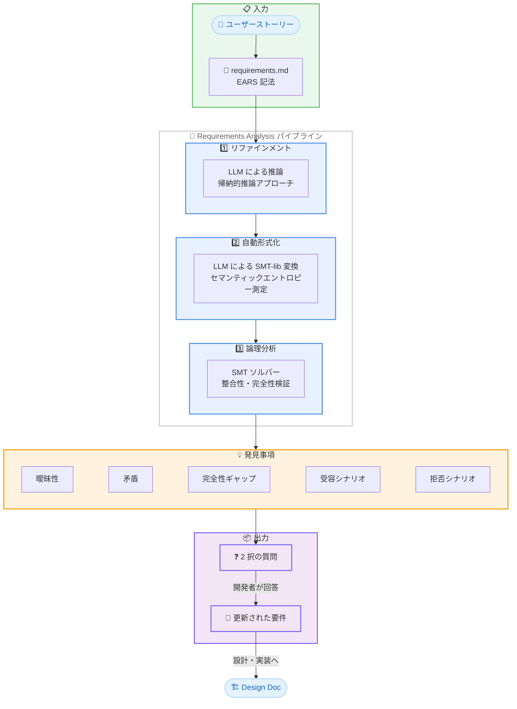

# Kiro - Requirements Analysis: 要件バグをコードになる前に発見する

**リリース日**: 2026 年 5 月 12 日
**サービス**: Kiro
**機能**: Requirements Analysis (要件分析)

## 概要

Kiro が Requirements Analysis (要件分析) 機能に関する技術ブログを公開した。この機能は、スペック駆動開発ワークフローにおいて、設計やコード生成の前段階で要件文書の品質問題を自動検出するオプションステップとして導入されたものである。

ソフトウェア開発において最もコストの高いバグは、コードではなく要件に起因する。要件文書に含まれる曖昧さ、矛盾、不完全性は、開発プロセスの後段階まで発見されないことが多く、修正コストが指数的に増大する。AI コーディングエージェントの普及により、曖昧なプロンプトから生成されるコードが人間のレビュー速度を超えて増大しており、この問題はさらに深刻化している。

研究結果によると、曖昧・不完全・矛盾するプロンプトでは Pass@1 が 20-40% 低下し、構文的に正しいコードの 60-90% が意味的に誤っている (Larbi et al., 2025)。また、仕様が不十分なプロンプトはモデルやプロンプトの変更時に約 2 倍リグレッションが発生しやすく、精度低下が 20% を超えることもある (Yang et al., 2025)。

**アップデート前の課題**

- 要件文書内の曖昧さや矛盾を人間のレビューだけで発見する必要があった
- AI エージェントが曖昧な要件を独自に解釈し、開発者の意図と乖離したコードを生成していた
- 要件レベルのバグが設計、タスク計画、コードへと伝播し、修正コストが増大していた
- 複数の要件間の論理的整合性を手動で検証することは事実上不可能だった

**アップデート後の改善**

- Neurosymbolic AI アプローチにより要件の曖昧さ・矛盾・不完全性を自動検出
- 各発見事項が 2 択の質問として提示され、開発者は形式論理の知識なしに判断可能
- LLM による要件のリファインメントで、テスト可能かつソリューション非依存な要件に自動変換
- SMT ソルバーによる論理的整合性と完全性の自動検証

## アーキテクチャ図

Requirements Analysis パイプラインの 3 段階のフローを示している。ユーザーストーリーと要件文書を入力として、リファインメント、自動形式化、論理分析の順に処理し、発見事項を 2 択の質問として開発者に提示する。

## サービスアップデートの詳細

### 主要機能

1. **要件バグの 4 分類**

   Requirements Analysis が検出する要件バグは以下の 4 クラスに分類される。

   - **詳細度の不適切さ**: 要件が論文のテーゼレベル (「システムは認証をサポートする」) または実装レシピ (「システムは 15 分 TTL の JWT トークンを使用する」) であり、観察可能な動作に対するテスト可能な制約になっていない
   - **曖昧性**: 同じ文が 2 つの妥当な解釈を持ち、2 人の開発者が異なる実装をする可能性がある
   - **矛盾**: 個別には合理的な 2 つの要件が同時に成立し得ない
   - **不完全性**: 要件が一部の入力に対する動作のみを記述しており、入力空間の全領域に対する動作が未定義

2. **3 段階のパイプライン**

   - **リファインメント**: LLM を使用して帰納的推論アプローチでテーゼレベルの要件をテスト可能かつソリューション非依存な受け入れ基準に変換する
   - **自動形式化**: 自然言語を SMT-lib 形式の論理モデルに変換し、セマンティックエントロピーにより曖昧性を検出する
   - **論理分析**: SMT ソルバーを使用して整合性と完全性を検証し、受容・拒否シナリオを生成する

3. **5 種類の発見事項**

   各発見事項は自然言語の 2 択質問として提示される (Option A: 現状維持、Option B: 変更提案)。

   - **曖昧性質問**: 文に 2 つの妥当な意味があり、どちらかを選択する
   - **矛盾質問**: 2 つのルールが同じ状況で矛盾する結果を要求し、どちらが優先するかを選択する
   - **完全性質問**: 到達可能な状況に動作を定義するルールがなく、その沈黙が意図的かを確認する
   - **受容シナリオ質問**: 仕様が現在許容している動作が意図的かを確認する
   - **拒否シナリオ質問**: 仕様が現在禁止している動作が意図的かを確認する

### リファインメントの詳細

リファインメント段階では、LLM が帰納的推論 (abductive reasoning) を使用して粗い要件を自動的にリファインする。

**プロセス**:
1. ユーザーストーリーから成功状態を逆算する
2. 成功状態に到達するための前提条件を特定する
3. 各前提条件について「何が妨げるか」「どのエラーパスが必要か」を問う
4. 既存の受け入れ基準が条件をカバーしているかを確認する
5. EARS パターンの誤用、曖昧な修飾語、実装レベルの言語をチェックする

**実例 - Delete Property 要件**:

元の 5 つの受け入れ基準に対して以下の問題を検出。

- 基準 2 (「レコードを削除する」= ハードデリート) と基準 4 (「ソフトデリートを実装」= レコード保持) が矛盾
- 基準 4 が「何を」ではなく「どのように」を記述 (実装言語の混入)
- 基準 5 が誤った EARS パターンを使用 (エラー条件に WHEN パターンを使用)

リファインメント後は 5 つの修正済み基準と 3 つの新規基準 (アクティブリース存在時、プロパティ不存在時、確認キャンセル時) が生成される。

### 自動形式化の詳細

自然言語を SMT-lib 形式の論理モデルに変換する。形式モデルは 3 つの部分で構成される。

1. **スキーマ**: エンティティ、属性、イベント、入力、出力を宣言する形式的シンボル
2. **アサーション集合**: 受け入れ基準を `antecedent => consequent` の論理含意としてエンコード
3. **背景アサーション集合**: シンボル間の暗黙的なドメイン知識をモデル化する制約

**セマンティックエントロピーによる曖昧性検出**:

LLM による形式化は非決定的であるため、同じ要件を複数回サンプリングし、自動推論エンジンで論理的等価性によりクラスタリングする。

- **低エントロピー** (low_threshold 未満): LLM が確信。多数派クラスタの代表を採用
- **高エントロピー** (high_threshold 超): LLM が信頼性なく形式化できない。EARS 文の再定式化が必要
- **中間エントロピー**: 複数の支配的解釈が存在。セマンティック差分を計算し、開発者に明確化質問を提示

### 論理分析の詳細

形式モデルに対して SMT ソルバーが以下を検証する。

- **整合性検証**: すべての受け入れ基準が同時に成立する状況が存在するか
- **完全性検証**: いずれの基準も適用されない状況が存在するか
- **矛盾検出**: 前提条件が同時に活性化しながら結論が矛盾するペアの検出

**実例 - Order Processing System**:

5 つの要件 (R1-R5) に対する分析結果。

- **矛盾 1**: R2 (在庫なし → バックオーダー) と R3 (バックオーダー禁止) が直接矛盾
- **条件付き矛盾**: キャンセル済み注文に対する再注文時、在庫有無に関わらず矛盾が発生 ({R1, R5} または {R2, R3})
- **完全性ギャップ**: 注文未送信かつ未キャンセル時、システムの動作を定義するルールが存在しない

## 技術仕様

| 項目 | 仕様 |
|------|------|
| 基盤技術 | Neurosymbolic AI (LLM + SMT ソルバー) |
| 形式言語 | SMT-lib |
| 要件記法 | EARS (Easy Approach to Requirements Syntax) |
| パイプライン段階 | 3 段階 (リファインメント → 自動形式化 → 論理分析) |
| 発見事項タイプ | 5 種類 (曖昧性、矛盾、完全性、受容シナリオ、拒否シナリオ) |
| ユーザーインタラクション | 2 択質問形式 |
| 曖昧性検出手法 | セマンティックエントロピー (複数サンプリング + 論理的等価クラスタリング) |
| ワークフロー位置 | Prompt → Requirements → **Requirements Analysis** → Design → Tasks → Code |
| 対象ファイル | requirements.md |

## 設定方法

Requirements Analysis は Kiro のスペック駆動開発ワークフロー内のオプションステップとして利用可能である。

### 基本的な利用フロー

1. Kiro でスペック駆動開発を開始し、初期プロンプトから要件を生成する
2. requirements.md が生成された後、Requirements Analysis を実行する
3. パイプラインが自動的にリファインメント、形式化、論理分析を実行する
4. 検出された問題が 2 択質問として表示される
5. 各質問に回答する (Option A: 現状維持、Option B: 変更)
6. 回答に基づいて要件が自動更新される
7. 更新された要件に基づいて設計・実装に進む

### 自動応答オプション

LLM ベースの批評者に回答を自動選択させることも可能であり、人間の介入なしにパイプラインを完了できる。

## メリット

1. **要件レベルのバグ早期発見**: 設計やコード生成前に曖昧さ・矛盾・不完全性を検出し、修正コストを大幅に削減する
2. **形式論理の知識不要**: ユーザーには 2 択の自然言語質問のみが提示され、SMT-lib や形式論理の知識は不要である
3. **AI コーディングの品質向上**: 明確で一貫した要件から生成されるコードの意味的正確性が向上する
4. **リグレッション防止**: モデルやプロンプトの変更時に発生するサイレントなリグレッションを、仕様レベルで防止する
5. **暗黙知の明示化**: 開発者の解釈バイアスやドメイン知識の暗黙的前提を明示的に文書化する
6. **自動リファインメント**: テーゼレベルの粗い要件が自動的にテスト可能で構造化された要件に変換される

## デメリット・制約事項

1. **ドメイン知識の限界**: 暗黙的なドメイン知識 (「注文はキャンセル前に送信されている必要がある」等) の抽出は頻度閾値ベースのサンプリングに依存しており、改善の余地がある
2. **形式化の信頼性**: LLM による形式化は非決定的であり、高エントロピー時は形式化を断念する必要がある
3. **オプションステップ**: 必須ではなくオプションであるため、開発者が意図的に実行する必要がある
4. **スケーラビリティの課題**: 大規模なドメインモデルの構築が要件分析のスケーリングにおける主要なボトルネックである
5. **LLM 依存**: リファインメントと形式化の品質が使用する LLM の能力に依存する
6. **完全な正確性の保証なし**: 低エントロピーでも形式化が意図と異なる可能性があり、シナリオ質問による補完が必要

## ユースケース

1. **新機能開発の要件定義**: 初期プロンプトから生成された要件を、設計前にリファインして品質を向上させる
2. **マルチ開発者プロジェクト**: 複数の開発者が異なる解釈をする可能性のある要件を事前に明確化する
3. **安全性が重要なシステム**: 矛盾する要件やカバーされていないエッジケースを事前に検出する
4. **レガシーシステムのリプレース**: 既存の要件文書の曖昧さや矛盾を発見し、移行仕様を明確化する
5. **AI エージェントへのタスク委任**: エージェントに委任する前に要件の曖昧さを排除し、意図しない実装を防止する
6. **大規模チームでの要件レビュー**: 人間によるレビューでは発見困難な要件間の論理的矛盾を自動検出する

## 利用可能リージョン

グローバル (Kiro はグローバルサービスとして提供)

## 関連サービス・機能

- **Kiro Spec-Driven Development**: 要件分析が組み込まれるスペック駆動開発ワークフロー全体
- **EARS 記法**: Kiro が要件文書で使用する Easy Approach to Requirements Syntax
- **Kiro Quick Plan Mode**: 明確な要件がある場合の高速スペック生成モード
- **Kiro Task Parallel Execution**: 要件分析後の設計・実装段階でのタスク並列実行

## 参考リンク

- [Requirements analysis: catching requirement bugs before they become code (Kiro Blog)](https://kiro.dev/blog/deep-spec-analysis/)
- [INCOSE Guide to Writing Requirements](https://www.incose.org/)
- Larbi, M., et al. (2025). When Prompts Go Wrong: Evaluating Code Model Robustness to Ambiguous, Contradictory, and Incomplete Task Descriptions. arXiv:2507.20439
- Yang, C., et al. (2025). What Prompts Don't Say: Understanding and Managing Underspecification in LLM Prompts. arXiv:2505.13360
- Norheim, J.J., et al. (2024). Challenges in applying large language models to requirements engineering tasks. Design Science, 10, e16

## まとめ

Kiro の Requirements Analysis は、Neurosymbolic AI (LLM + SMT ソルバー) を活用して要件文書の品質を自動検証する機能である。3 段階のパイプライン (リファインメント → 自動形式化 → 論理分析) により、テーゼレベルの粗い要件をテスト可能な形式に変換し、曖昧性・矛盾・不完全性を検出してユーザーに 2 択質問として提示する。

この機能の特に革新的な点は、セマンティックエントロピーを活用した曖昧性検出メカニズムと、形式論理の知識を一切必要としないユーザーインターフェースの設計にある。開発者は自然言語の質問に回答するだけで、背後で SMT ソルバーが実行する厳密な論理検証の恩恵を受けることができる。

AI コーディングの普及により、曖昧な仕様から生成されるコードのリスクが増大する中、要件レベルでの品質保証は開発プロセスの信頼性を根本から向上させるアプローチであり、spec-driven development の次の進化段階を示している。
