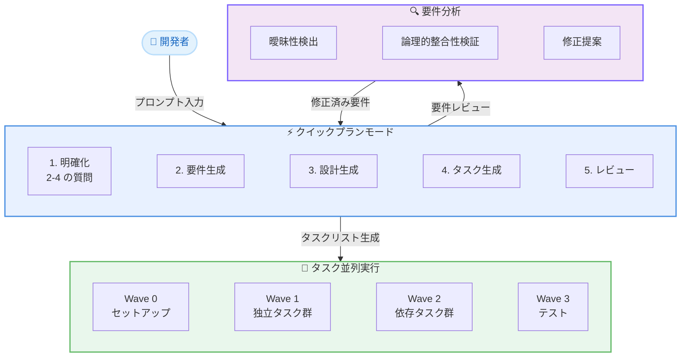

# Kiro - スペック駆動開発の高速化とインテリジェント化

**リリース日**: 2026年5月12日
**サービス**: Kiro
**機能**: タスク並列実行、クイックプランモード、要件分析

## 概要

Kiro は、スペック駆動開発 (spec-driven development) のワークフローを大幅に高速化・インテリジェント化する 3 つの新機能を発表した。タスク並列実行、クイックプランモード、および要件分析機能により、構造化された開発プロセスを維持しながら実装速度を劇的に向上させる。

従来のスペック駆動開発では、品質の高い実装を保証する代わりに開発プロセスの初期段階で時間がかかるというトレードオフがあった。今回のアップデートでは「スピードが必要な場面ではスピードを、深さが必要な場面では深さを」というコンセプトのもと、このトレードオフを解消している。

**アップデート前の課題**

- スペック内の 10 個のタスクのうち 6 個が独立していても、すべて順番に実行されていた
- 明確な機能要件がある場合でも、ステップごとの承認フローが必須だった
- 要件内の曖昧さや矛盾を人間のレビューだけで発見する必要があった
- 大規模なスペックの実装に 1 時間以上かかることがあった

**アップデート後の改善**

- 独立したタスクが依存関係グラフに基づいて自動的に並列実行される
- クイックプランモードにより、明確な機能は承認ゲートなしで一括生成可能
- Neurosymbolic AI による要件分析で曖昧さと矛盾を自動検出
- 大規模スペックの実装時間が約 4 分の 1 に短縮

## アーキテクチャ図

3 つの新機能の連携フローを示している。開発者のプロンプトからクイックプランモードでスペックを生成し、要件分析でレビューした上で、タスクを並列実行する。

## サービスアップデートの詳細

### 主要機能

1. **タスク並列実行**
   - 「Run all Tasks」クリック時に Kiro がタスクリストを解析し、依存関係グラフを自動構築
   - 同じファイルに書き込むタスクは並列実行されない
   - セットアップ・インフラ関連のタスクが最初に実行される
   - テストは検証対象のコードの後に実行される
   - 各タスクは独立したコンテキストで実行され、状態のリークがない
   - タスクが失敗しても他のタスクは継続して実行される
   - 設定不要 - 「Run all Tasks」をクリックするだけで自動的に最適化される
   - 大規模スペックの実装時間が 1 時間以上から約 15 分に短縮 (約 4 倍の高速化)

2. **クイックプランモード**
   - 従来の 3 フェーズ (要件 → 設計 → タスク) の承認フローを 1 パスで完了
   - プロンプトに基づいて 2-4 個の明確化質問を事前に提示
   - ワークスペースを自動スキャンし、言語・フレームワーク・プロジェクト構造を検出
   - 質問は 4 つの次元をカバー: スコープと制約、記述の曖昧さ、実装フォーク、方向性の決定
   - 要件・設計・タスクのアーティファクトは引き続き作成・保存され、実装時の根拠として使用
   - 選択的再生成: タスク変更 → タスクのみ再生成、設計変更 → 設計+タスク再生成、スコープ変更 → 全パイプライン再実行

3. **要件分析 (Neurosymbolic AI)**
   - LLM と自動推論を組み合わせた Neurosymbolic AI による深層分析
   - **曖昧性検出**: 各要件の複数の解釈をサンプリングし、異なる開発者が異なる実装を行う可能性のある箇所を特定
   - **論理的分析**: 自動推論により要件の整合性を数学的に検証し、矛盾する要件や記述の欠落を検出
   - 検出された問題に対して修正提案を提示
   - 「Analyze Requirements」ボタンから実行可能

## 技術仕様

### タスク並列実行の依存関係グラフ

| 分析項目 | 説明 |
|----------|------|
| ファイル書き込み検出 | 同一ファイルへの書き込みを検出し、競合を防止 |
| テスト依存関係 | テストコードが検証対象コードの後に実行されることを保証 |
| Wave グループ化 | 独立タスクを Wave (波) にグループ化して同時実行 |
| 障害分離 | 各タスクが独立したコンテキストで実行され、障害が伝播しない |

### クイックプランモードの質問次元

| 次元 | 目的 |
|------|------|
| スコープと制約 | 機能の範囲と制限を明確化 |
| 記述の曖昧さ | プロンプト内の不明確な表現を解消 |
| 実装フォーク | 複数の実装パスがある場合の選択を確認 |
| 方向性の決定 | 機能の全体的な方向性を確定 |

### 要件分析のアプローチ

| 手法 | 技術 | 検出対象 |
|------|------|----------|
| 曖昧性検出 | LLM による多重解釈サンプリング | 異なる解釈が可能な要件 |
| 論理的分析 | 自動推論 (数学的論理検証) | 矛盾する要件、記述の欠落 |

## 設定方法

### 前提条件

1. Kiro IDE がインストールされていること
2. プロジェクトにスペック (spec) が作成済みであること

### タスク並列実行の利用手順

#### ステップ 1: スペックの確認

スペック内のタスクリストが作成されていることを確認する。タスクが複数あり、独立したものが含まれている場合に並列実行の恩恵が大きい。

#### ステップ 2: Run all Tasks の実行

スペックの UI で「Run all Tasks」ボタンをクリックする。追加の設定は不要であり、Kiro が自動的に依存関係を分析して最適な実行順序を決定する。

#### ステップ 3: 結果の確認

各タスクの成功・失敗状態を確認する。失敗したタスクがあれば個別に対応し、成功したタスクの結果はそのまま利用できる。

### クイックプランモードの利用手順

#### ステップ 1: スペック作成の開始

新しいスペックを作成する際にクイックプランモードを選択する。

#### ステップ 2: 明確化質問への回答

Kiro がワークスペースをスキャンした後に提示する 2-4 個の質問に回答する。質問はプロジェクトのスタック固有のものとなる。

#### ステップ 3: タスクリストのレビュー

一括生成されたタスクリストを確認し、必要に応じて調整する。タスクの変更はタスクのみ、設計の変更は設計+タスクが再生成される。

### 要件分析の利用手順

#### ステップ 1: 要件生成

プロンプトに基づいて Kiro が要件を生成する。

#### ステップ 2: Analyze Requirements の実行

生成された要件に対して「Analyze Requirements」を選択し、Neurosymbolic AI による深層分析を開始する。

#### ステップ 3: 提案の確認と適用

検出された曖昧さや矛盾に対して提示される修正提案を確認し、適切なものを採用する。

## メリット

### ビジネス面

- **開発速度の劇的な向上**: 大規模スペックの実装時間が約 4 分の 1 に短縮され、プロジェクトの納期短縮に直結する
- **品質の維持**: 高速化しながらもスペックアーティファクトによるトレーサビリティは維持されるため、品質と速度のトレードオフが解消される
- **手戻りの削減**: 要件分析により実装前に矛盾や曖昧さを検出することで、後工程での手戻りコストを大幅に削減できる
- **トークン消費の最適化**: 事前の明確化により誤った方向への実装を防ぎ、無駄なトークン消費を回避できる

### 技術面

- **ゼロコンフィグの並列実行**: 開発者が依存関係を手動で定義する必要がなく、Kiro が自動的に最適化する
- **障害耐性**: タスクの失敗が他のタスクに伝播しないため、部分的な成功結果を活用できる
- **選択的再生成**: 変更の影響範囲のみを再生成するため、フィードバックループが高速化する
- **数学的論理検証**: LLM の推測ではなく自動推論による厳密な検証で要件の整合性を保証する

## デメリット・制約事項

### 制限事項

- タスク並列実行は同一ファイルへの書き込みが多いスペックでは効果が限定的となる
- クイックプランモードは未知の技術領域を探索する場合には、従来のステップバイステップフローの方が適切な場合がある
- 要件分析は Neurosymbolic AI に依存しており、すべての曖昧さや矛盾を 100% 検出できるわけではない
- 並列実行の効果はタスクの独立性に依存するため、タスク間の依存が多い場合は速度向上が限定的となる

### 考慮すべき点

- クイックプランモードでは承認ゲートが省略されるため、生成結果の事後レビューが重要になる
- 要件分析は追加の処理時間を要するため、シンプルな機能に対しては過剰な場合がある
- 並列実行中のタスク失敗時に、依存するタスクが待機状態となるケースがある

## ユースケース

### ユースケース 1: 大規模 API エンドポイントの一括実装

**シナリオ**: REST API の 10 個のエンドポイントをスペックとして定義し、実装する。

**効果**: 各エンドポイントが異なるファイルに実装される場合、タスク並列実行により 6-8 個のタスクが同時に実行される。従来 60-90 分かかっていた実装が約 15 分で完了する。

### ユースケース 2: 明確な仕様がある機能の高速実装

**シナリオ**: チーム内で既に議論済みのユーザー認証機能を Kiro で実装する。スコープ、制約、エッジケースが明確に定まっている。

**効果**: クイックプランモードにより、2-4 個の確認質問に答えるだけで要件・設計・タスクが一括生成される。従来の 3 段階承認フローが不要になり、アイデアからタスクリストまでが 1 パスで完了する。

### ユースケース 3: 複雑なビジネスルールの要件検証

**シナリオ**: EC サイトの割引ルールを複数定義したが、特定の条件の組み合わせで矛盾が発生する可能性がある。

**効果**: 要件分析機能により、「会員割引 30% + クーポン割引 20% = 合計 50% 割引」と「最大割引率は 40%」のような矛盾を自動検出し、修正提案を提示する。実装前に論理的な整合性が保証される。

## 利用可能リージョン

グローバル

## 関連サービス・機能

- **Kiro Specs**: スペック駆動開発の基盤機能。要件・設計・タスクの 3 層構造でプロジェクトを管理する
- **Kiro Powers**: エージェントフックを用いた自動化機能。スペック実行と連携してワークフローを拡張可能
- **Kiro CLI**: コマンドラインからもスペックの作成と実行が可能

## 参考リンク

- [公式ブログ記事 - Specs just got faster and smarter](https://kiro.dev/blog/faster-smarter-specs/)
- [Kiro Specs ドキュメント](https://kiro.dev/docs/specs)
- [要件分析の詳細 (deep-dive)](https://kiro.dev/blog/deep-spec-analysis)

## まとめ

Kiro のスペック駆動開発が 3 つの新機能により大幅に進化した。タスク並列実行により大規模スペックの実装時間が約 4 分の 1 に短縮され、クイックプランモードにより明確な機能のスペック生成が 1 パスで完了するようになった。さらに、Neurosymbolic AI を活用した要件分析により、実装前の段階で曖昧さや矛盾を検出できるようになった。これらの機能は「構造化された開発は高品質だが遅い」という従来のトレードオフを解消し、品質と速度の両立を実現している。すべての機能は追加設定不要で即座に利用可能である。
