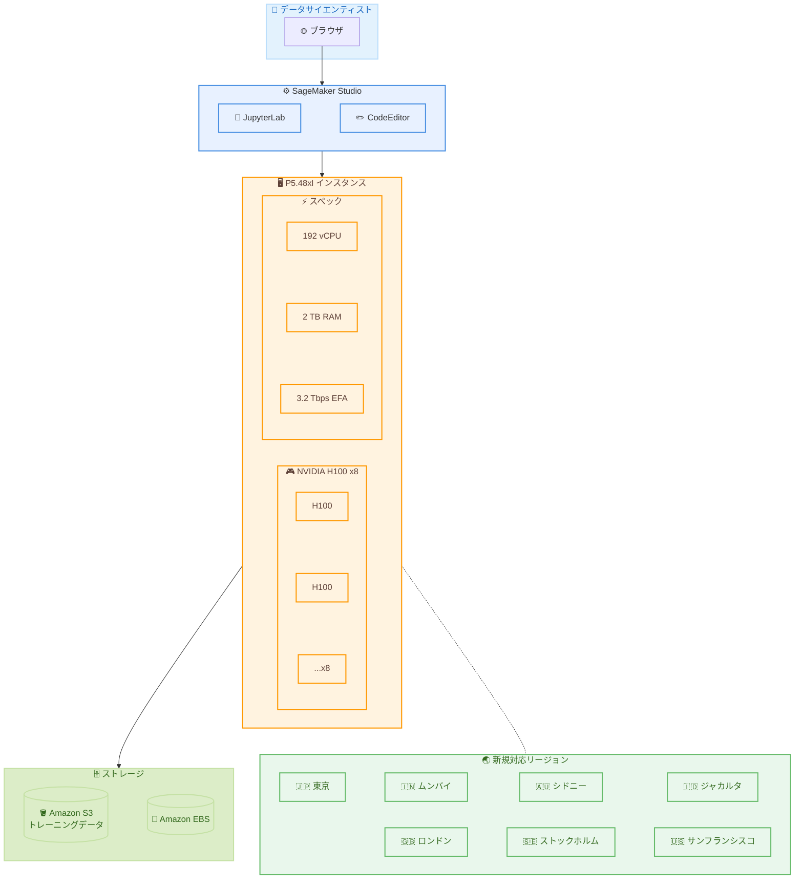

# Amazon SageMaker Studio - P5.48xl インスタンスのリージョン拡大

**リリース日**: 2026 年 5 月 12 日
**サービス**: Amazon SageMaker Studio
**機能**: P5.48xl インスタンス (NVIDIA H100 Tensor Core GPU 搭載) のリージョン拡大

📊 [このアップデートのインフォグラフィックを見る](https://takech9203.github.io/aws-news-summary/20260512-p5-48xl-region-expansion-sagemaker-studio-notebooks.html)

## 概要

Amazon EC2 P5.48xl インスタンスが SageMaker Studio ノートブック上で新たに 7 リージョンで一般利用可能 (GA) になった。追加されたリージョンは、US West (San Francisco)、Asia Pacific (Tokyo、Mumbai、Sydney、Jakarta)、Europe (London、Stockholm) である。**特に東京リージョン (ap-northeast-1) での利用が可能になったことで、日本のユーザーはデータの国内保持要件を満たしつつ、最新の NVIDIA H100 GPU を活用した大規模モデルのトレーニングや推論を低レイテンシで実行できるようになった。**

P5.48xl インスタンスは NVIDIA H100 Tensor Core GPU を搭載し、前世代の GPU ベース EC2 インスタンスと比較して最大 4 倍の処理速度向上と、ML モデルトレーニングコストの最大 40% 削減を実現する。SageMaker Studio の JupyterLab や CodeEditor から直接利用でき、大規模言語モデル (LLM) や拡散モデルのトレーニング・デプロイに適している。

**アップデート前の課題**

- 東京リージョンで P5.48xl インスタンスを SageMaker Studio ノートブックから利用できず、日本のユーザーはリージョン間のレイテンシを受け入れるか、性能の低いインスタンスを使用する必要があった
- アジア太平洋地域での H100 GPU へのアクセスが限定的で、データレジデンシー要件を満たしながら最新 GPU を活用することが困難だった
- 欧州地域のユーザーも同様に、GDPR 等のデータ保護要件を満たしつつ高性能 GPU を利用する選択肢が制限されていた

**アップデート後の改善**

- 東京リージョンを含む 7 つの新リージョンで P5.48xl インスタンスが SageMaker Studio ノートブックから利用可能になった
- 日本のユーザーがデータを国内に保持したまま NVIDIA H100 GPU による大規模 ML ワークロードを実行できるようになった
- アジア太平洋・欧州地域のユーザーがローカルリージョンで前世代比 4 倍高速な深層学習を実行可能になった
- SageMaker Studio の JupyterLab / CodeEditor を通じて、フルマネージドな開発環境で直接 P5.48xl にアクセスできるようになった

## アーキテクチャ図



P5.48xl インスタンスを SageMaker Studio ノートブックから利用するアーキテクチャ。ブラウザ経由で JupyterLab または CodeEditor に接続し、8 基の NVIDIA H100 GPU を搭載した P5.48xl インスタンス上で大規模モデルのトレーニングや推論を実行する。

## サービスアップデートの詳細

### 主要機能

1. **NVIDIA H100 Tensor Core GPU による高性能コンピューティング**
   - 8 基の NVIDIA H100 GPU を搭載し、前世代比最大 4 倍の深層学習性能を提供
   - 第 4 世代 Tensor Core による混合精度演算の高速化
   - Transformer Engine によるトレーニングと推論の効率化
   - FP8 精度のサポートにより、精度を維持しながら計算効率を向上

2. **SageMaker Studio ノートブックとのシームレスな統合**
   - JupyterLab アプリケーションから直接 P5.48xl インスタンスを選択して起動可能
   - CodeEditor アプリケーションでも同様に利用可能
   - フルマネージド環境でインフラ管理不要
   - カーネルの切り替えやライブラリの事前インストール済み環境を活用

3. **大規模生成 AI アプリケーションのサポート**
   - 大規模言語モデル (LLM) のトレーニングとデプロイ
   - 拡散モデルによる画像・動画生成
   - 質問応答、コード生成、音声認識などの生成 AI ユースケース
   - 高性能コンピューティング (HPC) アプリケーション

## 技術仕様

### P5.48xl インスタンス仕様

| 項目 | 詳細 |
|------|------|
| GPU | NVIDIA H100 Tensor Core GPU x 8 基 |
| GPU メモリ | 640 GB HBM3 (80 GB x 8) |
| vCPU | 192 |
| メモリ | 2,048 GB |
| GPU 間接続 | NVSwitch (900 GB/s) |
| ネットワーク帯域幅 | 3,200 Gbps (EFA) |
| ストレージ | 8 x 3.84 TB NVMe SSD |
| FP8 性能 | 約 16 PFLOPS |
| TF32 性能 | 約 8 PFLOPS |

### P5.48xl vs 前世代 P4d.24xlarge 比較

| 項目 | P5.48xl | P4d.24xlarge |
|------|---------|--------------|
| GPU | NVIDIA H100 x 8 | NVIDIA A100 x 8 |
| GPU メモリ | 640 GB HBM3 | 320 GB HBM2e |
| vCPU | 192 | 96 |
| システムメモリ | 2,048 GB | 1,152 GB |
| ネットワーク | 3,200 Gbps EFA | 400 Gbps EFA |
| トレーニング性能向上 | 最大 4 倍高速 | 基準値 |
| コスト効率 | 最大 40% コスト削減 | 基準値 |

### SageMaker Studio 対応アプリケーション

| アプリケーション | 対応状況 |
|-----------------|----------|
| JupyterLab | 対応済み |
| CodeEditor | 対応済み |
| Canvas | 未確認 |

## 設定方法

### 前提条件

1. AWS アカウントと SageMaker Studio ドメインが設定済みであること
2. P5.48xl インスタンスの Service Quotas が十分に確保されていること
3. 適切な IAM 権限が付与されていること
4. 対象リージョンで SageMaker Studio が利用可能であること

### 手順

#### ステップ 1: Service Quotas の確認と引き上げ申請

```bash
# 現在の P5 インスタンスのクォータを確認
aws service-quotas get-service-quota \
  --service-code sagemaker \
  --quota-code L-12345678 \
  --region ap-northeast-1
```

P5.48xl は 192 vCPU を使用するため、SageMaker Studio ノートブックの vCPU クォータが 192 以上であることを確認する。不足している場合は Service Quotas コンソールから引き上げ申請を行う。

#### ステップ 2: SageMaker Studio ドメインの作成または確認

```bash
# 東京リージョンで既存ドメインを確認
aws sagemaker list-domains --region ap-northeast-1

# ドメインが存在しない場合は新規作成
aws sagemaker create-domain \
  --domain-name "ml-studio-domain" \
  --auth-mode IAM \
  --default-user-settings '{
    "ExecutionRole": "arn:aws:iam::123456789012:role/SageMakerExecutionRole"
  }' \
  --subnet-ids subnet-xxxxx \
  --vpc-id vpc-xxxxx \
  --region ap-northeast-1
```

東京リージョンで SageMaker Studio ドメインを確認し、存在しない場合は新規作成する。

#### ステップ 3: JupyterLab で P5.48xl インスタンスを選択して起動

1. SageMaker Studio コンソールにアクセスする
2. JupyterLab または CodeEditor アプリケーションを選択する
3. インスタンスタイプとして `ml.p5.48xlarge` を選択する
4. イメージとして適切な深層学習フレームワーク (PyTorch、TensorFlow 等) を選択する
5. 「Run Space」をクリックしてノートブック環境を起動する

#### ステップ 4: GPU の動作確認

```python
# ノートブック内で GPU の認識を確認
import torch

print(f"CUDA available: {torch.cuda.is_available()}")
print(f"GPU count: {torch.cuda.device_count()}")
for i in range(torch.cuda.device_count()):
    print(f"GPU {i}: {torch.cuda.get_device_name(i)}")
    print(f"  Memory: {torch.cuda.get_device_properties(i).total_mem / 1e9:.1f} GB")
```

8 基の NVIDIA H100 GPU が正しく認識されていることを確認する。

## メリット

### ビジネス面

- **データレジデンシー要件の充足**: 東京リージョンでの利用により、日本国内でのデータ保持要件を満たしながら最新 GPU を活用できる
- **トレーニングコストの 40% 削減**: 前世代インスタンスと比較して同じモデルのトレーニングコストを大幅に削減可能
- **市場投入時間の短縮**: 4 倍高速なトレーニングにより、ML モデルの開発サイクルを大幅に短縮

### 技術面

- **低レイテンシアクセス**: 東京リージョンからの利用により、データ転送のレイテンシが大幅に低減
- **前世代比 4 倍の性能向上**: H100 GPU の第 4 世代 Tensor Core と HBM3 メモリにより、深層学習ワークロードが大幅に高速化
- **3,200 Gbps EFA ネットワーク**: 分散トレーニング時のノード間通信が高速化され、スケーリング効率が向上
- **フルマネージド環境**: SageMaker Studio 経由での利用により、インフラ管理のオーバーヘッドが不要

## デメリット・制約事項

### 制限事項

- P5.48xl は非常に大規模なインスタンスであり、Service Quotas の引き上げ申請が必要な場合が多い
- 高い時間単価のため、不要時のインスタンス停止管理が重要
- 一部リージョンではキャパシティの制約により、即時利用開始が困難な場合がある
- 8 GPU すべてを有効活用するには、分散トレーニングの知識とコードの最適化が必要

### 考慮すべき点

- 小規模なモデルや推論のみのワークロードでは、P5.48xl はオーバースペックとなる可能性がある。P4d.24xlarge や G5 インスタンスの方がコスト効率が良い場合がある
- ストレージ I/O がボトルネックにならないよう、トレーニングデータの配置戦略 (S3 バケットを同一リージョンに配置) を検討する必要がある
- EFA を活用した分散トレーニングには適切な VPC 設定とセキュリティグループの構成が必要

## ユースケース

### ユースケース 1: 大規模言語モデルのファインチューニング

**シナリオ**: 日本語特化の LLM を東京リージョンで自社データを用いてファインチューニングする

**実装例**:
```python
import sagemaker
from sagemaker.huggingface import HuggingFace

# 東京リージョンで SageMaker セッションを作成
session = sagemaker.Session(boto_session=boto3.Session(region_name='ap-northeast-1'))

# P5.48xl でファインチューニングジョブを設定
huggingface_estimator = HuggingFace(
    entry_point='train.py',
    instance_type='ml.p5.48xlarge',
    instance_count=1,
    role=role,
    transformers_version='4.36',
    pytorch_version='2.1',
    py_version='py310',
    hyperparameters={
        'model_name': 'meta-llama/Llama-3-70b',
        'epochs': 3,
        'per_device_train_batch_size': 4,
        'gradient_accumulation_steps': 8,
    },
    sagemaker_session=session,
)
```

**効果**: 日本国内にデータを保持しながら、70B パラメータクラスの LLM を 8 基の H100 GPU で効率的にファインチューニングできる。前世代比で約 4 倍速くトレーニングが完了する。

### ユースケース 2: 画像生成モデルのトレーニング

**シナリオ**: 高解像度画像生成のための拡散モデルをトレーニングする

**実装例**:
```python
# JupyterLab ノートブック内での分散トレーニング設定
import torch
import torch.distributed as dist
from accelerate import Accelerator

accelerator = Accelerator(
    mixed_precision="bf16",  # H100 の BF16 性能を活用
    gradient_accumulation_steps=4,
)

# 8 GPU で分散トレーニング
model = accelerator.prepare(model)
optimizer = accelerator.prepare(optimizer)
dataloader = accelerator.prepare(dataloader)

for batch in dataloader:
    with accelerator.accumulate(model):
        outputs = model(batch)
        loss = outputs.loss
        accelerator.backward(loss)
        optimizer.step()
        optimizer.zero_grad()
```

**効果**: 640 GB の GPU メモリを活用して大規模な拡散モデルをメモリ不足なくトレーニングでき、HBM3 の高帯域により画像生成のスループットが大幅に向上する。

### ユースケース 3: HPC シミュレーション

**シナリオ**: 創薬分子動力学シミュレーションを東京リージョンで実行する

**実装例**:
```python
# 分子動力学シミュレーション用の環境設定
# P5.48xl の NVMe SSD を一時ストレージとして活用

import subprocess

# OpenMM による GPU 加速分子シミュレーション
simulation_config = {
    "platform": "CUDA",
    "device_indices": "0,1,2,3,4,5,6,7",  # 8 GPU すべてを使用
    "precision": "mixed",
    "simulation_steps": 10_000_000,
}

# NVMe SSD にチェックポイントを高速保存
checkpoint_dir = "/opt/ml/nvme/checkpoints"
```

**効果**: 8 基の H100 GPU と NVSwitch による高速 GPU 間通信により、従来数日かかっていた分子シミュレーションを数時間で完了できる。日本の製薬企業がデータを国内に保持しながら高速計算を実行可能。

## 料金

P5.48xl インスタンスの SageMaker Studio ノートブック利用料金はリージョンにより異なる。以下は参考値である。

### 料金例

| リージョン | オンデマンド時間単価 (概算) |
|-----------|--------------------------|
| US West (San Francisco) | 約 $98.32/時間 |
| Asia Pacific (Tokyo) | 約 $117.98/時間 |
| Asia Pacific (Mumbai) | 約 $107.15/時間 |
| Asia Pacific (Sydney) | 約 $117.98/時間 |
| Europe (London) | 約 $113.07/時間 |
| Europe (Stockholm) | 約 $107.15/時間 |

**注意**: 上記は SageMaker Studio ノートブックでの P5.48xl インスタンス利用時の概算料金。正確な料金は [SageMaker 料金ページ](https://aws.amazon.com/sagemaker/pricing/) を確認すること。料金にはインスタンス利用料に加え、EBS ストレージや S3 データ転送の費用が別途発生する。

**コスト最適化のポイント**:
- ノートブックのアイドルタイムアウト設定を活用し、未使用時の自動停止を有効化する
- 開発・デバッグには小さいインスタンスを使用し、本番トレーニング時のみ P5.48xl を起動する
- SageMaker Savings Plans の活用を検討する

## 利用可能リージョン

### 今回新たに追加されたリージョン

| リージョン | リージョンコード | 備考 |
|-----------|-----------------|------|
| **US West (San Francisco)** | us-west-1 | - |
| **Asia Pacific (Tokyo)** | ap-northeast-1 | **日本のユーザーに最適** |
| **Asia Pacific (Mumbai)** | ap-south-1 | - |
| **Asia Pacific (Sydney)** | ap-southeast-2 | - |
| **Asia Pacific (Jakarta)** | ap-southeast-3 | - |
| **Europe (London)** | eu-west-2 | - |
| **Europe (Stockholm)** | eu-north-1 | - |

### 既存の対応リージョン

| リージョン | リージョンコード |
|-----------|-----------------|
| US East (N. Virginia) | us-east-1 |
| US East (Ohio) | us-east-2 |
| US West (Oregon) | us-west-2 |

## 関連サービス・機能

- **Amazon SageMaker Studio**: フルマネージドの ML 開発環境。JupyterLab と CodeEditor を提供し、P5.48xl インスタンスを直接利用可能
- **Amazon EC2 P5 インスタンス**: NVIDIA H100 GPU 搭載のインスタンスファミリー。SageMaker Studio 以外にも EC2 として直接起動可能
- **Amazon SageMaker Training**: マネージドトレーニングジョブとして P5 インスタンスを活用し、分散トレーニングを実行可能
- **Amazon S3**: トレーニングデータやモデルアーティファクトの保存先。同一リージョンでの利用が推奨される
- **AWS Elastic Fabric Adapter (EFA)**: 3,200 Gbps のネットワーク帯域を提供し、マルチノード分散トレーニングを高速化

## 参考リンク

- 📊 [インフォグラフィック](https://takech9203.github.io/aws-news-summary/20260512-p5-48xl-region-expansion-sagemaker-studio-notebooks.html)
- [公式発表 (What's New)](https://aws.amazon.com/about-aws/whats-new/2026/06/p5-48xl-region-expansion-sagemaker-studio-notebooks/)
- [SageMaker Studio JupyterLab 開発者ガイド](https://docs.aws.amazon.com/sagemaker/latest/dg/studio-updated-jl.html)
- [SageMaker Studio CodeEditor 開発者ガイド](https://docs.aws.amazon.com/sagemaker/latest/dg/code-editor.html)
- [SageMaker 料金ページ](https://aws.amazon.com/sagemaker/pricing/)
- [Amazon EC2 P5 インスタンス](https://aws.amazon.com/ec2/instance-types/p5/)

## まとめ

P5.48xl インスタンスの東京リージョンを含む 7 リージョンへの拡大は、特に日本のデータサイエンティストや ML エンジニアにとって重要なアップデートである。データレジデンシー要件を満たしながら NVIDIA H100 GPU の性能を活用でき、前世代比 4 倍の速度向上と 40% のコスト削減により、LLM や生成 AI モデルの開発を大幅に加速できる。SageMaker Studio の Service Quotas を確認し、東京リージョンでの P5.48xl インスタンスの利用を早期に開始することを推奨する。
