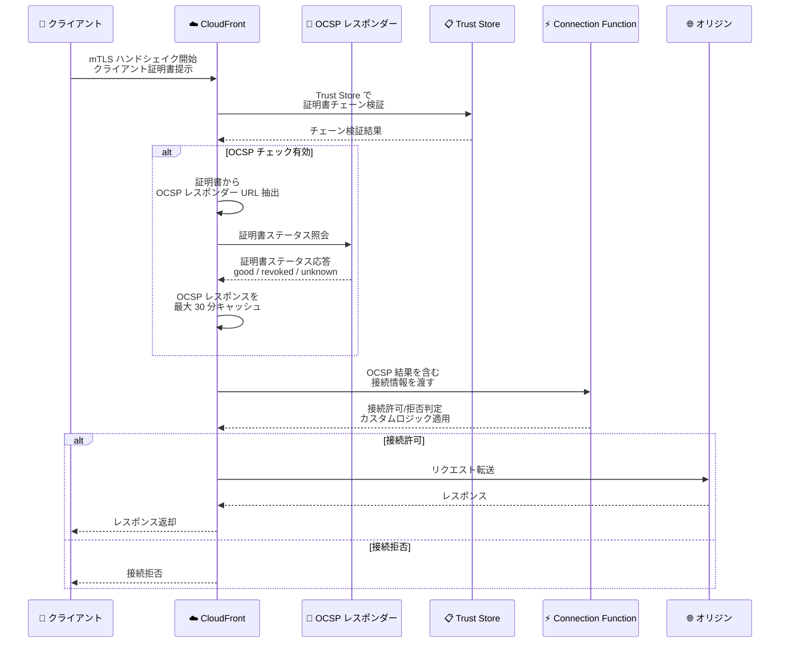

# Amazon CloudFront - Mutual TLS (Viewer) 向け OCSP 失効チェックサポート

**リリース日**: 2026年5月13日
**サービス**: Amazon CloudFront
**機能**: Online Certificate Status Protocol (OCSP) Revocation for Viewer mTLS

📊 [このアップデートのインフォグラフィックを見る](https://takech9203.github.io/aws-news-summary/20260513-amazon-cloudfront-ocsp-tls.html)

## 概要

Amazon CloudFront が、ビューワー側の相互 TLS (mTLS) 接続におけるクライアント証明書の OCSP (Online Certificate Status Protocol) 失効チェックをサポートしました。これにより、接続確立時にクライアント証明書の失効状態をリアルタイムで検証できるようになります。

OCSP 失効チェックは、規制業界やゼロトラストアーキテクチャで一般的に求められる要件です。CloudFront はクライアント証明書に埋め込まれた OCSP レスポンダー URL に対してクエリを実行し、証明書が失効していないかをリアルタイムで確認します。OCSP レスポンスは最大 30 分間キャッシュされ、パフォーマンスへの影響を最小限に抑えます。

**アップデート前の課題**

- クライアント証明書の失効確認には CloudFront Functions と KeyValueStore を使用した静的な失効リスト (CRL) の管理が必要だった
- 静的リストの手動更新が必要で、証明書失効からリスト反映までのタイムラグが発生していた
- 大規模な失効リストの管理が運用負荷として大きかった
- リアルタイムでの証明書失効状態の確認ができなかった

**アップデート後の改善**

- クライアント証明書に埋め込まれた OCSP レスポンダー URL を使用してリアルタイム失効チェックが可能になった
- 静的な失効リストの管理・更新が不要になった
- OCSP レスポンスが最大 30 分間キャッシュされ、パフォーマンスとセキュリティのバランスが取れた
- OCSP 結果がコネクション関数 (Connection Function) で利用可能になり、猶予期間や IP ベースの例外などのカスタムロジックを実装できるようになった
- 追加コストなしで利用可能

## アーキテクチャ図



CloudFront が mTLS ハンドシェイク中にクライアント証明書の OCSP 失効チェックを実行し、その結果を Connection Function に渡してカスタムロジックを適用するフローを示しています。

## サービスアップデートの詳細

### 主要機能

1. **リアルタイム OCSP 失効チェック**
   - クライアント証明書に埋め込まれた Authority Information Access (AIA) 拡張の OCSP レスポンダー URL を使用
   - 接続確立時に証明書の失効状態をリアルタイムで確認
   - Trust Store で `UseClientCertificateOCSPEndpoint` を有効化することで利用可能

2. **OCSP レスポンスキャッシュ**
   - OCSP レスポンスを最大 30 分間キャッシュ
   - 同一証明書の繰り返しチェックによるレイテンシー増加を防止
   - キャッシュにより OCSP レスポンダーへの負荷も軽減

3. **Connection Function との統合**
   - OCSP チェック結果がコネクション関数のイベントオブジェクトに含まれる
   - 猶予期間の設定 (例: 失効後 24 時間は接続を許可)
   - IP アドレスベースの例外処理
   - 自社独自の失効リストとの組み合わせ
   - OCSP レスポンダーが応答しない場合のフォールバック処理

4. **Passthrough モード**
   - ViewerMtlsConfig に新たに `passthrough` モードが追加
   - mTLS の結果を強制せず、Connection Function にすべての判断を委ねる柔軟な構成が可能

## 技術仕様

### 設定パラメータ

| 項目 | 詳細 |
|------|------|
| Trust Store 設定 | `UseClientCertificateOCSPEndpoint: boolean` |
| ViewerMtlsConfig モード | `enforce`, `passthrough` (新規追加) |
| OCSP レスポンスキャッシュ期間 | 最大 30 分 |
| OCSP プロトコル | RFC 6960 準拠 |
| 追加コスト | なし |

### API 変更履歴

| 日付 | サービス | 変更内容 |
|------|----------|----------|
| 2026/05/14 | [cloudfront](https://awsapichanges.com/archive/changes/bd1fb2-cloudfront.html) | 17 updated api methods - OCSP 失効チェック用ブール値と Passthrough モードの追加 |

### 主要な API 変更

**Trust Store API (CreateTrustStore / UpdateTrustStore)**:
- `UseClientCertificateOCSPEndpoint` パラメータの追加 (boolean)

**Distribution API (Create/Update/Get)**:
- `ViewerMtlsConfig.Mode` に `passthrough` オプションの追加

**更新された API メソッド**:
- `CreateDistribution` / `UpdateDistribution`
- `CreateTrustStore` / `UpdateTrustStore` / `GetTrustStore`
- `CopyDistribution` / `GetDistribution` / `GetDistributionConfig`
- `ListDistributions` および各種 `ListDistributionsBy*` メソッド
- `UpdateDistributionWithStagingConfig`

### 設定例

```json
{
  "TrustStore": {
    "Name": "my-mtls-trust-store",
    "UseClientCertificateOCSPEndpoint": true
  }
}
```

```json
{
  "ViewerMtlsConfig": {
    "Mode": "passthrough",
    "TrustStoreArn": "arn:aws:cloudfront::123456789012:trust-store/my-mtls-trust-store"
  }
}
```

## 設定方法

### 前提条件

1. 既存の CloudFront ディストリビューション
2. mTLS 用の Trust Store が設定済み (CA 証明書がアップロード済み)
3. クライアント証明書に OCSP レスポンダー URL が AIA 拡張として埋め込まれていること

### 手順

#### ステップ 1: Trust Store で OCSP チェックを有効化

```bash
aws cloudfront update-trust-store \
  --id E1234567890ABC \
  --use-client-certificate-ocsp-endpoint
```

Trust Store の設定を更新し、クライアント証明書に埋め込まれた OCSP エンドポイントを使用した失効チェックを有効にします。

#### ステップ 2: ディストリビューションの ViewerMtlsConfig を設定

```bash
aws cloudfront update-distribution \
  --id E1234567890ABC \
  --distribution-config '{
    "ViewerMtlsConfig": {
      "Mode": "enforce",
      "TrustStoreArn": "arn:aws:cloudfront::123456789012:trust-store/my-mtls-trust-store"
    }
  }'
```

ディストリビューションに mTLS 設定を適用します。`enforce` モードでは証明書の検証に失敗した接続を拒否します。`passthrough` モードでは Connection Function に判断を委ねます。

#### ステップ 3: Connection Function でカスタムロジックを実装 (オプション)

```javascript
function handler(event) {
  var connection = event.connection;
  var mtls = connection.mtls;

  // OCSP ステータスの確認
  if (mtls.ocspStatus === "revoked") {
    // 猶予期間の確認
    var revokedTime = new Date(mtls.ocspRevokedAt);
    var now = new Date();
    var gracePeriodMs = 24 * 60 * 60 * 1000; // 24 時間

    if (now - revokedTime < gracePeriodMs) {
      // 猶予期間内は接続を許可
      return { action: "allow" };
    }
    return { action: "deny", reason: "certificate_revoked" };
  }

  // OCSP レスポンダーに到達できない場合
  if (mtls.ocspStatus === "unknown") {
    // IP ベースの例外処理
    var trustedIPs = ["192.0.2.0/24", "198.51.100.0/24"];
    if (isInRange(connection.clientIp, trustedIPs)) {
      return { action: "allow" };
    }
    return { action: "deny", reason: "ocsp_check_failed" };
  }

  return { action: "allow" };
}
```

Connection Function を使用して OCSP 結果に基づくカスタムロジックを実装します。猶予期間、IP ベースの例外、独自の失効リストとの組み合わせなど、柔軟な制御が可能です。

## メリット

### ビジネス面

- **コンプライアンス対応の簡素化**: 金融機関や医療機関など規制業界で求められる証明書失効チェック要件を標準機能で対応可能
- **運用コスト削減**: 静的 CRL リストの管理・更新作業が不要になり、運用負荷を大幅に軽減
- **追加コストなし**: 既存の CloudFront 料金内で利用可能

### 技術面

- **リアルタイム検証**: 証明書失効の即時反映により、セキュリティギャップを最小化
- **キャッシュによるパフォーマンス最適化**: 最大 30 分のキャッシュにより、レイテンシーへの影響を抑制
- **柔軟なカスタマイズ**: Connection Function との統合により、組織固有のセキュリティポリシーを実装可能
- **ゼロトラストアーキテクチャの強化**: 証明書の有効性をリアルタイムで継続的に検証

## デメリット・制約事項

### 制限事項

- OCSP レスポンスのキャッシュ期間は最大 30 分で、この間に失効した証明書は即時にブロックされない
- クライアント証明書に OCSP レスポンダー URL (AIA 拡張) が埋め込まれている必要がある
- OCSP レスポンダーの可用性に依存するため、レスポンダーがダウンした場合のフォールバック設計が必要

### 考慮すべき点

- OCSP レスポンダーへのクエリにより、初回接続時のレイテンシーがわずかに増加する可能性がある
- OCSP Stapling とは異なり、クライアント側ではなく CloudFront (サーバー側) が OCSP レスポンダーに問い合わせを行う
- 既存の CRL ベースの失効チェックから移行する場合、両方を並行運用する移行期間を検討する

## ユースケース

### ユースケース 1: 金融機関の API ゲートウェイ

**シナリオ**: 銀行の API プラットフォームで、パートナー企業のクライアント証明書が失効した場合に即座にアクセスを遮断する必要がある。

**実装例**:
```json
{
  "TrustStore": {
    "UseClientCertificateOCSPEndpoint": true
  },
  "ViewerMtlsConfig": {
    "Mode": "enforce"
  }
}
```

**効果**: 契約終了や不正アクセス検知時に CA で証明書を失効させるだけで、最大 30 分以内に自動的にアクセスが遮断される。

### ユースケース 2: ゼロトラストアーキテクチャ

**シナリオ**: 企業のゼロトラスト環境で、デバイス証明書の有効性を継続的に検証しつつ、特定条件下では猶予期間を設ける。

**実装例**:
```javascript
function handler(event) {
  var mtls = event.connection.mtls;

  if (mtls.ocspStatus === "revoked") {
    // 社内 IP からのアクセスは猶予期間を適用
    if (isInternalNetwork(event.connection.clientIp)) {
      return { action: "allow", headers: { "x-cert-warning": "revoked" } };
    }
    return { action: "deny" };
  }
  return { action: "allow" };
}
```

**効果**: 外部からのアクセスは即座にブロックしつつ、社内ネットワークからのアクセスにはソフトランディング期間を確保できる。

### ユースケース 3: IoT デバイス管理

**シナリオ**: 大量の IoT デバイスが mTLS で接続する環境で、侵害されたデバイスの証明書を失効させて即時遮断する。

**実装例**:
```json
{
  "TrustStore": {
    "UseClientCertificateOCSPEndpoint": true
  },
  "ViewerMtlsConfig": {
    "Mode": "passthrough"
  }
}
```

**効果**: 静的な CRL の配信・更新を待たずに、CA で証明書を失効させるだけで侵害デバイスを自動的に遮断できる。Passthrough モードと Connection Function の組み合わせにより、デバイスタイプごとの柔軟なポリシー適用が可能。

## 料金

OCSP 失効チェック機能は追加コストなしで利用可能です。通常の CloudFront の利用料金 (リクエスト数、データ転送量) が適用されます。

## 利用可能リージョン

Amazon CloudFront はグローバルサービスであり、本機能はすべての CloudFront エッジロケーションで利用可能です。

## 関連サービス・機能

- **Amazon CloudFront Viewer mTLS**: クライアント証明書による相互 TLS 認証の基盤機能
- **CloudFront Connection Function**: 接続レベルでのカスタムロジック実行環境
- **AWS Certificate Manager (ACM)**: サーバー証明書の管理。クライアント証明書の CA は Trust Store で管理
- **AWS Private CA**: プライベート認証局の運用と証明書失効管理に使用可能

## 参考リンク

- 📊 [インフォグラフィック](https://takech9203.github.io/aws-news-summary/20260513-amazon-cloudfront-ocsp-tls.html)
- [公式発表 (What's New)](https://aws.amazon.com/about-aws/whats-new/2026/05/amazon-cloudfront-ocsp-tls/)
- [AWS API Changes - CloudFront](https://awsapichanges.com/archive/changes/bd1fb2-cloudfront.html)
- [CloudFront mTLS ドキュメント](https://docs.aws.amazon.com/AmazonCloudFront/latest/DeveloperGuide/mutual-tls-authentication.html)
- [CloudFront 料金ページ](https://aws.amazon.com/cloudfront/pricing/)

## まとめ

Amazon CloudFront の Viewer mTLS 向け OCSP 失効チェックサポートは、規制業界やゼロトラストアーキテクチャにおけるクライアント証明書管理を大幅に簡素化します。従来の静的な CRL 管理から、リアルタイムの OCSP ベース検証への移行により、運用負荷の削減とセキュリティの向上を同時に実現できます。追加コストなしで利用可能であり、既存の mTLS 環境を運用している組織は早期の導入検討を推奨します。
