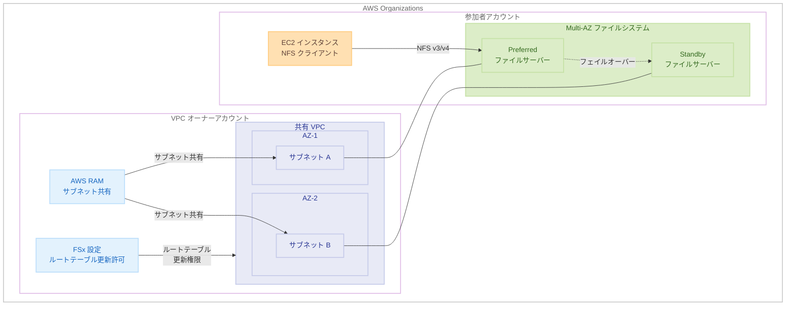

# Amazon FSx for OpenZFS - 共有 VPC での Multi-AZ ファイルシステム作成サポート

**リリース日**: 2026年5月13日
**サービス**: Amazon FSx for OpenZFS
**機能**: 共有 VPC における Multi-AZ ファイルシステムの作成

[このアップデートのインフォグラフィックを見る](https://takech9203.github.io/aws-news-summary/20260513-amazon-fsx-openzfs-multi-az-vpcs.html)

## 概要

Amazon FSx for OpenZFS が、AWS Organizations 内の共有 VPC において Multi-AZ ファイルシステムの作成をサポートするようになった。これにより、ネットワーク管理とストレージ管理の分散化がより容易になり、マルチアカウント環境での高可用性ファイルストレージの展開が大幅に簡素化される。

VPC 共有は、リソースオーナーアカウントが 1 つ以上の VPC サブネットを、同じ AWS Organization 内の他のアカウント (参加者アカウント) と共有できる機能である。今回のアップデートにより、参加者アカウントは共有 VPC 内であらゆるデプロイタイプの FSx for OpenZFS ファイルシステムを作成できるようになった。

**アップデート前の課題**

- 参加者アカウントは共有 VPC 内で Single-AZ の OpenZFS ファイルシステムのみ作成可能だった
- Multi-AZ ファイルシステムを使用するには、参加者アカウント自身が所有する VPC でのみ作成する必要があった
- マルチアカウント環境で高可用性ストレージを集中管理されたネットワーク上に展開するのが困難だった
- ネットワーク管理とストレージ管理の責任分離が Multi-AZ 構成では実現できなかった

**アップデート後の改善**

- 参加者アカウントが共有 VPC 内で Multi-AZ ファイルシステムを直接作成可能になった
- Single-AZ と Multi-AZ の両方のデプロイタイプが共有 VPC で利用可能になった
- ネットワーク管理 (VPC オーナー) とストレージ管理 (参加者アカウント) の責任を明確に分離できるようになった
- マルチアカウント環境での高可用性ファイルストレージ展開が簡素化された

## アーキテクチャ図



VPC オーナーアカウントがサブネットを AWS RAM 経由で共有し、参加者アカウントが共有サブネット内に Multi-AZ ファイルシステムを作成する構成を示している。Multi-AZ ではフェイルオーバー時にルートテーブルの更新が必要なため、VPC オーナーが事前にルートテーブル更新権限を有効化する必要がある。

## サービスアップデートの詳細

### 主要機能

1. **共有 VPC での Multi-AZ ファイルシステム作成**
   - 参加者アカウントが VPC オーナーから共有されたサブネットに Multi-AZ ファイルシステムを作成可能
   - 2 つの異なる AZ のサブネットを指定して高可用性構成を実現
   - フェイルオーバー時間は通常 60 秒以内

2. **VPC オーナーによるルートテーブル更新権限管理**
   - Multi-AZ ファイルシステムではフェイルオーバー時にルートテーブルの更新が必要
   - VPC オーナーが FSx コンソールまたは CLI から権限を有効化
   - `EnableFsxRouteTableUpdatesFromParticipantAccounts` 設定で制御

3. **全デプロイタイプの統一サポート**
   - Single-AZ (non-HA)、Single-AZ (HA)、Multi-AZ (HA) の全タイプが共有 VPC で利用可能
   - 参加者アカウントはワークロード要件に応じて最適なデプロイタイプを選択可能

## 技術仕様

### デプロイタイプ比較

| 項目 | Multi-AZ (HA) | Single-AZ (HA) | Single-AZ (non-HA) |
|------|---------------|-----------------|---------------------|
| サブネット数 | 2 | 1 | 1 |
| ENI 数 | 2 | 2 | 1 |
| フェイルオーバー | AZ 間自動 | AZ 内自動 | なし (自動復旧) |
| フェイルオーバー時間 | 60 秒以内 | 60 秒以内 | 約 30 分 |
| 共有 VPC サポート | 対応 (新規) | 対応 | 対応 |
| ルートテーブル更新 | 必要 | 不要 | 不要 |

### 共有 VPC の主要制約

| 項目 | 詳細 |
|------|------|
| 必須条件 | 同一 AWS Organization 内のアカウント |
| 共有方法 | AWS Resource Access Manager (RAM) |
| セキュリティグループ | 参加者は VPC のデフォルト SG を使用不可、独自に作成が必要 |
| CIDR 範囲 | ファイルシステムの in-VPC CIDR と VPC サブネットが重複しないこと |
| ルートテーブル数上限 | 最大 15 |

### API 変更履歴

| 日付 | サービス | 変更内容 |
|------|----------|----------|
| - | FSx | 今回のアップデートで新しい API の追加は確認されていない (既存の CreateFileSystem API で対応) |

### 関連 CLI コマンド

```bash
# VPC オーナー: 共有 VPC 設定の確認
aws fsx describe-shared-vpc-configuration

# VPC オーナー: Multi-AZ 共有 VPC 機能の有効化
aws fsx update-shared-vpc-configuration \
  --enable-fsx-route-table-updates-from-participant-accounts true

# 参加者: Multi-AZ ファイルシステムの作成
aws fsx create-file-system \
  --file-system-type OPENZFS \
  --storage-capacity 10000 \
  --storage-type SSD \
  --subnet-ids subnet-aaaa1111 subnet-bbbb2222 \
  --security-group-ids sg-0123456789abcdef0 \
  --open-zfs-configuration '{
    "DeploymentType": "MULTI_AZ_HA_1",
    "ThroughputCapacity": 128
  }'
```

## 設定方法

### 前提条件

1. AWS Organizations が設定済みで、VPC オーナーアカウントと参加者アカウントが同一 Organization に所属していること
2. VPC オーナーアカウントが AWS RAM を使用してサブネットを共有済みであること
3. 共有するサブネットが 2 つの異なる AZ に存在すること (Multi-AZ の場合)
4. 参加者アカウントが独自のセキュリティグループを作成済みであること

### 手順

#### ステップ 1: VPC オーナーによるサブネット共有

```bash
# AWS RAM でサブネットを参加者アカウントと共有
aws ram create-resource-share \
  --name "shared-vpc-subnets" \
  --resource-arns \
    arn:aws:ec2:us-east-1:111111111111:subnet/subnet-aaaa1111 \
    arn:aws:ec2:us-east-1:111111111111:subnet/subnet-bbbb2222 \
  --principals "222222222222"
```

VPC オーナーが AWS RAM を使用して、2 つの AZ に存在するサブネットを参加者アカウントに共有する。

#### ステップ 2: VPC オーナーによるルートテーブル更新権限の有効化

```bash
# Multi-AZ ファイルシステムのルートテーブル更新を許可
aws fsx update-shared-vpc-configuration \
  --enable-fsx-route-table-updates-from-participant-accounts true
```

Multi-AZ ファイルシステムがフェイルオーバー時にルートテーブルを更新できるよう、VPC オーナーが明示的に権限を有効化する。この設定は FSx コンソールの Settings ページからも実行可能。

#### ステップ 3: 参加者アカウントによる Multi-AZ ファイルシステムの作成

```bash
# 参加者アカウントで共有サブネットに Multi-AZ ファイルシステムを作成
aws fsx create-file-system \
  --file-system-type OPENZFS \
  --storage-capacity 10000 \
  --storage-type SSD \
  --subnet-ids subnet-aaaa1111 subnet-bbbb2222 \
  --security-group-ids sg-participant-sg-id \
  --open-zfs-configuration '{
    "DeploymentType": "MULTI_AZ_HA_1",
    "ThroughputCapacity": 256,
    "RootVolumeConfiguration": {
      "DataCompressionType": "LZ4",
      "NfsExports": [{
        "ClientConfigurations": [{
          "Clients": "*",
          "Options": ["rw", "root_squash", "crossmnt"]
        }]
      }]
    }
  }'
```

参加者アカウントが共有されたサブネットを指定して Multi-AZ ファイルシステムを作成する。2 つのサブネットはそれぞれ異なる AZ に属している必要がある。

#### ステップ 4: ファイルシステムのマウント

```bash
# Preferred AZ の EC2 インスタンスからマウント
sudo mount -t nfs \
  fs-0123456789abcdef0.fsx.us-east-1.amazonaws.com:/fsx \
  /mnt/fsx
```

作成されたファイルシステムに NFS プロトコルでアクセスする。レイテンシ最適化のため、Preferred AZ と同じ AZ の EC2 インスタンスからのアクセスが推奨される。

## メリット

### ビジネス面

- **組織的な責任分離**: ネットワークチームが VPC を管理し、アプリケーションチームが独自にストレージを管理する組織構造に対応
- **コスト最適化**: 集中管理された VPC を活用することで VPC 間のデータ転送コストを削減
- **ガバナンスの強化**: AWS Organizations と RAM を活用した統制されたリソース共有モデルの実現

### 技術面

- **高可用性の確保**: 共有 VPC 環境でも AZ 間の自動フェイルオーバーによる 99.99% の可用性を実現
- **ネットワークシンプル化**: VPC ピアリングや Transit Gateway を経由せず、共有サブネット内で直接アクセス可能
- **統一されたデプロイモデル**: 全デプロイタイプが共有 VPC で利用可能になり、アーキテクチャ設計の制約が解消

## デメリット・制約事項

### 制限事項

- VPC オーナーがルートテーブル更新権限を事前に有効化する必要がある (Multi-AZ のみ)
- 参加者アカウントは VPC のデフォルトセキュリティグループを使用できない
- VPC オーナーは参加者が作成したファイルシステムを参照・変更・削除できない
- サブネットの共有が解除された場合、Multi-AZ ファイルシステムは MISCONFIGURED 状態になりフェイルオーバーが不可能になる

### 考慮すべき点

- ファイルシステムの in-VPC CIDR 範囲と VPC サブネットの CIDR が重複しないよう設計が必要
- VPC オーナーがルートテーブル更新権限を無効化すると、既存の Multi-AZ ファイルシステムも MISCONFIGURED 状態になるため、無効化前に参加者作成のファイルシステムを削除することが推奨される
- セキュリティグループの管理はオーナーと参加者でそれぞれ独立しており、相互に操作できない

## ユースケース

### ユースケース 1: エンタープライズのマルチアカウント環境

**シナリオ**: 大規模企業でネットワークチームが中央集権的に VPC を管理し、各事業部門のアカウントが個別にストレージリソースを管理するモデル。

**実装例**:
```bash
# ネットワーク管理アカウント (オーナー) でサブネットを共有
aws ram create-resource-share \
  --name "production-subnets" \
  --resource-arns \
    arn:aws:ec2:ap-northeast-1:NETWORK-ACCOUNT:subnet/subnet-az1 \
    arn:aws:ec2:ap-northeast-1:NETWORK-ACCOUNT:subnet/subnet-az2 \
  --principals "arn:aws:organizations::MANAGEMENT-ACCOUNT:ou/o-org123/ou-prod456"

# ルートテーブル更新を許可
aws fsx update-shared-vpc-configuration \
  --enable-fsx-route-table-updates-from-participant-accounts true
```

**効果**: ネットワーク管理の一元化を維持しながら、各事業部門が高可用性ファイルストレージを独立して運用可能。

### ユースケース 2: 本番環境の災害対策

**シナリオ**: 金融サービス企業が規制要件に基づき、AZ 障害時にも継続稼働が求められるファイルストレージを共有ネットワーク基盤上に構築する。

**実装例**:
```bash
# 参加者アカウントで Multi-AZ ファイルシステムを作成
aws fsx create-file-system \
  --file-system-type OPENZFS \
  --storage-capacity 50000 \
  --storage-type SSD \
  --subnet-ids subnet-primary-az subnet-standby-az \
  --security-group-ids sg-financial-app \
  --open-zfs-configuration '{
    "DeploymentType": "MULTI_AZ_HA_1",
    "ThroughputCapacity": 512,
    "AutomaticBackupRetentionDays": 90,
    "RootVolumeConfiguration": {
      "DataCompressionType": "LZ4"
    }
  }'
```

**効果**: 共有ネットワーク基盤上で AZ 間の自動フェイルオーバーにより、60 秒以内の復旧を実現し、規制要件を満たす。

### ユースケース 3: 開発・テスト環境の統合管理

**シナリオ**: SaaS 企業が共通ネットワーク基盤上で、複数のチームが各自の開発環境用に Multi-AZ ファイルシステムを構築し、本番と同等の高可用性構成でテストを実施する。

**実装例**:
```bash
# 各開発チームアカウントから Multi-AZ ファイルシステムを作成
aws fsx create-file-system \
  --file-system-type OPENZFS \
  --storage-capacity 5000 \
  --storage-type SSD \
  --subnet-ids subnet-dev-az1 subnet-dev-az2 \
  --security-group-ids sg-dev-team-a \
  --open-zfs-configuration '{
    "DeploymentType": "MULTI_AZ_HA_1",
    "ThroughputCapacity": 128,
    "RootVolumeConfiguration": {
      "DataCompressionType": "LZ4"
    }
  }'
```

**効果**: 各チームが独立して高可用性構成のストレージを管理でき、本番環境と同等のアーキテクチャでテストが可能。

## 料金

FSx for OpenZFS の料金は、共有 VPC で作成する場合も通常と同一の料金体系が適用される。Multi-AZ 構成では 2 つの AZ にデータが同期レプリケートされるため、Single-AZ と比較してストレージコストが高くなる。

### 料金要素

| 項目 | 説明 |
|------|------|
| ストレージ容量 | Intelligent-Tiering または SSD (プロビジョンド) の使用量に基づく |
| スループット容量 | プロビジョンドスループット (MBps) に基づく月額料金 |
| SSD IOPS | デフォルト (3 IOPS/GB) を超えるプロビジョンド IOPS の追加料金 |
| バックアップ | バックアップストレージの使用量に基づく料金 |

### 注意事項

- Multi-AZ は Single-AZ と比較してストレージおよびスループットの料金が高い
- 共有 VPC の利用自体に追加料金は発生しない
- AWS RAM によるサブネット共有に追加料金は発生しない
- 具体的な料金は [FSx for OpenZFS 料金ページ](https://aws.amazon.com/fsx/openzfs/pricing/) を参照

## 利用可能リージョン

Amazon FSx for OpenZFS の Multi-AZ ファイルシステムが利用可能な全リージョンで、共有 VPC での作成がサポートされる。FSx for OpenZFS は以下を含む主要リージョンで利用可能。

- 米国東部 (バージニア北部、オハイオ)
- 米国西部 (オレゴン、北カリフォルニア)
- アジアパシフィック (東京、ソウル、シンガポール、シドニー、ムンバイ、香港)
- 欧州 (アイルランド、フランクフルト、ロンドン、パリ、ミラノ)
- カナダ (中部、西部)
- 南米 (サンパウロ)
- 中東 (バーレーン)
- アフリカ (ケープタウン)

最新のリージョン対応状況は [AWS ドキュメント](https://docs.aws.amazon.com/fsx/latest/OpenZFSGuide/what-is-fsx.html) を参照。

## 関連サービス・機能

- **AWS Resource Access Manager (RAM)**: VPC サブネットを Organization 内の他アカウントと共有するために使用
- **AWS Organizations**: マルチアカウント環境の基盤となるサービス。RAM との連携で組織単位での共有が可能
- **Amazon VPC**: 共有 VPC の基盤。VPC 共有機能によりサブネットレベルでのリソース分離を提供
- **Amazon FSx for OpenZFS Single-AZ**: 以前から共有 VPC で利用可能だった Single-AZ デプロイタイプ
- **AWS IAM**: ファイルシステムの API レベルでのアクセス制御を提供

## 参考リンク

- [インフォグラフィック](https://takech9203.github.io/aws-news-summary/20260513-amazon-fsx-openzfs-multi-az-vpcs.html)
- [公式発表 (What's New)](https://aws.amazon.com/about-aws/whats-new/2026/05/amazon-fsx-openzfs-multi-az-vpcs/)
- [FSx for OpenZFS - 共有サブネットでのファイルシステム作成](https://docs.aws.amazon.com/fsx/latest/OpenZFSGuide/creating-file-systems.html)
- [FSx for OpenZFS - 可用性と耐久性](https://docs.aws.amazon.com/fsx/latest/OpenZFSGuide/availability-durability.html)
- [料金ページ](https://aws.amazon.com/fsx/openzfs/pricing/)
- [AWS RAM - リソース共有](https://docs.aws.amazon.com/ram/latest/userguide/what-is.html)
- [Amazon VPC - VPC 共有](https://docs.aws.amazon.com/vpc/latest/userguide/vpc-sharing.html)

## まとめ

今回のアップデートにより、AWS Organizations のマルチアカウント環境において、共有 VPC 内で Multi-AZ の高可用性ファイルシステムを作成できるようになった。これは特に、ネットワーク管理とストレージ管理を異なるチームやアカウントで分離する大規模組織にとって重要な機能拡張である。既に共有 VPC を活用している組織は、VPC オーナーがルートテーブル更新権限を有効化するだけで、参加者アカウントから Multi-AZ ファイルシステムの作成を開始できる。
