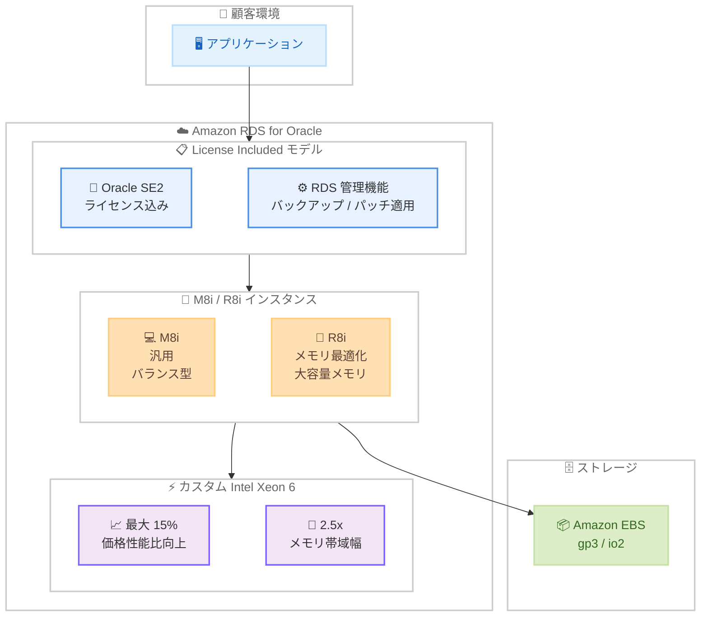

# Amazon RDS for Oracle - M8i/R8i インスタンスで Oracle SE2 License Included をサポート

**リリース日**: 2026年5月13日
**サービス**: Amazon RDS for Oracle
**機能**: M8i および R8i インスタンスクラスでの Oracle Database Standard Edition 2 (SE2) License Included (LI) サポート

[このアップデートのインフォグラフィックを見る](https://takech9203.github.io/aws-news-summary/20260513-amazon-oracle-m8i-r8i-license-included.html)

## 概要

Amazon RDS for Oracle において、M8i および R8i インスタンスクラスが Oracle Database Standard Edition 2 (SE2) の License Included (LI) モデルで利用可能になった。M8i および R8i インスタンスは AWS 専用のカスタム Intel Xeon 6 プロセッサを搭載しており、クラウド上の同等の Intel プロセッサの中で最高のパフォーマンスと最速のメモリ帯域幅を提供する。

新しいインスタンスは、前世代の Intel ベースインスタンスと比較して最大 15% の価格性能比向上と 2.5 倍のメモリ帯域幅を実現する。RDS for Oracle SE2 LI モデルでは、Oracle ライセンスとサポートを別途購入する必要がなく、Oracle データベースワークロードの運用コストと管理負荷を大幅に削減できる。

**アップデート前の課題**

- M8i/R8i インスタンスを RDS for Oracle SE2 で使用するには Bring Your Own License (BYOL) モデルが必要だった
- License Included モデルでは前世代のインスタンスクラス (M6i/R6i、M7i/R7i など) のみ選択可能だった
- 最新世代の Intel プロセッサによるパフォーマンス向上を LI モデルで享受できなかった
- Oracle ライセンスを持たない顧客は最新インスタンスを利用できなかった

**アップデート後の改善**

- M8i/R8i インスタンスが License Included モデルで直接利用可能になった
- Oracle ライセンスを別途購入せずに最新世代のハードウェアパフォーマンスを享受できるようになった
- 前世代比で最大 15% の価格性能比向上を LI モデルで実現できるようになった
- 2.5 倍のメモリ帯域幅により、データベースの読み取り/書き込み処理が高速化された

## アーキテクチャ図



RDS for Oracle SE2 License Included モデルで M8i/R8i インスタンスを使用するアーキテクチャ。ライセンス管理が不要で、カスタム Intel Xeon 6 プロセッサによる高パフォーマンスを享受できる。

## サービスアップデートの詳細

### 主要機能

1. **License Included モデルでの M8i/R8i サポート**
   - Oracle SE2 ライセンスが含まれた状態で M8i/R8i インスタンスを起動可能
   - Oracle ライセンスの個別購入やコンプライアンス管理が不要
   - RDS の自動管理機能 (バックアップ、パッチ適用、モニタリング) がすべて利用可能

2. **カスタム Intel Xeon 6 プロセッサ**
   - AWS 専用に設計されたカスタムプロセッサ
   - クラウド上の同等 Intel プロセッサの中で最高のパフォーマンスを提供
   - 前世代比で最大 15% の価格性能比向上

3. **メモリ帯域幅の大幅向上**
   - 前世代 Intel ベースインスタンス比で 2.5 倍のメモリ帯域幅
   - データベースの大規模クエリ処理やインメモリ操作で顕著な効果
   - 大量のデータを扱うワークロードに最適

## 技術仕様

### インスタンスクラス比較

| 項目 | M8i (汎用) | R8i (メモリ最適化) | M7i (前世代) | R7i (前世代) |
|------|-----------|-------------------|-------------|-------------|
| プロセッサ | カスタム Intel Xeon 6 | カスタム Intel Xeon 6 | Intel Xeon Sapphire Rapids | Intel Xeon Sapphire Rapids |
| 最大 vCPU | 192 | 192 | 192 | 192 |
| 最大メモリ | 768 GiB | 1,536 GiB | 768 GiB | 1,536 GiB |
| メモリ帯域幅 | 2.5x 向上 | 2.5x 向上 | ベースライン | ベースライン |
| 価格性能比 | 最大 15% 向上 | 最大 15% 向上 | ベースライン | ベースライン |
| EBS 帯域幅 | 最大 300 Gbps | 最大 300 Gbps | 最大 40 Gbps | 最大 40 Gbps |
| ネットワーク | 最大 200 Gbps | 最大 200 Gbps | 最大 50 Gbps | 最大 50 Gbps |

### RDS for Oracle SE2 License Included の主な仕様

| 項目 | 詳細 |
|------|------|
| データベースエディション | Oracle Database Standard Edition 2 (SE2) |
| ライセンスモデル | License Included (LI) |
| 対応インスタンスファミリー | M8i、R8i (新規追加)、M7i、R7i、M6i、R6i など |
| デプロイオプション | Single-AZ、Multi-AZ |
| ストレージ | Amazon EBS (gp3、io2 Block Express) |
| Oracle バージョン | Oracle 19c、21c |
| 自動バックアップ | 最大 35 日間の保持期間 |

### M8i インスタンスサイズ (RDS 利用可能)

| インスタンスクラス | vCPU | メモリ | 用途 |
|-------------------|------|--------|------|
| db.m8i.large | 2 | 8 GiB | 開発/テスト |
| db.m8i.xlarge | 4 | 16 GiB | 小規模本番 |
| db.m8i.2xlarge | 8 | 32 GiB | 中規模本番 |
| db.m8i.4xlarge | 16 | 64 GiB | 中〜大規模本番 |
| db.m8i.8xlarge | 32 | 128 GiB | 大規模本番 |
| db.m8i.12xlarge | 48 | 192 GiB | 大規模本番 |
| db.m8i.16xlarge | 64 | 256 GiB | エンタープライズ |
| db.m8i.24xlarge | 96 | 384 GiB | エンタープライズ |

### R8i インスタンスサイズ (RDS 利用可能)

| インスタンスクラス | vCPU | メモリ | 用途 |
|-------------------|------|--------|------|
| db.r8i.large | 2 | 16 GiB | 開発/テスト |
| db.r8i.xlarge | 4 | 32 GiB | 小規模本番 |
| db.r8i.2xlarge | 8 | 64 GiB | 中規模本番 |
| db.r8i.4xlarge | 16 | 128 GiB | 中〜大規模本番 |
| db.r8i.8xlarge | 32 | 256 GiB | 大規模本番 |
| db.r8i.12xlarge | 48 | 384 GiB | 大規模本番 |
| db.r8i.16xlarge | 64 | 512 GiB | エンタープライズ |
| db.r8i.24xlarge | 96 | 768 GiB | エンタープライズ |

## 設定方法

### 前提条件

1. AWS アカウントが有効であること
2. RDS サービスへのアクセス権限 (IAM ポリシー) が設定されていること
3. VPC およびサブネットグループが設定されていること

### 手順

#### ステップ 1: RDS コンソールからインスタンスを作成

```bash
aws rds create-db-instance \
  --db-instance-identifier my-oracle-se2-m8i \
  --db-instance-class db.m8i.2xlarge \
  --engine oracle-se2 \
  --license-model license-included \
  --master-username admin \
  --master-user-password <password> \
  --allocated-storage 100 \
  --storage-type gp3 \
  --vpc-security-group-ids sg-xxxxxxxx \
  --db-subnet-group-name my-subnet-group \
  --engine-version 19.0.0.0.ru-2026-04.rur-2026-04.r1
```

Oracle SE2 データベースを M8i インスタンスクラスで作成する。`--license-model license-included` を指定することで License Included モデルが適用される。

#### ステップ 2: 既存インスタンスのインスタンスクラス変更

```bash
aws rds modify-db-instance \
  --db-instance-identifier my-existing-oracle-db \
  --db-instance-class db.r8i.4xlarge \
  --apply-immediately
```

既存の RDS for Oracle SE2 LI インスタンスのインスタンスクラスを R8i に変更する。`--apply-immediately` を指定すると即時適用される (メンテナンスウィンドウでの適用も可能)。

#### ステップ 3: インスタンスのステータス確認

```bash
aws rds describe-db-instances \
  --db-instance-identifier my-oracle-se2-m8i \
  --query 'DBInstances[0].[DBInstanceStatus,DBInstanceClass,LicenseModel]' \
  --output table
```

インスタンスの作成/変更が完了したことを確認する。ステータスが `available` になれば利用可能。

## メリット

### ビジネス面

- **ライセンスコスト削減**: Oracle ライセンスとサポート費用を別途支払う必要がなく、RDS の利用料金にすべて含まれる
- **価格性能比の向上**: 前世代比で最大 15% の価格性能比改善により、同じ予算でより高いパフォーマンスを得られる
- **運用管理の簡素化**: Oracle ライセンスのコンプライアンス管理、更新管理、監査対応が不要になる

### 技術面

- **メモリ帯域幅の大幅向上**: 2.5 倍のメモリ帯域幅により、大規模クエリやインメモリ処理のスループットが向上する
- **最新プロセッサアーキテクチャ**: AWS カスタム Intel Xeon 6 プロセッサによる高いシングルスレッド性能
- **高い EBS スループット**: 最大 300 Gbps の EBS 帯域幅により、ストレージ I/O ボトルネックが解消される
- **シームレスな移行**: 既存の RDS for Oracle SE2 LI インスタンスからインスタンスクラスの変更のみで移行可能

## デメリット・制約事項

### 制限事項

- License Included モデルは Oracle SE2 エディションのみ対応 (Enterprise Edition は BYOL のみ)
- Oracle SE2 のソケット制限により、使用可能な CPU ソケット数に制限がある (SE2 は最大 2 ソケット)
- Real Application Clusters (RAC)、Data Guard、Partitioning などの Enterprise Edition 機能は利用不可
- インスタンスクラスの変更時にはデータベースの再起動が必要

### 考慮すべき点

- M8i/R8i への移行時にはアプリケーションの互換性テストを事前に実施すること
- Multi-AZ 構成ではフェイルオーバー時間への影響を確認すること
- 大きなインスタンスサイズへの変更は SE2 のライセンス制約に注意すること
- オンデマンド料金は前世代より単価が高い場合があるが、性能向上分を考慮した価格性能比で評価すること

## ユースケース

### ユースケース 1: 基幹業務システムの Oracle データベース

**シナリオ**: 中規模企業が ERP システムのバックエンドとして Oracle Database を利用しており、ライセンスの管理負荷とコストの削減を目指している。

**実装例**:
```bash
aws rds create-db-instance \
  --db-instance-identifier erp-oracle-prod \
  --db-instance-class db.r8i.4xlarge \
  --engine oracle-se2 \
  --license-model license-included \
  --multi-az \
  --storage-type io2 \
  --iops 10000 \
  --allocated-storage 500
```

**効果**: Oracle ライセンス管理が不要になり、年間数百万円のライセンスコストと管理工数を削減。R8i の大容量メモリにより、ERP の複雑なクエリパフォーマンスも向上する。

### ユースケース 2: レガシー Oracle アプリケーションのクラウド移行

**シナリオ**: オンプレミスの Oracle SE2 データベースを AWS に移行したいが、Oracle ライセンスの再購入コストを抑えたい。

**実装例**:
```bash
# DMS を使用したマイグレーション先として RDS を作成
aws rds create-db-instance \
  --db-instance-identifier legacy-migration-target \
  --db-instance-class db.m8i.4xlarge \
  --engine oracle-se2 \
  --license-model license-included \
  --allocated-storage 200 \
  --storage-type gp3 \
  --storage-throughput 500
```

**効果**: ライセンス費用を追加負担せずに Oracle ワークロードをクラウドに移行でき、M8i の最新プロセッサにより性能も向上する。

### ユースケース 3: データウェアハウスのクエリ高速化

**シナリオ**: Oracle SE2 上でレポーティングやデータ集計処理を実行しているが、メモリ帯域幅不足でクエリの実行時間が長い。

**実装例**:
```bash
# 既存インスタンスをメモリ最適化の R8i に変更
aws rds modify-db-instance \
  --db-instance-identifier reporting-oracle-db \
  --db-instance-class db.r8i.8xlarge \
  --apply-immediately
```

**効果**: R8i の 2.5 倍のメモリ帯域幅により、大規模なテーブルスキャンやソート処理が高速化され、レポート生成時間を大幅に短縮できる。

## 料金

RDS for Oracle SE2 License Included モデルの料金は、インスタンスの利用時間に応じた従量課金となる。Oracle ライセンス費用がインスタンス料金に含まれているため、別途ライセンスを購入する必要はない。

### 料金例 (米国東部リージョン、オンデマンド、Single-AZ)

| インスタンスクラス | 1 時間あたり (概算) | 月額 (730 時間、概算) |
|-------------------|-------------------|---------------------|
| db.m8i.large | 約 $0.55 | 約 $401 |
| db.m8i.xlarge | 約 $1.10 | 約 $803 |
| db.m8i.2xlarge | 約 $2.20 | 約 $1,606 |
| db.r8i.large | 約 $0.65 | 約 $475 |
| db.r8i.xlarge | 約 $1.30 | 約 $949 |
| db.r8i.2xlarge | 約 $2.60 | 約 $1,898 |

**注意**: 上記は概算であり、最新の正確な料金は AWS 料金ページを確認すること。Multi-AZ 構成の場合は約 2 倍の料金となる。

### コスト最適化オプション

- **リザーブドインスタンス**: 1 年または 3 年のコミットメントで最大 60% 割引
- **Database Savings Plans**: 1 年コミットメントで柔軟な割引を適用可能
- **Single-AZ / Multi-AZ の選択**: 開発環境では Single-AZ で費用を抑制

## 利用可能リージョン

M8i および R8i インスタンスが利用可能な AWS リージョンで、RDS for Oracle SE2 License Included モデルとして使用可能。具体的なリージョン別の対応状況は AWS の料金ページまたは RDS コンソールで確認すること。

主要な対応リージョン (M8i/R8i EC2 インスタンスの提供実績に基づく) は以下の通り。

- 米国東部 (バージニア北部)
- 米国東部 (オハイオ)
- 米国西部 (オレゴン)
- 欧州 (アイルランド)
- 欧州 (フランクフルト)
- アジアパシフィック (東京)
- アジアパシフィック (シンガポール)
- アジアパシフィック (シドニー)

## 関連サービス・機能

- **Amazon RDS for Oracle (BYOL)**: Enterprise Edition が必要な場合や既存ライセンスを活用する場合に使用
- **AWS Database Migration Service (DMS)**: オンプレミス Oracle から RDS for Oracle への移行を支援
- **Amazon RDS Multi-AZ**: 高可用性構成を提供し、自動フェイルオーバーをサポート
- **Amazon RDS Performance Insights**: データベースのパフォーマンスを可視化し、ボトルネックを特定
- **AWS Compute Optimizer**: インスタンスサイズの最適化推奨を提供

## 参考リンク

- [インフォグラフィック](https://takech9203.github.io/aws-news-summary/20260513-amazon-oracle-m8i-r8i-license-included.html)
- [公式発表 (What's New)](https://aws.amazon.com/about-aws/whats-new/amazon-oracle-m8i-r8i-license-included)
- [Amazon RDS for Oracle ドキュメント](https://docs.aws.amazon.com/AmazonRDS/latest/UserGuide/CHAP_Oracle.html)
- [RDS for Oracle 料金ページ](https://aws.amazon.com/rds/oracle/pricing/)
- [Amazon EC2 M8i インスタンス](https://aws.amazon.com/ec2/instance-types/m8i/)
- [Amazon EC2 R8i インスタンス](https://aws.amazon.com/ec2/instance-types/r8i/)

## まとめ

Amazon RDS for Oracle で M8i/R8i インスタンスが License Included モデルに対応したことで、Oracle ライセンスを個別に管理・購入することなく最新世代のハードウェアパフォーマンスを活用できるようになった。前世代比で最大 15% の価格性能比向上と 2.5 倍のメモリ帯域幅の向上は、Oracle SE2 ワークロードの実行効率を大幅に改善する。Oracle ライセンスの管理負荷を軽減しつつ性能向上を求める企業は、既存インスタンスの M8i/R8i へのアップグレードを検討することを推奨する。
