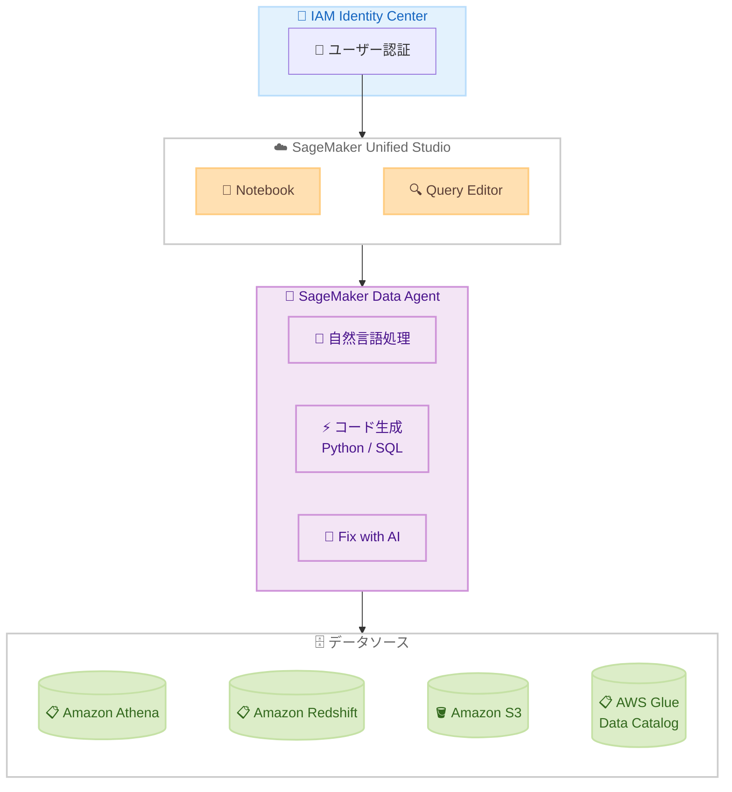

# Amazon SageMaker Data Agent - IAM Identity Center ドメインでの利用開始

**リリース日**: 2026 年 5 月 13 日
**サービス**: Amazon SageMaker
**機能**: SageMaker Data Agent (IAM Identity Center 対応)

📊 [このアップデートのインフォグラフィックを見る](https://takech9203.github.io/aws-news-summary/20260513-amazon-sagemaker-data-agent-idc.html)

## 概要

Amazon SageMaker Data Agent が、IAM Identity Center で構成された SageMaker Unified Studio ドメインで利用可能になった。Data Agent は AI を活用したアシスタント機能であり、データアナリストやデータエンジニアが SageMaker ノートブックおよび Query Editor 環境において、分析ワークフローを効率化することを支援する。

ユーザーは分析目的を自然言語 (英語) で記述するだけで、接続されたデータソースに最適化された Python または SQL コードを自動生成できる。対応するデータソースには Amazon Athena、Amazon Redshift、Amazon S3、AWS Glue Data Catalog が含まれる。Data Agent はノートブックセル間の会話コンテキスト、選択されたテーブル、クエリ履歴を維持し、コード生成前にステップバイステップの計画を提案する。

**アップデート前の課題**

- IAM Identity Center で認証されたドメイン環境では Data Agent を利用できなかった
- 複雑な SQL JOIN、集約処理、Python コードを手動で記述する必要があった
- データソースのスキーマやテーブル構造を把握した上で、適切なクエリを自力で組み立てる必要があった
- 実行エラーが発生した場合、エラーメッセージを自分で分析してデバッグする必要があった

**アップデート後の改善**

- IAM Identity Center で構成された SageMaker Unified Studio ドメインで Data Agent が利用可能になった
- 自然言語で分析目的を説明するだけで、データソースに適したコードが自動生成される
- 会話コンテキストの維持により、段階的にデータ分析を深掘りできる
- "Fix with AI" 機能により、実行エラーの分析と修正提案が自動化された

## アーキテクチャ図



IAM Identity Center で認証されたユーザーが SageMaker Unified Studio にアクセスし、Data Agent を通じて自然言語からコードを生成、接続されたデータソースに対してクエリを実行する流れを示している。

## サービスアップデートの詳細

### 主要機能

1. **自然言語によるコード生成**
   - 分析目的を平易な英語で記述するだけで、Python または SQL コードを生成
   - 接続されたデータソースのスキーマを自動認識し、適切なコードを生成
   - 四半期ごとの収益成長率計算、データ可視化、DataFrame 変換、クエリパフォーマンス最適化などに対応

2. **会話コンテキストの維持**
   - ノートブックセル間でコンテキストを保持
   - 選択されたテーブルやクエリ履歴を記憶
   - ステップバイステップの計画を提案してからコードを生成
   - 段階的な分析の深掘りが可能

3. **Fix with AI 機能**
   - 実行エラーを AI が分析し、修正提案を自動生成
   - エラーの根本原因を特定し、具体的な修正方法を提示
   - 開発サイクルの短縮に貢献

4. **IAM Identity Center 統合**
   - SSO 認証によるシームレスなアクセス
   - 組織の ID 管理と統合された認証フロー
   - 従来の IAM 認証ドメインに加え、IAM Identity Center ドメインでも利用可能に

## 技術仕様

### 対応データソース

| データソース | 用途 |
|------|------|
| Amazon Athena | S3 上のデータに対するインタラクティブクエリ |
| Amazon Redshift | データウェアハウスに対する分析クエリ |
| Amazon S3 | オブジェクトストレージ上のデータアクセス |
| AWS Glue Data Catalog | メタデータカタログの参照とスキーマ情報の活用 |

### 対応環境

| 項目 | 詳細 |
|------|------|
| ドメインタイプ | IAM Identity Center 構成の SageMaker Unified Studio ドメイン |
| 利用環境 | SageMaker Notebook、Query Editor |
| 生成言語 | Python、SQL |
| インタラクション言語 | 英語 (自然言語入力) |

### API 変更履歴

| 日付 | サービス | 変更内容 |
|------|----------|----------|
| 2026/05/13 | [Amazon SageMaker Service](https://awsapichanges.com/archive/changes/74501c-api.sagemaker.html) | 27 updated api methods - ExecutionRoleSessionNameMode の追加、Flexible Training Plans の Studio アプリ対応、Unified Studio 設定の追加など |

## 設定方法

### 前提条件

1. IAM Identity Center が有効化された AWS 環境
2. SageMaker Unified Studio ドメインが IAM Identity Center で構成されていること
3. プロジェクト内でデータソース (Athena、Redshift、S3、Glue Data Catalog) が接続されていること

### 手順

#### ステップ 1: SageMaker Unified Studio のプロジェクトにアクセス

SageMaker Unified Studio コンソールにアクセスし、対象のプロジェクトを開く。IAM Identity Center を通じて SSO 認証が行われる。

#### ステップ 2: Notebook または Query Editor を開く

プロジェクト内で Notebook 環境または Query Editor を起動する。

#### ステップ 3: Data Agent パネルを選択

サイドバーまたはメニューから Data Agent パネルを選択して起動する。分析目的を自然言語で入力し、生成されたコードを実行する。

## メリット

### ビジネス面

- **生産性の向上**: 複雑なクエリを手動で記述する時間を削減し、分析作業に集中できる
- **スキルギャップの解消**: SQL や Python に不慣れなビジネスアナリストでもデータ分析を実施可能
- **迅速な意思決定**: データから洞察を得るまでの時間を短縮

### 技術面

- **コンテキスト認識型コード生成**: データソースのスキーマやテーブル構造を考慮した正確なコードを生成
- **デバッグの効率化**: Fix with AI によりエラー解決時間を短縮
- **統合認証**: IAM Identity Center との統合により、組織の ID 管理ポリシーに準拠したアクセス制御が可能

## デメリット・制約事項

### 制限事項

- 自然言語入力は現時点で英語のみ対応
- IAM Identity Center で構成されたドメインが必要 (IAM 認証のみのドメインでは従来通りの利用)
- AI による生成コードの正確性は保証されないため、実行結果の検証が必要

### 考慮すべき点

- Data Agent が生成するコードは、接続されたデータソースの権限に依存する
- 機密データへのアクセスについては、既存の IAM ポリシーとデータガバナンスポリシーが適用される
- 大規模なデータセットに対するクエリ生成時は、コスト最適化を意識した確認が推奨される

## ユースケース

### ユースケース 1: 四半期売上分析レポートの自動生成

**シナリオ**: データアナリストが Redshift 上の売上データから四半期ごとの成長率を算出し、可視化したい。

**実装例**:
```
Data Agent への入力:
"Calculate quarterly revenue growth rates from the sales table
for the past 2 years and generate a line chart visualization"
```

**効果**: 複数テーブルの JOIN や集約関数の記述を自動化し、数分で分析コードと可視化を取得できる。

### ユースケース 2: データパイプラインのデバッグ

**シナリオ**: Athena クエリで型変換エラーが発生し、原因を特定できない。

**実装例**:
```
エラー発生時に "Fix with AI" ボタンをクリック:
Data Agent がエラーメッセージを分析し、
カラムのデータ型不一致を特定、修正済みクエリを提案
```

**効果**: エラーの根本原因特定と修正に要する時間を大幅に短縮。

### ユースケース 3: クロスソースデータ統合分析

**シナリオ**: S3 上のログデータと Redshift 上の顧客データを組み合わせてユーザー行動分析を行いたい。

**実装例**:
```
Data Agent への入力:
"Join the user activity logs from S3 with the customer table
in Redshift to identify top 10 customers by engagement score"
```

**効果**: 異なるデータソースを横断した分析コードを自動生成し、複雑なデータ統合作業を簡素化。

## 料金

SageMaker Data Agent の料金は SageMaker Unified Studio の利用料金に含まれる。データソースへのクエリ実行に伴う料金 (Athena のスキャン量、Redshift のコンピュートノード、S3 のリクエスト費用など) は別途発生する。詳細は各サービスの料金ページを参照。

## 利用可能リージョン

Amazon SageMaker Unified Studio がサポートされているすべての商用 AWS リージョンで利用可能。

## 関連サービス・機能

- **Amazon SageMaker Unified Studio**: Data Agent が統合されている開発環境
- **AWS IAM Identity Center**: SSO 認証基盤としてドメインの認証を管理
- **Amazon Athena**: S3 上のデータに対するサーバーレスクエリサービス
- **Amazon Redshift**: ペタバイト規模のデータウェアハウスサービス
- **AWS Glue Data Catalog**: データレイクのメタデータ管理サービス

## 参考リンク

- 📊 [インフォグラフィック](https://takech9203.github.io/aws-news-summary/20260513-amazon-sagemaker-data-agent-idc.html)
- [公式発表 (What's New)](https://aws.amazon.com/about-aws/whats-new/2026/05/amazon-sagemaker-data-agent-idc/)
- [Amazon SageMaker Unified Studio ページ](https://aws.amazon.com/sagemaker/unified-studio/)
- [Amazon SageMaker Unified Studio ユーザーガイド - Use the SageMaker Data Agent](https://docs.aws.amazon.com/sagemaker-unified-studio/latest/userguide/data-agent.html)
- [Amazon SageMaker 料金ページ](https://aws.amazon.com/sagemaker/pricing/)

## まとめ

Amazon SageMaker Data Agent の IAM Identity Center ドメインへの対応により、SSO 認証環境を採用している組織でも AI 支援によるデータ分析の効率化が可能になった。自然言語からのコード生成、コンテキスト維持、Fix with AI によるデバッグ支援を活用することで、データアナリストやエンジニアは分析ロジックの構築に集中でき、生産性の向上が期待できる。SageMaker Unified Studio を利用している組織は、プロジェクト内で Data Agent パネルを有効化し、接続済みデータソースに対する自然言語分析をすぐに開始できる。
