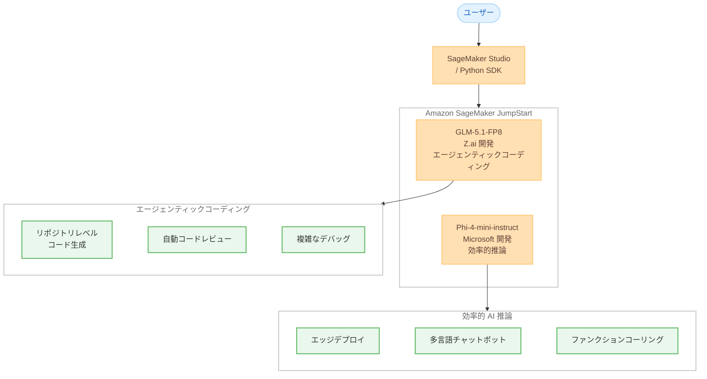

# Amazon SageMaker JumpStart - エージェンティックコーディングおよび効率的 AI モデルの追加

**リリース日**: 2026 年 5 月 14 日
**サービス**: Amazon SageMaker JumpStart
**機能**: GLM-5.1-FP8 および Phi-4-mini-instruct モデルの提供開始

[このアップデートのインフォグラフィックを見る](https://takech9203.github.io/aws-news-summary/20260514-agentic-reasoning-models-on-sagemaker-jumpstart.html)

## 概要

AWS は Amazon SageMaker JumpStart において、GLM-5.1-FP8 (Z.ai 開発) と Phi-4-mini-instruct (Microsoft 開発) の 2 つの基盤モデルの提供を開始した。これらのモデルは、エージェンティック AI ワークロードおよび効率的な推論処理をエンタープライズ環境で実現するために設計されている。

GLM-5.1-FP8 はエージェンティックなソフトウェアエンジニアリングに特化したモデルで、数百ラウンドにわたる反復的な最適化を通じてリポジトリレベルのコード生成、ターミナルタスク、複雑なデバッグワークフローを処理する。Phi-4-mini-instruct はメモリ制約のある環境でも強力な推論、数学、論理処理を実現するコンパクトなモデルで、24 言語対応とファンクションコーリングをサポートする。

**アップデート前の課題**

- エージェンティックなコーディングタスクに最適化された大規模言語モデルを SageMaker 上でワンクリックでデプロイする手段が限られていた
- メモリ制約のある環境やレイテンシーが重要なユースケースにおいて、高い推論能力を持つコンパクトモデルの選択肢が不足していた
- 長時間にわたるマルチラウンドの推論最適化に対応したモデルのデプロイに専門的な設定が必要だった

**アップデート後の改善**

- SageMaker JumpStart から数クリックでエージェンティックコーディングに特化した GLM-5.1-FP8 をデプロイ可能になった
- リソースオーバーヘッドを最小限に抑えつつ 24 言語対応の推論を実行できる Phi-4-mini-instruct が利用可能になった
- エンタープライズ AI ワークロードにおけるモデル選択の幅が拡大し、ユースケースに応じた最適なモデル選定が容易になった

## アーキテクチャ図



SageMaker JumpStart を通じて 2 つの異なる特性を持つモデルをデプロイし、それぞれの強みを活かしたユースケースに活用する構成を示している。

## サービスアップデートの詳細

### 主要機能

1. **GLM-5.1-FP8 - エージェンティックソフトウェアエンジニアリングモデル**
   - Z.ai が開発したエージェンティックコーディング特化モデル
   - 持続的なマルチラウンド最適化により、数百ラウンドにわたってソリューションを反復改善
   - リポジトリレベルのコード生成に対応し、大規模コードベースの変更を一貫して処理
   - ターミナルタスクの実行と複雑なデバッグワークフローを自律的に処理
   - 拡張推論 (Extended Reasoning) により、長期的な問題解決で精度が向上
   - FP8 量子化により推論効率を最適化

2. **Phi-4-mini-instruct - コンパクト高効率推論モデル**
   - Microsoft が開発した軽量かつ高性能な推論モデル
   - メモリ制約のある環境やレイテンシーが重要な場面に最適
   - 24 言語をサポートし、グローバルなアプリケーション展開が可能
   - ファンクションコーリング (Function Calling) に対応し、ツール連携が容易
   - 強力な数学的推論および論理的推論能力を持つ
   - コンパクトなフォームファクターで最小限のリソースオーバーヘッドを実現

3. **SageMaker JumpStart による統合デプロイ体験**
   - SageMaker Studio の Models セクションからワンクリックでデプロイ可能
   - SageMaker Python SDK を使用したプログラマティックなデプロイにも対応
   - AWS インフラストラクチャ上でセキュアかつスケーラブルに運用可能

## 技術仕様

### モデル比較

| 項目 | GLM-5.1-FP8 | Phi-4-mini-instruct |
|------|-------------|---------------------|
| 開発元 | Z.ai | Microsoft |
| 主要用途 | エージェンティックコーディング | 効率的推論・多言語処理 |
| 量子化 | FP8 | - |
| 対応言語 | コード生成特化 | 24 言語 |
| ファンクションコーリング | - | 対応 |
| 強み | マルチラウンド最適化、リポジトリレベルコード生成 | 数学・論理推論、低リソース環境 |
| 最適環境 | GPU インスタンス (高メモリ) | メモリ制約環境、エッジ |

### API 変更履歴

| 日付 | サービス | 変更内容 |
|------|----------|----------|
| 2026/05/13 | [Amazon SageMaker Service](https://awsapichanges.com/archive/changes/74501c-api.sagemaker.html) | 27 updated api methods - 実行ロールセッション名モード、Flexible Training Plans、制限付きモデルパッケージの追加 |

## 設定方法

### 前提条件

1. AWS アカウントと SageMaker へのアクセス権限
2. SageMaker Studio ドメインのセットアップ済み環境
3. モデルデプロイ用の適切な IAM ロール (SageMaker 実行ロール)
4. GPU インスタンス (GLM-5.1-FP8 の場合) の利用クォータ

### 手順

#### ステップ 1: SageMaker Studio からのデプロイ

SageMaker Studio にアクセスし、左メニューの Models セクションに移動する。検索バーで「GLM-5.1-FP8」または「Phi-4-mini-instruct」を検索し、デプロイボタンをクリックする。

#### ステップ 2: SageMaker Python SDK を使用したデプロイ

```python
from sagemaker.jumpstart.model import JumpStartModel

# GLM-5.1-FP8 のデプロイ
glm_model = JumpStartModel(model_id="glm-5-1-fp8")
glm_predictor = glm_model.deploy()

# Phi-4-mini-instruct のデプロイ
phi_model = JumpStartModel(model_id="phi-4-mini-instruct")
phi_predictor = phi_model.deploy()
```

SageMaker Python SDK を使用して、プログラマティックにモデルをデプロイする。model_id を指定するだけで、適切なインスタンスタイプやコンテナイメージが自動的に選択される。

#### ステップ 3: モデルの推論実行

```python
# GLM-5.1-FP8 でのエージェンティックコーディング例
response = glm_predictor.predict({
    "inputs": "Review this Python function for bugs and suggest fixes:\n\ndef calculate_average(numbers):\n    total = 0\n    for n in numbers:\n        total += n\n    return total / len(numbers)",
    "parameters": {
        "max_new_tokens": 1024,
        "temperature": 0.7
    }
})

# Phi-4-mini-instruct での多言語推論例
response = phi_predictor.predict({
    "inputs": "Solve step by step: If a train travels at 120 km/h for 2.5 hours, how far does it travel?",
    "parameters": {
        "max_new_tokens": 512,
        "temperature": 0.3
    }
})
```

デプロイ完了後、predict メソッドを使用して推論を実行する。GLM-5.1-FP8 にはコーディングタスクのプロンプトを、Phi-4-mini-instruct には推論タスクや多言語クエリを渡す。

## メリット

### ビジネス面

- **開発生産性の向上**: GLM-5.1-FP8 のエージェンティックコーディング機能により、コードレビュー、デバッグ、リファクタリングの自動化が可能になり、開発チームの生産性を大幅に向上できる
- **コスト効率の高い AI 導入**: Phi-4-mini-instruct のコンパクトなフォームファクターにより、高価な GPU リソースを必要とせず、多くの推論タスクを低コストで実行できる
- **グローバル展開の加速**: Phi-4-mini-instruct の 24 言語対応により、多言語アプリケーションの構築コストを削減し、グローバル市場への迅速な展開を支援する

### 技術面

- **長期推論の安定性**: GLM-5.1-FP8 は数百ラウンドにわたる反復最適化で品質が向上する設計のため、複雑な問題に対して一貫した解を導出できる
- **FP8 量子化による効率化**: GLM-5.1-FP8 は FP8 量子化を採用しており、フル精度モデルと比較してメモリ使用量を削減しつつ高い精度を維持する
- **ファンクションコーリング対応**: Phi-4-mini-instruct はツール利用が組み込まれており、外部 API やデータベースとの連携が容易に実装できる

## デメリット・制約事項

### 制限事項

- GLM-5.1-FP8 は FP8 量子化モデルであり、フル精度版と比較して一部のタスクで微小な精度低下が発生する可能性がある
- Phi-4-mini-instruct はコンパクトモデルであるため、大規模モデルと比較して複雑な長文生成や高度なコンテキスト理解で制限がある場合がある
- GLM-5.1-FP8 のエージェンティック機能を最大限に活用するには、適切なプロンプト設計とマルチターンのオーケストレーション環境が必要
- SageMaker JumpStart のモデルデプロイにはリアルタイムエンドポイントの料金が発生する

### 考慮すべき点

- GLM-5.1-FP8 を本番のコード生成パイプラインに組み込む場合、出力コードのセキュリティレビューと品質検証プロセスの設計が重要
- Phi-4-mini-instruct の 24 言語サポートについて、各言語での品質レベルが均一でない可能性があるため、対象言語での事前検証を推奨
- モデルのライセンス条件を確認し、商用利用の要件を満たしているか事前に検証する必要がある

## ユースケース

### ユースケース 1: AI 駆動型コードレビューパイプライン

**シナリオ**: 開発チームがプルリクエストを作成するたびに、GLM-5.1-FP8 を活用して自動的にコードレビューを実施し、バグの検出、セキュリティ脆弱性の指摘、リファクタリング提案を行う。

**実装例**:
```python
# CI/CD パイプラインでのコードレビュー自動化
review_prompt = f"""
Review the following code changes for:
1. Potential bugs and logical errors
2. Security vulnerabilities
3. Performance improvements
4. Code style and best practices

Code diff:
{code_diff}
"""

response = glm_predictor.predict({
    "inputs": review_prompt,
    "parameters": {"max_new_tokens": 2048, "temperature": 0.5}
})
```

**効果**: コードレビューの待ち時間を削減し、一貫した品質基準でのレビューを 24 時間自動実行できる。人間のレビュアーは高レベルの設計判断に集中できるようになる。

### ユースケース 2: エッジ環境での多言語カスタマーサポート

**シナリオ**: リソースが限られたエッジデバイスやコンテナ環境で、24 言語に対応したカスタマーサポートボットを運用する。レイテンシーを最小限に抑えつつ、論理的な回答を生成する。

**実装例**:
```python
# 多言語対応のファンクションコーリング付きチャットボット
support_prompt = f"""
You are a multilingual customer support agent. 
Answer the customer's question using the available tools.

Available functions:
- get_order_status(order_id: str) -> dict
- get_product_info(product_id: str) -> dict
- create_return_request(order_id: str, reason: str) -> dict

Customer message: {customer_message}
"""

response = phi_predictor.predict({
    "inputs": support_prompt,
    "parameters": {"max_new_tokens": 512, "temperature": 0.3}
})
```

**効果**: 少ないリソースで多言語対応のインテリジェントなカスタマーサポートを実現し、応答時間の短縮と顧客満足度の向上を同時に達成できる。

### ユースケース 3: 自律型デバッグエージェント

**シナリオ**: 本番環境で発生した複雑なバグに対して、GLM-5.1-FP8 を活用した自律型デバッグエージェントがログ分析、原因特定、修正パッチの生成を反復的に実行する。

**実装例**:
```python
# マルチラウンドデバッグセッション
debug_context = {
    "error_log": error_log_content,
    "stack_trace": stack_trace,
    "related_code": source_code,
    "round": 1
}

# 反復的にデバッグを実行
while not resolved and debug_context["round"] <= 10:
    response = glm_predictor.predict({
        "inputs": f"Debug round {debug_context['round']}:\n{format_context(debug_context)}",
        "parameters": {"max_new_tokens": 2048, "temperature": 0.7}
    })
    # エージェントの出力を解析し、次のアクションを決定
    debug_context = update_context(response, debug_context)
```

**効果**: 複雑なバグの根本原因分析と修正提案を自動化し、MTTR (平均修復時間) を大幅に短縮できる。

## 料金

SageMaker JumpStart のモデル利用料金は、デプロイ先のインスタンスタイプと稼働時間に基づく。モデル自体の追加ライセンス料金は発生しない。

### 料金例

| インスタンスタイプ | 用途 | 時間単価 (概算、us-east-1) |
|-------------------|------|---------------------------|
| ml.g5.2xlarge | GLM-5.1-FP8 推論 | $1.515/時間 |
| ml.g5.4xlarge | GLM-5.1-FP8 推論 (高スループット) | $2.03/時間 |
| ml.g5.xlarge | Phi-4-mini-instruct 推論 | $1.408/時間 |
| ml.c5.xlarge | Phi-4-mini-instruct 推論 (CPU) | $0.238/時間 |

※ 料金は変動する可能性があるため、最新の料金は AWS 公式料金ページで確認すること。

## 利用可能リージョン

SageMaker JumpStart が利用可能なすべてのリージョンで提供される。主要なリージョンには以下が含まれる。

- 米国東部 (バージニア北部): us-east-1
- 米国東部 (オハイオ): us-east-2
- 米国西部 (オレゴン): us-west-2
- 欧州 (アイルランド): eu-west-1
- アジアパシフィック (東京): ap-northeast-1
- アジアパシフィック (シンガポール): ap-southeast-1

## 関連サービス・機能

- **Amazon SageMaker Studio**: モデルの検索、デプロイ、管理を行う統合開発環境
- **Amazon Bedrock**: マネージド型の基盤モデルサービスで、API 経由で各種モデルを利用可能
- **AWS CodeWhisperer**: AI コーディング支援ツールで、GLM-5.1-FP8 のエージェンティック機能と補完的に活用可能
- **AWS Lambda**: Phi-4-mini-instruct のファンクションコーリング機能と連携し、サーバーレスなツール実行環境を構築可能

## 参考リンク

- [インフォグラフィック](https://takech9203.github.io/aws-news-summary/20260514-agentic-reasoning-models-on-sagemaker-jumpstart.html)
- [公式発表 (What's New)](https://aws.amazon.com/about-aws/whats-new/2026/05/agentic-reasoning-models-on-sagemaker-jumpstart/)
- [Amazon SageMaker JumpStart ドキュメント](https://docs.aws.amazon.com/sagemaker/latest/dg/studio-jumpstart.html)
- [SageMaker 料金ページ](https://aws.amazon.com/sagemaker/pricing/)

## まとめ

今回のアップデートにより、SageMaker JumpStart にエージェンティックコーディング特化の GLM-5.1-FP8 とコンパクト高効率推論の Phi-4-mini-instruct が追加された。GLM-5.1-FP8 は自動コードレビューや自律型デバッグなどの長時間マルチラウンド推論が必要なワークロードに最適であり、Phi-4-mini-instruct はメモリ制約環境での多言語推論やファンクションコーリングを必要とするユースケースに適している。開発チームの生産性向上やコスト効率の高い AI 推論環境の構築を検討している場合、SageMaker Studio からこれらのモデルを試用することを推奨する。
