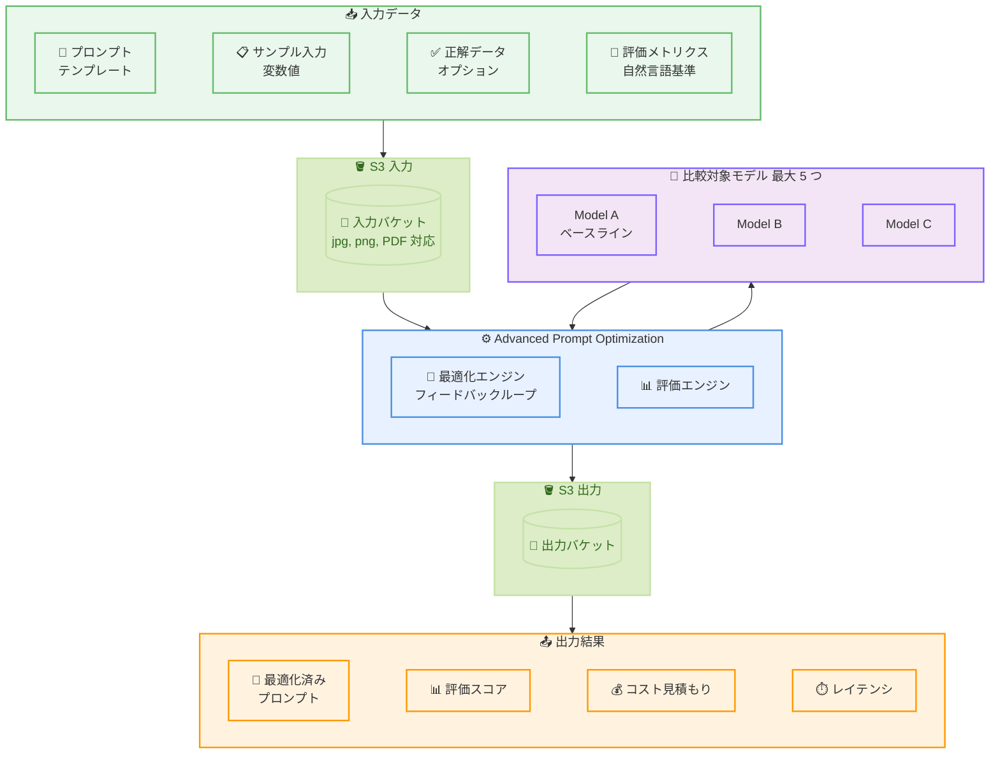

# Amazon Bedrock - Advanced Prompt Optimization and Migration Tool

**リリース日**: 2026 年 5 月 14 日
**サービス**: Amazon Bedrock
**機能**: Advanced Prompt Optimization (AdvPO)

📊 [このアップデートのインフォグラフィックを見る](https://takech9203.github.io/aws-news-summary/20260514-amazon-bedrock-advanced-prompt-optimization-migration-tool.html)

## 概要

Amazon Bedrock に Advanced Prompt Optimization (AdvPO) が新たに導入された。この機能は、Bedrock 上の任意のモデルに対してプロンプトを自動最適化し、最大 5 つのモデルで同時に元のプロンプトと最適化後のプロンプトを比較評価できるツールである。モデル移行時のプロンプト調整や、現行モデルでのパフォーマンス改善に活用できる。

プロンプトテンプレート、変数値のサンプル入力、オプションの正解データ、評価メトリクスまたは自然言語の評価基準を入力として受け取り、フィードバックループで反復的にプロンプトを最適化する。マルチモーダル入力 (jpg、png、PDF) にも対応しており、最終的に元のプロンプトと最適化後のプロンプトの評価スコア、コスト見積もり、レイテンシを出力する。

**アップデート前の課題**

- プロンプト最適化に数日から数週間の手動作業が必要だった
- モデル移行時にプロンプトを変更した後のリグレッションテストが困難だった
- 複数モデルでのパフォーマンス比較を手動で行う必要があり、時間とコストがかかっていた
- プロンプト変更の効果を定量的に評価する統一的な手段がなかった

**アップデート後の改善**

- 自動化されたフィードバックループにより、プロンプト最適化の工数を大幅に削減
- 最大 5 モデルの同時比較評価により、モデル移行の意思決定を迅速化
- 評価スコア、コスト見積もり、レイテンシの定量的な比較データを自動生成
- API 経由でプログラマティックに最適化ジョブを管理可能

## アーキテクチャ図



Advanced Prompt Optimization のワークフロー。入力データを S3 経由で受け取り、フィードバックループで反復的にプロンプトを最適化し、最大 5 モデルで同時評価を行い、結果を S3 に出力する。

## サービスアップデートの詳細

### 主要機能

1. **プロンプト自動最適化**
   - フィードバックループによる反復的なプロンプト改善
   - 評価メトリクスまたは自然言語の評価基準に基づいてプロンプトを自動調整
   - 元のプロンプトテンプレートを維持しつつ最適化版を生成

2. **マルチモデル同時比較**
   - 最大 5 つのモデルで同時にプロンプトを評価
   - 現行モデルをベースラインとし、最大 4 つの候補モデルと比較可能
   - モデル変更なしの場合は同一モデルで Before/After を評価

3. **マルチモーダル入力対応**
   - テキストに加えて jpg、png、PDF の入力に対応
   - 画像や文書を含むプロンプトの最適化が可能

4. **定量的評価出力**
   - 評価スコアによるパフォーマンス比較
   - コスト見積もりによる費用対効果の把握
   - レイテンシ測定による応答速度の比較

## 技術仕様

### API メソッド

| メソッド | 機能 |
|----------|------|
| `CreateAdvancedPromptOptimizationJob` | 最適化ジョブの作成と開始 |
| `GetAdvancedPromptOptimizationJob` | ジョブのステータスと結果の取得 |
| `ListAdvancedPromptOptimizationJobs` | ジョブ一覧の取得 |
| `StopAdvancedPromptOptimizationJob` | 実行中ジョブの停止 |
| `BatchDeleteAdvancedPromptOptimizationJob` | ジョブの一括削除 |

### ジョブステータス

| ステータス | 説明 |
|------------|------|
| `InProgress` | 最適化実行中 |
| `Completed` | 正常完了 |
| `PartiallyCompleted` | 一部完了 |
| `Failed` | 失敗 |
| `Stopping` | 停止処理中 |
| `Stopped` | 停止済み |
| `Deleting` | 削除処理中 |

### API 変更履歴

| 日付 | サービス | 変更内容 |
|------|----------|----------|
| 2026/05/14 | [Amazon Bedrock](https://awsapichanges.com/archive/changes/bd1fb2-bedrock.html) | 5 new api methods - AdvPO ジョブの CRUD 操作と停止 |

### モデル設定パラメータ

```json
{
  "modelConfigurations": [
    {
      "modelId": "us.anthropic.claude-sonnet-4-20250514-v1:0",
      "inferenceConfig": {
        "maxTokens": 4096,
        "temperature": 0.7,
        "topP": 0.9,
        "stopSequences": []
      },
      "additionalModelRequestFields": {}
    }
  ]
}
```

### 入出力設定

```json
{
  "jobName": "prompt-migration-claude-4",
  "inputConfig": {
    "s3Uri": "s3://my-bucket/advpo-input/"
  },
  "outputConfig": {
    "s3Uri": "s3://my-bucket/advpo-output/"
  },
  "encryptionKeyArn": "arn:aws:kms:us-east-1:123456789012:key/example-key-id"
}
```

## 設定方法

### 前提条件

1. Amazon Bedrock へのアクセス権限を持つ IAM ロールまたはユーザー
2. 入出力用の S3 バケット
3. 使用するモデルへのアクセスが有効化されていること
4. (オプション) KMS キーによる暗号化設定

### 手順

#### ステップ 1: S3 バケットに入力データを準備

```bash
# プロンプトテンプレートとサンプル入力を S3 にアップロード
aws s3 cp prompt-template.json s3://my-bucket/advpo-input/
aws s3 cp sample-inputs.json s3://my-bucket/advpo-input/
```

プロンプトテンプレート、変数のサンプル値、(オプション) 正解データ、評価基準を含むファイルを S3 にアップロードする。

#### ステップ 2: 最適化ジョブを作成

```bash
aws bedrock create-advanced-prompt-optimization-job \
  --job-name "optimize-for-claude-4" \
  --input-config '{"s3Uri": "s3://my-bucket/advpo-input/"}' \
  --output-config '{"s3Uri": "s3://my-bucket/advpo-output/"}' \
  --model-configurations '[
    {"modelId": "us.anthropic.claude-sonnet-4-20250514-v1:0", "inferenceConfig": {"maxTokens": 4096, "temperature": 0.7}},
    {"modelId": "us.amazon.nova-premier-v1:0", "inferenceConfig": {"maxTokens": 4096, "temperature": 0.7}}
  ]'
```

最適化ジョブを作成し、比較対象のモデルを指定して実行を開始する。

#### ステップ 3: ジョブのステータスを確認

```bash
aws bedrock get-advanced-prompt-optimization-job \
  --job-identifier "arn:aws:bedrock:us-east-1:123456789012:advanced-prompt-optimization-job/optimize-for-claude-4"
```

ジョブの進行状況を確認し、完了後に結果を取得する。

## メリット

### ビジネス面

- **モデル移行の迅速化**: 手動で数日から数週間かかっていたプロンプト調整を自動化し、移行期間を大幅に短縮
- **コスト最適化の可視化**: モデルごとのコスト見積もりにより、パフォーマンスとコストのバランスを定量的に判断可能
- **リスク低減**: 評価スコアによるリグレッション検知で、モデル移行に伴う品質低下リスクを軽減

### 技術面

- **フィードバックループ最適化**: 評価メトリクスに基づく自動反復により、人手では到達しにくい最適化レベルを実現
- **API ファースト設計**: 5 つの新規 API メソッドにより CI/CD パイプラインへの統合が容易
- **マルチモーダル対応**: テキストだけでなく画像や PDF を含むプロンプトの最適化が可能
- **暗号化サポート**: KMS による暗号化に対応し、機密性の高いプロンプトデータも安全に処理

## デメリット・制約事項

### 制限事項

- 同時比較モデル数は最大 5 つまで
- 入出力は S3 経由のバッチ処理形式 (リアルタイム最適化ではない)
- 対応するマルチモーダル形式は jpg、png、PDF に限定

### 考慮すべき点

- 最適化ジョブの実行には各モデルでの推論コストが発生する
- フィードバックループの反復回数に応じて処理時間とコストが増加する可能性がある
- 評価メトリクスの設定品質が最適化結果に大きく影響するため、適切な基準設定が重要

## ユースケース

### ユースケース 1: モデル世代間の移行

**シナリオ**: 現在 Claude 3.5 Sonnet で運用しているチャットボットを Claude Sonnet 4 に移行したい。既存のプロンプトがそのまま動作するか確認し、必要に応じて最適化したい。

**実装例**:
```json
{
  "jobName": "migrate-chatbot-to-claude-4",
  "modelConfigurations": [
    {"modelId": "anthropic.claude-3-5-sonnet-20241022-v2:0"},
    {"modelId": "us.anthropic.claude-sonnet-4-20250514-v1:0"}
  ]
}
```

**効果**: 現行モデルをベースラインとして新モデルとの比較が自動で行われ、最適化されたプロンプトにより移行後も品質を維持または向上できる。

### ユースケース 2: コスト最適化のためのモデル選定

**シナリオ**: 高品質な要約タスクに最適なモデルを選定したい。複数のモデルでコストとパフォーマンスのバランスを比較評価する。

**実装例**:
```json
{
  "jobName": "find-best-summarization-model",
  "modelConfigurations": [
    {"modelId": "us.anthropic.claude-sonnet-4-20250514-v1:0"},
    {"modelId": "us.amazon.nova-premier-v1:0"},
    {"modelId": "us.anthropic.claude-haiku-4-5-20251001-v1:0"}
  ]
}
```

**効果**: 各モデルの評価スコア、コスト見積もり、レイテンシを一覧で比較し、要件に最適なモデルを客観的に選定できる。

### ユースケース 3: マルチモーダルプロンプトの最適化

**シナリオ**: 画像分析パイプラインで使用しているプロンプトのパフォーマンスを改善したい。商品画像の説明文生成精度を向上させる。

**実装例**:
```json
{
  "jobName": "optimize-image-analysis-prompt",
  "inputConfig": {
    "s3Uri": "s3://my-bucket/image-analysis-input/"
  },
  "modelConfigurations": [
    {"modelId": "us.anthropic.claude-sonnet-4-20250514-v1:0", "inferenceConfig": {"maxTokens": 1024}}
  ]
}
```

**効果**: jpg/png 画像を含むプロンプトが自動的に最適化され、画像解析タスクの精度が向上する。正解データと評価メトリクスに基づく定量的な改善が確認できる。

## 料金

Advanced Prompt Optimization の料金は Amazon Bedrock の料金ページを参照。最適化ジョブの実行時に、各モデルでの推論に対して通常の Bedrock 推論料金が発生する。

### 料金構成要素

| 項目 | 説明 |
|------|------|
| モデル推論料金 | 最適化プロセスでの各モデル呼び出しに対する入出力トークン料金 |
| S3 ストレージ | 入出力データの保存に対する S3 標準料金 |
| KMS (オプション) | 暗号化キー使用に対する KMS 料金 |

## 利用可能リージョン

リージョンの利用可能状況については、Amazon Bedrock のドキュメントを参照。

## 関連サービス・機能

- **Amazon Bedrock Prompt Management**: プロンプトのバージョン管理と共有機能。AdvPO で最適化したプロンプトの管理に活用可能
- **Amazon Bedrock Model Evaluation**: モデルの評価機能。AdvPO はプロンプト最適化に特化した評価を内蔵
- **Amazon Bedrock Guardrails**: 安全性フィルタリング。最適化後のプロンプトにも Guardrails を適用可能
- **Amazon S3**: 入出力データの保存先。AdvPO ジョブの入力データと結果の格納に使用

## 参考リンク

- 📊 [インフォグラフィック](https://takech9203.github.io/aws-news-summary/20260514-amazon-bedrock-advanced-prompt-optimization-migration-tool.html)
- [公式発表 (What's New)](https://aws.amazon.com/about-aws/whats-new/2026/05/amazon-bedrock-advanced-prompt-optimization-migration-tool/)
- [Amazon Bedrock ドキュメント](https://docs.aws.amazon.com/bedrock/latest/userguide/)
- [Amazon Bedrock 料金ページ](https://aws.amazon.com/bedrock/pricing/)
- [AWS API Changes - Bedrock AdvPO](https://awsapichanges.com/archive/changes/bd1fb2-bedrock.html)

## まとめ

Amazon Bedrock Advanced Prompt Optimization は、プロンプトエンジニアリングの自動化とモデル移行の効率化を実現する重要なアップデートである。最大 5 モデルの同時比較評価、マルチモーダル対応、API ファーストの設計により、プロンプト最適化のワークフローを大幅に効率化できる。モデル移行を検討している組織や、既存プロンプトのパフォーマンス改善を目指すチームは、早期に検証を開始することを推奨する。
