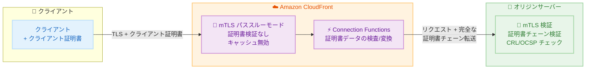

# Amazon CloudFront - Viewer mTLS パススルーモード

**リリース日**: 2026 年 5 月 14 日
**サービス**: Amazon CloudFront
**機能**: Passthrough Mode for mutual TLS (Viewer)

:bar_chart: [このアップデートのインフォグラフィックを見る](https://takech9203.github.io/aws-news-summary/20260514-amazon-cloudfront-mtls-passthrough.html)

## 概要

Amazon CloudFront が Viewer mutual TLS (mTLS) 認証のパススルーモードをサポートした。この新しいモードにより、CloudFront がクライアント証明書の検証を行わず、クライアント証明書をそのままオリジンに転送して、オリジン側で認証を実行できるようになる。

従来の CloudFront Viewer mTLS では、Required モードと Optional モードが提供されており、いずれも CloudFront のトラストストアを使用してクライアント証明書の検証をエッジで実行していた。今回のパススルーモードは、既にオリジンサーバーで mTLS 検証インフラを運用している顧客向けに設計されており、トラストストアの設定なしに CloudFront を通じてクライアント証明書をオリジンに転送できる。

**アップデート前の課題**

- オリジンに既存の mTLS 検証インフラがある場合でも、CloudFront 側にトラストストアの設定が必要だった
- CloudFront でクライアント証明書を検証するには、信頼する CA 証明書を CloudFront のトラストストアにアップロードする必要があった
- 独自の証明書検証ロジック (カスタム CRL、OCSP レスポンダー、証明書属性チェックなど) をオリジンで維持したい場合、CloudFront との二重検証が発生していた

**アップデート後の改善**

- CloudFront のトラストストア設定なしに、クライアント証明書チェーン全体をオリジンに転送可能になった
- オリジンの既存 mTLS 検証インフラをそのまま活用できるようになった
- Connection Functions を使用して、証明書データをオリジンに到達する前に検査・変換する処理が引き続き利用可能
- パススルーモードではキャッシュが無効化され、すべてのリクエストがエンドツーエンドでオリジンにより認証される

## アーキテクチャ図



パススルーモードでは、CloudFront は証明書の検証を行わず、クライアントの完全な証明書チェーンをオリジンに転送する。Connection Functions による証明書データの検査・変換は引き続き利用可能。

## サービスアップデートの詳細

### 主要機能

1. **パススルーモード (Passthrough Mode)**
   - CloudFront がクライアント証明書の検証を行わず、オリジンに転送する新しい mTLS モード
   - トラストストアの設定が不要
   - `ViewerMtlsConfig` の `Mode` パラメータに `passthrough` を指定して有効化

2. **完全な証明書チェーン転送**
   - クライアントの完全な証明書チェーンをオリジンに転送
   - オリジン側で自由に証明書検証ロジックを実行可能
   - 中間 CA 証明書も含めて転送される

3. **キャッシュの自動無効化**
   - パススルーモードではキャッシュが自動的に無効化
   - すべてのリクエストがオリジンに到達し、エンドツーエンドの認証を保証
   - リクエストごとに異なるクライアント証明書が提示される環境に対応

4. **Connection Functions との連携**
   - Connection Functions による証明書データの検査・変換がパススルーモードでも利用可能
   - 証明書属性の抽出やヘッダーへの変換をエッジで実行可能
   - オリジンへのリクエストに追加情報を付与できる

## 技術仕様

### ViewerMtlsConfig のモード比較

| 項目 | Required モード | Optional モード | Passthrough モード |
|------|----------------|----------------|-------------------|
| トラストストア設定 | 必須 | 必須 | 不要 |
| CloudFront での検証 | あり | あり (証明書がある場合) | なし |
| オリジンへの証明書転送 | オプション | オプション | 常に転送 |
| キャッシュ | 有効 | 有効 | 無効 |
| 証明書なしのリクエスト | 拒否 | 許可 | オリジンに委任 |
| Connection Functions | 利用可能 | 利用可能 | 利用可能 |

### API 変更履歴

| 日付 | サービス | 変更内容 |
|------|----------|----------|
| 2026/05/14 | [cloudfront](https://awsapichanges.com/archive/changes/bd1fb2-cloudfront.html) | 17 updated api methods - ViewerMtlsConfig に Mode: passthrough オプション追加、TrustStore に UseClientCertificateOCSPEndpoint boolean 追加 |

### 更新された主要 API メソッド

| API メソッド | 変更内容 |
|-------------|----------|
| CreateDistribution | `ViewerMtlsConfig.Mode` に `passthrough` オプション追加 |
| UpdateDistribution | `ViewerMtlsConfig.Mode` に `passthrough` オプション追加 |
| GetDistribution | レスポンスに `passthrough` モード情報を含む |
| CreateTrustStore | `UseClientCertificateOCSPEndpoint` boolean 追加 |
| UpdateTrustStore | `UseClientCertificateOCSPEndpoint` boolean 追加 |

### 設定例

```json
{
  "DistributionConfig": {
    "ViewerMtlsConfig": {
      "Mode": "passthrough"
    }
  }
}
```

## 設定方法

### 前提条件

1. Amazon CloudFront ディストリビューションが作成済みであること
2. オリジンサーバーが mTLS クライアント証明書の検証に対応していること
3. AWS CLI v2 の最新バージョンがインストールされていること

### 手順

#### ステップ 1: 既存のディストリビューション設定を取得

```bash
aws cloudfront get-distribution-config --id <DISTRIBUTION_ID> > dist-config.json
```

現在のディストリビューション設定を取得し、ETag を確認する。

#### ステップ 2: ViewerMtlsConfig にパススルーモードを設定

```json
{
  "DistributionConfig": {
    "ViewerMtlsConfig": {
      "Mode": "passthrough"
    }
  }
}
```

ディストリビューション設定の `ViewerMtlsConfig` セクションに `Mode: passthrough` を追加する。トラストストアの指定は不要。

#### ステップ 3: ディストリビューションを更新

```bash
aws cloudfront update-distribution \
  --id <DISTRIBUTION_ID> \
  --distribution-config file://dist-config.json \
  --if-match <ETAG>
```

更新した設定をディストリビューションに適用する。デプロイが完了するまで数分待機する。

## メリット

### ビジネス面

- **移行コスト削減**: 既存の mTLS 検証インフラを変更せずに CloudFront を導入可能
- **運用簡素化**: CloudFront 側でのトラストストア管理が不要になり、証明書管理の一元化が可能
- **追加コストなし**: パススルーモードは追加料金なしで利用可能

### 技術面

- **柔軟な検証ロジック**: カスタム CRL チェック、OCSP ステープリング、証明書属性ベースのアクセス制御など、独自の検証ロジックを維持可能
- **エンドツーエンド認証**: キャッシュ無効化により、すべてのリクエストがオリジンで認証されることを保証
- **Connection Functions 対応**: エッジでの証明書データ処理により、オリジンへの情報付与やフィルタリングが可能

## デメリット・制約事項

### 制限事項

- キャッシュが無効化されるため、レスポンスのキャッシュによる高速化は利用不可
- すべてのリクエストがオリジンに到達するため、オリジンサーバーの負荷が増加する可能性あり
- CloudFront 側での証明書検証 (不正な証明書のブロック) が行われないため、オリジン側で堅牢な検証が必須

### 考慮すべき点

- パススルーモードではオリジンの可用性とスケーラビリティが重要になる
- 不正なクライアント証明書を持つリクエストもオリジンまで到達するため、オリジンでの適切なエラーハンドリングが必要
- キャッシュ無効化により CloudFront の CDN としての性能メリット (レイテンシ削減) が限定的になる

## ユースケース

### ユースケース 1: 既存の mTLS インフラを持つ金融機関

**シナリオ**: 金融機関が既にオンプレミスで厳格な mTLS 検証インフラ (カスタム CRL、HSM ベースの検証) を運用しており、CloudFront を CDN として導入したいが、証明書検証ロジックの移行は困難。

**実装例**:
```json
{
  "DistributionConfig": {
    "ViewerMtlsConfig": {
      "Mode": "passthrough"
    },
    "Origins": {
      "Items": [
        {
          "DomainName": "api.bank-origin.example.com",
          "CustomOriginConfig": {
            "OriginProtocolPolicy": "https-only"
          }
        }
      ]
    }
  }
}
```

**効果**: 既存の検証インフラを変更せずに CloudFront の DDoS 防御、WAF 連携、グローバルエッジネットワークを活用可能。

### ユースケース 2: IoT デバイス認証

**シナリオ**: IoT デバイスがクライアント証明書を使用してバックエンドに接続する環境で、デバイス証明書の有効性をデバイス管理プラットフォームと連携して検証する必要がある。

**実装例**:
```json
{
  "DistributionConfig": {
    "ViewerMtlsConfig": {
      "Mode": "passthrough"
    }
  }
}
```

**効果**: デバイス証明書の検証をデバイス管理プラットフォームと連携したオリジンで実行しつつ、CloudFront のグローバルエッジを通じて接続の最適化が可能。

### ユースケース 3: Connection Functions による証明書データ変換

**シナリオ**: オリジンが特定のヘッダー形式でクライアント証明書情報を期待しており、証明書チェーンからの属性抽出をエッジで実行したい。

**実装例**:
```javascript
// Connection Function でクライアント証明書の属性を抽出してヘッダーに設定
function handler(event) {
  var cert = event.viewer.tlsConnection.clientCertificate;
  // 証明書の Subject DN をカスタムヘッダーとして追加
  event.request.headers['x-client-cert-subject'] = { value: cert.subjectDN };
  return event.request;
}
```

**効果**: オリジンアプリケーションの変更なしに、エッジで証明書データを適切な形式に変換して転送可能。

## 料金

CloudFront Mutual TLS (Viewer) のパススルーモードは**追加料金なし**で利用可能。通常の CloudFront リクエスト料金とデータ転送料金のみが適用される。

ただし、キャッシュが無効化されるため、すべてのリクエストがオリジンに転送される。これにより以下のコスト影響がある。

| 項目 | 影響 |
|------|------|
| CloudFront リクエスト料金 | 変更なし |
| オリジンへのデータ転送 | キャッシュヒットがないため全リクエスト分発生 |
| オリジンサーバーコスト | 全リクエストを処理するためスケーリングが必要な場合あり |

## 利用可能リージョン

Amazon CloudFront はグローバルサービスであり、パススルーモードはすべての CloudFront エッジロケーションで利用可能。

## 関連サービス・機能

- **CloudFront Viewer mTLS (Required/Optional モード)**: トラストストアを使用した CloudFront エッジでの証明書検証
- **CloudFront Connection Functions**: 接続レベルのデータ (TLS 属性、クライアント証明書) を検査・変換する機能
- **AWS Certificate Manager (ACM)**: サーバー側 TLS 証明書の管理
- **AWS WAF**: CloudFront と連携した Web アプリケーションファイアウォール

## 参考リンク

- :bar_chart: [インフォグラフィック](https://takech9203.github.io/aws-news-summary/20260514-amazon-cloudfront-mtls-passthrough.html)
- [公式発表 (What's New)](https://aws.amazon.com/about-aws/whats-new/2026/05/amazon-cloudfront-mtls-passthrough/)
- [ドキュメント - CloudFront mutual TLS (viewer)](https://docs.aws.amazon.com/AmazonCloudFront/latest/DeveloperGuide/mutual-tls-viewer.html)
- [API Changes](https://awsapichanges.com/archive/changes/bd1fb2-cloudfront.html)
- [料金ページ](https://aws.amazon.com/cloudfront/pricing/)

## まとめ

Amazon CloudFront の Viewer mTLS パススルーモードは、既存の mTLS 検証インフラを維持しながら CloudFront を導入したい顧客にとって重要なアップデートである。トラストストア設定なしにクライアント証明書をオリジンに転送でき、追加コストも不要。金融機関や IoT デバイス認証など、独自の証明書検証ロジックを持つ環境で特に有用であり、CloudFront 導入のハードルを下げる機能と言える。
