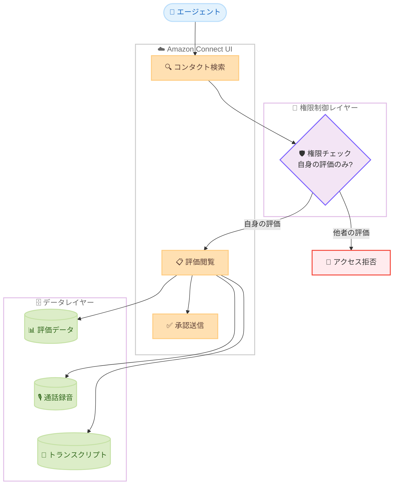

# Amazon Connect Customer - エージェント自身のパフォーマンス評価閲覧権限

**リリース日**: 2026 年 5 月 14 日
**サービス**: Amazon Connect Customer
**機能**: エージェント自身のパフォーマンス評価のみの閲覧権限

📊 [このアップデートのインフォグラフィックを見る](https://takech9203.github.io/aws-news-summary/20260514-amazon-connect-customer-permission-view-own-performance-evaluations.html)

## 概要

Amazon Connect Customer に、エージェントが自分自身のパフォーマンス評価のみを閲覧できる新しい権限が追加された。この権限により、エージェントは Connect UI 上で自身の評価結果を確認し、フィードバックを基にパフォーマンス改善に取り組むことが可能になる。他のエージェントの評価情報は公開されないため、プライバシーが保護される。

この機能は、コンタクトセンターにおけるエージェントの自律的な成長を支援するセルフサービス型のアプローチを実現する。エージェントは評価を受けたコンタクトを検索し、通話録音やトランスクリプトと併せて評価内容を確認した上で、確認済みの承認を送信できる。

**アップデート前の課題**

- エージェントが自身のパフォーマンス評価を確認するには、スーパーバイザーやマネージャーに直接確認する必要があった
- 評価閲覧権限を付与すると、他のエージェントの評価も見えてしまうリスクがあった
- 部門全体のコンタクトを閲覧しながら、評価情報のみを制限するきめ細かなアクセス制御ができなかった

**アップデート後の改善**

- エージェントが Connect UI から直接、自分の評価結果をセルフサービスで確認可能になった
- 権限ベースのアクセス制御により、自分の評価のみが表示され、他のエージェントの評価は非公開が維持される
- 部門全体のコンタクト閲覧と自身の評価のみの閲覧を両立する柔軟な権限設計が実現された

## アーキテクチャ図

エージェントがコンタクトを検索すると、権限制御レイヤーが自身の評価のみを表示するようフィルタリングし、通話録音やトランスクリプトと併せて閲覧できる仕組みを示している。

## サービスアップデートの詳細

### 主要機能

1. **エージェント自身の評価閲覧権限**
   - 新しい権限設定により、エージェントは自分が受けた評価のみを Connect UI 上で閲覧可能
   - 他のエージェントの評価データへのアクセスは完全にブロックされる
   - セキュリティプロファイルで権限を付与する形式で管理

2. **評価付きコンタクトの検索機能**
   - エージェントは、自身が評価を受けたコンタクトを検索できる
   - 部門全体のコンタクト一覧から、評価が紐付いたものを特定可能
   - マルチコンタクトの顧客問題調査時にも、部門のコンタクト全体を閲覧できる

3. **評価と関連メディアの統合閲覧**
   - 評価結果を通話録音と併せて確認可能
   - トランスクリプトと評価コメントを同一画面で参照
   - 評価の文脈を完全に把握した上でフィードバックを理解できる

4. **承認の送信機能**
   - エージェントは評価内容を確認した後、承認 (acknowledgment) を送信可能
   - 管理者はエージェントが評価を確認済みであることを追跡できる
   - フィードバックループの完結を管理できる

## 技術仕様

### 権限設定

| 項目 | 詳細 |
|------|------|
| 権限タイプ | セキュリティプロファイルベースの権限 |
| 適用範囲 | 自身の評価のみ |
| コンタクト閲覧 | 部門全体のコンタクトを閲覧可能 |
| 評価閲覧 | 自分の評価のみに制限 |
| 承認機能 | 閲覧後に確認済み承認を送信可能 |

### アクセス制御マトリクス

| 操作 | エージェント権限あり | エージェント権限なし |
|------|------|------|
| 部門コンタクト検索 | 可能 | 不可 |
| 自身の評価閲覧 | 可能 | 不可 |
| 他者の評価閲覧 | 不可 | 不可 |
| 通話録音再生 | 可能 | 不可 |
| トランスクリプト閲覧 | 可能 | 不可 |
| 承認送信 | 可能 | 不可 |

## 設定方法

### 前提条件

1. Amazon Connect インスタンスが設定済みであること
2. パフォーマンス評価機能が有効化されていること
3. 管理者権限を持つユーザーでログインしていること

### 手順

#### ステップ 1: セキュリティプロファイルの設定

Amazon Connect 管理コンソールにログインし、対象のセキュリティプロファイルを開く。評価と承認に関する権限セクションで、エージェントが自身の評価を閲覧できる権限を有効化する。

#### ステップ 2: エージェントへのセキュリティプロファイル割り当て

設定したセキュリティプロファイルを、対象のエージェントユーザーに割り当てる。これにより、該当エージェントは次回ログイン時から自身の評価を閲覧可能になる。

#### ステップ 3: エージェントによる評価確認

エージェントは Connect UI にログインし、コンタクト検索から自身が評価を受けたコンタクトを検索する。評価内容を確認し、承認を送信してフィードバック確認を完了する。

## メリット

### ビジネス面

- **エージェントエンゲージメントの向上**: エージェントが自律的にフィードバックを確認できることで、成長意欲とモチベーションが向上する
- **管理工数の削減**: スーパーバイザーが個別にフィードバックを伝達する必要がなくなり、管理業務の効率化が図れる
- **コンプライアンス対応**: 評価の確認・承認プロセスが記録されるため、品質管理プロセスの監査証跡として活用できる

### 技術面

- **きめ細かなアクセス制御**: コンタクト閲覧と評価閲覧を分離した権限設計により、セキュリティとユーザビリティを両立
- **プライバシー保護**: 他のエージェントの評価データが完全に非表示になることで、機密性の高いパフォーマンスデータが保護される
- **追加インフラ不要**: Amazon Connect の既存機能として提供されるため、追加のインフラ構築や外部ツール連携が不要

## デメリット・制約事項

### 制限事項

- エージェントは自身の評価のみ閲覧可能であり、チーム全体の傾向やベンチマークは確認できない
- 承認機能は閲覧確認のみであり、評価に対する異議申し立てや修正リクエストの機能は含まれない
- 権限設定はセキュリティプロファイル単位であるため、個別エージェントごとの細かな制御にはプロファイルの追加作成が必要

### 考慮すべき点

- 既存のセキュリティプロファイルに権限を追加する場合、影響を受けるエージェント数を事前に確認すること
- エージェントへの権限付与前に、評価フォームの内容がエージェント向けに適切であることを確認すること

## ユースケース

### ユースケース 1: コンタクトセンターのセルフサービス型品質改善

**シナリオ**: 大規模コンタクトセンターで、数百名のエージェントに対して定期的なパフォーマンス評価を実施している。スーパーバイザーが個別にフィードバック面談を行う時間が不足している。

**効果**: エージェントが自主的に評価を確認し、改善ポイントを把握できるため、スーパーバイザーは重要なケースのコーチングに集中できる。

### ユースケース 2: リモートワーク環境でのフィードバック提供

**シナリオ**: リモートワーク中心のコンタクトセンターで、対面でのフィードバック機会が限られている。評価結果の共有が遅延しがちである。

**効果**: エージェントがリアルタイムで評価を確認でき、通話録音とトランスクリプトを合わせて振り返ることで、即座にパフォーマンス改善に取り組める。

### ユースケース 3: コンプライアンス対応の監査証跡

**シナリオ**: 金融サービス業界のコンタクトセンターで、品質管理プロセスの監査対応が求められている。エージェントがフィードバックを受領したことの証跡が必要である。

**効果**: エージェントの承認送信により、評価の確認・受領が記録され、コンプライアンス監査時のエビデンスとして活用できる。

## 料金

この機能は Amazon Connect Customer の既存機能の一部として提供される。パフォーマンス評価機能を含む Amazon Connect の料金体系に従い、追加料金は発生しない。Amazon Connect の利用料金は使用量ベースで、1 分あたりの通話時間やメッセージ数に基づいて課金される。

## 利用可能リージョン

Amazon Connect Customer が提供されているすべての AWS リージョンで利用可能。主なリージョンは以下の通り。

- 米国東部 (バージニア北部)
- 米国西部 (オレゴン)
- アジアパシフィック (東京)
- アジアパシフィック (シンガポール)
- アジアパシフィック (シドニー)
- 欧州 (フランクフルト)
- 欧州 (ロンドン)
- カナダ (中部)

詳細なリージョン一覧は [Amazon Connect のリージョン別サービス提供状況](https://docs.aws.amazon.com/connect/latest/adminguide/regions.html#amazonconnect_region) を参照。

## 関連サービス・機能

- **Amazon Connect Contact Lens**: 通話録音の自動分析やセンチメント検出を提供し、評価フォーム作成の基礎データを生成する
- **Amazon Connect 評価フォーム**: エージェントのパフォーマンスを構造化されたフォームで評価する機能。今回の権限と連携して動作する
- **Amazon Connect セキュリティプロファイル**: ユーザーのアクセス権限をきめ細かく制御する仕組み。今回の権限もセキュリティプロファイルで管理される

## 参考リンク

- 📊 [インフォグラフィック](https://takech9203.github.io/aws-news-summary/20260514-amazon-connect-customer-permission-view-own-performance-evaluations.html)
- [公式発表 (What's New)](https://aws.amazon.com/about-aws/whats-new/2026/05/amazon-connect-customer-permission-view-own-performance-evaluations/)
- [評価とコーチングの権限 - ドキュメント](https://docs.aws.amazon.com/connect/latest/adminguide/evaluation-and-coaching-permissions.html)
- [Amazon Connect Conversational Analytics](https://aws.amazon.com/connect/conversational-analytics/)
- [Amazon Connect リージョン情報](https://docs.aws.amazon.com/connect/latest/adminguide/regions.html#amazonconnect_region)

## まとめ

Amazon Connect Customer にエージェント自身のパフォーマンス評価のみを閲覧できる権限が追加されたことで、コンタクトセンターにおけるフィードバックプロセスのセルフサービス化が実現された。スーパーバイザーの負荷軽減とエージェントの自律的成長を両立しつつ、他者の評価データのプライバシーを確保する実用的なアップデートである。特に大規模なコンタクトセンターを運営する組織は、セキュリティプロファイルの設定を見直し、この権限の導入を検討することを推奨する。
