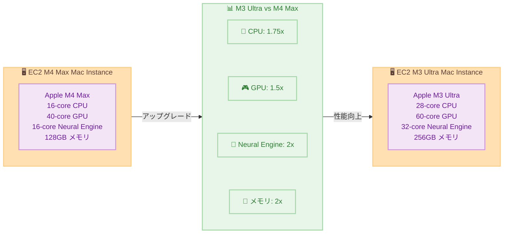

# Amazon EC2 M3 Ultra Mac Instances - 一般提供開始

**リリース日**: 2026年5月14日
**サービス**: Amazon EC2
**機能**: M3 Ultra Mac instances

📊 [このアップデートのインフォグラフィックを見る](https://takech9203.github.io/aws-news-summary/20260514-amazon-ec2-m3-ultra-mac-instances-generally-available.html)

## 概要

Amazon Web Services は、最新の Mac Studio ハードウェアを搭載した Amazon EC2 M3 Ultra Mac instances の一般提供を開始しました。M3 Ultra Mac instances は、Apple 開発者が最も要求の厳しいビルドおよびテストワークロードを AWS に移行できるようにする次世代 EC2 Mac インスタンスです。

M3 Ultra Mac instances は、iOS、macOS、iPadOS、tvOS、watchOS、visionOS、Safari などの Apple プラットフォーム向けアプリケーションの構築とテストに最適です。Apple M3 Ultra チップを搭載した Mac Studio コンピュータをベースとし、28 コア CPU、60 コア GPU、32 コア Neural Engine、256GB のユニファイドメモリを搭載しています。

AWS Nitro System により、最大 10 Gbps のネットワーク帯域幅と 8 Gbps の Amazon EBS ストレージ帯域幅を提供します。既存の EC2 M4 Max Mac instances と比較して、2 倍のユニファイドメモリ、1.75 倍の CPU コア数、1.5 倍の GPU コア数、2 倍の Neural Engine コア数を備えており、大幅に多くの Xcode シミュレータを並列実行し、オンデバイス ML ワークフローを高速化できます。

**アップデート前の課題**

- M4 Max Mac instances では 128GB のユニファイドメモリに制限され、大規模な並列シミュレータ実行が困難だった
- 16 コア CPU では、非常に大規模なプロジェクトのビルドに時間がかかっていた
- Neural Engine が 16 コアに制限され、ML ワークロードの処理能力に制約があった
- 複数の Xcode シミュレータを同時実行する際にリソース不足が発生していた

**アップデート後の改善**

- 256GB のユニファイドメモリにより、大規模な並列ビルドとシミュレータ実行が可能に
- 28 コア CPU により、コンパイル性能が大幅に向上
- 60 コア GPU により、グラフィックス処理と GPU コンピューティングが強化
- 32 コア Neural Engine により、オンデバイス ML ワークフローが高速化
- 大幅に多くの Xcode シミュレータを並列実行可能になり、製品の市場投入までの時間を短縮

## アーキテクチャ図



この図は、EC2 M3 Ultra Mac instances と M4 Max Mac instances のスペック比較を示しています。M3 Ultra は全ての主要コンポーネントで M4 Max を上回る性能を提供します。

## サービスアップデートの詳細

### 主要機能

1. **Apple M3 Ultra チップ搭載**
   - 28 コア CPU で大規模プロジェクトの高速コンパイルを実現
   - 60 コア GPU でグラフィックス処理と GPU コンピューティングを大幅に強化
   - 32 コア Neural Engine でオンデバイス ML ワークフローを高速化
   - 256GB のユニファイドメモリで大規模な並列ワークロードをサポート

2. **大幅な並列処理能力の向上**
   - M4 Max と比較して大幅に多くの Xcode シミュレータを並列実行可能
   - 複数の Apple プラットフォーム向けビルドを同時に処理
   - テストスイートの並列実行により、CI/CD パイプラインの効率化
   - 製品の市場投入までの時間を短縮

3. **AWS Nitro System による高性能インフラストラクチャ**
   - 最大 10 Gbps のネットワーク帯域幅
   - 最大 8 Gbps の Amazon EBS ストレージ帯域幅
   - 高速なコード転送とビルド成果物の保存
   - セキュアで分離されたホスト環境

## 技術仕様

### インスタンススペック

| 項目 | 詳細 |
|------|------|
| プロセッサ | Apple M3 Ultra |
| CPU コア数 | 28 コア |
| GPU コア数 | 60 コア |
| Neural Engine | 32 コア |
| メモリ | 256GB ユニファイドメモリ |
| ネットワーク帯域幅 | 最大 10 Gbps |
| EBS 帯域幅 | 最大 8 Gbps |
| ベースハードウェア | Apple Mac Studio |

### M3 Ultra vs M4 Max 比較

| 項目 | M3 Ultra Mac | M4 Max Mac | 倍率 |
|------|-------------|------------|------|
| CPU コア数 | 28 コア | 16 コア | 1.75x |
| GPU コア数 | 60 コア | 40 コア | 1.5x |
| Neural Engine | 32 コア | 16 コア | 2x |
| ユニファイドメモリ | 256GB | 128GB | 2x |
| ネットワーク帯域幅 | 10 Gbps | 10 Gbps | 同等 |
| EBS 帯域幅 | 8 Gbps | 8 Gbps | 同等 |

## 設定方法

### 前提条件

1. AWS アカウントを持っていること
2. EC2 Dedicated Hosts の使用権限があること
3. macOS と Xcode の知識があること
4. 対象リージョン (us-east-1 または us-west-2) を使用すること

### 手順

#### ステップ 1: Dedicated Host の割り当て

```bash
# M3 Ultra Mac 用の Dedicated Host を割り当て
aws ec2 allocate-hosts \
  --instance-type mac2-m3ultra.metal \
  --availability-zone us-east-1a \
  --quantity 1
```

このコマンドは、M3 Ultra Mac instance を実行するための Dedicated Host を割り当てます。EC2 Mac instances は Apple のライセンス要件により Dedicated Hosts 上でのみ実行可能です。

#### ステップ 2: Mac インスタンスの起動

```bash
# M3 Ultra Mac インスタンスを起動
aws ec2 run-instances \
  --instance-type mac2-m3ultra.metal \
  --image-id ami-xxxxxxxxx \
  --key-name my-key-pair \
  --placement Tenancy=host,HostId=h-xxxxxxxxx
```

このコマンドは、割り当てた Dedicated Host 上で M3 Ultra Mac インスタンスを起動します。AMI は macOS Sequoia や macOS Sonoma などの対応 AMI を指定してください。

#### ステップ 3: 接続とビルド環境の設定

```bash
# SSH で Mac インスタンスに接続
ssh -i my-key-pair.pem ec2-user@<instance-public-ip>

# Xcode のインストール確認
xcode-select --print-path

# 大規模プロジェクトのビルド（28 コアを活用）
xcodebuild -project MyApp.xcodeproj \
  -scheme MyApp \
  -configuration Release \
  -jobs 28
```

これらのコマンドは、Mac インスタンスに接続し、28 コア CPU を最大限に活用してビルドを実行します。

## メリット

### ビジネス面

- **開発サイクルの大幅な高速化**: 2 倍のメモリと 1.75 倍の CPU コアにより、ビルドとテストの処理時間を大幅に短縮
- **並列テストの拡大**: 256GB のユニファイドメモリにより、大幅に多くの Xcode シミュレータを同時実行可能で、テストカバレッジと速度が向上
- **コスト最適化**: オンプレミスの Mac Studio ハードウェアを購入・維持する必要がなく、使用した分だけ支払い

### 技術面

- **ML ワークフローの高速化**: 32 コア Neural Engine により、Core ML モデルのトレーニングと推論が高速化
- **メモリ集約型ワークロード対応**: 256GB のユニファイドメモリにより、大規模なモノレポや複雑なプロジェクトのビルドが可能
- **GPU コンピューティング強化**: 60 コア GPU により、Metal を使用したグラフィックスレンダリングや GPU 計算が高速化

## デメリット・制約事項

### 制限事項

- 現時点では US East (N. Virginia) と US West (Oregon) の 2 リージョンのみで利用可能
- Dedicated Hosts として提供され、24 時間の最小割り当て期間がある
- macOS ライセンスの制約により、インスタンスタイプの変更に制限がある
- ベアメタルインスタンスのみ (mac2-m3ultra.metal) で提供

### 考慮すべき点

- 24 時間の最小割り当て期間があるため、短時間のみの利用にはコスト効率が低い
- Dedicated Host の管理とライフサイクル管理が必要
- macOS の更新とセキュリティパッチの適用は利用者の責任
- M4 Max と比較して時間あたりのコストが高くなる可能性がある
- 東京リージョンでの提供は現時点で未定

## ユースケース

### ユースケース 1: 大規模 iOS アプリの並列テスト

**シナリオ**: 多数の UI テストケースを持つ大規模 iOS アプリの開発チームが、テスト実行時間を短縮したい。

**実装例**:
```bash
# 256GB メモリを活用して多数のシミュレータを並列起動
# 複数のテストプランを同時に実行
xcodebuild test \
  -project MyApp.xcodeproj \
  -scheme MyApp \
  -parallel-testing-enabled YES \
  -maximum-concurrent-test-simulator-destinations 12 \
  -destination 'platform=iOS Simulator,name=iPhone 16' \
  -destination 'platform=iOS Simulator,name=iPhone 16 Pro' \
  -destination 'platform=iOS Simulator,name=iPad Pro'
```

**効果**: 256GB のユニファイドメモリにより、M4 Max の倍以上のシミュレータを同時実行でき、テスト完了時間を大幅に短縮できます。

### ユースケース 2: オンデバイス ML モデルの開発と最適化

**シナリオ**: Core ML を使用した機械学習モデルの変換、最適化、テストを高速に実行したい。

**実装例**:
```python
# Core ML モデルの変換と最適化
import coremltools as ct

# 大規模モデルの変換（256GB メモリで大規模モデルに対応）
model = ct.convert(
    large_pytorch_model,
    compute_units=ct.ComputeUnit.ALL  # CPU + GPU + Neural Engine を活用
)

# Neural Engine 向けに最適化
model_optimized = ct.optimize.coreml.palettize_weights(model)
model_optimized.save("OptimizedModel.mlpackage")
```

**効果**: 32 コア Neural Engine と 256GB メモリにより、大規模な ML モデルの変換と最適化が高速化され、開発イテレーションが加速します。

### ユースケース 3: マルチプラットフォーム同時ビルド

**シナリオ**: iOS、macOS、visionOS、watchOS、tvOS 向けのアプリを同時にビルドし、CI/CD パイプライン全体の実行時間を短縮したい。

**実装例**:
```bash
#!/bin/bash
# 28 コア CPU と 256GB メモリを活用した並列ビルド
xcodebuild -project MyApp.xcodeproj -scheme iOS \
  -destination generic/platform=iOS -jobs 5 &
xcodebuild -project MyApp.xcodeproj -scheme macOS \
  -destination generic/platform=macOS -jobs 5 &
xcodebuild -project MyApp.xcodeproj -scheme visionOS \
  -destination generic/platform=visionOS -jobs 5 &
xcodebuild -project MyApp.xcodeproj -scheme watchOS \
  -destination generic/platform=watchOS -jobs 5 &
xcodebuild -project MyApp.xcodeproj -scheme tvOS \
  -destination generic/platform=tvOS -jobs 5 &
wait
echo "全プラットフォームのビルド完了"
```

**効果**: 28 コア CPU と 256GB のユニファイドメモリにより、5 つのプラットフォーム向けビルドを同時に実行でき、全体のビルド時間を大幅に短縮できます。

## 料金

M3 Ultra Mac instances は Dedicated Hosts として提供され、On-Demand と Savings Plans の料金モデルが利用可能です。秒単位の課金で、24 時間の最小割り当て期間があります。

### 料金例

| リージョン | インスタンスタイプ | 備考 |
|------------|-------------------|------|
| US East (N. Virginia) | mac2-m3ultra.metal | Dedicated Host 料金が適用 |
| US West (Oregon) | mac2-m3ultra.metal | Dedicated Host 料金が適用 |

*注: 正確な料金は [EC2 料金ページ](https://aws.amazon.com/ec2/pricing/dedicated-hosts/) を参照してください。M4 Max Mac instances よりも高い料金設定が想定されます。

## 利用可能リージョン

- US East (N. Virginia) - us-east-1
- US West (Oregon) - us-west-2

## 関連サービス・機能

- **Amazon EBS**: 高性能ストレージ (8 Gbps 帯域幅) によるビルドデータの永続化
- **AWS CodeBuild / CodePipeline**: CI/CD パイプラインの自動化と Mac インスタンスの統合
- **Amazon S3**: ビルド成果物、IPA ファイル、テストレポートの保存
- **Amazon CloudWatch**: インスタンスのモニタリングとビルドメトリクスの可視化
- **EC2 M4 Max Mac instances**: より小規模なワークロード向けの代替選択肢

## 参考リンク

- 📊 [インフォグラフィック](https://takech9203.github.io/aws-news-summary/20260514-amazon-ec2-m3-ultra-mac-instances-generally-available.html)
- [公式発表 (What's New)](https://aws.amazon.com/about-aws/whats-new/2026/05/amazon-ec2-m3-ultra-mac-instances-generally-available/)
- [Amazon EC2 Mac instances](https://aws.amazon.com/ec2/instance-types/mac/)
- [EC2 料金ページ](https://aws.amazon.com/ec2/pricing/dedicated-hosts/)

## まとめ

Amazon EC2 M3 Ultra Mac instances は、Apple 開発者に対して EC2 Mac インスタンスファミリーの中で最も強力なコンピューティングリソースを提供します。M4 Max と比較して 2 倍のメモリ、1.75 倍の CPU コア、1.5 倍の GPU コア、2 倍の Neural Engine コアを備え、大規模な並列シミュレータ実行や ML ワークフローの高速化に特に有効です。現在 US East と US West の 2 リージョンで利用可能であり、大規模な Apple プラットフォーム開発チームや、メモリ集約型のビルド・テストワークロードを持つ組織は、評価を開始することをお勧めします。
