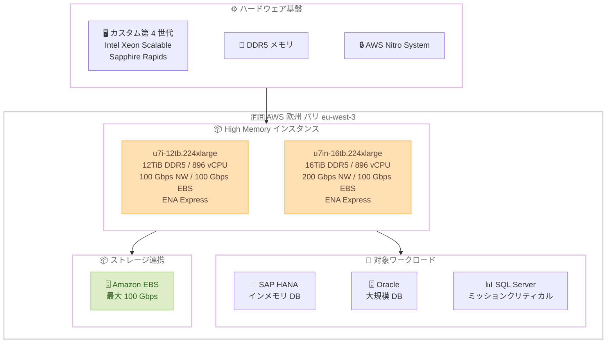

# Amazon EC2 - High Memory U7i/U7in インスタンスが欧州 (パリ) リージョンで利用可能に

**リリース日**: 2026年05月14日
**サービス**: Amazon EC2
**機能**: High Memory U7i-12TB および U7in-16TB インスタンスの欧州 (パリ) リージョン展開

📊 [このアップデートのインフォグラフィックを見る](https://takech9203.github.io/aws-news-summary/20260514-amazon-ec2-u7i-aws-europe-paris.html)

## 概要

Amazon EC2 High Memory U7i-12TB インスタンス (u7i-12tb.224xlarge) および U7in-16TB インスタンス (u7in-16tb.224xlarge) が AWS 欧州 (パリ) リージョン (eu-west-3) で利用可能になりました。これにより、フランスおよび欧州地域のデータレジデンシー要件を持つお客様が、大規模なインメモリデータベースワークロードをパリリージョンで直接実行できるようになります。

U7i インスタンスは AWS 第 7 世代のインスタンスファミリーに属し、カスタム第 4 世代 Intel Xeon Scalable Processors (Sapphire Rapids) を搭載しています。DDR5 メモリテクノロジーを採用し、既存の U-1 インスタンスと比較して最大 45% 優れた価格性能比を実現します。SAP HANA、Oracle、SQL Server などのミッションクリティカルなインメモリデータベースワークロードに最適化されたインスタンスです。

**アップデート前の課題**

- 欧州 (パリ) リージョンで U7i-12TB および U7in-16TB インスタンスが利用できず、12TiB 以上のメモリを必要とするワークロードを他のリージョンに配置する必要があった
- フランスのデータレジデンシー規制に準拠しつつ、大規模インメモリデータベースを運用する選択肢が限られていた
- パリリージョンのユーザーが U-1 インスタンスを使用する場合、U7i と比較して最大 45% 劣る価格性能比で運用する必要があった

**アップデート後の改善**

- 欧州 (パリ) リージョンで u7i-12tb.224xlarge (12TiB DDR5 メモリ、896 vCPU、100 Gbps ネットワーク) が利用可能になった
- 欧州 (パリ) リージョンで u7in-16tb.224xlarge (16TiB DDR5 メモリ、896 vCPU、200 Gbps ネットワーク) が利用可能になった
- フランスのデータ主権要件を満たしながら、高性能なインメモリデータベース環境を構築できるようになった

## アーキテクチャ図



U7i-12TB と U7in-16TB の 2 つのインスタンスタイプがパリリージョンで提供され、SAP HANA、Oracle、SQL Server などのインメモリデータベースワークロードに最適化されています。

## サービスアップデートの詳細

### 主要機能

1. **U7i-12TB インスタンス (u7i-12tb.224xlarge)**
   - 12TiB の DDR5 メモリを搭載し、大規模なインメモリデータベースに対応
   - 896 vCPU による高い並列処理能力
   - 100 Gbps のネットワーク帯域幅と 100 Gbps の EBS 帯域幅
   - ENA Express による低レイテンシーネットワーキング

2. **U7in-16TB インスタンス (u7in-16tb.224xlarge)**
   - 16TiB の DDR5 メモリを搭載し、最大級のインメモリワークロードに対応
   - 896 vCPU による高い並列処理能力
   - 200 Gbps のネットワーク帯域幅 (U7i-12TB の 2 倍)
   - 100 Gbps の EBS 帯域幅で高速なデータロードとバックアップを実現
   - ENA Express による低レイテンシーネットワーキング

3. **価格性能比の改善**
   - 既存の U-1 インスタンスと比較して最大 45% 優れた価格性能比
   - DDR5 メモリテクノロジーによるメモリ帯域幅の向上
   - Sapphire Rapids プロセッサによる演算性能の向上

## 技術仕様

### インスタンスタイプ比較

| 項目 | U7i-12TB | U7in-16TB |
|------|----------|-----------|
| インスタンスサイズ | u7i-12tb.224xlarge | u7in-16tb.224xlarge |
| メモリ | 12 TiB DDR5 | 16 TiB DDR5 |
| vCPU | 896 | 896 |
| プロセッサ | カスタム第 4 世代 Intel Xeon Scalable (Sapphire Rapids) | カスタム第 4 世代 Intel Xeon Scalable (Sapphire Rapids) |
| ネットワーク帯域幅 | 100 Gbps | 200 Gbps |
| EBS 帯域幅 | 100 Gbps | 100 Gbps |
| ENA Express | 対応 | 対応 |
| 価格性能比 (対 U-1) | 最大 45% 改善 | 最大 45% 改善 |

### プロセッサアーキテクチャ

| 項目 | 詳細 |
|------|------|
| プロセッサ世代 | カスタム第 4 世代 Intel Xeon Scalable |
| コードネーム | Sapphire Rapids |
| メモリ規格 | DDR5 |
| インスタンス世代 | AWS 第 7 世代 |
| 仮想化基盤 | AWS Nitro System |

## 設定方法

### 前提条件

1. AWS アカウントに High Memory インスタンスの起動権限があること
2. 十分な vCPU クォータが設定されていること (896 vCPU が必要)
3. 欧州 (パリ) リージョン (eu-west-3) へのアクセスが有効であること

### 手順

#### ステップ 1: vCPU クォータの確認と引き上げ

```bash
# 現在の Running On-Demand High Memory instances のクォータを確認
aws service-quotas get-service-quota \
  --service-code ec2 \
  --quota-code L-43DA4232 \
  --region eu-west-3
```

U7i-12TB および U7in-16TB は 896 vCPU を使用するため、クォータが不足している場合は引き上げリクエストを送信します。

#### ステップ 2: インスタンスの起動

```bash
# U7i-12TB インスタンスの起動
aws ec2 run-instances \
  --instance-type u7i-12tb.224xlarge \
  --image-id ami-xxxxxxxx \
  --subnet-id subnet-xxxxxxxx \
  --security-group-ids sg-xxxxxxxx \
  --region eu-west-3

# U7in-16TB インスタンスの起動
aws ec2 run-instances \
  --instance-type u7in-16tb.224xlarge \
  --image-id ami-xxxxxxxx \
  --subnet-id subnet-xxxxxxxx \
  --security-group-ids sg-xxxxxxxx \
  --region eu-west-3
```

対応する AMI (SAP HANA 用 SUSE Linux Enterprise Server、Red Hat Enterprise Linux など) を選択してインスタンスを起動します。

#### ステップ 3: EBS ボリュームの最適化

```bash
# 高スループット EBS ボリュームのアタッチ (io2 Block Express 推奨)
aws ec2 create-volume \
  --volume-type io2 \
  --size 16384 \
  --iops 256000 \
  --throughput 4000 \
  --availability-zone eu-west-3a \
  --region eu-west-3
```

100 Gbps の EBS 帯域幅を最大限活用するために、io2 Block Express ボリュームの使用を推奨します。

## メリット

### ビジネス面

- **データ主権の確保**: フランスおよび EU のデータレジデンシー要件を満たしながら、大規模インメモリデータベースを運用可能
- **コスト最適化**: U-1 インスタンスから移行することで最大 45% の価格性能比改善を実現
- **レイテンシー削減**: パリリージョンでの直接実行により、フランスおよび西欧のエンドユーザーへのレイテンシーを削減

### 技術面

- **DDR5 メモリ**: DDR4 比で高いメモリ帯域幅を実現し、インメモリデータベースのスループットが向上
- **高ネットワーク帯域幅**: U7in-16TB の 200 Gbps ネットワークにより、ノード間通信やデータレプリケーションが高速化
- **ENA Express**: P99 テールレイテンシーの削減により、トランザクション処理の安定性が向上

## デメリット・制約事項

### 制限事項

- Dedicated Host としての起動が必要な場合がある (インスタンスタイプにより異なる)
- オンデマンドの場合、高額なインスタンスコスト (時間課金)
- 896 vCPU の大きなクォータが必要で、新規アカウントではクォータ引き上げリクエストが必要

### 考慮すべき点

- SAP HANA ワークロードの場合、SAP 認定 AMI の使用が推奨される
- インスタンスの起動に時間がかかる場合がある (大規模メモリの初期化)
- 可用性を確保するため、Capacity Reservation の事前予約を検討すべき

## ユースケース

### ユースケース 1: SAP HANA のフランス国内運用

**シナリオ**: フランスに本社を置く企業が GDPR およびフランスのデータ主権要件を満たしつつ、SAP S/4HANA を大規模にスケールする必要がある。

**実装例**:
```bash
# SAP HANA 認定 AMI で U7i-12TB を起動
aws ec2 run-instances \
  --instance-type u7i-12tb.224xlarge \
  --image-id ami-sap-hana-sles15 \
  --placement "Tenancy=dedicated" \
  --region eu-west-3
```

**効果**: 12TiB のメモリで大規模な SAP HANA データベースをフランス国内で運用でき、データ主権要件を満たしながら U-1 比 45% の価格性能比改善を実現。

### ユースケース 2: Oracle Database のインメモリ処理

**シナリオ**: 金融機関が Oracle Database のインメモリオプションを使用して、リアルタイム分析とトランザクション処理を同一インスタンスで実行する。

**実装例**:
```bash
# U7in-16TB で Oracle Database を実行
aws ec2 run-instances \
  --instance-type u7in-16tb.224xlarge \
  --image-id ami-oracle-linux-8 \
  --region eu-west-3 \
  --block-device-mappings '[{"DeviceName":"/dev/sda1","Ebs":{"VolumeType":"io2","VolumeSize":4096,"Iops":64000}}]'
```

**効果**: 16TiB メモリと 200 Gbps ネットワークにより、大規模データセットのインメモリ分析と高速バックアップ/リストアを同時に実現。

### ユースケース 3: SQL Server の大規模 OLTP/OLAP 統合

**シナリオ**: 大規模 EC サイトを運営する企業が SQL Server で OLTP と OLAP を統合し、リアルタイムなビジネスインテリジェンスを実現する。

**実装例**:
```bash
# U7i-12TB で SQL Server Enterprise を実行
aws ec2 run-instances \
  --instance-type u7i-12tb.224xlarge \
  --image-id ami-windows-sql-enterprise \
  --region eu-west-3 \
  --placement "GroupName=cluster-placement-group"
```

**効果**: 12TiB メモリで SQL Server のインメモリ OLTP テーブルとカラムストアインデックスを大規模に活用し、リアルタイム分析基盤を構築。

## 料金

High Memory U7i/U7in インスタンスの料金は、オンデマンド、リザーブドインスタンス、Savings Plans で利用可能です。具体的な料金はリージョンとインスタンスタイプにより異なります。

### 料金の考え方

| 購入オプション | 特徴 |
|----------------|------|
| オンデマンド | 時間単位課金、コミットメント不要 |
| リザーブドインスタンス (1 年/3 年) | 最大 60% 以上の割引 |
| Savings Plans | 柔軟なコミットメントベースの割引 |
| Dedicated Host | ライセンス持ち込み (BYOL) に最適 |

**注意**: 具体的な料金については [EC2 料金ページ](https://aws.amazon.com/ec2/pricing/) を参照してください。SAP HANA や Oracle のライセンスコストは別途発生します。

## 利用可能リージョン

今回のアップデートで U7i-12TB および U7in-16TB インスタンスが利用可能になったリージョンは以下の通りです。

| リージョン | U7i-12TB | U7in-16TB |
|------------|----------|-----------|
| 欧州 (パリ) eu-west-3 | 利用可能 | 利用可能 |

その他のリージョンでの提供状況については [EC2 High Memory インスタンスページ](https://aws.amazon.com/ec2/instance-types/u7i/) を参照してください。

## 関連サービス・機能

- **Amazon EBS io2 Block Express**: 100 Gbps の EBS 帯域幅を活用するための高性能ブロックストレージ
- **ENA Express**: シングルフローのレイテンシーを削減し、トランザクション処理の P99 レイテンシーを改善
- **EC2 Capacity Reservations**: 大規模インスタンスの可用性を事前に確保するための機能
- **AWS Nitro System**: セキュリティ、パフォーマンス、信頼性を提供する仮想化基盤

## 参考リンク

- 📊 [インフォグラフィック](https://takech9203.github.io/aws-news-summary/20260514-amazon-ec2-u7i-aws-europe-paris.html)
- [公式発表 (What's New)](https://aws.amazon.com/about-aws/whats-new/2026/05/amazon-ec2-u7i-aws-europe-paris/)
- [EC2 High Memory U7i インスタンスタイプ](https://aws.amazon.com/ec2/instance-types/u7i/)
- [EC2 料金ページ](https://aws.amazon.com/ec2/pricing/)

## まとめ

Amazon EC2 High Memory U7i-12TB および U7in-16TB インスタンスが欧州 (パリ) リージョンで利用可能になったことで、フランスおよび欧州のデータレジデンシー要件を持つお客様が大規模インメモリデータベースをより近くで運用できるようになりました。既存の U-1 インスタンスから移行することで最大 45% の価格性能比改善が見込めるため、SAP HANA、Oracle、SQL Server などのミッションクリティカルワークロードを運用中のお客様は移行を検討することを推奨します。
