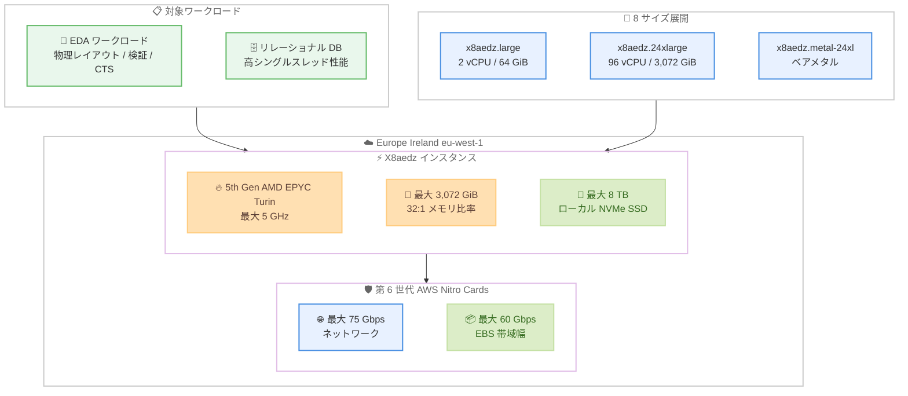

# Amazon EC2 X8aedz - ヨーロッパ (アイルランド) リージョンで利用可能に

**リリース日**: 2026 年 5 月 14 日
**サービス**: Amazon EC2
**機能**: X8aedz インスタンスのリージョン拡大

[このアップデートのインフォグラフィックを見る](https://takech9203.github.io/aws-news-summary/20260514-amazon-ec2-x8aedz-europe-ireland.html)

## 概要

Amazon EC2 X8aedz インスタンスがヨーロッパ (アイルランド) リージョン (eu-west-1) で利用可能になりました。X8aedz インスタンスは第 5 世代 AMD EPYC プロセッサ (コード名 Turin) を搭載し、クラウドで最高となる最大 5 GHz の CPU 周波数を提供するメモリ最適化インスタンスです。

X8aedz インスタンスは第 6 世代 AWS Nitro Cards を使用して構築されており、32:1 のメモリ対 vCPU 比率を持ち、最大 3,072 GiB のメモリと最大 8 TB のローカル NVMe SSD ストレージを搭載しています。電子設計自動化 (EDA) ワークロードのフロアプランニング、ロジック配置、クロックツリーシンセシス (CTS)、ルーティング、電力/信号インテグリティ解析、および高いシングルスレッド性能を必要とするリレーショナルデータベースに最適です。

今回のアイルランドリージョンへの拡大により、西欧に拠点を持つ半導体企業やデータベース運用チームが低レイテンシーで X8aedz インスタンスを活用できるようになりました。

**アップデート前の課題**

- 西欧のユーザーが X8aedz インスタンスを利用するためには米国リージョンを選択する必要があり、レイテンシーが課題だった
- EU 域内のデータレジデンシー要件を満たしながら 5 GHz の最高性能を活用できるリージョンが限られていた
- EDA ワークロードの大量データ転送において、大陸間通信のコストと遅延が発生していた

**アップデート後の改善**

- アイルランドリージョンで X8aedz インスタンスが直接利用可能になり、西欧ユーザーの低レイテンシーアクセスを実現
- EU 域内でのデータレジデンシー要件に準拠しながら、クラウド最高の 5 GHz CPU 性能を活用可能に
- Savings Plans、オンデマンド、スポットインスタンスの全購入オプションがアイルランドリージョンで利用可能

## アーキテクチャ図



X8aedz インスタンスのコンポーネント構成、対象ワークロード、およびサイズ展開を示しています。第 6 世代 AWS Nitro Cards がネットワークと EBS の I/O をオフロードし、CPU とメモリのリソースをワークロードに集中させます。

## サービスアップデートの詳細

### 主要機能

1. **クラウド最高の CPU 周波数 5 GHz**
   - 第 5 世代 AMD EPYC プロセッサ (Turin) を搭載
   - クラウド環境で最高となる最大 5 GHz の CPU 周波数を実現
   - シングルスレッド性能が要求される EDA バックエンドフローに最適

2. **32:1 のメモリ対 vCPU 比率**
   - vCPU あたり 32 GiB のメモリを搭載
   - 最大 3,072 GiB (約 3 TiB) のメモリ構成が可能
   - メモリ集約型のバックエンド EDA ワークロードとリレーショナルデータベースに最適化

3. **最大 8 TB のローカル NVMe SSD ストレージ**
   - 高速な一時データアクセスにより EDA 中間ファイルの処理を加速
   - 5 GHz プロセッサとローカル NVMe の組み合わせで、メモリ集約型ワークロードの高速処理を実現
   - インスタンスサイズに応じた容量を提供 (158 GB から 7,600 GB)

4. **ベアメタルバリアント**
   - x8aedz.metal-12xl (48 vCPU、1,536 GiB) と x8aedz.metal-24xl (96 vCPU、3,072 GiB) の 2 種類を提供
   - ハードウェアへの直接アクセスが必要なワークロードに対応
   - EDA ソフトウェアのライセンス要件やカスタムハイパーバイザーに最適

## 技術仕様

### インスタンスサイズ一覧

| インスタンスサイズ | vCPU | メモリ (GiB) | ローカル NVMe SSD (GB) | ネットワーク帯域幅 (Gbps) | EBS 帯域幅 (Gbps) |
|---|---|---|---|---|---|
| x8aedz.large | 2 | 64 | 1 x 158 | 最大 18.75 | 最大 15 |
| x8aedz.xlarge | 4 | 128 | 1 x 316 | 最大 18.75 | 最大 15 |
| x8aedz.3xlarge | 12 | 384 | 1 x 950 | 最大 18.75 | 最大 15 |
| x8aedz.6xlarge | 24 | 768 | 1 x 1,900 | 18.75 | 15 |
| x8aedz.12xlarge | 48 | 1,536 | 1 x 3,800 | 37.5 | 30 |
| x8aedz.24xlarge | 96 | 3,072 | 2 x 3,800 | 75 | 60 |
| x8aedz.metal-12xl | 48 | 1,536 | 1 x 3,800 | 37.5 | 30 |
| x8aedz.metal-24xl | 96 | 3,072 | 2 x 3,800 | 75 | 60 |

### プロセッサ仕様

| 項目 | 詳細 |
|------|------|
| プロセッサ | 第 5 世代 AMD EPYC (Turin) |
| 最大 CPU 周波数 | 5 GHz |
| アーキテクチャ | x86_64 |
| メモリタイプ | DDR5 |
| メモリ対 vCPU 比率 | 32:1 |
| Nitro System | 第 6 世代 AWS Nitro Cards |
| ローカルストレージ | 最大 8 TB NVMe SSD |

## 設定方法

### 前提条件

1. AWS アカウントとアイルランドリージョン (eu-west-1) へのアクセス権限
2. X8aedz インスタンスに対応した AMI (Amazon Linux 2023、Ubuntu、Windows Server など)
3. 適切な IAM 権限とセキュリティグループの設定

### 手順

#### ステップ 1: アイルランドリージョンで X8aedz インスタンスを起動

```bash
# アイルランドリージョンで X8aedz インスタンスを起動
aws ec2 run-instances \
    --region eu-west-1 \
    --image-id ami-xxxxxxxxxxxxxxxxx \
    --instance-type x8aedz.12xlarge \
    --key-name your-key-pair \
    --security-group-ids sg-xxxxxxxxxxxxxxxxx \
    --subnet-id subnet-xxxxxxxxxxxxxxxxx
```

アイルランドリージョンを指定して X8aedz インスタンスを起動します。`--instance-type` パラメータで 8 つのサイズから選択できます。

#### ステップ 2: ローカル NVMe ストレージのマウント

```bash
# ローカル NVMe デバイスの確認
lsblk

# ファイルシステムの作成とマウント
sudo mkfs -t xfs /dev/nvme1n1
sudo mkdir -p /mnt/local-nvme
sudo mount /dev/nvme1n1 /mnt/local-nvme
```

ローカル NVMe SSD をマウントして、EDA ワークロードの中間データ保存やデータベースの一時領域として使用します。インスタンスの停止・終了でローカルストレージのデータは消失するため、永続データは Amazon EBS に保存してください。

#### ステップ 3: EDA ワークロードの実行

```bash
# EDA ツールのライセンスサーバー設定
export LM_LICENSE_FILE=port@license-server

# バックエンド EDA フローの実行例
# ローカル NVMe をスクラッチ領域として指定
export EDA_SCRATCH_DIR=/mnt/local-nvme
./run_pnr --threads 48 --memory 1536G --scratch $EDA_SCRATCH_DIR
```

5 GHz の CPU 周波数とローカル NVMe の組み合わせにより、物理配置・ルーティングなどのバックエンド EDA ジョブを高速に処理します。

## メリット

### ビジネス面

- **西欧拠点の低レイテンシーアクセス**: アイルランドリージョンでの提供により、英国・アイルランド・西欧諸国に拠点を持つ企業がレイテンシーの低い環境で EDA ワークロードを実行可能
- **EU データレジデンシー要件への対応**: EU 域内でデータを保持しながら、クラウド最高の 5 GHz CPU 性能を活用可能
- **柔軟な購入オプション**: Savings Plans、オンデマンド、スポットインスタンスから最適な課金モデルを選択でき、コスト最適化が可能

### 技術面

- **クラウド最高の CPU 性能**: 5 GHz の CPU 周波数により、シングルスレッド性能が要求される EDA ワークロードとデータベースクエリを高速処理
- **豊富なサイズ選択肢**: 2 vCPU から 96 vCPU まで 8 サイズ (ベアメタル 2 種を含む) からワークロードに最適なサイズを選択可能
- **高速ローカルストレージ**: 最大 8 TB のローカル NVMe SSD により、I/O 集約型の EDA 中間ファイル処理を高速化

## デメリット・制約事項

### 制限事項

- ローカル NVMe ストレージはインスタンスの停止・終了時にデータが消失するエフェメラルストレージ
- メモリ対 vCPU 比率が 32:1 に固定されているため、異なる比率が必要な場合は他のインスタンスファミリーの検討が必要
- 大規模サイズ (x8aedz.24xlarge、metal-24xl) はコストが高いため、適切なサイジングが重要

### 考慮すべき点

- EDA ツールのライセンスがベアメタルインスタンスやクラウド環境に対応しているか事前に確認が必要
- ローカル NVMe の容量はインスタンスサイズに紐づくため、ストレージ要件に合わせたサイズ選択が求められる
- スポットインスタンス利用時は中断リスクを考慮し、チェックポイント機能を実装することを推奨

## ユースケース

### ユースケース 1: 半導体 EDA バックエンドフロー

**シナリオ**: 西欧の半導体設計企業が、フロアプランニングからルーティングまでのバックエンド EDA フローをクラウドで実行

**実装例**:
```bash
# x8aedz.24xlarge でバックエンド EDA ジョブを実行
aws ec2 run-instances \
    --region eu-west-1 \
    --instance-type x8aedz.24xlarge \
    --image-id ami-eda-tools-preinstalled \
    --block-device-mappings '[{"DeviceName":"/dev/sda1","Ebs":{"VolumeSize":500,"VolumeType":"gp3"}}]'

# ローカル NVMe を EDA スクラッチ領域として使用
sudo mount /dev/nvme1n1 /scratch
export EDA_SCRATCH_DIR=/scratch
```

**効果**: 5 GHz のシングルスレッド性能とローカル NVMe の組み合わせで、物理配置・ルーティングの処理時間を大幅に短縮。3,072 GiB のメモリにより大規模チップ設計のデータセット全体をメモリに保持可能。

### ユースケース 2: 大規模リレーショナルデータベース

**シナリオ**: EU 拠点の企業が高いシングルスレッド性能を要求するリレーショナルデータベースをアイルランドリージョンで運用

**実装例**:
```bash
# ベアメタルインスタンスでデータベースを実行
aws ec2 run-instances \
    --region eu-west-1 \
    --instance-type x8aedz.metal-24xl \
    --image-id ami-database-optimized

# 3,072 GiB メモリでデータベース全体をインメモリに保持
# ベアメタルによりハイパーバイザーオーバーヘッドなし
```

**効果**: 5 GHz の CPU 周波数により、シングルスレッド性能に依存するデータベースクエリを高速処理。ベアメタルインスタンスでハードウェアリソースを最大限活用し、3 TiB のメモリで大規模データセットのインメモリ処理を実現。

### ユースケース 3: 物理検証ジョブの並列実行

**シナリオ**: 半導体企業がチップ設計の物理検証 (DRC/LVS) を大量に並列実行

**実装例**:
```bash
# 複数の x8aedz.6xlarge インスタンスで検証ジョブを分散実行
for i in $(seq 1 10); do
    aws ec2 run-instances \
        --region eu-west-1 \
        --instance-type x8aedz.6xlarge \
        --image-id ami-eda-verification \
        --instance-market-options '{"MarketType":"spot"}' \
        --tag-specifications "ResourceType=instance,Tags=[{Key=Job,Value=drc-run-$i}]"
done
```

**効果**: 検証ジョブを複数のインスタンスに分散し、全体の検証時間を短縮。スポットインスタンスの活用でコストを大幅に削減しながら、各インスタンスの 5 GHz CPU 性能により個々のジョブも高速に処理。

## 料金

X8aedz インスタンスは、以下の購入オプションで利用可能です。

- **オンデマンドインスタンス**: 使用した分だけの従量課金
- **Savings Plans**: 1 年または 3 年のコミットメントで割引料金を適用
- **スポットインスタンス**: 未使用キャパシティを大幅割引で利用 (中断の可能性あり)

具体的な料金はリージョンとインスタンスサイズにより異なります。詳細は [Amazon EC2 料金ページ](https://aws.amazon.com/ec2/pricing/) を参照してください。

## 利用可能リージョン

X8aedz インスタンスは以下のリージョンで利用可能です。

- US East (N. Virginia) - us-east-1
- US West (Oregon) - us-west-2
- **Europe (Ireland) - eu-west-1** (今回の追加)
- Europe (Stockholm) - eu-north-1

追加リージョンは順次提供予定です。

## 関連サービス・機能

- **AWS Nitro System**: 第 6 世代 Nitro Cards が I/O 処理をオフロードし、X8aedz インスタンスの高いシステム性能を支える基盤技術
- **Amazon EBS**: 永続ストレージとして使用。X8aedz では最大 60 Gbps の EBS 帯域幅をサポート
- **EC2 Dedicated Hosts**: EDA ソフトウェアのライセンス要件に対応するための専用ホスト配置オプション
- **Amazon EC2 Spot Instances**: EDA バッチジョブなど中断耐性のあるワークロードでコスト最適化を実現

## 参考リンク

- [インフォグラフィック](https://takech9203.github.io/aws-news-summary/20260514-amazon-ec2-x8aedz-europe-ireland.html)
- [公式発表 (What's New)](https://aws.amazon.com/about-aws/whats-new/2026/05/amazon-ec2-x8aedz-europe-ireland/)
- [Amazon EC2 X8aedz インスタンスページ](https://aws.amazon.com/ec2/instance-types/x8aedz/)
- [AWS Blog - X8aedz インスタンスの紹介](https://aws.amazon.com/blogs/aws/introducing-amazon-ec2-x8aedz-instances-powered-by-5th-gen-amd-epyc-processors-for-memory-intensive-workloads)
- [Amazon EC2 料金ページ](https://aws.amazon.com/ec2/pricing/)

## まとめ

Amazon EC2 X8aedz インスタンスがヨーロッパ (アイルランド) リージョンで利用可能になりました。クラウド最高となる 5 GHz の CPU 周波数、32:1 のメモリ対 vCPU 比率、最大 8 TB のローカル NVMe SSD を備え、EDA ワークロードやリレーショナルデータベースに最適なインスタンスです。西欧に拠点を持つ半導体企業やデータベース運用チームは、EU データレジデンシー要件に準拠しながら低レイテンシーで高性能コンピューティングを活用できるようになりました。アイルランドリージョンでの利用開始にあたっては、AWS Management Console または AWS CLI から即座にインスタンスを起動できます。
