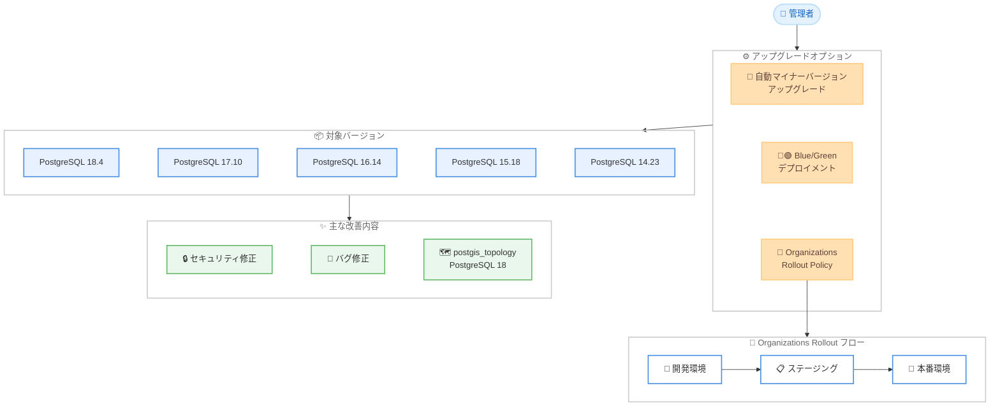

# Amazon RDS for PostgreSQL - マイナーバージョン 18.4, 17.10, 16.14, 15.18, 14.23 サポート

**リリース日**: 2026年5月14日
**サービス**: Amazon RDS for PostgreSQL
**機能**: PostgreSQL マイナーバージョンアップデート

📊 [このアップデートのインフォグラフィックを見る](https://takech9203.github.io/aws-news-summary/20260514-amazon-rds-postgresql.html)

## 概要

Amazon RDS for PostgreSQL が最新のマイナーバージョン 18.4、17.10、16.14、15.18、14.23 をサポートした。これらのバージョンには、既知のセキュリティ脆弱性の修正、バグ修正、PostgreSQL コミュニティによる改善が含まれている。

今回のリリースでは、PostgreSQL 18 向けに PostGIS 3.6.3 で postgis_topology のサポートが追加され、ネットワーク接続性や空間的隣接関係といったトポロジカルな関係をデータベース内で直接モデリング・クエリできるようになった。

さらに、AWS Organizations Upgrade Rollout Policy による大規模なアップグレードのオーケストレーションと、物理レプリケーションを使用した Amazon RDS Blue/Green デプロイメントによるダウンタイム最小化のアップグレードがサポートされている。

**アップデート前の課題**

- マイナーバージョンのアップグレードを大規模環境で段階的に実施するには手動でのオーケストレーションが必要だった
- PostgreSQL 18 で postgis_topology 機能を利用できなかった
- マイナーバージョンアップグレード時にダウンタイムが発生する場合があった

**アップデート後の改善**

- AWS Organizations Upgrade Rollout Policy により数千台のデータベースを開発環境から本番環境へ段階的にアップグレード可能になった
- PostgreSQL 18 で PostGIS 3.6.3 の postgis_topology が利用可能になり、トポロジカルデータの管理が改善された
- RDS Blue/Green デプロイメントの物理レプリケーションにより、マイナーバージョンアップグレード時のダウンタイムを最小化できるようになった

## アーキテクチャ図



Amazon RDS for PostgreSQL のマイナーバージョンアップグレードには 3 つの方法が提供されている。自動アップグレード、Blue/Green デプロイメント、Organizations Rollout Policy を組み合わせることで、規模や要件に応じた柔軟なアップグレード戦略を実現できる。

## サービスアップデートの詳細

### 主要機能

1. **PostgreSQL マイナーバージョンアップデート**
   - PostgreSQL 18.4、17.10、16.14、15.18、14.23 の 5 バージョンをサポート
   - セキュリティ脆弱性の修正を含む
   - PostgreSQL コミュニティによるバグ修正と改善を反映

2. **PostGIS 3.6.3 の postgis_topology サポート**
   - PostgreSQL 18 向けに新たに追加
   - ネットワーク接続性のモデリングが可能
   - 空間的隣接関係のクエリをデータベース内で直接実行可能
   - トポロジカルデータの整合性管理に対応

3. **AWS Organizations Upgrade Rollout Policy**
   - 数千台規模のデータベースアップグレードを段階的にオーケストレーション
   - 開発環境を先にアップグレードし、その後本番環境をアップグレードするフェーズ制御
   - 自動マイナーバージョンアップグレードと組み合わせて使用

4. **Blue/Green デプロイメントによる物理レプリケーション**
   - マイナーバージョンアップグレード時のダウンタイムを最小化
   - 物理レプリケーションによりグリーン環境を迅速に同期
   - 問題発生時のロールバックが容易

## 技術仕様

### サポート対象バージョン

| メジャーバージョン | 新マイナーバージョン | 備考 |
|------|------|------|
| PostgreSQL 18 | 18.4 | PostGIS 3.6.3 postgis_topology 対応 |
| PostgreSQL 17 | 17.10 | - |
| PostgreSQL 16 | 16.14 | - |
| PostgreSQL 15 | 15.18 | - |
| PostgreSQL 14 | 14.23 | - |

### アップグレード方式の比較

| 方式 | ダウンタイム | 規模 | 適用シナリオ |
|------|------|------|------|
| 自動マイナーバージョンアップグレード | メンテナンスウィンドウ中 | 個別 DB | 開発・テスト環境 |
| Blue/Green デプロイメント | 最小限 | 個別 DB | 本番環境 |
| Organizations Rollout Policy | フェーズ依存 | 数千台規模 | エンタープライズ大規模環境 |

### API変更履歴

今回のアップデートに関連する RDS API の変更は過去 7 日間で検出されなかった。

## 設定方法

### 前提条件

1. Amazon RDS for PostgreSQL インスタンスが稼働していること
2. 対象のメジャーバージョン (14, 15, 16, 17, 18) を使用していること
3. Blue/Green デプロイメントを使用する場合は、対象 DB インスタンスが要件を満たしていること

### 手順

#### ステップ 1: 自動マイナーバージョンアップグレードの有効化

```bash
aws rds modify-db-instance \
  --db-instance-identifier my-postgres-db \
  --auto-minor-version-upgrade \
  --apply-immediately
```

自動マイナーバージョンアップグレードを有効にすると、メンテナンスウィンドウ中に自動的に最新のマイナーバージョンへアップグレードされる。

#### ステップ 2: Blue/Green デプロイメントによるアップグレード

```bash
aws rds create-blue-green-deployment \
  --blue-green-deployment-name my-pg-upgrade \
  --source arn:aws:rds:ap-northeast-1:123456789012:db:my-postgres-db \
  --target-engine-version 17.10
```

Blue/Green デプロイメントを作成すると、グリーン環境が新しいバージョンで作成され、物理レプリケーションで同期される。検証後にスイッチオーバーを実行してダウンタイムを最小化できる。

#### ステップ 3: スイッチオーバーの実行

```bash
aws rds switchover-blue-green-deployment \
  --blue-green-deployment-identifier my-pg-upgrade
```

グリーン環境の検証が完了したら、スイッチオーバーを実行してトラフィックを新しいバージョンに切り替える。

## メリット

### ビジネス面

- **セキュリティリスクの低減**: 既知の脆弱性が修正され、コンプライアンス要件への適合が容易になる
- **運用コストの削減**: Organizations Rollout Policy により大規模環境での手動作業が不要になる
- **ダウンタイムの最小化**: Blue/Green デプロイメントにより本番環境のアップグレード時の影響を最小限に抑えられる

### 技術面

- **空間データ処理の強化**: postgis_topology により PostgreSQL 18 でトポロジカルデータの管理が可能になる
- **段階的ロールアウト**: 開発環境で先行検証してから本番環境をアップグレードする安全なプロセスを自動化できる
- **物理レプリケーション**: Blue/Green デプロイメントで物理レプリケーションを使用することで、論理レプリケーションよりも高速に同期できる

## デメリット・制約事項

### 制限事項

- PostgreSQL 14 は今後のサポート終了が予定されているため、メジャーバージョンアップグレードの計画が必要
- Blue/Green デプロイメントはすべてのインスタンス構成で利用できるわけではない
- Organizations Rollout Policy の利用には AWS Organizations の設定が前提となる

### 考慮すべき点

- マイナーバージョンアップグレード後にアプリケーションの互換性テストを実施すること
- postgis_topology を使用する場合は、既存の PostGIS 拡張との互換性を確認すること
- 自動アップグレードのメンテナンスウィンドウがビジネス要件に合致しているか確認すること

## ユースケース

### ユースケース 1: エンタープライズ大規模環境のセキュリティパッチ適用

**シナリオ**: 数百台の RDS PostgreSQL インスタンスを運用する企業が、セキュリティ脆弱性の修正を段階的に適用する必要がある。

**実装例**:
```bash
# Organizations Upgrade Rollout Policy を設定して段階的にアップグレード
# 開発環境 → ステージング → 本番環境の順序で実行
aws rds modify-db-instance \
  --db-instance-identifier dev-db-001 \
  --auto-minor-version-upgrade \
  --apply-immediately
```

**効果**: 手動作業なしで数千台規模のデータベースを安全に段階的アップグレードでき、セキュリティパッチの適用漏れを防止できる。

### ユースケース 2: GIS アプリケーションでのトポロジカルデータ管理

**シナリオ**: 物流企業がネットワーク接続性分析やルート最適化のためにトポロジカルデータを PostgreSQL 18 で管理したい。

**実装例**:
```sql
-- postgis_topology 拡張を有効化
CREATE EXTENSION postgis_topology;

-- トポロジの作成
SELECT topology.CreateTopology('road_network', 4326);

-- ネットワーク接続性のクエリ
SELECT edge_id, start_node, end_node
FROM road_network.edge_data
WHERE ST_Intersects(geom, ST_MakeEnvelope(139.6, 35.6, 139.8, 35.8, 4326));
```

**効果**: データベース内で直接トポロジカルな関係をモデリングでき、アプリケーション側の複雑なロジックを削減できる。

### ユースケース 3: ゼロダウンタイムに近いバージョンアップグレード

**シナリオ**: 24 時間 365 日稼働の SaaS アプリケーションのバックエンドデータベースを、サービス影響なくアップグレードしたい。

**実装例**:
```bash
# Blue/Green デプロイメントを作成
aws rds create-blue-green-deployment \
  --blue-green-deployment-name saas-upgrade \
  --source arn:aws:rds:ap-northeast-1:123456789012:db:saas-prod \
  --target-engine-version 17.10

# グリーン環境の検証完了後にスイッチオーバー
aws rds switchover-blue-green-deployment \
  --blue-green-deployment-identifier saas-upgrade
```

**効果**: 物理レプリケーションにより高速にグリーン環境を同期し、スイッチオーバー時のダウンタイムを数秒レベルに抑えられる。

## 料金

マイナーバージョンアップグレード自体に追加料金は発生しない。通常の Amazon RDS for PostgreSQL のインスタンス料金が適用される。

### 料金に関する注意点

| 項目 | 料金影響 |
|--------|------------------|
| 自動マイナーバージョンアップグレード | 追加料金なし |
| Blue/Green デプロイメント | グリーン環境の稼働時間分のインスタンス料金が発生 |
| Organizations Rollout Policy | 追加料金なし |

## 利用可能リージョン

Amazon RDS for PostgreSQL が利用可能なすべての AWS リージョンで利用可能。詳細は [Amazon RDS for PostgreSQL の料金ページ](https://aws.amazon.com/rds/postgresql/pricing/) を参照。

## 関連サービス・機能

- **Amazon RDS Blue/Green Deployments**: ダウンタイム最小化のためのデプロイメント戦略
- **AWS Organizations**: 大規模環境でのアップグレードポリシー管理
- **Amazon RDS Multi-AZ**: 高可用性構成でのマイナーバージョンアップグレード
- **PostGIS**: PostgreSQL の空間データ拡張機能

## 参考リンク

- 📊 [インフォグラフィック](https://takech9203.github.io/aws-news-summary/20260514-amazon-rds-postgresql.html)
- [公式発表 (What's New)](https://aws.amazon.com/about-aws/whats-new/2026/05/amazon-rds-postgresql/)
- [Amazon RDS for PostgreSQL ドキュメント](https://docs.aws.amazon.com/AmazonRDS/latest/UserGuide/CHAP_PostgreSQL.html)
- [Amazon RDS Blue/Green Deployments](https://docs.aws.amazon.com/AmazonRDS/latest/UserGuide/blue-green-deployments.html)
- [料金ページ](https://aws.amazon.com/rds/postgresql/pricing/)

## まとめ

Amazon RDS for PostgreSQL の最新マイナーバージョン (18.4, 17.10, 16.14, 15.18, 14.23) がリリースされ、セキュリティ修正とコミュニティ改善が適用された。特に PostgreSQL 18 での postgis_topology サポート追加と、AWS Organizations Upgrade Rollout Policy による大規模アップグレードのオーケストレーション機能が注目点である。本番環境では Blue/Green デプロイメントを活用してダウンタイムを最小化しつつ、早期のアップグレードを推奨する。
