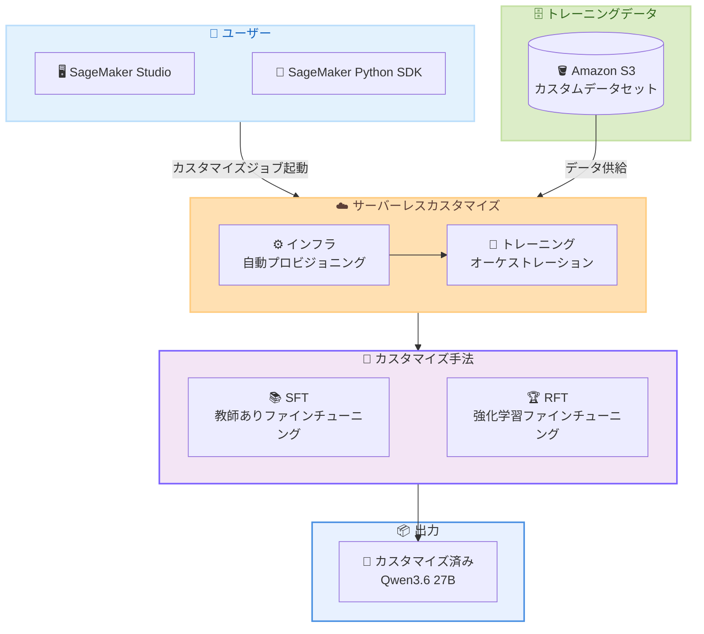

# Amazon SageMaker AI - Qwen3.6 サーバーレスモデルカスタマイズ

**リリース日**: 2026 年 5 月 14 日
**サービス**: Amazon SageMaker AI
**機能**: サーバーレスモデルカスタマイズ (Qwen3.6 対応)

📊 [このアップデートのインフォグラフィックを見る](https://takech9203.github.io/aws-news-summary/20260514-amazon-sagemaker-ft-qwen3-6.html)

## 概要

Amazon SageMaker AI が Qwen3.6 27B パラメータモデルのサーバーレスモデルカスタマイズに対応した。教師ありファインチューニング (SFT) と強化学習ファインチューニング (RFT) の 2 つの手法をサポートしており、Alibaba Cloud が提供するオープンウェイトモデルファミリーである Qwen3.6 を、ユーザー独自のドメインやワークフローに適応させることが可能になった。

サーバーレスカスタマイズにより、SageMaker AI がインフラストラクチャのプロビジョニングとトレーニングオーケストレーションをすべて自動的に処理するため、ユーザーはデータと評価に集中でき、使用した分だけの課金となる。既存の Qwen3.5 やその他のモデルに対するファインチューニングサポートに加えた追加対応となる。

**アップデート前の課題**

- Qwen3.6 ベースモデルは SageMaker AI へのデプロイのみが可能で、カスタマイズには対応していなかった
- ファインチューニングを行うには GPU クラスターの手動プロビジョニングとトレーニングパイプラインの構築が必要だった
- インフラストラクチャ管理の複雑さにより、モデルカスタマイズの敷居が高かった

**アップデート後の改善**

- Qwen3.6 27B モデルに対して SFT と RFT によるカスタマイズが SageMaker AI 上で直接実行可能になった
- サーバーレスアーキテクチャにより、インフラ管理が不要になり、従量課金で利用可能になった
- SageMaker Studio の GUI または SageMaker Python SDK からプログラマティックにカスタマイズジョブを起動できるようになった

## アーキテクチャ図



SageMaker AI のサーバーレスカスタマイズでは、ユーザーがカスタマイズジョブを起動すると、インフラのプロビジョニングからトレーニングの実行まで自動的に処理される。

## サービスアップデートの詳細

### 主要機能

1. **サーバーレスモデルカスタマイズ**
   - GPU クラスターの手動管理が不要
   - インフラストラクチャの自動プロビジョニング
   - トレーニングオーケストレーションの自動化
   - 使用した分だけの従量課金

2. **教師ありファインチューニング (SFT)**
   - ラベル付きデータセットを使用してモデルを特定タスクに最適化
   - ドメイン固有の知識、用語、品質基準を反映
   - 入出力ペアによるモデルの振る舞い調整

3. **強化学習ファインチューニング (RFT)**
   - 報酬モデルやフィードバックに基づくモデル最適化
   - 出力品質の継続的な改善
   - 人間のフィードバックを活用した調整が可能

## 技術仕様

### 対応モデル

| 項目 | 詳細 |
|------|------|
| モデル名 | Qwen3.6 |
| パラメータ数 | 27B |
| 提供元 | Alibaba Cloud |
| モデルタイプ | オープンウェイト |
| カスタマイズ手法 | SFT、RFT |

### API 変更履歴

| 日付 | サービス | 変更内容 |
|------|----------|----------|
| 2026/05/13 | [Amazon SageMaker Service](https://awsapichanges.com/archive/changes/74501c-api.sagemaker.html) | 27 updated api methods - Flexible Training Plans、実行ロールセッション名モード、制限付きモデルパッケージの追加 |

### アクセス方法

**SageMaker Studio 経由:**

SageMaker Studio の Models ページからカスタマイズジョブを起動する。

**SageMaker Python SDK 経由:**

```python
import sagemaker
from sagemaker.tuner import HyperparameterTuner

# セッション初期化
session = sagemaker.Session()

# カスタマイズジョブの設定例
# モデル ID とファインチューニングパラメータを指定
```

## 設定方法

### 前提条件

1. AWS アカウントと適切な IAM 権限
2. SageMaker Studio または SageMaker Python SDK のセットアップ
3. Amazon S3 にアップロードされたトレーニングデータセット
4. 対応リージョンでの利用

### 手順

#### ステップ 1: トレーニングデータの準備

```bash
# S3 にトレーニングデータをアップロード
aws s3 cp ./training_data.jsonl s3://your-bucket/sagemaker/customization/training/
```

SFT 用のデータは入力と出力のペアを含む JSONL 形式で準備する。

#### ステップ 2: SageMaker Studio からカスタマイズジョブを起動

1. SageMaker Studio にサインイン
2. Models ページに移動
3. Qwen3.6 モデルを選択
4. 「Customize」をクリック
5. カスタマイズ手法 (SFT または RFT) を選択
6. トレーニングデータの S3 パスを指定
7. ジョブを起動

#### ステップ 3: カスタマイズ済みモデルのデプロイ

```bash
# カスタマイズ完了後、エンドポイントにデプロイ
# SageMaker Studio の GUI または SDK から実行可能
```

カスタマイズジョブが完了すると、カスタマイズ済みモデルを SageMaker エンドポイントにデプロイして推論に使用できる。

## メリット

### ビジネス面

- **コスト効率**: サーバーレスにより使用した分だけの課金で、アイドル時のコストが発生しない
- **迅速な価値提供**: インフラ構築不要で、データ準備後すぐにカスタマイズを開始できる
- **差別化**: 自社データで Qwen3.6 をカスタマイズし、ドメイン固有の高品質な AI アプリケーションを構築できる

### 技術面

- **運用負荷の軽減**: GPU クラスターの管理、スケーリング、障害対応が不要
- **柔軟な手法選択**: SFT と RFT の 2 つのファインチューニング手法から目的に応じて選択可能
- **統合開発環境**: SageMaker Studio と Python SDK の両方からアクセスでき、既存ワークフローとの統合が容易

## デメリット・制約事項

### 制限事項

- 対応モデルは Qwen3.6 27B パラメータモデルのみ (同シリーズの他サイズは現時点では未確認)
- 利用可能リージョンが 4 リージョンに限定されている
- サーバーレスのため、トレーニングインフラの細かなカスタマイズはできない

### 考慮すべき点

- トレーニングデータの品質がカスタマイズ結果に直接影響する
- RFT には報酬モデルまたは評価基準の設計が必要
- カスタマイズジョブの実行時間とコストはデータ量に依存する

## ユースケース

### ユースケース 1: ドメイン固有の Q&A システム

**シナリオ**: 法律事務所が法律用語や判例に精通した AI アシスタントを構築したい場合

**実装例**:
```json
{"messages": [{"role": "user", "content": "不法行為の成立要件は?"}, {"role": "assistant", "content": "不法行為の成立要件は..."}]}
```

**効果**: 法律ドメインの専門知識を反映した高精度な回答が可能になる

### ユースケース 2: カスタマーサポート自動化

**シナリオ**: EC サイトが自社の商品情報やポリシーに基づいた自動応答システムを構築したい場合

**実装例**:
```json
{"messages": [{"role": "user", "content": "返品ポリシーを教えて"}, {"role": "assistant", "content": "当社の返品ポリシーは..."}]}
```

**効果**: 自社ブランドのトーンと正確な情報に基づいた一貫性のある顧客対応を実現

### ユースケース 3: コード生成の品質向上

**シナリオ**: 開発チームが社内フレームワークやコーディング規約に準拠したコード生成 AI を構築したい場合

**実装例**:
```json
{"messages": [{"role": "user", "content": "ユーザー認証 API を実装して"}, {"role": "assistant", "content": "// 社内フレームワーク準拠の実装..."}]}
```

**効果**: 社内標準に沿ったコード生成により、レビューコストと修正工数を削減

## 料金

サーバーレスモデルカスタマイズは従量課金制で、トレーニングに使用したコンピューティングリソースの使用量に基づいて課金される。アイドル時のコストは発生しない。

詳細な料金については [Amazon SageMaker の料金ページ](https://aws.amazon.com/sagemaker/pricing/) を参照。

## 利用可能リージョン

| リージョン名 | リージョンコード |
|-------------|-----------------|
| US East (N. Virginia) | us-east-1 |
| US West (Oregon) | us-west-2 |
| Asia Pacific (Tokyo) | ap-northeast-1 |
| EU (Ireland) | eu-west-1 |

東京リージョン (ap-northeast-1) が含まれているため、日本のユーザーも低レイテンシーで利用可能。

## 関連サービス・機能

- **Amazon SageMaker JumpStart**: 事前トレーニング済みモデルのカタログと簡単なデプロイ
- **Amazon SageMaker Training**: カスタムトレーニングジョブの実行基盤
- **Amazon Bedrock**: マネージド基盤モデルサービスとの比較検討
- **Amazon S3**: トレーニングデータの保存先

## 参考リンク

- 📊 [インフォグラフィック](https://takech9203.github.io/aws-news-summary/20260514-amazon-sagemaker-ft-qwen3-6.html)
- [公式発表 (What's New)](https://aws.amazon.com/about-aws/whats-new/2026/05/amazon-sagemaker-ft-qwen3-6/)
- [Amazon SageMaker AI モデルカスタマイズドキュメント](https://docs.aws.amazon.com/sagemaker/latest/dg/model-customization.html)
- [Amazon SageMaker 料金ページ](https://aws.amazon.com/sagemaker/pricing/)

## まとめ

Amazon SageMaker AI が Qwen3.6 27B モデルのサーバーレスファインチューニングに対応したことで、インフラ管理の複雑さを排除しながら、オープンウェイトの大規模言語モデルを自社データでカスタマイズする敷居が大幅に下がった。東京リージョンを含む 4 リージョンで利用可能であり、SFT と RFT の両手法をサポートしているため、日本のユーザーも自社のユースケースに最適な手法を選択してすぐに活用を開始できる。
