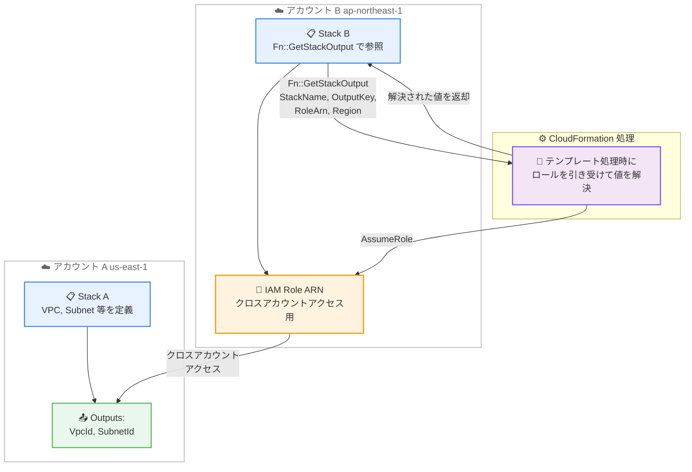

# AWS CloudFormation - Fn::GetStackOutput によるクロスアカウント/クロスリージョンスタック出力参照

**リリース日**: 2026年5月14日
**サービス**: AWS CloudFormation / AWS CDK
**機能**: Fn::GetStackOutput 組み込み関数

📊 [このアップデートのインフォグラフィックを見る](https://takech9203.github.io/aws-news-summary/20260514-aws-cloudformation-cdk-stack.html)

## 概要

AWS CloudFormation に新しい組み込み関数 `Fn::GetStackOutput` が追加され、CloudFormation テンプレートおよび CDK アプリケーション内から、AWS アカウントやリージョンを跨いでスタック出力を直接参照できるようになった。これにより、マルチアカウント/マルチリージョン環境でのインフラ管理が大幅に簡素化される。

この機能は、マルチアカウント AWS 環境を運用する組織にとって重要なアップデートである。VPC ID やデータベースエンドポイントなどのインフラ値を、アカウント境界を越えて共有する際の手動作業やコーディネーションの負担を排除する。CDK ユーザーにとっては、クロスアカウント/クロスリージョン参照時に必要だったカスタムリソースや SSM パラメータが不要になり、デプロイメントのデッドロック問題も解消される。

**アップデート前の課題**

- マルチアカウント環境で他アカウントのスタック出力値を参照するには、手動でテンプレート間で値をコピーするか、チーム間でパラメータ更新を調整する必要があった
- CDK でクロスアカウント/クロスリージョン参照を実現するには、カスタムリソースや SSM パラメータを使用した複雑な実装が必要だった
- CDK アプリケーションでクロススタック依存関係を再構成する際にデプロイメントデッドロックが発生する可能性があった
- 設定値のドリフト (意図しない乖離) が発生するリスクがあった

**アップデート後の改善**

- `Fn::GetStackOutput` を使用して、テンプレート内から直接他アカウント/リージョンのスタック出力を参照可能になった
- CDK ではクロスアカウント/クロスリージョン参照が自動的にこの関数を使用するため、追加実装が不要になった
- `Fn.getStackOutput` を直接呼び出してスタック間の弱い参照を作成でき、スタックのリファクタリングが容易になった
- CloudFormation がテンプレート処理中に指定された IAM ロールを引き受けて出力値を自動解決するため、手動コーディネーションが不要になった

## アーキテクチャ図



`Fn::GetStackOutput` は、CloudFormation がテンプレート処理時に指定された IAM ロールを引き受け、ターゲットスタックの出力値をクロスアカウント/クロスリージョンで自動的に解決する仕組みである。

## サービスアップデートの詳細

### 主要機能

1. **Fn::GetStackOutput 組み込み関数**
   - CloudFormation テンプレート内で使用可能な新しい組み込み関数
   - ターゲットスタック名、出力キー、IAM ロール ARN、リージョン (オプション) を指定
   - テンプレート処理時に CloudFormation が自動的にロールを引き受けて値を解決
   - 手動でのテンプレート間コピーやパラメータ調整が不要

2. **CDK でのシームレスな統合**
   - クロスアカウント/クロスリージョン参照が自動的に `Fn::GetStackOutput` を使用
   - カスタムリソースや SSM パラメータの手動設定が不要に
   - `Fn.getStackOutput` を直接呼び出してスタック間の弱い参照を作成可能
   - クロススタック依存関係の再構成時のデプロイメントデッドロックを解消

3. **セキュアなクロスアカウントアクセス**
   - IAM ロール ARN を指定してクロスアカウントアクセスを制御
   - CloudFormation が AssumeRole を実行して安全に値を取得
   - 既存の IAM ポリシーメカニズムと統合
   - 設定ドリフトのリスクを低減

## 技術仕様

### Fn::GetStackOutput パラメータ

| パラメータ | 必須 | 説明 |
|-----------|------|------|
| StackName | はい | ターゲットスタックの名前 |
| OutputKey | はい | 取得する出力値のキー |
| RoleArn | はい | クロスアカウントアクセス用の IAM ロール ARN |
| Region | いいえ | ターゲットスタックのリージョン (省略時は同一リージョン) |

### API 変更履歴

本アップデートに関連する API 変更は、調査期間内の awsapichanges.com フィードでは確認されなかった。組み込み関数の追加であるため、CloudFormation API エンドポイント自体への変更ではなく、テンプレート処理エンジン内部の機能拡張として実装されている可能性がある。

### CloudFormation テンプレートでの使用例

```yaml
Resources:
  MyResource:
    Type: AWS::EC2::Instance
    Properties:
      SubnetId:
        Fn::GetStackOutput:
          StackName: "networking-stack"
          OutputKey: "SubnetId"
          RoleArn: "arn:aws:iam::123456789012:role/CrossAccountCFNRole"
          Region: "us-east-1"
```

### CDK での使用例

```typescript
import { Fn } from 'aws-cdk-lib';

// 自動的なクロスアカウント/クロスリージョン参照
// CDK が自動的に Fn::GetStackOutput を使用
const vpcId = otherStack.vpc.vpcId;

// 明示的に Fn.getStackOutput を使用した弱い参照
const subnetId = Fn.getStackOutput({
  stackName: 'networking-stack',
  outputKey: 'SubnetId',
  roleArn: 'arn:aws:iam::123456789012:role/CrossAccountCFNRole',
  region: 'us-east-1',
});
```

## 設定方法

### 前提条件

1. ソースアカウントに CloudFormation スタックが存在し、Outputs セクションで値をエクスポートしていること
2. ターゲットアカウントから AssumeRole 可能な IAM ロールがソースアカウントに設定されていること
3. IAM ロールに `cloudformation:DescribeStacks` 権限が付与されていること

### 手順

#### ステップ 1: ソースアカウントで IAM ロールを作成

```json
{
  "Version": "2012-10-17",
  "Statement": [
    {
      "Effect": "Allow",
      "Principal": {
        "AWS": "arn:aws:iam::TARGET_ACCOUNT_ID:root"
      },
      "Action": "sts:AssumeRole"
    }
  ]
}
```

ソースアカウント (参照される側) に IAM ロールを作成し、ターゲットアカウントからの AssumeRole を許可する信頼ポリシーを設定する。

#### ステップ 2: IAM ロールに権限を付与

```json
{
  "Version": "2012-10-17",
  "Statement": [
    {
      "Effect": "Allow",
      "Action": "cloudformation:DescribeStacks",
      "Resource": "arn:aws:cloudformation:*:SOURCE_ACCOUNT_ID:stack/networking-stack/*"
    }
  ]
}
```

作成した IAM ロールに、対象スタックの出力を読み取るための `cloudformation:DescribeStacks` 権限を付与する。

#### ステップ 3: テンプレートで Fn::GetStackOutput を使用

```yaml
AWSTemplateFormatVersion: '2010-09-09'
Resources:
  AppServer:
    Type: AWS::EC2::Instance
    Properties:
      SubnetId:
        Fn::GetStackOutput:
          StackName: "networking-stack"
          OutputKey: "PrivateSubnetId"
          RoleArn: "arn:aws:iam::111111111111:role/CFNReadOutputsRole"
          Region: "us-east-1"
```

ターゲットアカウントの CloudFormation テンプレートで `Fn::GetStackOutput` を使用して、ソースアカウントのスタック出力を参照する。

## メリット

### ビジネス面

- **運用効率の向上**: マルチアカウント環境でのインフラ値共有における手動作業が大幅に削減され、チーム間のコーディネーション負荷が軽減される
- **設定ドリフトリスクの低減**: テンプレート処理時に動的に値が解決されるため、手動コピーによる値の不整合リスクが排除される
- **デプロイ速度の向上**: CDK でのクロスアカウント参照にカスタムリソースが不要になり、デプロイパイプラインが簡素化・高速化される

### 技術面

- **宣言的な参照**: テンプレート内で直接クロスアカウント/クロスリージョン値を参照でき、外部スクリプトやパラメータストアが不要
- **デッドロック解消**: CDK のクロススタック依存関係の再構成時にデプロイメントデッドロックが発生しなくなる
- **弱い参照の活用**: `Fn.getStackOutput` による弱い参照でスタックのリファクタリングが容易になり、循環依存を回避できる
- **IAM ベースのセキュリティ**: 既存の IAM メカニズムを活用したきめ細かいアクセス制御が可能

## デメリット・制約事項

### 制限事項

- IAM ロールのセットアップが必須であり、初期構成にはクロスアカウントの IAM 設計が必要
- ターゲットスタックが削除された場合や出力キーが変更された場合、参照側スタックの更新が失敗する可能性がある
- テンプレート処理時に外部アカウントへのアクセスが発生するため、ネットワークやサービス障害の影響を受ける可能性がある

### 考慮すべき点

- クロスアカウントアクセスを許可する IAM ロールの権限は最小権限の原則に基づいて設計する必要がある
- 参照元と参照先のスタック間で暗黙的な依存関係が生まれるため、ライフサイクル管理を適切に設計する必要がある
- 既存の SSM パラメータやカスタムリソースベースの実装からの移行計画を検討する必要がある

## ユースケース

### ユースケース 1: マルチアカウントネットワーキング

**シナリオ**: 共有サービスアカウントで VPC やサブネットを管理し、ワークロードアカウントからそのネットワーク情報を参照する。

**実装例**:
```yaml
# ワークロードアカウントのテンプレート
Resources:
  AppInstance:
    Type: AWS::EC2::Instance
    Properties:
      SubnetId:
        Fn::GetStackOutput:
          StackName: "shared-networking"
          OutputKey: "AppSubnetId"
          RoleArn: "arn:aws:iam::SHARED_ACCOUNT:role/NetworkOutputsReader"
```

**効果**: ネットワークチームとアプリケーションチームの間で手動のパラメータ受け渡しが不要になり、ネットワーク変更が自動的にワークロードスタックに反映される。

### ユースケース 2: マルチリージョン DR 構成

**シナリオ**: プライマリリージョンのデータベースエンドポイントを DR リージョンのアプリケーションが参照する。

**実装例**:
```yaml
# DR リージョンのテンプレート
Resources:
  AppConfig:
    Type: AWS::SSM::Parameter
    Properties:
      Name: "/app/primary-db-endpoint"
      Value:
        Fn::GetStackOutput:
          StackName: "database-stack"
          OutputKey: "DatabaseEndpoint"
          RoleArn: "arn:aws:iam::SAME_ACCOUNT:role/CFNSelfReadRole"
          Region: "us-east-1"
```

**効果**: DR リージョンのインフラがプライマリリージョンの最新エンドポイント情報を自動的に取得し、フェイルオーバー時の設定ミスを防止する。

### ユースケース 3: CDK でのスタックリファクタリング

**シナリオ**: 既存の CDK アプリケーションでモノリシックなスタックを複数のスタックに分割する際、デプロイメントデッドロックを回避する。

**実装例**:
```typescript
import { Fn } from 'aws-cdk-lib';

// 弱い参照を使用してデッドロックを回避
const dbEndpoint = Fn.getStackOutput({
  stackName: 'legacy-monolith-stack',
  outputKey: 'DatabaseEndpoint',
  roleArn: role.roleArn,
});

new CfnOutput(this, 'MigratedDbEndpoint', {
  value: dbEndpoint,
});
```

**効果**: スタック分割時に従来発生していた循環依存やデプロイメントデッドロックを、弱い参照を使用して安全に解消できる。

## 料金

`Fn::GetStackOutput` の使用自体に追加料金は発生しない。CloudFormation の通常の料金体系が適用される。

- サードパーティリソースタイプのハンドラー操作: $0.0009/操作
- 基本的な CloudFormation 操作 (AWS リソースタイプ): 無料
- クロスアカウントアクセス時の STS AssumeRole 呼び出し: 無料

## 利用可能リージョン

CloudFormation がサポートされている全ての AWS リージョンで利用可能。

## 関連サービス・機能

- **AWS CloudFormation Exports/Imports**: 同一アカウント/リージョン内でのスタック間値共有 (従来の `Fn::ImportValue`)
- **AWS CDK**: TypeScript/Python 等のプログラミング言語でインフラを定義するフレームワーク
- **AWS Organizations**: マルチアカウント環境の管理とガバナンス
- **AWS IAM**: クロスアカウントアクセスの認証・認可基盤
- **AWS Systems Manager Parameter Store**: 従来のクロスアカウント値共有で使用されていたパラメータストア

## 参考リンク

- 📊 [インフォグラフィック](https://takech9203.github.io/aws-news-summary/20260514-aws-cloudformation-cdk-stack.html)
- [公式発表 (What's New)](https://aws.amazon.com/about-aws/whats-new/2026/05/aws-cloudformation-cdk-stack/)
- [AWS CloudFormation ユーザーガイド](https://docs.aws.amazon.com/AWSCloudFormation/latest/UserGuide/)
- [AWS CDK デベロッパーガイド](https://docs.aws.amazon.com/cdk/v2/guide/)
- [CloudFormation 料金ページ](https://aws.amazon.com/cloudformation/pricing/)

## まとめ

`Fn::GetStackOutput` の追加により、マルチアカウント/マルチリージョン環境での CloudFormation 運用が大きく簡素化された。特に CDK ユーザーにとっては、カスタムリソースや SSM パラメータに頼る必要がなくなり、スタックのリファクタリング時のデッドロック問題も解消される。AWS Organizations を活用したマルチアカウント戦略を採用している組織は、既存のクロスアカウント参照パターンをこの新機能に移行することを検討すべきである。
